# How to Turn Your Photoshop Brush into an Eraser

> Source: [https://www.photoshopessentials.com/basics/turn-a-photoshop-brush-into-an-eraser/](https://www.photoshopessentials.com/basics/turn-a-photoshop-brush-into-an-eraser/)
> Downloaded and converted to Markdown.

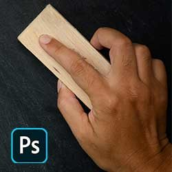

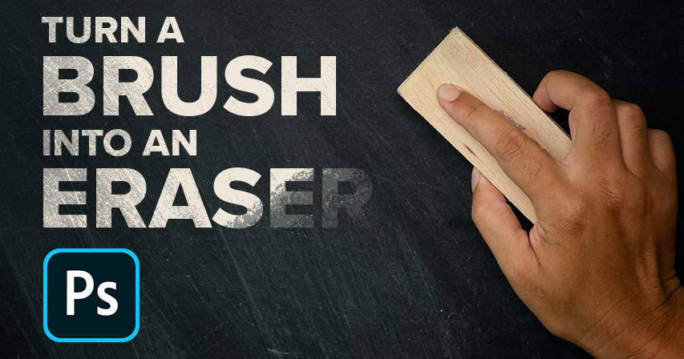

Learn two easy ways to instantly turn any Photoshop brush into an eraser, including a great new way in Photoshop CC 2020!

In this tutorial, I show you two quick and easy ways to turn your current brush into an eraser when painting in Photoshop! Now you may be thinking that the obvious way to erase a brush stroke is to use Photoshop's Eraser Tool. But the problem is that the Brush Tool and the Eraser Tool do not share the same settings. So if you switch to the Eraser Tool after painting with a custom brush, you'll be erasing with a different brush or with different settings.

What if you want to erase using the *same* brush that you painted with? It's actually very easy, and in this quick tutorial, I'll show you two ways to do it. The first way uses blend modes and works with any recent version of Photoshop. And the second way to erase with your current brush is brand new as of [Photoshop 2020](https://prf.hn/l/dlXjD2w). At the end of the tutorial, we'll look at why turning your brush into an eraser only works when painting on a separate layer.

Let's get started!

### Setting up the document

To follow along, go ahead and open any image to use as a background. I'll use this [blue texture](https://prf.hn/l/n0O3QB8) that I downloaded from Adobe Stock:

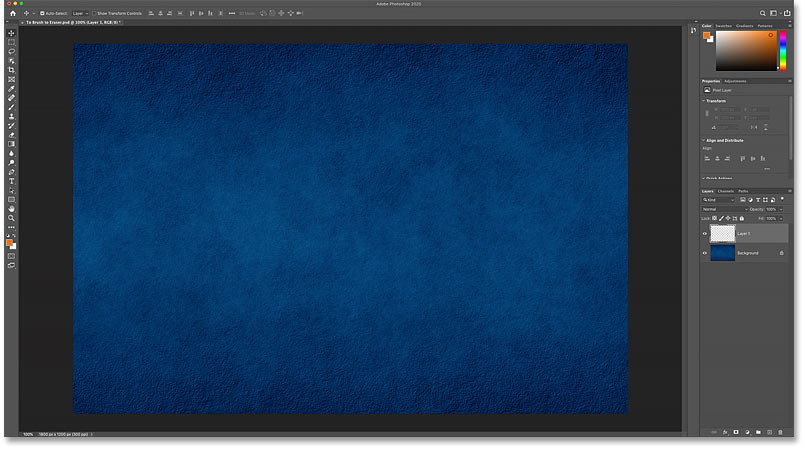
*The original document. Background from Adobe Stock.*

In the [Layers panel](/basics/layers/layers-panel/), we see that I've added a new blank layer ("Layer 1") above the Background layer. It's very important that you paint on a [separate layer](/basics/understanding-photoshop-layers/), as we'll see later on:

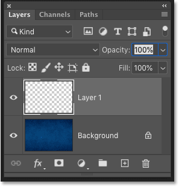
*The Layers panel showing the blank layer above the background.*

## Painting with the Brush Tool

First, let's add a brush stroke using the Brush Tool.

### Selecting the Brush Tool

Start by selecting the **Brush Tool** from the [toolbar](/basics/photoshop-tools-toolbar-overview/):

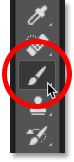
*Selecting the Brush Tool.*

[Related: How to customize the toolbar in Photoshop](/basics/custom-toolbar-photoshop/)

### Choosing a brush

Then to choose a brush, **right-click** (Win) / **Control-click** (Mac) inside the document to open Photoshop's **Brush Preset Picker**. I'll twirl open the Dry Media Brushes set and I'll choose a Charcoal brush.

Note that Adobe made [changes to the brushes](/basics/restore-legacy-brushes-photoshop-cc-2018/) back in Photoshop CC 2018. So if you're using an earlier version, your list of brushes will look different. For this tutorial, it doesn't matter which brush you choose, but pick something other than a standard round brush:

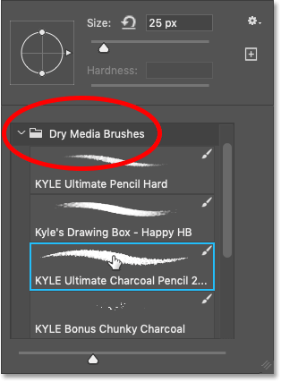
*Choosing a brush from the Brush Preset Picker.*

### Choosing the brush color

With your brush selected, click the **Foreground color swatch** in the toolbar:

*Clicking the Foreground color swatch.*

And then choose a color for your brush from the **Color Picker**. Again it doesn't matter which color you pick for this tutorial. But if you're following along with me, I'll choose orange by setting the **H** (Hue) value to **27**, the **B** (Brightness) value to **90**, and the **S** (Saturation) value also to **90**. Click OK when you're done to close the Color Picker:

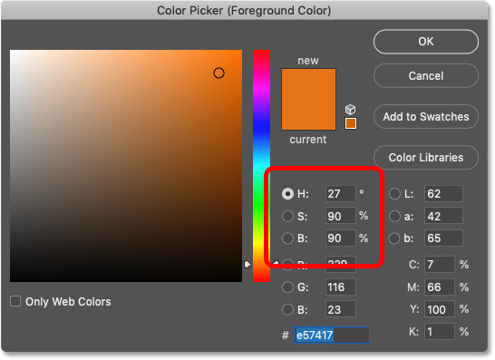
*Choosing a brush color from the the Color Picker.*

### Painting the brush stroke

To resize your brush, use the **left or right bracket key** on your keyboard. The right bracket key ( **]** ) makes the brush larger and the left bracket key ( **[** ) makes it smaller.

Then if you have actual painting skills, go ahead and start painting something impressive. Or if you're more like me, just scribble something. And we now have a brush stroke in front of the background:

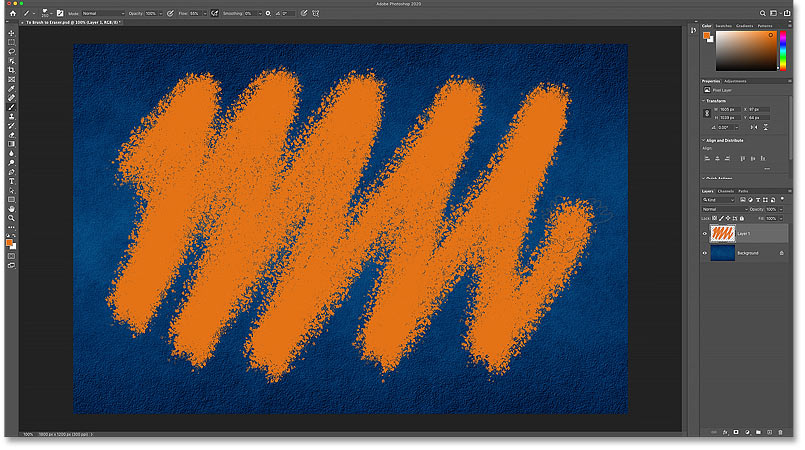
*Painting a stroke with the Brush Tool.*

[Related: How to save your brushes as custom presets!](/basics/save-custom-brush-presets-photoshop-cc2018/)

## Erasing the brush stroke with the Eraser Tool

What if we need to erase some of the brush stroke? The **Eraser Tool** seems like the obvious choice, so go ahead and select the Eraser Tool from the toolbar:

*Selecting Photoshop's Eraser Tool.*

But as soon as we start dragging over the brush stroke with the Eraser Tool, we see the problem. The Eraser Tool is using a different brush than the one we painted with. That's because the Brush Tool and the Eraser Tool are separate tools, and they each have their own settings.

In my case, the Eraser Tool is using a standard round brush set to a much smaller size than what I painted with. So the result is not was I was hoping for:

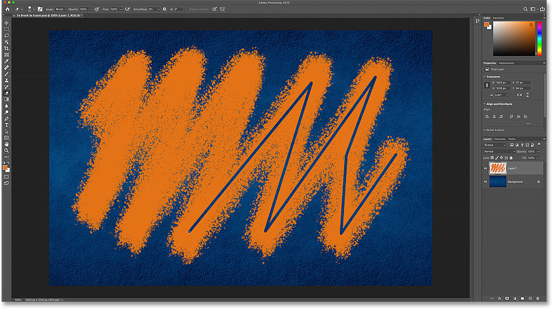
*Trying to erase the brush stroke with the Eraser Tool.*

### Undoing the Eraser Tool

To undo the damage caused by the Eraser Tool, go up to the **Edit** menu in the Menu Bar and choose **Undo Eraser**. Or press **Ctrl+Z** (Win) / **Command+Z** (Mac) on your keyboard:

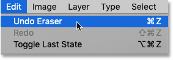
*Going to Edit > Undo Eraser.*

## Two ways to turn your Photoshop brush into an eraser

Rather than using Photoshop's Eraser Tool to erase a brush stroke, we can actually turn the Brush Tool itself into an eraser, which means we'll be erasing using the same brush and settings that we painted with! And there are two easy ways to do it. One works with any recent version of Photoshop, and one is brand new as of Photoshop CC 2020.

### Method 1: Change the brush blend mode to "Clear"

This first way to turn your brush into an eraser works with any recent version of Photoshop. With your Brush Tool still active, go up to the Options Bar and change the brush [blend mode](/photo-editing/layer-blend-modes/intro/) from Normal to **Clear**:

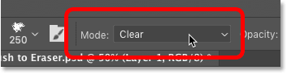
*Changing the brush's blend mode to "Clear".*

Then just paint over the stroke, and any area you paint over disappears:

*Erasing the brush stroke using the Clear blend mode.*

Once you've erased the area, you can continue painting by setting the blend mode back to **Normal**:

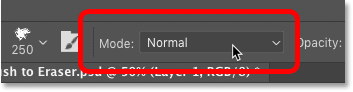
*Setting the brush blend mode to "Normal".*

#### Tip! Changing the brush blend mode from the keyboard

And here's a faster way to switch between the two brush blend modes. With the Brush Tool active, press **Shift+Alt+R** (Win) / **Shift+Option+R** (Mac) to change the brush blend mode to **Clear**. Then when you're done erasing, press **Shift+Alt+N** (Win) / **Shift+Option+N** (Mac) to set the blend mode back to **Normal**.

[Related: Photoshop blend mode tips and tricks!](/basics/blend-mode-tips-tricks/)

### Method 2: Use the tilde (~) key

As of [Photoshop CC 2020](https://clk.tradedoubler.com/click?p(264303)a(2982769)g(22913540)url(https://www.adobe.com/ca/products/photoshop.html)), there's now an even faster way to switch the Brush Tool between "paint" and "erase" modes. Simply press and hold the **tilde** (**~**) **key** on your keyboard. On an American keyboard, the tilde key is found directly under the Esc key in the upper left.

Hold down the tilde key to temporarily turn your brush into an eraser, which lets you erase using the same brush and settings that you painted with. Then release the tilde key to continue painting:

*Hold the tilde key to temporarily turn your brush into an eraser.*

[Related: More hidden tips and tricks for Photoshop's brushes!](/basics/photoshop-brush-tool-hidden-tips-tricks/)

## Why you can't erase on the Background layer

Earlier, I mentioned that it's very important to paint on a separate layer rather than painting directly on the [Background layer](/basics/background-layer-photoshop-cc/). So let's finish up with a look at what happens when we try to erase a brush stroke that we've painted on the Background layer.

Here's the same brush stroke I started with:

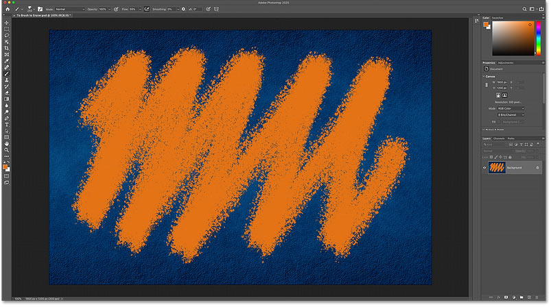
*Painting the same brush stroke.*

But in the Layers panel, we see that instead of painting on a separate layer, this time I've painted directly on the Background layer:

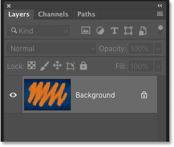
*The stroke has been painted directly on the Background layer.*

### Problem #1: The Clear blend mode is unavailable

The first method we looked at for turning your brush into an eraser was by changing the brush's **blend mode** to **Clear**. But if you've painted on the Background layer, you'll find that the Clear blend mode in the Options Bar is grayed out and unavailable. So this first method won't work:

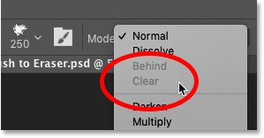
*The Clear blend mode is grayed out when painting on the Background layer.*

### Problem #2: The Background layer does not support transparency

And the second method was to press and hold the **tilde key** to temporarily turn the brush into an eraser. But the main reason why we can't erase a brush stroke on the Background layer is because **Background layers do not support transparency**. So even though you can still hold down the tilde key to erase, you won't get the result you were expecting.

Instead, notice that with my tilde key held down, all I'm doing is painting with white. Where is the white coming from? Since Background layers do not support transparency, Photoshop is instead filling the erased areas with the current **Background color**, which by default is white:

*Trying to erase the brush stroke on the Background layer.*

You'll find your current Background color in the **Background color swatch** in the toolbar:

*The Background color swatch in the toolbar.*

So again, if you want to be able to erase your brush strokes, make sure you paint on a separate layer. And even if you won't need to erase them, painting on a separate layer will still allow you to work non-destructively and prevent any permanent changes to your background image.

And there we have it! That's two easy ways to turn your brush into an eraser in Photoshop! Check out our [Photoshop Basics](/basics/) section for more tutorials. And don't forget, all of our Photoshop tutorials are available to [download as PDFs](/print-ready-pdfs/)!