# Photoshop CC 2019’s Type Changes – Live Type Previews and More

> Source: [https://www.photoshopessentials.com/basics/type-changes-photoshop-cc-2019/](https://www.photoshopessentials.com/basics/type-changes-photoshop-cc-2019/)
> Downloaded and converted to Markdown.

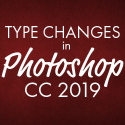

Learn all about Live Type Previews, the Type Tool's new Auto-Select feature, and more improvements to how we add type and edit text in Photoshop CC 2019!

The biggest change with text in Photoshop CC 2019 is that the Type Tool now includes a live preview, giving us an easy way to choose the right font before we start typing. But there are other changes as well. We can now auto-select the Type Tool when we need to edit our text, and it's now easier than ever to commit the text once we've added it. Adobe has also changed the way the Free Transform command works when using it to resize type. We'll look at all of these changes in this lesson.

To follow along, you'll need [Photoshop CC](https://prf.hn/l/dlXjD2w). If you're already a Creative Cloud subscriber, make sure that your copy of Photoshop CC is [up to date](/basics/update-photoshop-cc/). Let's get started!

## How to use live type previews in Photoshop CC 2019

We'll start by learning how to use the Type Tool's new live preview feature. I've gone ahead and opened a new Photoshop document ([background image](https://prf.hn/l/pmX19OW) from Adobe Stock):

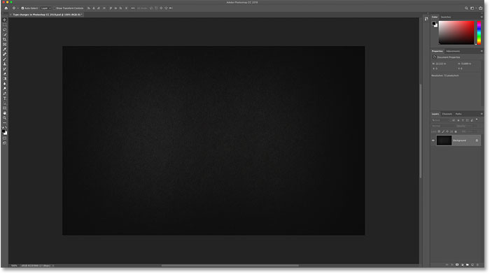
*A new document in Photoshop CC 2019.*

### Step 1: Select the Type Tool

First select the **Type Tool** from the [Toolbar](/basics/photoshop-tools-toolbar-overview/):

*Selecting the Type Tool.*

### Step 2: Click in the document to view the live preview

With the Type Tool selected, click in the document as you normally would to begin adding your text. And as soon as you click, the new live preview appears. Photoshop adds placeholder text ("Lorem Ipsum") so you can preview your current font and type size before adding your own text:

*The live preview shows your current font and type size.*

### Step 3: Choose a new font

With the preview open, go up to the Options Bar and choose your font:

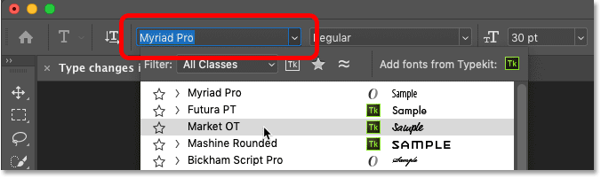
*Choosing a font in the Options Bar.*

As you try different fonts, the preview updates:

*The live preview lets you find the right font before adding your text.*

### Step 4: Choose a type size

Along with choosing a font, you can also change your type size in the Options Bar. The easiest way to change it is with the *scrubby slider* (click and drag over the Size option):

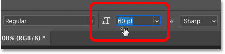
*Increasing the type size by dragging with the scrubber slider.*

And the preview instantly updates with the new size:

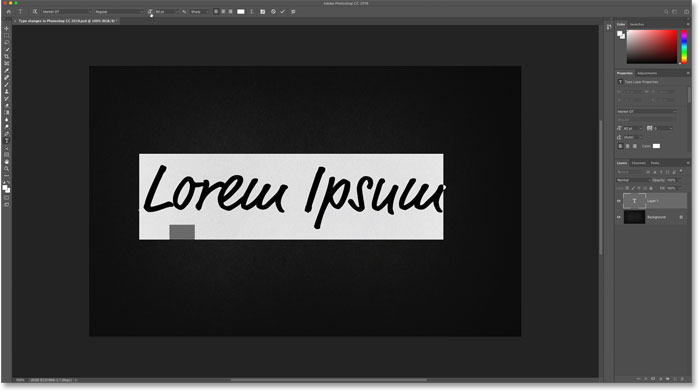
*Photoshop CC 2019 previews both the font and the type size.*

### Step 5: Add your text

When you're happy with the preview, enter your text. Photoshop replaces the placeholder text with whatever you type:

*The placeholder text disappears when you start typing.*

[Also new in Photoshop CC 2019: Place images in shapes with the Frame Tool](/basics/place-images-into-shapes-with-the-new-frame-tool-in-photoshop-cc-2019/)

## A faster way to commit text in Photoshop CC 2019

Along with the new live preview in CC 2019, Adobe has also made it easier to commit your text once you've added it. To commit the text in previous versions of Photoshop, we had to click the checkmark in the Options Bar.

That still works, but in Photoshop CC 2019, you can now commit text just by moving your mouse cursor away from the text, and then clicking in the document to accept it:

*Clicking away from the text to accept it in CC 2019.*

## Free Transform now scales type proportionally

Another change Adobe has made with type in Photoshop CC 2019 is that the [Free Transform](/basics/photoshops-free-transform-essentials/) command now scales text proportionally by default. In the past, we needed hold **Shift** while dragging the transform handles to lock the aspect ratio in place. But now, the aspect ratio is locked automatically.

Holding Shift while dragging a handle in CC 2019 switches you to freeform mode where you can drag the handle in any direction. In other words, it's the exact opposite of what it used to be.

### Step 1: Select Free Transform

To resize your text, make sure your Type layer is selected in the [Layers panel](/basics/layers/layers-panel/):

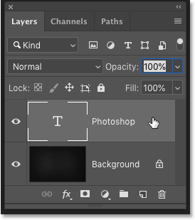
*Selecting the Type layer.*

Then go up to the **Edit** menu in the Menu Bar and choose **Free Transform**:

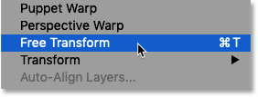
*Going to Edit > Free Transform.*

### Step 2: Drag the transform handles to scale the text

To scale the text proportionally, click and drag the handles. Press and hold **Alt** (Win) / **Option** (Mac) as you drag to scale text proportionally from its center:

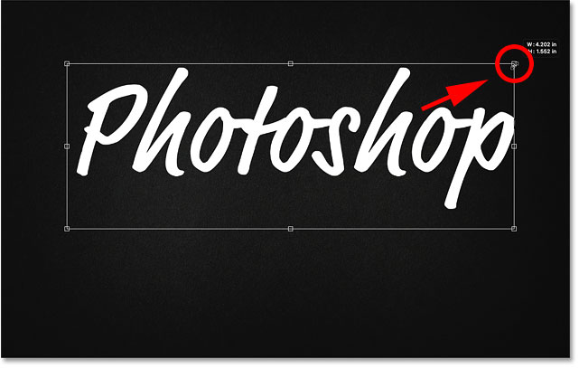
*Free Transform now locks the aspect ratio of the text automatically.*

To scale the text non-proportionally, hold **Shift** while dragging a handle. This lets you move the handle in any direction. Release Shift to switch back to resizing the text with the aspect ratio locked in place:

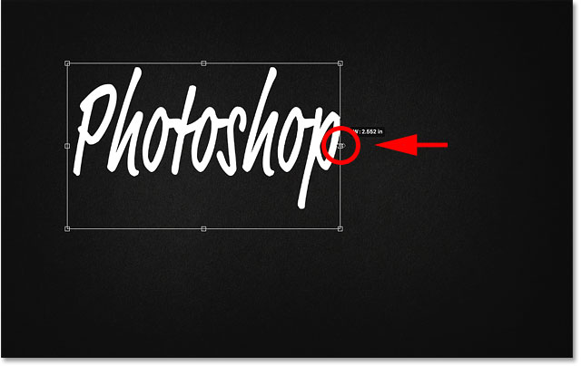
*To resize the text non-proportionally, hold Shift as you drag a handle.*

### Step 3: Commit the change and close Free Transform

To close Free Transform, again just move your mouse cursor outside and away from the Free Transform box, and then click in the document to accept it:

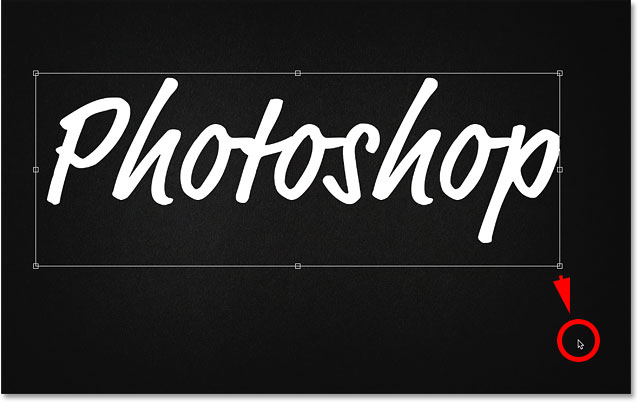
*Clicking outside the Free Transform box to commit the change.*

[Also new in Photoshop CC 2019: Preview layer blend modes on the fly!](/basics/preview-layer-blend-modes-photoshop-cc-2019/)

## Auto-selecting the Type Tool in Photoshop CC 2019

Finally, one more improvement Adobe has made in Photoshop CC 2019 is that we can now edit our text even with the Move Tool selected. Photoshop will automatically select the Type Tool for you, so there's no need to select it yourself.

I'll make a quick copy of my Type layer by pressing **Ctrl+J** (Win) / **Command+J** (Mac) on my keyboard. In the Layers panel, the copy appears above the original:

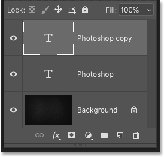
*Making a copy of the Type layer.*

Then, I'll select the **Move Tool** from the Toolbar:

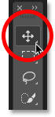
*Selecting the Move Tool.*

And I'll drag the copy of the text down below the original text:

*Moving the copy of the text below the original.*

### How to auto-select the Type Tool

I want to edit that second line of text. In previous versions of Photoshop, I would first need to reselect the Type Tool from the Toolbar. But in Photoshop CC 2019, there's no need. I can just **double-click** with the Move Tool directly on the text:

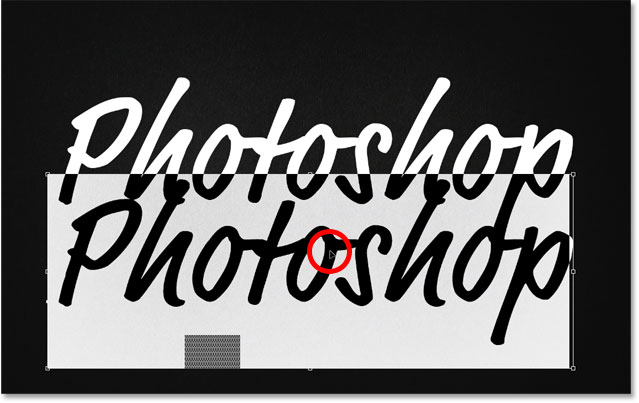
*Highlighting the text by double-clicking on it with the Move Tool.*

We're not actually editing the text with the Move Tool. Instead, double-clicking on it with the Move Tool now auto-selects the Type Tool:

*Double-clicking with the Move Tool automatically selected the Type Tool.*

With the type selected, I can choose a new font, edit my text, and resize the type as needed with Free Transform:

*Auto-selecting the Type Tool makes editing text easier than ever.*

And there we have it! That's a quick look at the new changes and improvements when working with text in Photoshop CC 2019! Check out our [Photoshop Basics](/basics/) section for more tutorials! And don' forget, all of our tutorials are now available to [download as PDFs](/print-ready-pdfs)!