# Type On A Path In Photoshop

> Source: [https://www.photoshopessentials.com/basics/type-path-photoshop/](https://www.photoshopessentials.com/basics/type-path-photoshop/)
> Downloaded and converted to Markdown.

*Before we begin...* This version of our Type On A Path tutorial is for Photoshop CS5 and earlier. Using Photoshop CS6 or CC? You'll want to check out the [updated version](/basics/type-on-a-path/).

In this **Photoshop Basics** tutorial, we'll learn **how to add type along a path**! Adobe first gave Photoshop the ability to add text on a path back in version CS, so you'll need CS or later to follow along. I'll be using Photoshop CS5 for this tutorial but any version from CS on up will work.

To add type to a path, we first need a path, and Photoshop gives us a few different ways to draw one. We can use the standard **Shape Tools** like the Rectangle Tool or the Ellipse Tool, we can create a path from **custom shapes**, and we can draw a freeform path using the **Pen Tool**. The method you use to draw your path makes no difference as far as how we go about adding text to it because a path is a path no matter how it was created and the steps for adding type to it are always the same.

To keep things simple for this tutorial, we'll stick with Photoshop's basic Shape Tools, but once you've seen how to go about adding text to a path, if you're interested in learning how the Pen Tool works, I cover it in great detail in our [Making Selections With The Pen Tool](/basics/pen-tool-selections/) tutorial. You can also learn more about drawing paths from custom shapes in our [Custom Shapes As Text Frames](/basics/fill-shapes-with-text/) tutorial, both of which are found in our [Photoshop Basics](/basics/) section.

Here's [the image](https://prf.hn/l/gAzVE24) I'll be adding my path and text to:

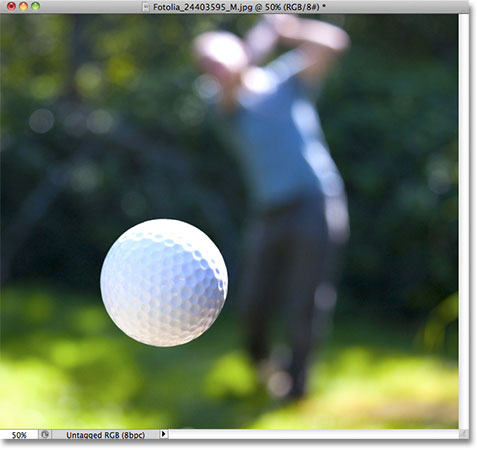
*The original image.*

Let's get started!

### Step 1: Select The Ellipse Tool

As I mentioned a moment ago, the steps for adding text along a path are the same no matter how you created the path, but for this tutorial, we'll keep things simple. Select the **Ellipse Tool** from the Tools panel. By default, it's hiding behind the Rectangle Tool, so click on the Rectangle Tool and hold your mouse button down for a second or two until a fly-out menu appears, then select the Ellipse Tool from the list:

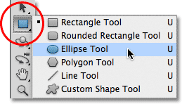
*Click and hold on the Rectangle Tool, then choose the Ellipse Tool from the menu.*

### Step 2: Select The "Paths" Option

With the Ellipse Tool selected, the **Options Bar** along the top of the screen changes to show us various options for working with the tool. Near the far left of the Options Bar is a series of three icons, each one representing a different type of shape we can draw in Photoshop. We can draw vector-based shapes, paths, or pixel-based shapes. Click on the middle of the three icons to choose the **Paths** option:

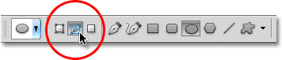
*Choose the Paths option in the Options Bar.*

### Step 3: Draw Your Path

With the Ellipse Tool selected and Paths chosen in the Options Bar, click inside your document and drag out an elliptical path. Holding your **Shift** key down as you drag will force the path into a perfect circle. To draw the path out from its center rather than from a corner, hold down your **Alt** key as you drag. If you need to reposition the path as you're drawing it, hold down your **spacebar**, drag the path to a new location, then release your spacebar and continue dragging.

In my case, I'm going to draw a circular path around the golf ball. The path appears as a thin outline:

*Drag out a path inside your document.*

### Step 4: Select The Type Tool

With our path drawn, we can add our text. Select the **Type Tool** from the Tools panel:

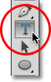
*Select the Type Tool.*

### Step 5: Choose Your Font

With the Type Tool selected, choose your font settings from the Options Bar. I'm going to use Futura Condensed Medium set to 13 pt. My text color is set to white:

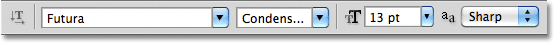
*Select your font, size and text color from the Options Bar.*

### Step 6: Move The Cursor Over The Path

Move the Type Tool directly over the path. The cursor icon will change to an **I-beam with a dotted wavy line** through it. This tells us we're about to add text directly to the path itself:

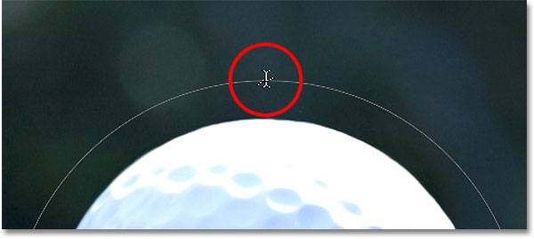
*The dotted wavy line tells us we're adding text to the path.*

### Step 7: Click On The Path And Add Your Type

Click anywhere along the path and begin adding your text. The spot you click on is where the text will begin, but don't worry if you've clicked on the wrong spot because we can easily move the text around on the path once we've added it, as we'll see in a moment. As you type, the text follows the direction of the path:

*The text is following along the shape of the circle.*

Continue adding your text along the path. When you're done, click on the **checkmark** in the Options Bar to accept it and exit out of Photoshop's text editing mode:

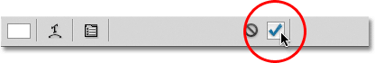
*Click the checkmark in the Options Bar when you're done adding text.*

The text is now added to the path, although at the moment it's on a bit of a weird angle:

*The text is following the path but needs to be repositioned.*

### Step 8: Select The Path Selection Tool

To reposition your text along the path, choose the **Path Selection Tool** from the Tools panel:

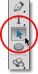
*Select the Path Selection Tool.*

Move the Path Selection Tool's cursor anywhere over top of your text. You'll see the cursor change from a black arrow into an **I-beam with a small arrow** on the side of it pointing left or right. Simply click on your text and drag it back and forth along the path with your mouse. Here, I'm dragging my text clockwise around the circle:

*Move the Path Selection Tool over your text, then click and drag it along the path.*

Watch what happens, though, if I drag my text too far. Some of it gets cut off at the end:

*Dragging the text too far resulted in the end being cut off.*

The end was cut off because I moved the text beyond the visible text area on the path. To fix the problem, look for a small circle on the path at the spot where the text is being cut off. The circle marks the end of the visible area:

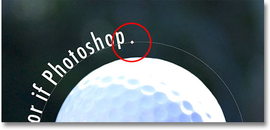
*Look for a small circle where the text gets cut off.*

Simply click on the circle with the Path Selection Tool and drag it further down the path until all of your text is visible once again. Here, as I drag the circle clockwise along the path, the text that was cut off reappears:

*Dragging the circle clockwise along the path to reveal the text that was cut off.*

### Flipping The Text Over The Path

Be careful as you're dragging your text along the path that you don't accidentally drag **across** the path. If you do, the text will flip to the other side and reverse direction:

*Dragging across the path flips and reverses the text.*

Depending on the effect you're going for, flipping and reversing the text like this may be what you wanted to do, but if you didn't do it on purpose, simply drag back across the path with the Path Selection Tool and your text will flip back over to the original side. It will also revert back to its original direction.

### Hiding The Path

When you're done positioning your text and you're happy with the results, hide the path in the document by selecting any layer other than your Type layer in the Layers panel. In my case, my document only has two layers, the Type layer and the Background layer that holds my image, so I'll click on the Background layer to select it:

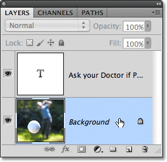
*Select any layer other than the Type layer to hide the path in the document.*

With my path now hidden and the text flipped back over to its original side, here's my final result:

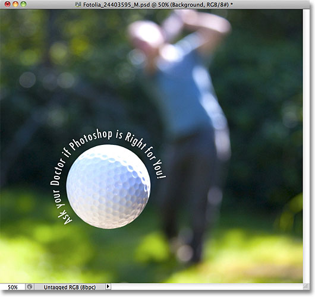
*The final result.*

Keep in mind that even though we've added the text to a path, Photoshop hasn't done anything fancy with the text itself. It's still just text, which means you can go back at any time and edit it, or completely change it if you need to. You can choose a different font, change the font size or color, adjust the leading, kerning and tracking, the baseline shift, and anything else you can do with text. Editing text in Photoshop goes a bit beyond the scope of this particular tutorial, but just remember that unlike many [text effects](/photoshop-text/text-effects/) that require us to convert the text to some other format, like shapes or pixels, there's nothing you can do with text normally that you can't do with text on a path.