# Photoshop Layer Mask Basics For Beginners

> Source: [https://www.photoshopessentials.com/basics/understanding-photoshop-layer-masks/](https://www.photoshopessentials.com/basics/understanding-photoshop-layer-masks/)
> Downloaded and converted to Markdown.

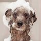

Learn the basics of layer masks in Photoshop and how to use a layer mask to hide or show different parts of a layer! For Photoshop CC, CS6 and earlier.

In this tutorial, you'll learn how to use layer masks in Photoshop. If you're new to Photoshop, layer masks can seem like an advanced topic. But layer masks are *easy* to use. In fact, a layer mask is as simple as black and white! There are so many practical and creative uses for layer masks  that covering them all at once would be impossible. So for this first tutorial in the series, we'll take a more general look at layer masks, covering just the basics of how they work so you can start using them right away! We'll also compare layer masks with similar features in Photoshop, like the Opacity option in the Layers panel, and Photoshop's Eraser Tool, to get a better sense of just how powerful layer masks really are.

I'll be using Photoshop CC but this tutorial is also fully compatible with Photoshop CS6**. In fact, the basics of layer masks haven't changed since they were first introduced way back in Photoshop 3.0. However, Photoshop's interface *has* changed a lot in recent versions. So if you're using Photoshop CS5 or earlier, you may want to follow along instead with our original [Understanding Layer Masks](/basics/layers/layer-masks/) tutorial.

Before we continue, this tutorial assumes that you have at least a basic understanding of **layers** (not layer *masks*, but layers themselves). If you're not yet familiar with layers, I *highly* recommend reading through our [Photoshop Layers](/basics/layers) tutorials, beginning with the first one in the series, [Understanding Layers In Photoshop](/basics/understanding-photoshop-layers/). If you're already good to go with layers and you're ready to learn all about layer masks, then let's get started!

## How To Use A Layer Mask In Photoshop

### Setting Up The Document

To follow along with this tutorial, you'll need two images. Since our goal here is simply to understand how layer masks work, not to create a finished masterpiece,  any two photos will do. Here's the first image I'll be using ([dog in bath photo](https://prf.hn/l/megXdO5) from Adobe Stock):

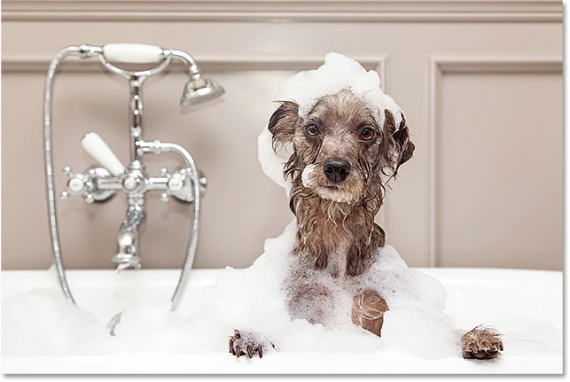
*The first image. Photo credit: Adobe Stock.*

And here's my second image ([kitten with bubbles photo](https://prf.hn/l/0Gmw5VY) from Adobe Stock):

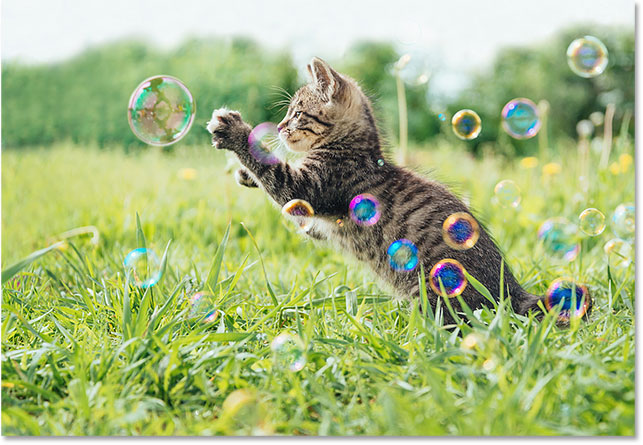
*The second image. Photo credit: Adobe Stock.*

#### Loading The Images Into Photoshop As Layers

We need to get both images into the same Photoshop document, with each photo on its own separate layer. To do that, go up to the **File** menu in the Menu Bar along the top of the screen, choose **Scripts**, and then choose **Load Files into Stack**:

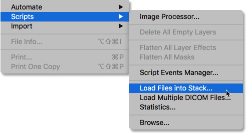
*Going to File > Scripts > Load Files into Stack.*

This opens the **Load Layers** dialog box. Make sure the **Use** option is set to **Files**, and then click the **Browse** button:

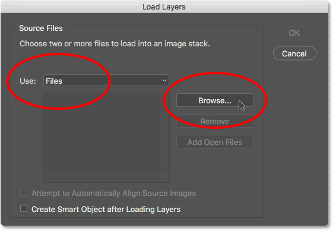
*The Load Layers dialog box.*

Clicking Browse opens a **File Explorer** window on a PC or a **Finder** window on a Mac (which is what I'm using here). Navigate to the location of your images on your computer. Select the two images you want to use, and then click **OK** in your File Explorer window or **Open** in your Finder window:

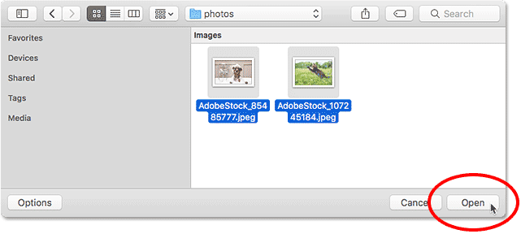
*Selecting my images.*

Back in the Load Layers dialog box, the names of the images you selected will appear. Click **OK** to close the dialog box and load the images into Photoshop:

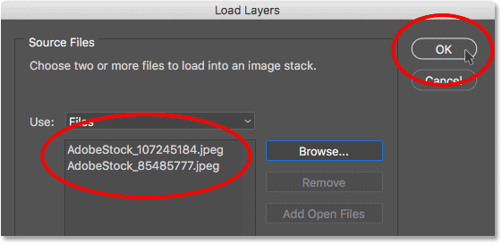
*Clicking OK to load the images.*

Photoshop loads both images into the same document, and if we look in my [Layers panel](/basics/layers/layers-panel/), we see each image on its own layer. Notice that in my case, the photo of the cat appears above the photo of the dog (which some might say is the natural order of things, but I'm sure my two dogs would disagree):

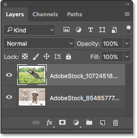
*The Layers panel showing each photo on its own layer.*

If we look in my document window, here's how the two images are being displayed. Since the cat photo is sitting *above* the dog photo in the Layers panel, it appears *in front of* the dog photo in the document. The dog photo is a bit wider than the cat photo, which is why we can see some of the dog photo sticking out on the far right:

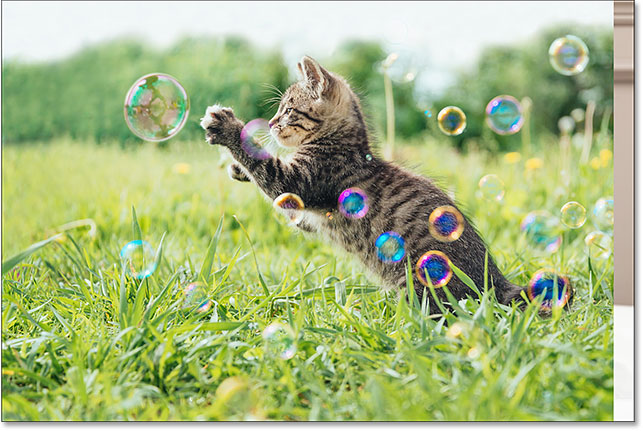
*The images as they appear after loading them into Photoshop.*

### Renaming The Layers (Optional)

If we look again in the Layers panel, we see that Photoshop has named the layers based on the file names of the images. I'm going to quickly rename my layers so that I don't have to keep typing out those long file names. You can skip this part if you like, but renaming layers is a very good habit to get into.

I'll start with the  layer on top. To rename it, I'll **double-click** on its current name to highlight it. Then, I'll enter "Cat" on my keyboard for the new name. Unless your photo is also of a cat, you may want to name it something different:

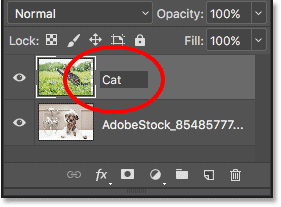
*Renaming the top layer.*

I'll press the **Tab** key on my keyboard to jump down and highlight the name of the layer below it:

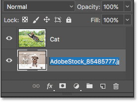
*Pressing Tab to highlight the bottom layer's name.*

Then I'll type in "Dog" for its new name. I'll press **Enter** (Win) / **Return** (Mac) on my keyboard to accept the name changes, and now both layers have been renamed, with a "Cat" layer on top and a "Dog" layer on the bottom. Doesn't get much simpler than that:

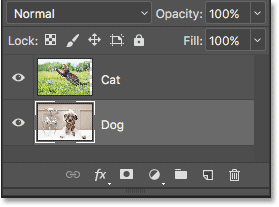
*Both layers have been renamed.*

### Repositioning The Images

One last thing I need to do before I start blending the images together is reposition them within the document. I need to move the cat photo over to the right and the dog photo over to the left.

To do that, I'll select Photoshop's **Move Tool** from the [Toolbar](/basics/the-new-customizable-toolbar-in-photoshop-cc-2015/) along the left of the screen. I could also select the Move Tool by pressing the letter **V** on my keyboard:

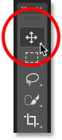
*Selecting the Move Tool.*

I'll click on the "Cat" layer in the Layers panel to select it and make it the active layer:

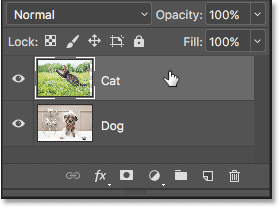
*Selecting the "Cat" layer.*

Then, I'll click on the image in the document and drag it over to the right. As I drag, I'll press and hold the **Shift** key on my keyboard. Holding the Shift key limits the direction in which I can move the layer, making it easier to drag in a straight, horizontal line:

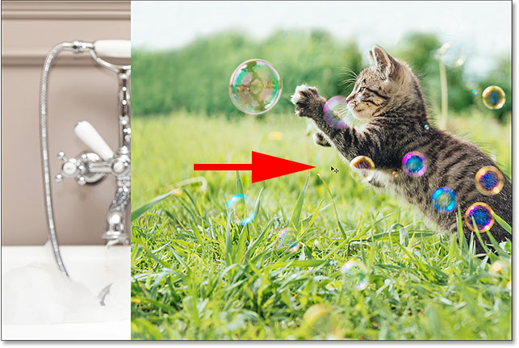
*Holding Shift while dragging the "Cat" layer to the right.*

Now that I've moved the cat photo to the right, I'll move the dog photo to the left. Since the cat photo is currently blocking most of the dog photo from view, I'll turn off the "Cat" layer for the moment by clicking on its **visibility icon** in the Layers panel:

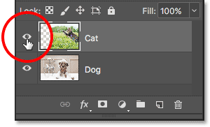
*Clicking the visibility icon for the "Cat" layer.*

With the "Cat" layer turned off, I'll click on the "Dog" layer to select it:

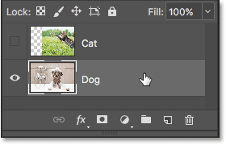
*Selecting the "Dog" layer.*

Then, I'll click inside the document with my Move Tool, press and hold my **Shift** key, and drag the dog image over to the left. The **checkerboard pattern** we now see on the right side of the document is how Photoshop represents transparency on a layer. We're seeing it because I've moved the dog image so far over to the left that the right side of the layer is now blank, and there are no other layers below the "Dog" layer for anything else to show through. That's okay, though, because the cat photo will be covering up that empty area once I turn it back on:

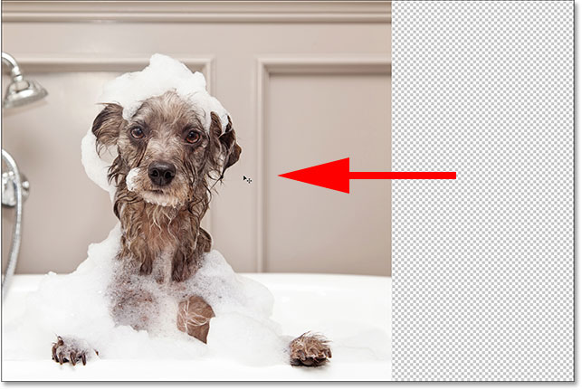
*Holding Shift while dragging the "Dog" layer to the left.*

With both images now moved into place, I'll turn the "Cat" layer back on by clicking once again on its **visibility icon** (the empty square where the eyeball used to be) in the Layers panel:

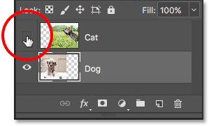
*Turning the "Cat" layer back on.*

And now, both images are visible once again. The cat photo is still blocking much of the dog photo from view, but now that we've set up our document, let's learn how we can use a layer mask to blend our two images together:

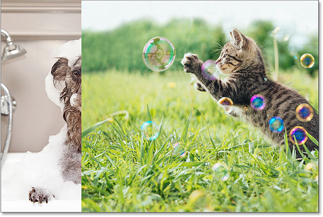
*The result after repositioning the images.*

## What Is A Layer Mask?

So, what exactly *is* a layer mask and what does it do? Quite simply, a layer mask is something we can add to a layer that allows us to control the **transparency** of that layer. Of course, there are other ways in Photoshop to control a layer's transparency as well. The **Opacity** option in the  Layers panel is one way to adjust transparency. The **Eraser Tool** is another common way to add transparency to a layer. So what makes layer masks so special?

While the Opacity option in the Layers panel does allow us to control a layer's transparency, it's limited by the fact that it can only adjust transparency for the *entire layer as a whole*. Lower the Opacity value down to 50% and the entire layer becomes 50% transparent. Lower it to 0% and the entire layer is completely hidden from view.

That may be fine in some situations. But what if you need only *part* of a layer to be transparent? What if, say, you want the left side of a layer to be 100% transparent (completely hidden) and the right side to be 100% visible, with a smooth transition between them in the middle? What I've just described is a very common technique in Photoshop, allowing us to fade one image into another. But since we'd need to adjust the transparency level of different areas of the layer *separately*, and the Opacity option can only affect the entire layer *as a whole*, this simple effect is beyond what the Opacity option can do.

### The Layer Opacity Option

To show you what I mean, let's try blending our two images together using the Opacity option in the Layers panel. Click on the top layer to select it, which in my case is the "Cat" layer:

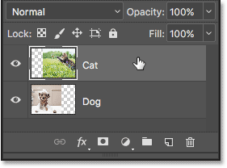
*Selecting the top layer.*

The Opacity option is found in the upper right of the Layers panel. By default, it's set to 100% which means that the layer is fully visible in the document. Let's lower it down to **70%**:

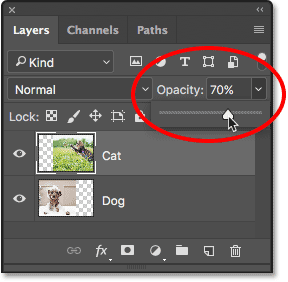
*Lowering the opacity of the top layer to 70%.*

Here, we see the result. Lowering the opacity of my "Cat" layer causes the cat image to appear faded in the document, allowing the dog image below it (as well as the checkerboard pattern to the right of the dog image) to partially show through. Yet because the Opacity option affects the entire layer as a whole, the entire cat image appears faded. What I wanted was a smooth transition from one image to another, but all I got was the bottom layer showing through the top layer:

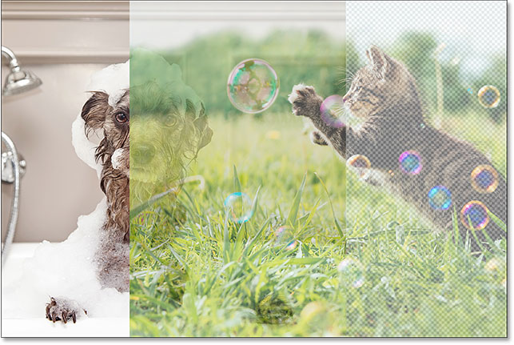
*The result after lowering the opacity of the top layer to 70%.*

If we lower the Opacity value all the way down to **0%**:

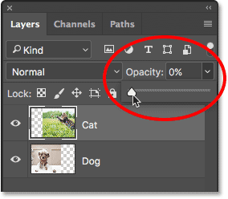
*Lowering the opacity of the top layer to 0%.*

All we end up doing is hiding the top layer completely. Again, it's because the Opacity value affects the entire layer as a whole. There's no way to adjust different parts of the layer separately:

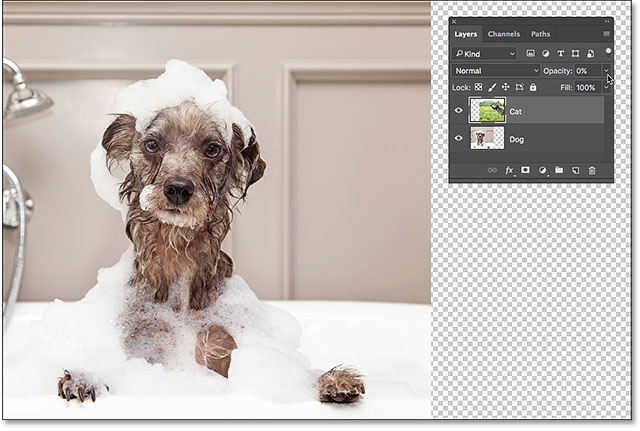
*The result after lowering the opacity to 0%.*

Since the Opacity option is not going to give us the result we're looking for, let's set it back to **100%**:

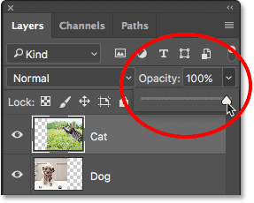
*Increasing the Opacity value back to 100%.*

This brings the top image back into view and returns us to where we started:

*Both images are once again visible.*

[Layer Opacity vs Fill in Photoshop](/basics/layers/opacity-vs-fill/)

### The Eraser Tool

Now that we've looked at the Opacity option, let's see if Photoshop's **Eraser Tool** can give us better results. Unlike the Opacity option which affects the entire layer at once, Photoshop's Eraser Tool can easily adjust the transparency of different parts of a layer separately. That's because the Eraser Tool is nothing more than a brush, and to use it, we just drag the brush over any areas we want to remove. 

Since the Eraser Tool is so simple and intuitive (everyone knows what an eraser is), it's usually one of the first tools we turn to when learning Photoshop. And that's unfortunate, because the Eraser Tool has one serious drawback. As its name implies, the Eraser Tool works by *erasing* (deleting) pixels in the image. And once those pixels are gone, there's no way to get them back. 

This is known as a *destructive* edit in Photoshop because it makes a permanent change to the original image. If, later on, we need to restore some of the area we erased with the Eraser Tool, there's no easy way to do it. Often, our only option at that point would be to re-open the original image (assuming you still have it) and start the work all over again.

### Saving Our Work

Let's look at the Eraser Tool in action. But before we do, we'll quickly save our document. That way, when we're done with the Eraser Tool, we'll be able to easily return to our document's original state. To save it, go up to the **File** menu at the top of the screen and choose **Save As**:

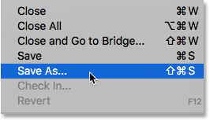
*Going to File > Save As.*

This opens the Save As dialog box. Name the document anything you like. I'll name mine "Understanding Layer Masks" and I'll save it to my Desktop. Make sure you set the **Format** to **Photoshop**, then click the **Save** button:

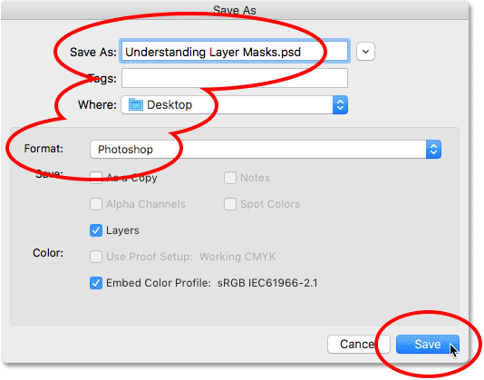
*The "Save As" options.*

Now that we've saved the document, I'll select the Eraser Tool from the Toolbar. I could also select it by pressing the letter **E** on my keyboard:

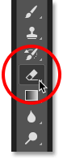
*Selecting the Eraser Tool.*

With the Eraser Tool selected, I'll **Right-click** (Win) / **Control-click** (Mac) inside the document to open the **Brush Preset Picker** where I can adjust the **Size** and **Hardness** of the brush using the sliders at the top. To blend one image into another, a large, soft-edge brush usually works best, so I'll increase my brush size to around **490 px** and I'll lower the hardness all the way down to **0%**. You may need to choose a different brush size depending on the size of your images:

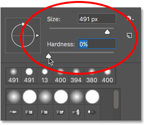
*Setting the Size and Hardness of the Eraser Tool.*

Then, with my "Cat" layer still selected in the Layers panel, I'll click and drag with the Eraser Tool over part of the cat image to erase those areas and start blending it in with the dog image below it. Already, things are looking much better than they did with the Opacity option. Only the parts of the cat image that I'm dragging over are being erased. The rest of the image remains fully visible:

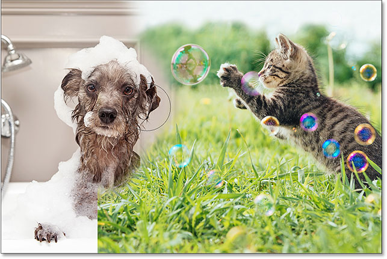
*Erasing some of the cat photo to reveal the dog photo behind it.*

I'll continue erasing more of the cat image to blend it in with the dog image, and here's the result. As we see, the Eraser Tool made it easy to blend the two photos together:

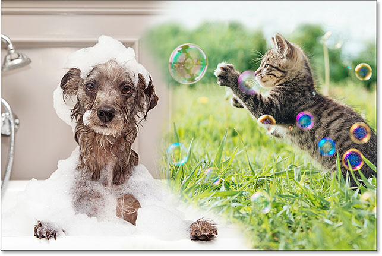
*The result using the Eraser Tool.*

But here's the problem with the Eraser Tool. I'm going to hide the dog image for a moment by clicking on the "Dog" layer's **visibility icon** in the Layers panel:

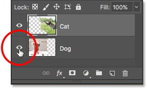
*Turning off the "Dog" layer.*

This allows us to see just my cat image in the document, and look what's happened. All of the areas I dragged over with the Eraser Tool are now gone. The checkerboard pattern in their place tells us that those parts of the image are now blank. If, later on, I realize that I erased too much of the cat image and need to bring some of it back, I'd be out of luck. Once those pixels have been deleted, they're gone for good:

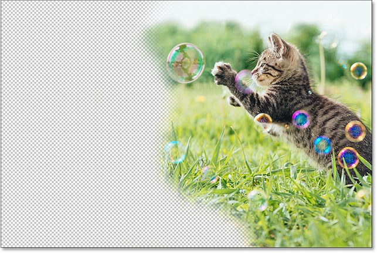
*The Eraser Tool permanently deleted parts of the image.*

Of course, at the moment, I could probably just undo my brush strokes to restore the areas I deleted. But that won't always be the case. Photoshop gives us only a limited number of undo's, so if I had done more work on the document after erasing the pixels, I may not be able to go back far enough in my document's history to undo it. Also, once we close out of the document, we lose our file history, which means that the next time we open the document to continue working, Photoshop would have no record of our previous steps and no way to undo them.

### Restoring The Image

Fortunately, in this case, we planned ahead and saved our document before using the Eraser Tool. To revert the document back to the way it looked before we erased any pixels, all we need to do is go up to the **File** menu at the top of the screen and choose **Revert**:

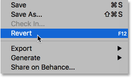
*Going to File > Revert.*

This returns the document back to the way it looked the last time we saved it, restoring the pixels in the top image:

*The top image has been restored.*

[Still scrolling? Download this tutorial as a PDF!](/print-ready-pdfs/)

### Adding A Layer Mask

So far, we've seen that the Opacity option in the Layers panel can only affect entire layers at once, and that the Eraser Tool causes permanent damage to an image. Let's see if a layer mask can give us better results.

We want to blend the top image in with the layer below it, which means that we'll need to hide some of the top layer to let the bottom layer show through. The first thing we'll need to do, then, is select the top layer in the Layers panel (if it isn't selected already):

*Selecting the top layer.*

Then, to add a layer mask to the selected layer, we simply click the **Add Layer Mask** icon (the rectangle with a circle in the middle) at the bottom of the Layers panel:

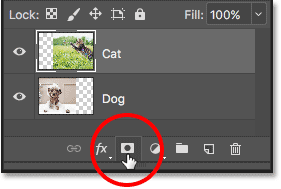
*Clicking the "Add Layer Mask" icon.*

Nothing will happen to the images in the document, but if we look again in the Layers panel, we see that the top layer now shows a **layer mask thumbnail** to the right of its preview thumbnail:

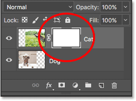
*A layer mask thumbnail appears on the selected layer.*

### As Easy As Black And White (And Gray)

Notice that the layer mask thumbnail is filled with **white**. Why white? Why not black, or red, or blue? Well, the reason it's not filled with red or blue is because layer masks are **grayscale images**. A grayscale image is an image that uses only black, white and the various shades of gray in between. It can't display any other colors.

Many people think of grayscale images as *black and white* images. But really, most black and white photos are actually grayscale photos, not black and white, since a true "black and white" photo would contain *only* pure black and pure white, with no other shades of gray, and that would make for a pretty odd looking image.

So, since layer masks are grayscale images, that explains why the layer mask isn't filled with red or blue. But why white? Why not black or gray? Well, we use a layer mask to control the transparency level of a layer. Usually, we use it to adjust the transparency of different areas of the layer independently (otherwise we'd just use the Opacity option in the Layers panel that we looked at earlier).

But by default, when we first add a layer mask, Photoshop keeps the entire layer fully visible. It does that by filling the layer mask with white. Why white? It's because the way a layer mask works is that it uses **white** to represent the areas of the layer that should remain **100% visible** in the document. It uses **black** to represent areas that should be **100% transparent** (completely hidden). And, it uses the various shades of **gray** in between to represent **partial transparency**, with areas filled with darker shades of gray appearing more transparent than areas filled with lighter shades.

In other words, with layer masks, we use white to *show* the contents of the layer, black to *hide* them, and gray to *partially* show or hide them. And that's really all there is to it!

Since my layer mask is currently filled with white, and white on a layer mask represents  areas on the layer that are 100% visible, my entire image on the "Cat" layer is fully visible in the document:

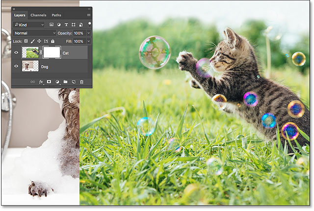
*The cat image is 100% visible with the layer mask filled with white.*

Let's see what happens if we fill the layer mask with **black**. Notice in the Layers panel that the layer mask thumbnail has a white **highlight border** around it. That's because the layer and its layer mask are two separate things, and the highlight border around the layer mask thumbnail tells us that the mask, not the layer itself, is currently selected. If you're not seeing the highlight border around the layer mask thumbnail, click on the thumbnail to select it:

*The highlight border around the thumbnail tells us that the layer mask is selected.*

Then, to fill the layer mask with black, go up to the **Edit** menu at the top of the screen and choose **Fill**:

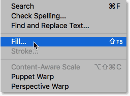
*Going to Edit > Fill.*

This opens Photoshop's Fill dialog box. Change the **Contents** option at the top to **Black**, then click **OK**:

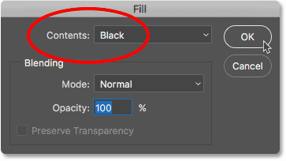
*Changing "Contents" to "Black" in the Fill dialog box.*

Back in the Layers panel, we see that the layer mask thumbnail is now filled with solid black:

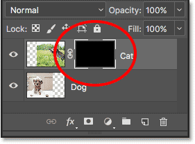
*The Layers panel showing the mask thumbnail filled with black.*

Since black on a layer mask represents areas on the layer that are 100% transparent, filling the entire layer mask with black causes the contents of the layer (my cat photo) to be completely hidden from view. This gives us the same result as if we had lowered the Opacity option in the Layers panel down to 0%:

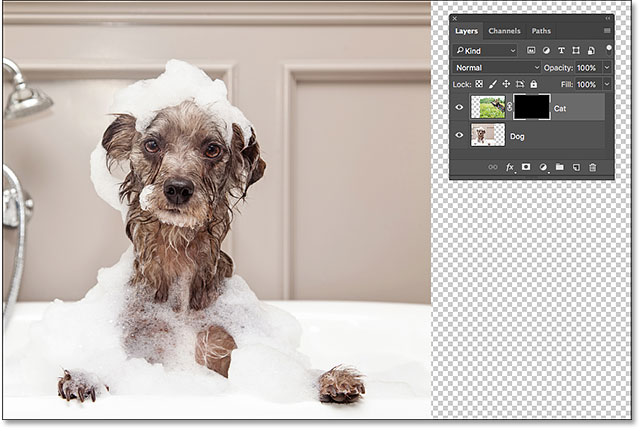
*The cat image disappears after filling the layer mask with black.*

What if we fill the layer mask with gray? Let's give it a try. I'll go back up to the **Edit** menu and I'll once again choose **Fill**:

*Going again to Edit > Fill.*

When the Fill dialog box re-appears, I'll change the **Contents** option from Black to **50% Gray**, then I'll click **OK**:

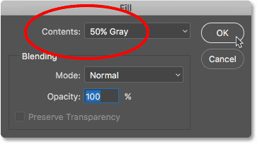
*Changing "Contents" to "50% Gray".*

Back in the Layers panel, we see that my layer mask thumbnail is now filled with 50% gray (the shade of gray directly between pure black and pure white):

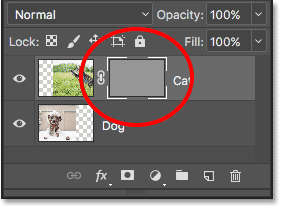
*The Layers panel showing the mask thumbnail filled with gray.*

Since gray on a layer mask represents areas of partial transparency on the layer, and we filled the mask specifically with 50% gray, my cat photo now appears 50% transparent in the document, giving us the same result as if we had lowered the Opacity option  to 50%:

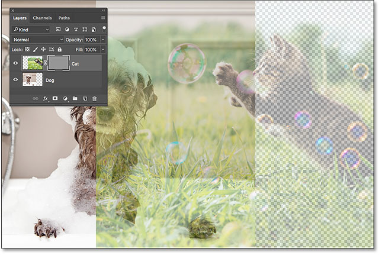
*The result after filling the layer mask with 50% gray.*

Let's restore the image back to 100% visibility by again going up to the **Edit** menu and choosing **Fill**:

*Going one last time to Edit > Fill.*

When the Fill dialog box appears, change the **Contents** option to **White**, then click **OK**:

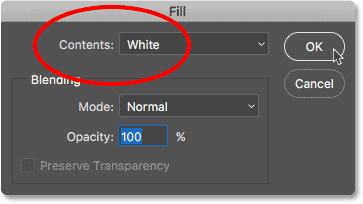
*Changing "Contents" to "White".*

This fills our layer mask with white, just like it was originally:

*The layer mask is once again filled with white.*

And the image on the layer is once again 100% visible:

*The result after filling the layer mask with white.*

## Destructive vs Non-Destructive Editing

So far, layer masks haven't seemed like anything special. In fact, as we've seen, filling a layer mask entirely with solid white, black or gray gives us the same result as using the Opacity option in the Layers panel. If that was all that layer masks could do, there would be no need for layer masks since the Opacity option is faster and easier to use.

But layer masks in Photoshop are a lot more powerful than that. In fact, they have more in common with the Eraser Tool than with the Opacity option. Like the Eraser Tool, layer masks allow us to easily show and hide different areas of a layer independently. 

But here's the important difference. While the Eraser Tool permanently deletes areas of an image, layer masks simply *hide* those areas from view. In other words, the Eraser Tool makes *destructive* edits to an image; layer masks do it *non-destructively*. Let's see how it works.

First, let's make sure once again that our layer mask, not the layer itself, is selected. You should be seeing the white highlight border around the mask thumbnail:

*Make sure the mask, not the layer, is selected.*

### The Brush Tool

I mentioned earlier that the Eraser Tool is a brush. With layer masks, we don't use the Eraser Tool itself, but we *do* use a brush. In fact, we use Photoshop's **Brush Tool**. I'll select it from the Toolbar. You can also select the Brush Tool by pressing the letter **B** on your keyboard:

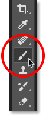
*Selecting the Brush Tool.*

Since we want to use the Brush Tool to hide  areas of the layer we paint over, and we know that on a layer mask, black represents areas that are hidden, we'll need to paint with **black**. Photoshop uses our current **Foreground color** as the brush color. But by default, whenever we have a layer mask selected, Photoshop sets the Foreground color to **white**, not black.

We can see our current Foreground and Background colors in the **color swatches** near the bottom of the Toolbar. Notice that the Foreground color (the swatch in the upper left) is set to white and that the Background color (the swatch in the lower right) is set to black. These are the default colors when working with layer masks:

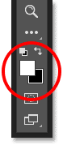
*The current Foreground (upper left) and Background (lower right) colors.*

To set our Foreground color to black, all we need to do is swap the current Foreground and Background colors, and the easiest way to do that is by pressing the letter **X** on your keyboard. This sets the Foreground color, and our brush color, to black:

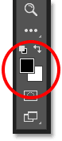
*Pressing X to swap the Foreground and Background colors.*

All we need to do now is set the size and hardness of our brush. Just like I did with the Eraser Tool, I'll **Right-click** (Win) / **Control-click** (Mac) inside my document to quickly open Photoshop's **Brush Preset Picker**. Then, I'll use the **Size** slider at the top to set my brush size to the same size I used with the Eraser Tool (around 490 px), and I'll drag the **Hardness** slider all the way to the left (to a value of 0%) to give my brush nice, soft edges:

*Setting the Size and Hardness of the Brush Tool.*

### Painting With Black To Hide Areas

Then, with black as my brush color, I'll start painting over roughly the same areas that I did with the Eraser Tool. Because I'm painting on a layer mask, not on the layer itself, we don't see the brush color as we paint. Instead, since I'm painting with black, and black hides areas on a layer mask, the areas I paint over are hidden from view:

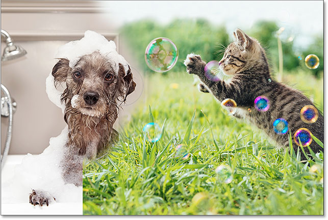
*Painting with black on the layer mask to hide parts of the image.*

I'll continue hiding more of the cat image by painting over more areas with black until I get a result similar to what I achieved with the Eraser Tool:

*Painting away more of the top image.*

At this point, the difference between a layer mask and the Eraser Tool isn't all that obvious. Both of them allowed me to blend my two images together by hiding parts of the top layer, and both gave me similar results. Yet as we saw earlier, the Eraser Tool permanently deleted the areas I erased. Let's look more closely at what's happened with the layer mask.

First, let's look again at our layer mask thumbnail in the Layers panel where we see that it's no longer filled with just solid white. Some of it remains white, but we can also see the areas where we painted on it with black:

*The layer mask thumbnail now contains both white *and* black.*

### Viewing The Layer Mask

It's important to understand that the layer mask thumbnail in the Layers panel is not the actual layer mask itself. The thumbnail is there simply to give us a way to select the layer mask so we can work on it, and to show us a small preview of what the full size layer mask looks like.

To view the actual layer mask in your document, press and hold the **Alt** (Win) / **Option** (Mac) key on your keyboard and click on the **layer mask thumbnail**:

*Holding Alt (Win) / Option (Mac) and clicking the mask thumbnail.*

This temporarily hides our image and replaces it with the layer mask, giving us a better view of what we've done. In my case, the white area on the right is where my cat photo remains 100% visible. The areas I painted over with black are the areas where my cat image is now 100% transparent, allowing the dog photo below the layer to show through. 

And, because I painted with a soft-edge brush, we see a feathering effect around the black areas, creating narrow **gradients** that transition smoothly from black to white. Since we know that gray on a layer mask creates partial transparency, and darker shades of gray appear more transparent than lighter shades, those dark-to-light gradients between the black (100% transparent) and white (100% visible) areas allow my two images to transition smoothly together:

*Viewing the actual layer mask in the document.*

To hide the layer mask and return to your image, once again press and hold **Alt** (Win) / **Option** (Mac) on your keyboard and click the **layer mask thumbnail**:

*Holding Alt (Win) / Option (Mac) and clicking the mask thumbnail again.*

And now, we're back to seeing our images:

*The layer mask is once again hidden from view.*

### Turning The Layer Mask Off

We can also turn  the layer mask off in the document. To turn off the  mask, press and hold the **Shift** key on your keyboard and click on the **layer mask thumbnail**. A big red **X** will appear across the thumbnail, letting you know that the mask has been temporarily turned off:

*Holding Shift and clicking the layer mask thumbnail.*

With the layer mask turned off, we're no longer seeing its effects in the document, and this is where the difference between the Eraser Tool and a layer mask becomes obvious. Remember, the Eraser Tool permanently deleted areas of the image. Yet as we see, the layer mask did not. All the layer mask did was *hide* those areas from view. When we turn the mask off, the entire image on the layer returns:

*Turning off the layer mask makes the entire image on the layer 100% visible.*

To turn the mask back on and hide those areas again, press and hold **Shift** and click once again on the **layer mask thumbnail**. The red **X** across the thumbnail will disappear, and so will the areas of the image that you painted over with black:

*Turning the layer mask back on hides the areas once again.*

### Painting With White To Restore Hidden Areas

Since a layer mask simply hides, rather than deletes, areas on a layer, and our original image is still there, it's easy to bring back any areas that were previously hidden. We know that **white** on a layer mask makes those areas 100% visible, so all we need to do is paint over any areas we want to restore with white.

To change your brush color from black to white, press the letter **X** on your keyboard to swap your Foreground and Background colors back to their defaults. This sets your Foreground color (and your brush color) to white:

*Pressing X to swap the Foreground color (upper left swatch) back to white.*

Then, with the layer mask still selected and white as your brush color, simply paint over any areas that were previously hidden to make them visible. In my case, I'll paint over the dog's paw in the bottom center to hide it and show the cat image in its place:

*Restoring the cat photo in the bottom center by painting on the mask with white.*

Again, because we're painting on a layer mask, not on the image itself, we don't see our brush color as we paint. So to better see what I've done, I'll view my layer mask in the document by pressing and holding **Alt** (Win) / **Option** (Mac) on my keyboard and clicking on the **layer mask thumbnail**, just as we did earlier.

With the layer mask itself now visible, we see how easy it was to restore the top image in that area. Even though I had previously painted over it with black to hide the cat photo from view, all I had to do to restore it was paint over that same area with white:

*Painting over the area with white was all it took to restore the image on the top layer.*