# Understanding Layers In Photoshop

> Source: [https://www.photoshopessentials.com/basics/understanding-photoshop-layers/](https://www.photoshopessentials.com/basics/understanding-photoshop-layers/)
> Downloaded and converted to Markdown.

Learn the basics of layers in Photoshop, including what layers are, how they work, and why knowing how to use layers is so important. For Photoshop CC, CS6 and earlier versions of Photoshop.

If you're brand new to layers in Photoshop, you've picked a great place to start. For this first look at layers, we'll focus on what layers are and why we need them. Rather than creating anything fancy, we'll use some very simple tools to draw some very simple shapes. Then, we'll learn how we can manipulate those shapes within our document using layers! We'll start by creating our composition without layers and looking at the challenges we face when trying to make even simple changes. Then, we'll create the same composition again, this time using layers, to see just how much of a difference layers really make.

The basics of layers have not changed at all over the years, so even though I'll be using **Photoshop CS6** here, everything is fully compatible with **Photoshop CC** as well as earlier versions of Photoshop. So, if you're ready to learn about layers, let's get started!

Layers are, without a doubt, the single most important aspect of Photoshop. Nothing worth doing in Photoshop can, or at least *should*, be done without layers. They're so important that they have their own [Layers panel](/basics/layers/layers-panel/) as well as their own Layer category in Photoshop's Menu Bar along the top of the screen. You can add layers, delete layers, name and rename layers, group them, move them, mask them, blend them together, add effects to layers, change their opacity, and more!

Need to add some text to your layout? It will appear on its own Type layer. How about vector shapes? They'll appear on separate Shape layers. Layers are the heart and soul of Photoshop. It's a good thing, then, that layers are so easy to use, and easy to understand, at least once you wrap your head around them.

"That's great!", you say, "but that doesn't tell me what layers are". Good point, so let's find out!

This tutorial is Part 1 of my complete [Photoshop Layers Learning Guide](/photoshop-layers-learning-guide/ "View our Layers Learning Guide").

Let's get started!

## Photoshop Without Layers

Before we look at what layers are and how to use them, let's first see what working in Photoshop would be like *without* layers. This will make it easier to see why layers are so important. We'll start by creating a new Photoshop document. To do that, go up to the **File** menu in the **Menu Bar** along the top of the screen and choose **New**:

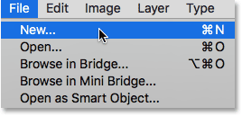
*Going to File > New.*

This opens the New dialog box. There's no particular size we need for our document, but to keep us both on the same page, enter **1200 pixels** for the **Width** and **800 pixels** for the **Height**. You can leave the **Resolution** value set to **72 pixels/inch**. Finally, make sure **Background Contents** is set to **White** so that our new document will have a solid white background. Click OK when you're done to close out of the dialog box. Your new white-filled document will appear on the screen:

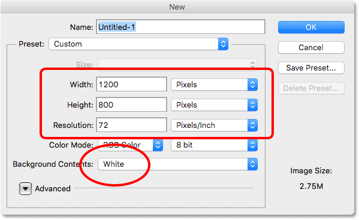
*Photoshop's New dialog box.*

### Drawing A Square Shape

Now that we have our new document ready to go, let's draw a couple of simple shapes. First, we'll draw a square, and for that, we'll use one of Photoshop's basic selection tools. Select the **Rectangular Marquee Tool** from the top of your **Tools panel** along the left of the screen:

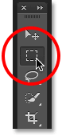
*Selecting the Rectangular Marquee Tool.*

To draw a square with the [Rectangular Marquee Tool](/basics/selections/rectangular-marquee-tool/), click anywhere in the upper left of your document to set the starting point for the selection. Then, with your mouse button still held down, press and hold your **Shift** key and drag diagonally towards the lower right. Normally, the Rectangular Marquee Tool draws freeform rectangular selections, but by pressing and holding the Shift key, we tell Photoshop to force the shape of the selection into a perfect square.

Once you've drawn out the selection, release your mouse button, then release your Shift key. It's very important that you release your mouse button first, *then* the Shift key, otherwise your perfect square will revert back into a freeform rectangle:

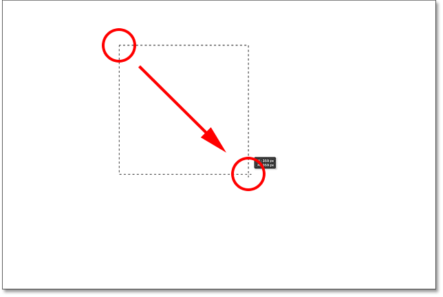
*Drawing a square selection with the Rectangular Marquee Tool.*

Now that we've drawn our selection outline, let's fill it with a color. To do that, we'll use Photoshop's Fill command. Go up to the **Edit** menu at the top of the screen and choose **Fill**:

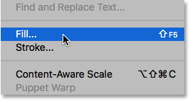
*Going to Edit > Fill.*

This opens the Fill dialog box. Change the **Use** option at the top of the dialog box to **Color**:

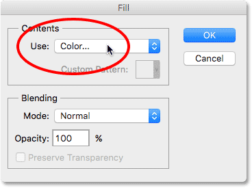
*Changing Use to Color.*

As soon as you select Color, Photoshop will pop open its **Color Picker** so we can choose which color we want to use. You can pick any color you like. I'll choose a shade of red:

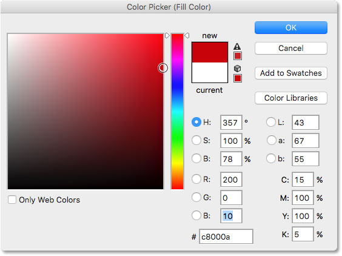
*Choose a color from the Color Picker. Any color will do.*

Click OK when you're done to close out of the Color Picker, then click OK to close out of the Fill dialog box. Photoshop fills the selection with your chosen color, which in my case was red:

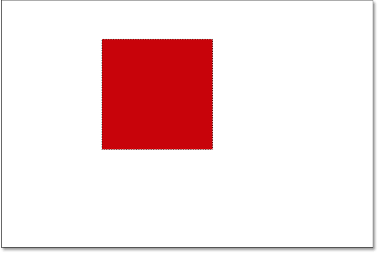
*The document after filling the selection with red.*

We don't need our selection outline around the square anymore, so let's remove it by going up to the **Select** menu at the top of the screen and choosing **Deselect**:

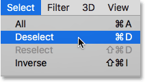
*Going to Select > Deselect.*

### Drawing A Round Shape

So far so good. Now let's add a second shape to the document. We've already added a square, so let's mix things up a bit and add a round shape this time. For that, we'll use another one of Photoshop's basic selection tools—the [Elliptical Marquee Tool](/basics/selections/elliptical-marquee-tool/).

The Elliptical Marquee Tool is nested in behind the Rectangular Marquee Tool in the Tools panel. To select it, **right-click** (Win) / **Control-click** (Mac) on the Rectangular Marquee Tool, then choose the Elliptical Marquee Tool from the fly-out menu:

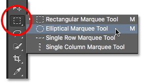
*Selecting the Elliptical Marquee Tool.*

Let's draw our round shape so that it overlaps the square. Click in the bottom right corner of the square to set the starting point for the selection. Then, with your mouse button still held down, press and hold **Shift+Alt** (Win) / **Shift+Option** (Mac) on your keyboard and drag away from the starting point.

Normally, the Elliptical Marquee Tool draws freeform elliptical selections, but by holding down the Shift key as we drag, we force the shape into a perfect circle. Holding the Alt (Win) / Option (Mac) key tells Photoshop to draw the shape outward from the point where we initially clicked.

Drag out the shape so that it's roughly the same size as the square. When you're done, release your Shift key and the Alt (Win) / Option (Mac) key, then release your mouse button. Again, make sure you release the keys first, *then* the mouse button:

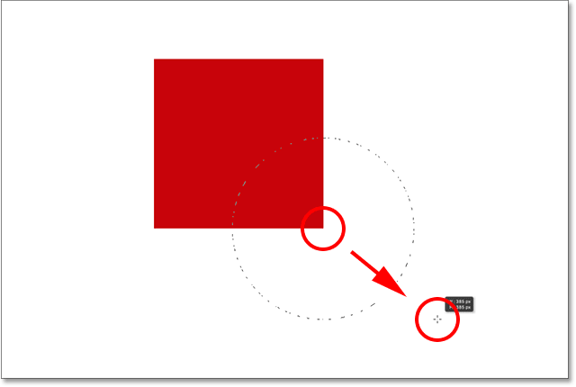
*Drawing a circular selection that overlaps the square.*

Once you've drawn your circular selection outline, go back up to the **Edit** menu at the top of the screen and choose **Fill** to fill the selection with a color. The **Use** option at the top of the Fill dialog box should already be set to **Color** since that's what we set it to previously. But if you simply click OK to close out of the dialog box, Photoshop will fill the selection with the same color you chose last time, and that's not what we want.

We want a different color for the round shape, so click on the word Color, then re-select Color from the list of options (I know, it seems weird to select something that's already selected), at which point Photoshop will re-open the **Color Picker**. Choose a different color this time. I'll choose orange. Again, feel free to pick any color you like:

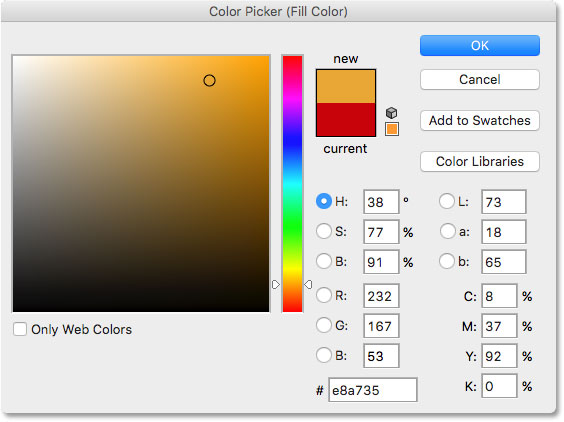
*Choose a different color for the second shape.*

Click OK to close out of the Color Picker, then click OK to close out of the Fill dialog box, at which point Photoshop fills the selection with color. To remove the selection outline from around the shape, go up to the **Select** menu at the top of the screen and choose **Deselect**, just as we did last time. We now have two shapes—one square and one circle—with the circle overlapping the square:

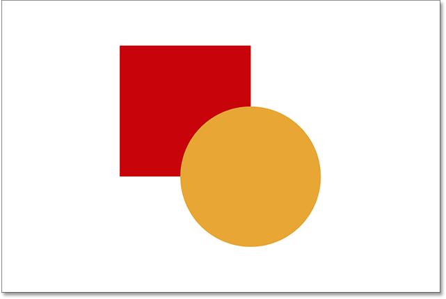
*The document with both shapes added.*

### The Problem...

We've drawn our shapes and everything looks great. Although...

Now that I've been looking at it for a while, I'm not sure I'm happy with something. See how the orange shape overlaps the red one? I know I did that on purpose, but now I'm thinking it was a mistake. It might look better if the red shape was in front of the orange shape. I think I want to swap them. That should be easy enough, right? All I need to do is grab the red one and move it overtop of the orange one.

To do that, we... um... hmm. Wait a minute, how do we do that? I drew the red one, then I drew the orange one, and now I just need to move the red one in front of the orange one. Sounds easy enough, but... how?

The simple answer is, I can't. There's no way to move that red shape in front of the orange one because the orange one isn't *really* in front of the red one at all. It's just an illusion. The orange shape is simply cutting into the red one, and those [pixels](/essentials/pixels.php) that were initially colored with red when I filled in the square were changed to orange when I filled in the circle.

In fact, the two shapes are not *really* sitting in front of the white background, either. Again, it's just an illusion. The entire composition is nothing more than a *single flat image*. Everything in the document—the square shape, the round shape and the white background—is stuck together.

Let's take a look in our **Layers panel** to see what's happening. The Layers panel is where we view the layers in our document. Notice that even though we haven't looked at layers yet, and made no attempt to add one ourselves, Photoshop automatically created a default layer for us. The default layer is named **Background** because it serves as the background for our composition.

If we look to the left of the layer's name, we see a thumbnail image. This is the layer's **preview thumbnail**. It shows us a small preview of what's on the layer. In this case, we see both of our shapes as well as the white background. Since we didn't add any other layers ourselves, Photoshop placed everything we've done so far on this one, default Background layer:

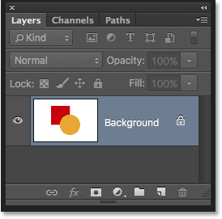
*The Layers panel showing everything on the Background layer.*

And that's the problem. Everything we did was added to that one layer. With our entire composition on a single layer, we don't have many options if we want to change something. We could undo our way back through the steps to get to the point where we can make our change, or we could scrap the whole thing and start over again. Neither of those options sounds very appealing. There must be a better way to work in Photoshop, one that will give us the freedom and flexibility to change our composition without needing to undo a bunch of steps or start over from scratch.

Fortunately, there is! The solution is to use layers. Let's try the same thing, but this time using layers!

## Take Two, This Time With Layers

Now that we've seen what it's like to work in Photoshop without layers, let's see what layers can do for us. First, we'll clear away the two shapes we've added. Since everything is on a single layer, we can do that easily just by filling the layer with white.

Go up to the **Edit** menu at the top of the screen and once again choose **Fill**. When the Fill dialog box appears, change the **Use** option from Color to **White**:

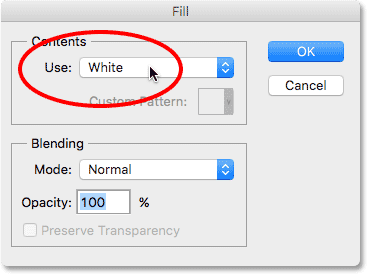
*Going to Edit > Fill, then changing Use to White.*

Click OK to close out of the dialog box. Photoshop fills the document with white, and we're back to where we started:

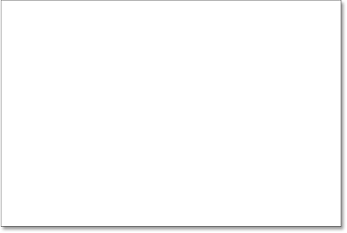
*The document is once again filled with white.*

### The Layers Panel

I mentioned a moment ago that the Layers panel is where we go to view the layers in our document. But really, the [Layers panel](/basics/layers/layers-panel/) is so much more. In fact, it's really Command Central for layers. If there's something we need to do in Photoshop that has something to do with layers, the Layers panel is where we do it. We use the Layers panel to create new layers, delete existing layers, rename layers, move layers around, turn layers on and off in the document, add layer masks and layer effects.... the list goes on. And it's all done from within the Layers panel.

As we've already seen, the Layers panel is showing us that we currently have one layer in our document—the default [Background layer](/basics/layers/background-layer/). The preview thumbnail to the left of the layer's name is showing us that the Background layer is filled with white:

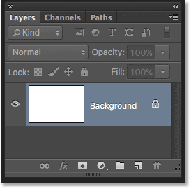
*The Layers panel showing the white-filled Background layer.*

When we initially added our two shapes to the document, they were both added to the Background layer, and that's why there was no way to move them independently of each other. The shapes and the white background were all stuck together on a flat image. This way of working in Photoshop, where everything is added to a single layer, is known in technical terms as "wrong" because when you need to go back and make changes, you run into a "problem" (another technical term). Let's see what happens if we create the same layout as before, but this time, we'll place everything on its own layer.

Our white background is already on the Background layer, so let's add a new layer above it for our first shape. To add a new layer to the document, we simply click on the **New Layer** icon at the bottom of the Layers panel (second icon from the right):

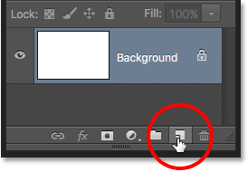
*Clicking the New Layer icon.*

A new layer appears above the Background layer. Photoshop automatically names the new layer **Layer 1**. If we look at the preview thumbnail to the left of the layer's name, we see that it's filled with a **checkerboard pattern**. The checkerboard pattern is Photoshop's way of representing transparency. In other words, it's telling us that the new layer is blank. It's there waiting for us to do something with it, but at the moment, there's nothing on it:

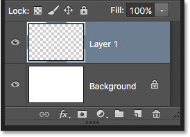
*A new blank layer named "Layer 1" appears above the Background layer.*

Notice that Layer 1 is highlighted in blue. This means it's currently the *active layer*. Anything we add to the document at this point will be added to the active layer (Layer 1), not the Background layer below it. Let's add our first shape, just as we did before. Since our first shape was the square, we'll need to once again select the **Rectangular Marquee Tool** from the Tools panel.

The Tools panel shows us the last tool that we selected from the group. By "group", I mean all of the tools that are nested together in the same spot. Since the last tool we chose from the group was the Elliptical Marquee Tool, its icon is the one currently visible in the Tools panel. To switch back to the Rectangular Marquee Tool, we'll need to **right-click** (Win) / **Control-click** (Mac) on the Elliptical Marquee Tool and then choose the Rectangular Marquee Tool from the fly-out menu:

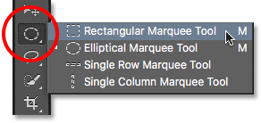
*Selecting the Rectangular Marquee Tool from behind the Elliptical Marquee Tool.*

With the Rectangular Marquee Tool in hand, click and drag out a square selection similar to the previous one, pressing and holding the **Shift** key as you drag to force the shape into a perfect square. When you're done, release the Shift key, then release your mouse button. Here, we see my selection outline:

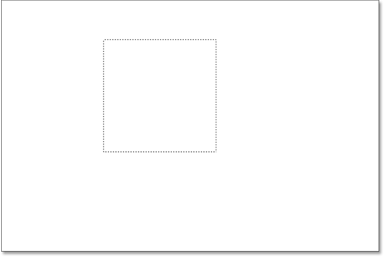
*Drawing another square selection.*

Go up to the **Edit** menu at the top of the screen and choose **Fill**. When the Fill dialog box opens, change the **Use** option to **Color**, then pick a color for the square from the **Color Picker**. I'll choose the same red color I chose last time. Click OK to close out of the Color Picker, then click OK to close out of the Fill dialog box.

Photoshop fills the selection with your chosen color. To remove the selection outline from around the shape, go up to the **Select** menu at the top of the screen and choose **Deselect** (I'm running through these steps quickly here simply because they're exactly the same as what we did previously). I now have my first shape, filled with red, just as I had before:

*The document after re-drawing the same square shape.*

It doesn't seem like anything is different just by looking at the composition itself. We have a square shape sitting against a white background, just like we had last time. But the Layers panel is now telling a different story. The preview thumbnails are showing us that the Background layer is still filled with solid white, while the square is now on a completely separate layer (Layer 1) above it. This means that the white background and the square shape are no longer part of the same flat image. It *looks* like they are in the document, but they're really two completely separate elements:

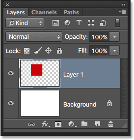
*The square shape and the white background are now independent of each other.*

Let's add our second shape. Again, we want to place it on its own layer, which means we first need to add another new layer to the document by clicking the **New Layer** icon at the bottom of the Layers panel:

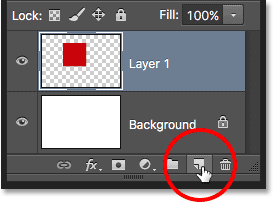
*Adding another new layer.*

A second new layer, **Layer 2**, appears above Layer 1. Normally, we'd want to rename our layers since names like "Layer 1" and "Layer 2" don't tell us anything about what's actually on each layer. But for our purposes here, the automatic names are fine. Notice that once again, the checkerboard pattern in the preview thumbnail is telling us that the new layer is currently blank:

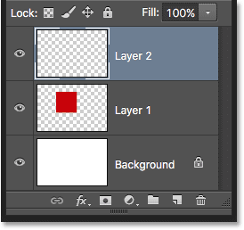
*The new blank layer appears above Layer 1.*

Notice also that Layer 2 is highlighted in blue, which means it's now the active layer. Anything we add next to the document will be added to Layer 2. Grab the **Elliptical Marquee Tool** from the Tools panel (nested behind the Rectangular Marquee Tool) and drag out a circular selection, just as we did before. Make sure that part of it is overlapping the square. Then go back up to the **Edit** menu and choose **Fill**. Re-select **Color** for the **Use** option to open the **Color Picker** and choose a color for the shape. I'll choose the same orange.

Click OK to close out of the Color Picker, then click OK to close out of the Fill dialog box. Photoshop fills the selection with color. Go up to the **Select** menu and choose **Deselect** to remove the selection outline from around the shape. And now, we're back to the way things looked previously with both of our shapes added:

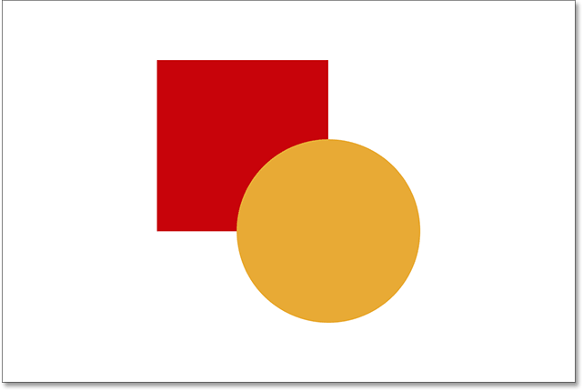
*Both shapes have been redrawn.*

Looking in the Layers panel, we see that the square shape remains all by itself on Layer 1 while the new round shape was placed on Layer 2. The white background remains on the Background layer, which means that all three elements that make up our document (the white background, the square shape and the round shape) are now on their own separate layers and completely independent of each other:

*Each element in the document is now on its own layer.*

### Changing The Order Of Layers

Previously, when everything was on a single layer, we found that there was no way to move the square shape in front of the round one because they really were not two separate shapes. They were simply areas of different-colored pixels mixed in with areas of white pixels on the same flat image. But this time, with everything on its own layer, we really do have two separate shapes, along with a completely separate background. Let's see how we can use our layers to easily swap the order of the shapes.

At the moment, the round shape appears in front of the square shape in the composition because the round shape's layer (Layer 2) is *above* the square shape's layer (Layer 1) in the Layers panel. Imagine as you're looking at the layers from top to bottom in the Layers panel that you're looking *down through* the layers in the document. Any layer above another layer in the Layers panel appears in front of it in the document. If the contents of two layers overlap each other, as our shapes are doing, then whichever layer is *below* the other in the Layers panel will appear *behind* the other layer in the composition.

This means that if we want to swap the order of our shapes so that the square one appears in front of the round one, all we need to do is move the square shape's layer (Layer 1) *above* the round shape's layer (Layer 2). To do that, simply click on Layer 1, then keep your mouse button held down and drag it up and above Layer 2 until you see a horizontal **highlight bar** appear directly above Layer 2. The bar tells us where the layer will be moved to when we release the mouse button:

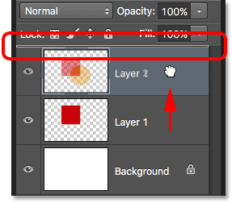
*Dragging Layer 1 above Layer 2.*

Go ahead and release your mouse button, at which point Photoshop drops Layer 1 into place above Layer 2:

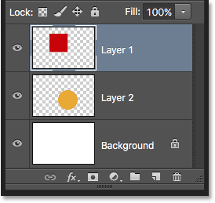
*Layer 1 now appears above Layer 2 in the Layers panel.*

With the square shape's layer now above the round shape's layer, their order in the composition has been reversed. The square shape now appears in front of the round one:

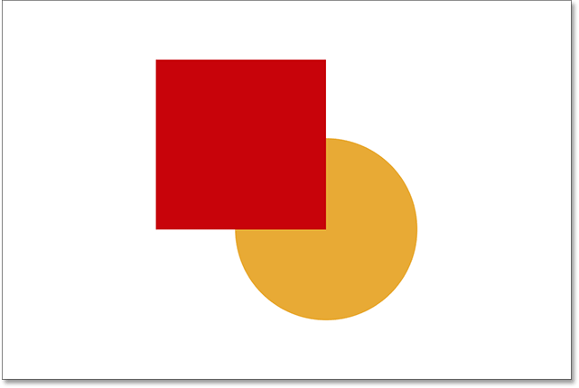
*Thanks to layers, it was easy to move one shape in front of the other.*

Without layers, moving one element in front of the other like this would not have been possible. But with everything on its own layer, it couldn't have been easier. Layers keep everything separate, allowing us to make changes to individual elements without affecting the entire composition.

What if I decide later on that, you know what? I actually liked it better before. I want to move the round shape so it's back in front of the square one. Thanks to layers, it's not a problem! Just as we can drag layers above other layers, we can also drag them below other layers.

I'll click on the square shape's layer (Layer 1) and drag it back down below the round shape's layer (Layer 2). Once again, the highlight bar shows me where the layer will be moved to when I release my mouse button:

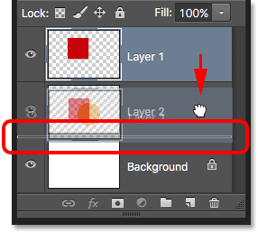
*Dragging Layer 1 below Layer 2.*

I'll release my mouse button so Photoshop can drop Layer 1 below Layer 2:

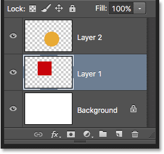
*The square shape's layer is back below the round shape's layer.*

And we're back to seeing the round shape in front of the square one in the composition:

*The shapes are back to their original order.*

### Moving Layers Around

What if we don't really want the shapes overlapping each other? Maybe they would look better if they were spread further apart. Again, because they're on separate layers, we can easily move them around.

To move the contents of a layer, select Photoshop's **Move Tool** from the top of the Tools panel:

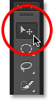
*Selecting the Move Tool.*

Then, make sure you have the correct layer selected in the Layers panel. I'm going to move the round shape over to the right of the square shape, so I'll click on the round shape's layer (Layer 2) to select it and make it active. Again, I know it's now the active layer because Photoshop highlights it in blue when I click on it:

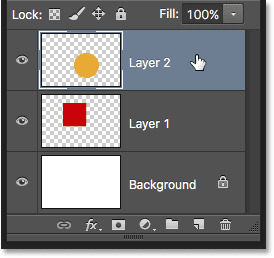
*Clicking on Layer 2 to select it.*

With Layer 2 selected, I'll click with the Move Tool on the round shape and drag it over to the right of the square:

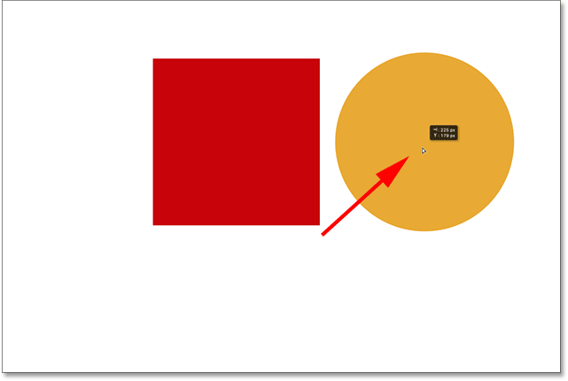
*Layers make it easy to move elements around within a composition.*

We can even move both shapes at once. For that, we'll need to have both shape layers selected at the same time. I already have Layer 2 selected in the Layers panel. To select Layer 1 as well, all I need to do is press and hold my **Shift** key and click on Layer 1. Both layers are now highlighted in blue, which means they're both selected:

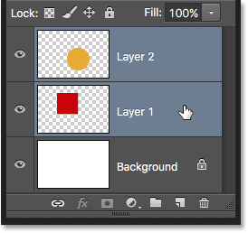
*Selecting both shape layers at once.*

With both layers selected, if we click and drag either one of them with the Move Tool, both shapes move together:

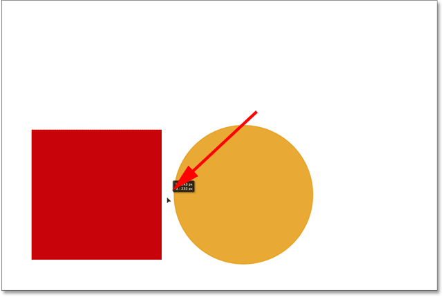
*Moving both shapes at the same time.*

### Deleting Layers

One last thing we'll look at in this tutorial is how to delete layers. If we decide we don't need one of the shapes, we can remove it from the composition simply by deleting its layer. I'll click on the square's layer (Layer 1) to select it. Then, to delete the layer, all we need to do is drag it into the **Trash Bin** at the bottom of the Layers panel (the icon furthest to the right):

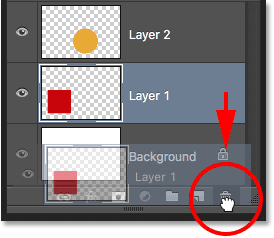
*Dragging Layer 1 into the trash.*

With the square's layer deleted, only the round shape remains in the document (along with the white background, of course):

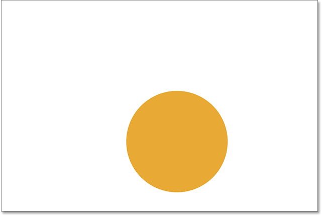
*Deleting a layer removes its contents from the document.*

I'll do the same thing with the round shape, dragging its layer down into the Trash Bin:

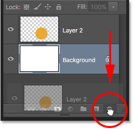
*Dragging Layer 2 into the trash.*

And now, with both shape layers deleted, we're once again back to nothing more than our solid white background:

*Both shapes have been removed. Only the background remains.*

### Where to go from here...

And there we have it! We've barely scratched the surface here when it comes to all of the things we can do with layers, but hopefully you now have a better sense of what layers are and why they're such an essential part of working with Photoshop. Layers allow us to keep all of the various elements in a composition separate so we can add them, move them, edit them, and even delete them without affecting anything else. And because layers keep our workflow flexible, they offer us a level of creativity that simply wouldn't be possible without layers.

As I mentioned earlier, anything that has anything to do with layers in Photoshop is done from the Layers panel. So now that we have a basic understanding of what layers are and how they work, in the next lesson, we'll learn all about Photoshop's [Layers panel](/basics/layers/layers-panel/)!

You can jump to any of the other lessons in this [Photoshop Layers series](/photoshop-layers-learning-guide/ "Photoshop Layers Learning Guide"). Or visit our [Photoshop Basics](/basics/ "Learn more") section for more topics!