# How to Keep Photoshop Always Up to Date

> Source: [https://www.photoshopessentials.com/basics/update-photoshop-cc/](https://www.photoshopessentials.com/basics/update-photoshop-cc/)
> Downloaded and converted to Markdown.

Learn how to keep Adobe Photoshop up to date with the latest features, improvements and fixes using the Creative Cloud desktop app! Now updated for Photoshop 2021.

As an Adobe Creative Cloud subscriber, you always have access to the latest and greatest version of Photoshop. Major Photoshop updates are released every six months or so, and minor updates and bug fixes are released all the time. So in this first tutorial in my [Getting Started with Photoshop](/basics/getting-started-photoshop/ "Learn more") series, you'll learn how easy it is to update Photoshop using the Adobe Creative Cloud desktop app.

I show you how to check for Photoshop updates and install them, and how to set up the Creative Cloud app to update Photoshop automatically. You'll also learn how to avoid losing your custom settings when updating to a new version, and how to keep the previous version of Photoshop in case you still need it.

Let's get started!

### Step 1: Open the Creative Cloud desktop app

Photoshop is updated using the Creative Cloud desktop app. If you have [downloaded and installed Photoshop](https://adobe.prf.hn/click/camref:1100lrdjJ/destination:https%3A%2F%2Fwww.adobe.com%2Fproducts%2Fphotoshop.html) on your computer, the Creative Cloud app is most likely running in the background. And if it is, the app can be opened just by clicking its icon.

#### Windows

On a Windows PC, the Creative Cloud icon is found in the system tray in the bottom right of your screen:

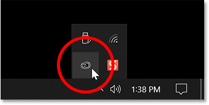
*Opening the Creative Cloud app in Windows.*

#### Mac

On a Mac, the icon appears in the Menu Bar in the upper right of your screen:

*Opening the Creative Cloud app on a Mac.*

#### From Photoshop

If the Creative Cloud app is not running in the background, open it from within Photoshop by going up to the **Help** menu in Photoshop's Menu Bar and choosing **Updates**:

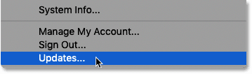
*In Photoshop, go to Help > Updates.*

The Creative Cloud app opens showing the Adobe apps currently installed on your computer. I keep several recent versions of Photoshop installed for comparison, but in most cases, you'll have just the one:

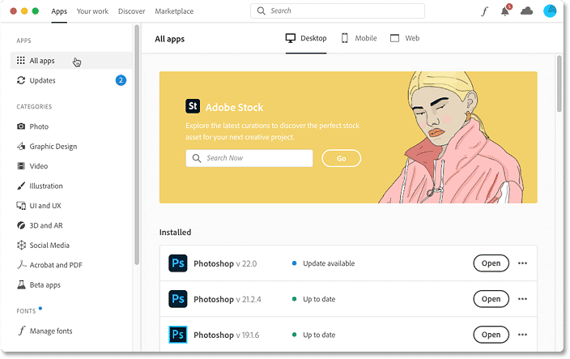
*The Creative Cloud desktop app.*

### Step 2: Choose the Updates category

To view only the apps that have an update available, choose **Updates** in the column along the left:

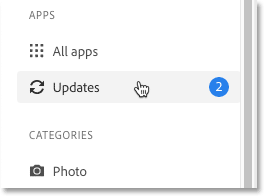
*Choosing the Updates category.*

### Step 3: Click the Update button

If an update is available for Photoshop, it appears in the **New updates** section, along with a brief description of what's included in the update. And note the version number next to Photoshop's name. Once the update is complete, we'll confirm that we are in fact running the latest version.

An update may also be available for Photoshop's **Camera Raw plugin**. But there's no need to update the plugin separately because it updates automatically with Photoshop:

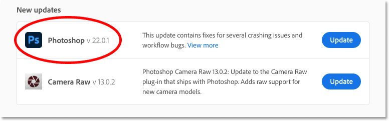
*Checking the update's version number.*

To update Photoshop to the latest version, click the **Update** button:

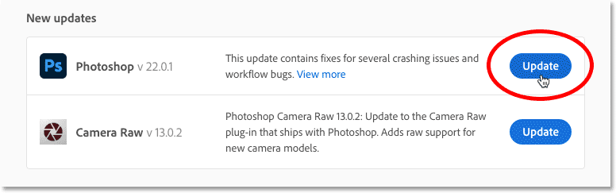
*Clicking the Update button.*

#### Closing Photoshop before updating

If Photoshop is open in the background, a warning message tells you that it needs to be closed before the update can continue. And if Adobe Bridge is open, it needs to be closed as well.

In that case, click the **Cancel** button, save your work, close Photoshop (and Adobe Bridge), and then try again:

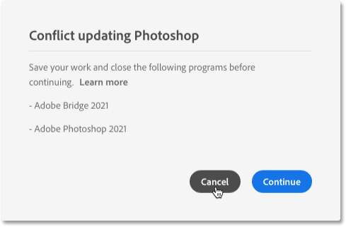
*Click Cancel and close Photoshop if needed.*

#### Viewing the update's progress

The update usually takes a few minutes, so the Creative Cloud app displays the progress:

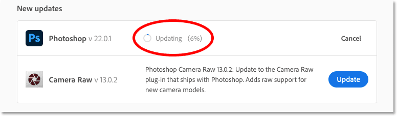
*Checking the update's progress.*

### Step 4: Open the updated version of Photoshop

Once completed, the Update button changes to an **Open** button. Click the button to open Photoshop:

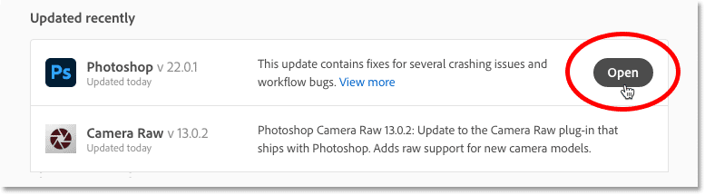
*Clicking the Open button.*

## How to confirm that Photoshop has been updated

You can confirm that Photoshop has been updated to the latest version by checking its version number.

On a Windows PC, go up to the **Help** menu in the Menu Bar. On a Mac, go up to the **Photoshop** menu. From there, choose **About Photoshop**:

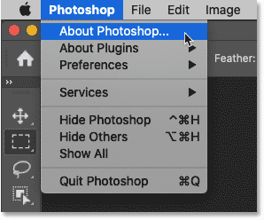
*Selecting the "About Photoshop" option.*

Photoshop's current version number appears in the upper left of the About Photoshop info box. This number should match the number displayed earlier in the Creative Cloud app:

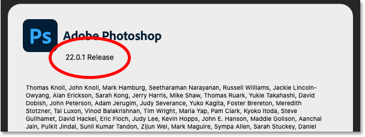
*The current version number after the update.*

## How to keep Photoshop updated automatically

So that's how to update Photoshop manually. Next I show you how to set up the Creative Cloud app to keep Photoshop up to date automatically, and how to avoid losing your current settings when Photoshop updates to a new version.

### Step 1: Open the Creative Cloud app's Preferences

Back in the Creative Cloud app, go up to the **File** menu on a Windows PC, or the **Creative Cloud** menu on a Mac, and choose **Preferences**:

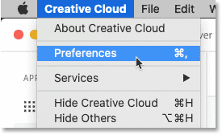
*Opening the Creative Cloud app's preferences.*

### Step 2: Select the Apps category

In the Preferences dialog box, choose the **Apps** category on the left:

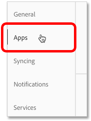
*Choosing the Apps category.*

### Step 3: Turn on Auto-update

Then make sure the main **Auto-update** option and the **Photoshop** option below it are both enabled:

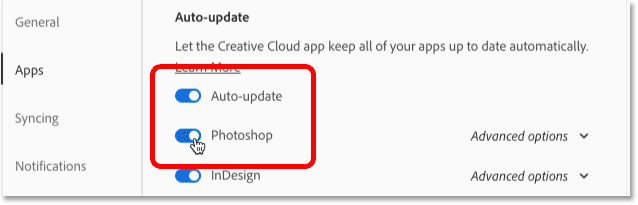
*Enabling Auto-update and Photoshop.*

### Step 4: Open the Advanced options

Finally, open the **Advanced options** for Photoshop:

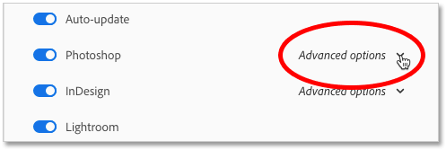
*Opening the Advanced options.*

### Step 5: Choose your settings

To keep your current Photoshop settings whenever an update is applied, make sure **Import previous settings and preferences** is checked.

Also, it's a good idea to keep the previous version of Photoshop until you're comfortable with the new version. So I always leave **Remove older versions** unchecked:

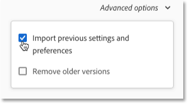
*The Advanced options.*

### Step 6: Close the Preferences dialog box

Click **Done** to close the Preferences dialog box, and the next time a new version of Photoshop is released, the update will be applied automatically:

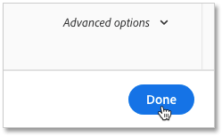
*Closing the Preferences dialog box.*