# The Updated Start Workspace In Photoshop CC

> Source: [https://www.photoshopessentials.com/basics/updated-start-workspace-photoshop-cc/](https://www.photoshopessentials.com/basics/updated-start-workspace-photoshop-cc/)
> Downloaded and converted to Markdown.

In this tutorial, we'll learn all about the updated **Start screen**, or **Start workspace** as it's officially known, in **Photoshop CC 2017**. The Start screen was actually introduced back in Photoshop CC 2015, but in CC 2017, Adobe has streamlined it a bit and made a few important changes, all of which we'll look at here.

The biggest change, though, isn't really with the Start screen itself but with the **New Document dialog box** which has been completely redesigned in Photoshop CC 2017. We'll look briefly at it here as we make our way through the Start screen's features, but I'll also cover it in much more detail in its own separate tutorial.

To follow along, you'll need to be using Photoshop CC (Creative Cloud) and you'll want to make sure that your copy of Photoshop CC is [up to date](/basics/update-photoshop-cc/). Let's get started!

## Photoshop's "Start Here" Point

Photoshop's Start screen gets its name from what it does; it gives us a place to start. Before we can do any work in Photoshop, we first need something to work *on*, and that's where the Start screen comes in. We can use the Start screen to create a brand new Photoshop document, or we can use it to open an existing image. The Start screen appears each time we launch Photoshop on its own, meaning we haven't yet selected a document or image to work on, and it appears whenever we close out of a document and have no other documents open on the screen.

Normally, the Start screen displays a list of your recently-opened files so you can quickly re-open one and continue working. But if this is the first time you've launched Photoshop, or you've cleared your Recent Files history (we'll see how to do that later), the Start screen will appear in its default state, with some brief tips and instructions in the center of the screen on how to get started:

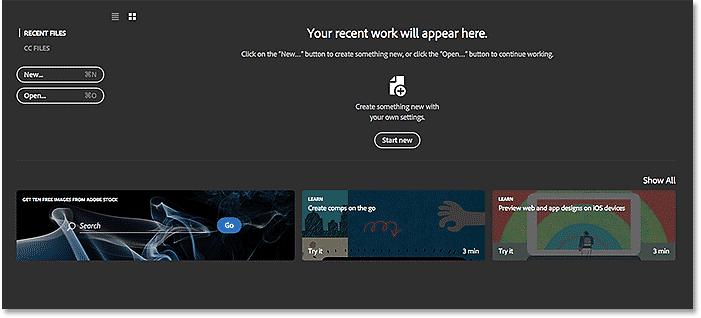
*The Start screen in Photoshop CC 2017.*

### The Menu Options

Along the left of the Start screen is the main menu. We'll cover each menu option (all 4 of them) as we go along, but for now, notice that **RECENT FILES** is selected by default at the top. If I had any recently-opened files (which I will shortly), they would appear in the center of the screen where the instructions are currently displayed.

Below RECENT FILES is **CC FILES**, a brand new addition to the Start screen in Photoshop CC 2017. The "CC" stands for Creative Cloud, and this option lets us open any Photoshop PSD files that we've stored not on our local computer but in the *cloud*—the online storage that Adobe gives us as part of our Creative Cloud subscription.

Below that, we find two simple buttons. The **New...** button lets us create a brand new Photoshop document, while the **Open...** button lets us open an existing document or image. They may not look like much, but these two buttons are the Start screen's features you'll use the most. We'll learn how they work in a moment:

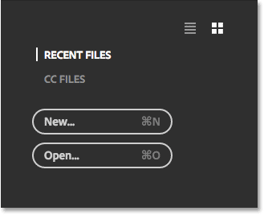
*The Start screen's main menu options.*

### The Tiles

The other main feature of the Start screen is the row of **tiles** along the bottom. The tiles are dynamic, meaning that their content changes from time to time. The only tile that doesn't change is the first one on the left, which lets us search for images using the [Adobe Stock](https://stock.adobe.com) service. The other tiles offer either tutorials or downloadable content. Clicking a tile will open your web browser and take you to Adobe's website where you'll find more information about the topic:

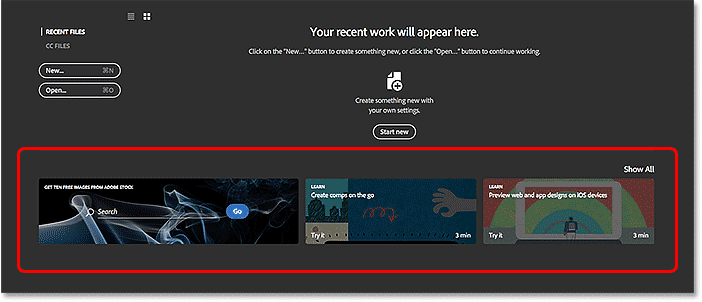
*The dynamic tiles along the bottom of the Start screen.*

Only a few tiles are displayed on the main Start screen. To view more tiles, click the **Show All** button above the tile on the right:

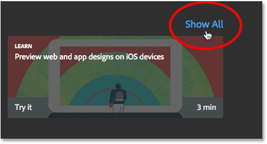
*Clicking the Show All button.*

To then return to the main Start screen, click the **Back** button:

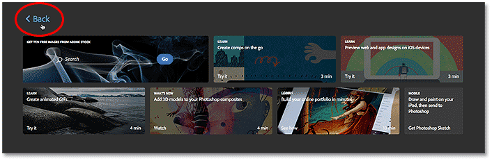
*Clicking the Back button.*

### Creating A New Photoshop Document

Let's look at the two biggest reasons for why the Start screen exists—creating new Photoshop documents and opening existing images. We'll start with how to create a new document. To create a brand new Photoshop document, click the **New...** button on the left:

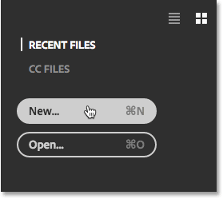
*Clicking the "New..." button.*

Or, if you don't have any recently-opened files, you can click the **Start new** button in the center of the screen. Note, though, that this button only appears when there are no recently-opened files to display:

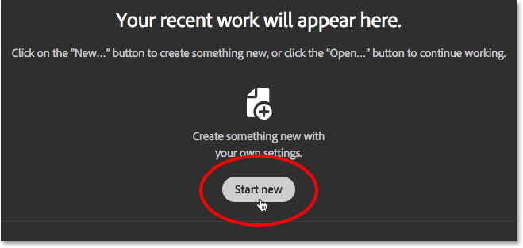
*The "Start new" button.*

Either way opens the **New Document** dialog box which has been completely redesigned in Photoshop CC 2017. As I mentioned earlier, we'll look briefly at it here, and I'll cover it in more detail in a separate tutorial:

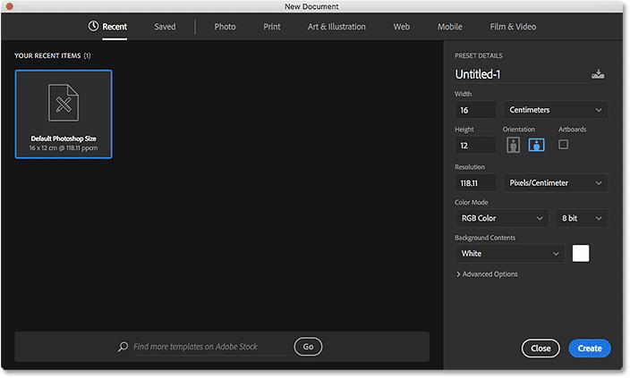
*The redesigned New Document dialog box in Photoshop CC 2017.*

To create a new document, we first choose the type of document we need (**Photo**, **Print**, **Art & Illustration**, **Web**, **Mobile**, or **Film & Video**) using the menu along the top of the dialog box. I'll choose Photo, just as an example:

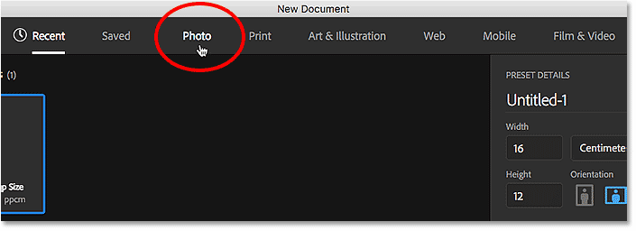
*Choosing a document type from the menu.*

This displays a collection of preset document sizes that we can choose from based on the type of document we selected. Since I chose Photo, I'm seeing presets for common photo sizes, like Landscape 2x3, Landscape 4x6, and Landscape 5x7.

Below the presets is a collection of **templates** (new in Photoshop CC 2017) which we can download from Adobe Stock. The templates allow us to add our images to pre-made layouts and effects. You'll see different templates depending on which document type you've selected. Using templates is a whole other topic, so we'll skip them for now and focus just on the presets.

Only a few presets are displayed initially. To view even more presets, click the **View All Presets** button:

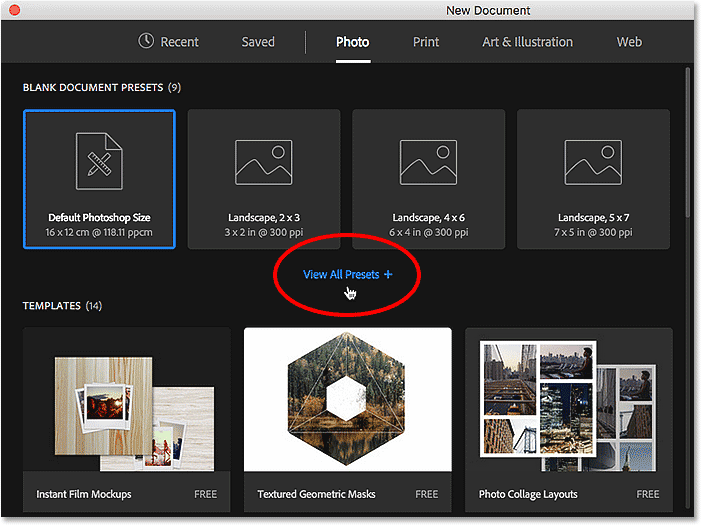
*Clicking "View All Presets".*

You may need to use the scroll bar along the right to scroll through the complete list of presets. If you see a preset that matches your needs, simply click on it to select it. I'll click on Landscape 8x10:

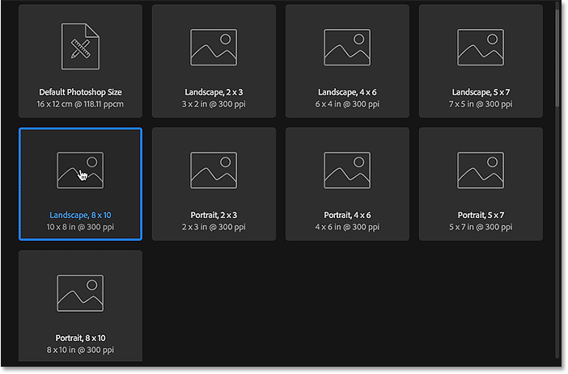
*Choosing a preset document size.*

The details of the preset, including its width, height and resolution, appear in the **PRESET DETAILS** column along the right of the dialog box:

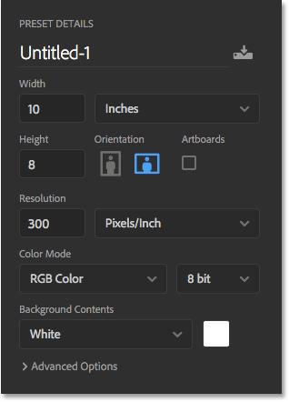
*The PRESET DETAILS column shows the settings that will be used.*

If you're happy with the settings, click the **Create** button in the bottom right corner. If none of the presets are what you need, just replace any of the preset values with your own custom values. For example, let's say that instead of a landscape 8x10 document, what I really need to create is an 11x14 document. Photoshop doesn't include an 11x14 preset, but that's not a problem. All I need to do is change the **Width** value from 10 inches to **14 inches** and the **Height** value from 8 inches to **11 inches**. Then, to create the document, I'll click the **Create** button:

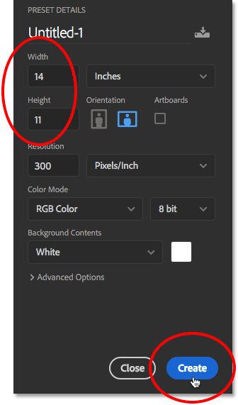
*Customizing the settings and clicking the Create button.*

A new blank document will open in Photoshop based on the settings you've chosen:

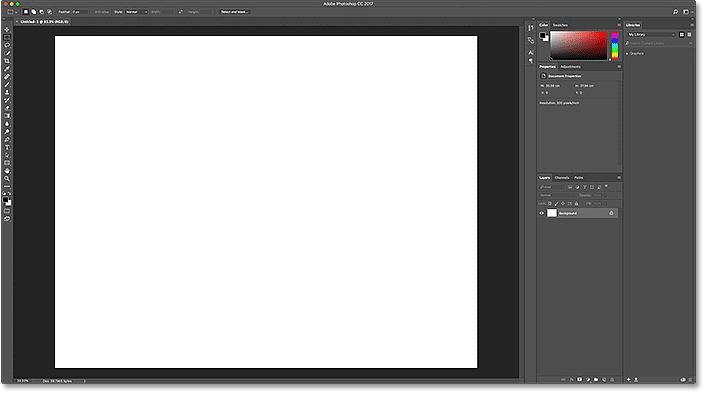
*The new document opens in Photoshop.*

I'll close the document for now by going up to the **File** menu in the Menu Bar along the top of the screen and choosing **Close**:

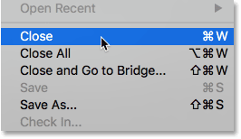
*Going to File > Close.*

Since no other documents are currently open on my screen, Photoshop returns me to the Start screen:

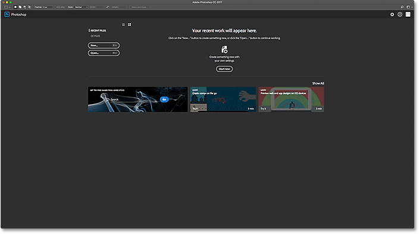
*The Start screen reappears after closing the document.*

That was just a brief glimpse at the redesigned New Document dialog box in CC 2017. There's a lot more to cover, and you can learn all about it in our [How To Create New Documents In Photoshop CC](/basics/create-new-documents-photoshop-cc/) tutorial.

### Opening Images Into Photoshop

Being able to create new, blank Photoshop documents is great for designs, mockups and layouts. But if you're a photographer, you'll most likely want to start by opening an existing image. To open an image from the Start screen, click the **Open...** button:

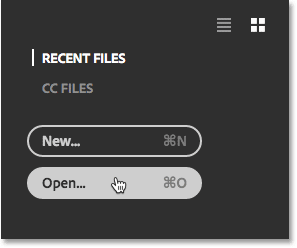
*Clicking the "Open..." button.*

Then, on a Windows PC, use File Explorer to navigate to the image on your computer. On a Mac (which is what I'm using here), use Finder to navigate to the image. Once you've located the image, double-click on it to open it:

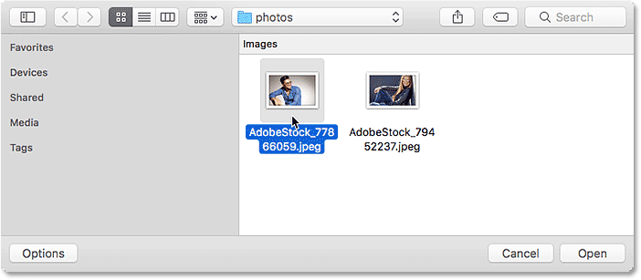
*Navigating to, and selecting, an image to open into Photoshop.*

The image opens in Photoshop, ready for editing (photo from [Adobe Stock](https://stock.adobe.com/ca/stock-photo/portrait-of-a-handsome-fashion-man-smiling/77866059)):

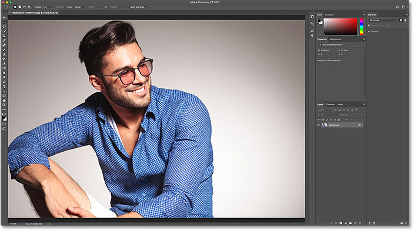
*The selected image opens in Photoshop. Image credit: Adobe Stock.*

I'll close the image for now by going up to the **File** menu at the top of the screen and choosing **Close**:

*Going to File > Close.*

And since I had no other images or documents open, I'm returned once again to the Start screen. Notice, though, that something has changed. Instead of the instructions in the center of the screen telling me how to get started, I'm seeing a thumbnail of the image in the Recent Files list. If I needed to quickly re-open it for further editing, all I would need to do is click on its thumbnail:

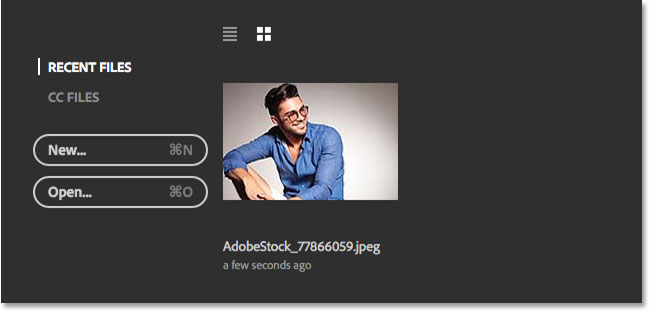
*The image appears in the Recent Files list.*

Instead of re-opening the same image, I'll open a second photo by once again clicking the **Open...** button:

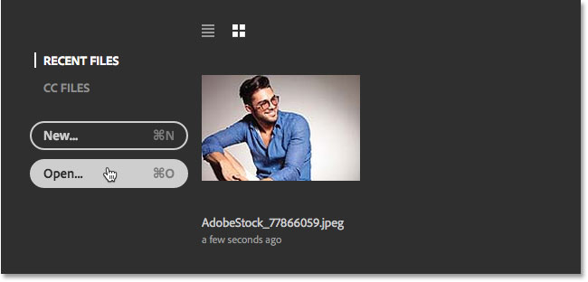
*Clicking the "Open..." button to open a different image.*

This re-opens my Finder window (File Explorer on a Windows PC). I'll select my second image by double-clicking on it:

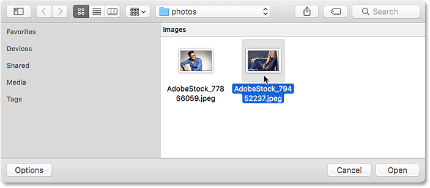
*Selecting a second image to open.*

And just like that, the new image opens in Photoshop (photo from [Adobe Stock](https://stock.adobe.com/ca/stock-photo/beautiful-fashionable-young-woman/79452237)):

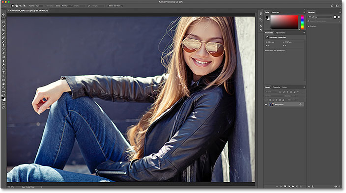
*Selecting a second image to open. Photo credit: Adobe Stock.*

I'll close out of it by once again going up to the **File** menu and choosing **Close**. Photoshop returns me to the Start screen where I now have two images displaying as thumbnails in my Recent Files list, ready to be re-opened at any time:

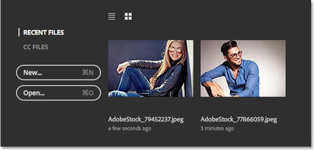
*The Recent Files list now shows the last two images I opened.*

### List View Or Thumbnail View

By default, Photoshop displays your recent files as thumbnails, but you can also display them as a text-based list. To switch to the list, click the **List View** icon above the thumbnails:

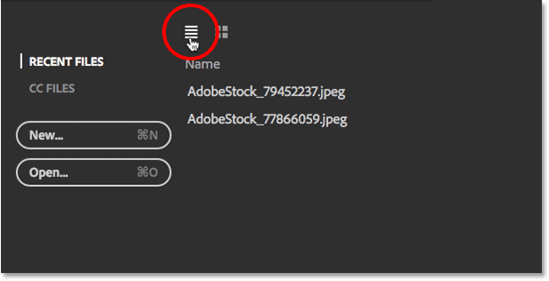
*Clicking the List View icon.*

To switch back to the thumbnails, click the **Thumbnail View** icon:

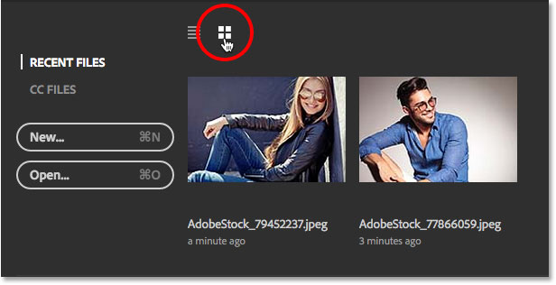
*Clicking the Thumbnail View icon.*

### Changing The Maximum Number Of Recent Files

Even though my Recent Files list only contains two images at the moment, it doesn't take long for the list to get cluttered with recently-opened files. We can control the maximum number of images that will be displayed using the File Handling options in Photoshop's Preferences.

On a Windows PC, go up to the **Edit** menu at the top of the screen, choose **Preferences**, then choose **File Handing**. On a Mac, go up to the **Photoshop CC** menu, choose **Preferences**, then choose **File Handing**:

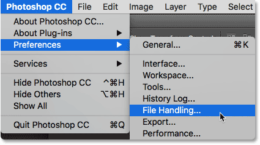
*Going to Edit (Win) / Photoshop CC (Mac) > Preferences > File Handing.*

This opens the Preferences dialog box set to the File Handling category. Look for the option that says **Recent File List Contains** down at the bottom. The default value is 20, meaning Photoshop will display the last 20 files you've opened. If you need to keep track of even more than 20 files, enter in a higher value, to a maximum of 100. Or, enter a lower value to display fewer recent files. If you don't want to see any recent files at all on your Start screen, set the value to 0. You'll need to quit and restart Photoshop for any changes to appear on the Start screen:

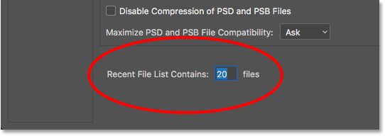
*The "Recent File List Contains" option in the File Handling preferences.*

### Opening CC (Creative Cloud) Files

Along with opening files that are stored locally on your computer, the Start screen in Photoshop CC 2017 also lets us open files which are stored online in the Creative Cloud. Every Creative Cloud subscription includes a certain amount of online storage space (the *cloud*), and saving our work to the cloud makes it easy to access it from any computer we need. The only thing to keep in mind is that the Start screen will only display files that were uploaded to the cloud as **PSD files**, which is Photoshop's native file format. JPEG images or any other file type will not appear.

To view your PSD files that are stored in the Creative Cloud, switch from RECENT FILES to **CC FILES**:

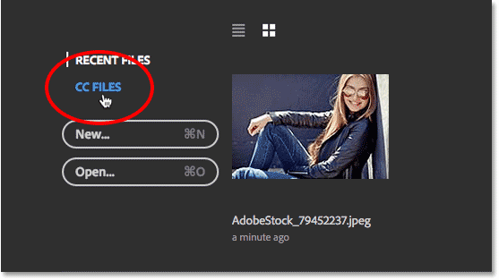
*Clicking the "CC FILES" menu option.*

Here, we see that I have one PSD file which I recently uploaded to my Creative Cloud storage. To open it in Photoshop, all I need to do is click on its thumbnail:

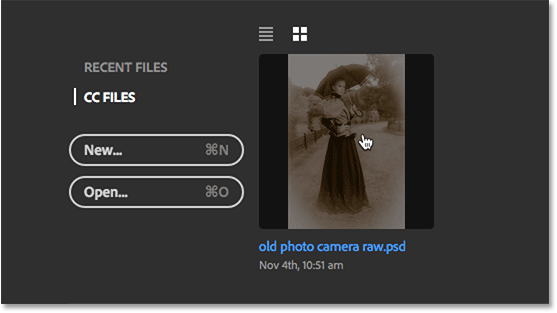
*Opening a PSD file from the Creative Cloud.*

The PSD file opens in Photoshop. This is the completed PSD file from our [Old Antique Photo Effect With The Camera Raw Filter](/photo-effects/old-antique-photo-effect-camera-raw-filter/) tutorial:

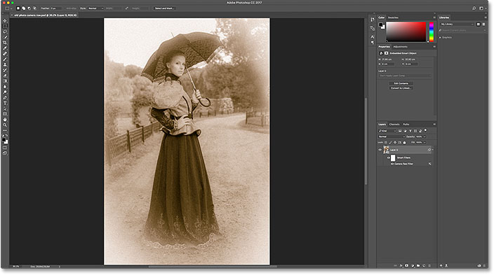
*The PSD file opens in Photoshop.*

I'll close the file by going up to the **File** menu and choosing **Close**:

*Going to File > Close.*

Then, I'll return to my Recent Files list by choosing **RECENT FILES** from the Start screen menu, where we now see all three of my images listed, including the PSD file from the cloud:

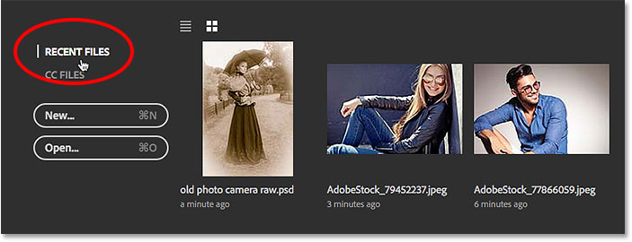
*Returning to the Recent Files list.*

### Clearing Your Recent Files

If you ever need to clear the images from your Recent Files list, go up to the **File** menu at the top of the screen, choose **Open Recent**, and then choose **Clear Recent File List**:

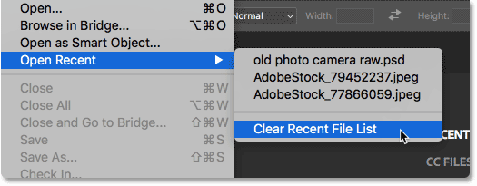
*Going to File > Open Recent > Clear Recent File List.*

This will return you to the Start screen's initial state with the instructions appearing in the center on how to get started:

*The Start screen after clearing the Recent Files list.*

### Turning Off The Start Screen

Finally, if you don't want to see the Start screen at all when you launch Photoshop or close out of your images, you can disable it in Photoshop's Preferences. On a Windows PC, go up to the **Edit** menu, choose **Preferences**, then choose **General**. On a Mac, go up to the **Photoshop CC** menu, choose **Preferences**, then choose **General**:

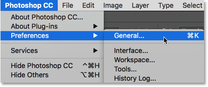
*Going to Edit (Win) / Photoshop CC (Mac) > Preferences > General.*

This opens the Preferences dialog box set to the General category. To disable to Start screen, uncheck the option that says **Show "START" Workspace When No Documents Are Open**. You'll need to quit and relaunch Photoshop for the change to take effect. To turn the Start screen back on again later, just come back to the same option and reselect it:

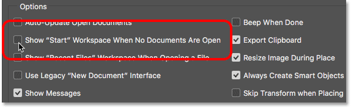
*Use the 'Show "START" Workspace When No Documents Are Open option' to enable or disable the Start screen.*

Of course, you may be wondering, "But how would I create a new document, or open an image, or access my recently-opened files, if I've turned off the Start screen?". While there's no doubt that the Start screen serves as a great starting point, especially for beginner Photoshop users, the truth is that there really isn't much here that we can't do *without* using the Start screen. So if the Start screen begins to feel like unnecessary clutter and you decide to turn it off, in the next tutorial, [How To Disable The Start Workspace In Photoshop CC](/basics/disable-start-workspace-photoshop-cc/), we'll look quickly at how to create new Photoshop documents and open images without using the Start screen.