# Best Way To Enlarge Images In Photoshop

> Source: [https://www.photoshopessentials.com/basics/upscale-images-photoshop-cc-2018/](https://www.photoshopessentials.com/basics/upscale-images-photoshop-cc-2018/)
> Downloaded and converted to Markdown.

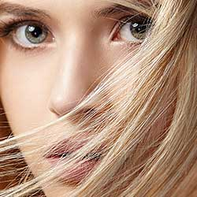

This tutorial shows you how to upscale and enlarge an image in Photoshop without losing quality and while keeping detail and textures looking great using Preserve Details 2.0.

When it comes to resizing images in Photoshop, the general rule has always been that you can make an image smaller than its original size, but you can't make it larger. Or at least, you can't make it larger if you care about image quality. To make an image smaller, all Photoshop really needs to do is take some of the pixels from the original image and toss them away. It sounds like a bad thing, but the result is just the opposite. The smaller version usually ends up looking sharper than the original.

But making an image *larger* than its original size is a whole other thing. Photoshop needs to add pixels to create detail that wasn't there before. And if *that* sounds like a bad thing, that's because it is. All Photoshop can do is guess at what the new pixels should look like, and then it tries to blend the new pixels in with the originals. The results haven't been great. Depending on which upsampling method you used, your larger version usually ended up looking soft and dull or chunky and oversharpened.

At least, that was the way it used to be. But Photoshop CC 2018 introduced a brand new upscaling algorithm known as **Preserve Details 2.0**. It's the sequel of sorts to the original Preserve Details algorithm that was added in an earlier release of Photoshop. Preserve Details 2.0 is by far the most advanced upscaling technology that Photoshop has ever seen. And if you still believe that you can't make an image larger without it looking terrible, Adobe and Photoshop are out to prove you wrong. Let's see how it works!

This is lesson 8 in my [Resizing Images in Photoshop](/basics/how-to-resize-images-in-photoshop-complete-guide/) series.

Let's get started!

### Which version of Photoshop do I need?

Preserve Details 2.0 is available in Photoshop CC 2018 and later so any recent version will work including Photoshop 2023. You can [get the latest Photoshop version here](https://prf.hn/l/dlXjD2w).

### Step 1: Open Your Image

Open the image you want to enlarge. I'll use [this image](https://prf.hn/l/8xovLyx) so we can see how good of a job Preserve Details 2.0 can do, not just on fine detail like eyes and hair but also on skin texture:

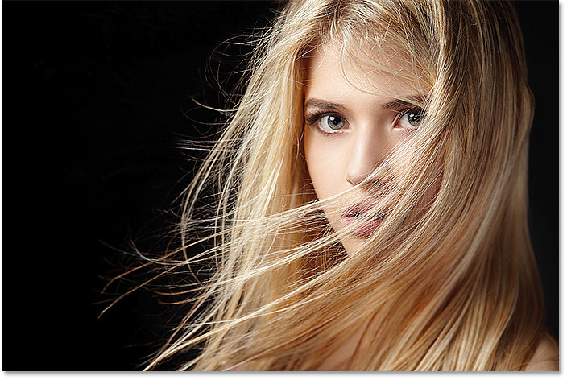
*The original image. Photo credit: Adobe Stock.*

### Step 2: Make Sure "Preserve Details 2.0" Is Enabled

Even though Preserve Details 2.0 is included with Photoshop CC 2018, it's not officially part of Photoshop just yet. Adobe considers it a technology preview, and to use it, we need to make sure it's enabled. We do that in the [Photoshop Preferences](/basics/essential-photoshop-preferences-beginners/). On a Windows PC, go up to the **Edit** menu in the Menu Bar. On a Mac, go up to the **Photoshop CC** menu. From there, choose **Preferences**, and then choose **Technology Previews**:

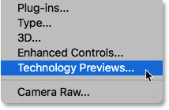
*Opening the Technology Previews preferences.*

This opens the Preferences dialog box to the Technology Previews options. Make sure **Enable Preserve Details 2.0 Upscale** is selected, and then click OK to close the dialog box:

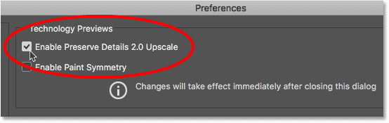
*The "Enable Preserve Details 2.0 Upscale" option.*

### Step 3: Open The Image Size Dialog Box

Open Photoshop's [Image Size](/essentials/resize-images-photoshop-cc/) dialog box by going up to the **Image** menu and choosing **Image Size**:

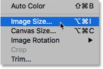
*Going to Image > Image Size.*

To see more of your image in the preview area, click and drag the bottom right corner of the Image Size dialog box outward to make it larger:

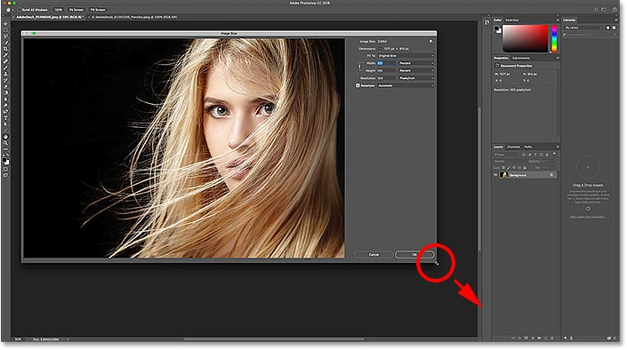
*Resizing the Image Size dialog box.*

### Step 4: Select "Resample"

In the resizing options along the right, make sure **Resample** is selected. This tells Photoshop that we want to change the physical dimensions of the image. In other words, we want to add or remove pixels:

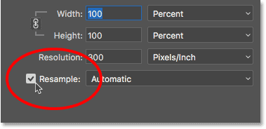
*Selecting the "Resample" option.*

### Step 5: Change The Width And Height

Enter your new dimensions for the image into the **Width** and **Height** fields. By default, Width and Height are linked together, so changing one automatically changes the other. Since our goal here is just to see how much of a difference Preserve Details 2.0 can make, let's push things beyond reason by setting both the Width and Height to **400%**:

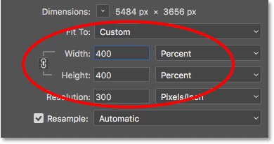
*Increasing the width and height of the image by 400%.*

### Step 6: Change The Resample Method To "Preserve Details 2.0"

By default, the *resampling method* (the algorithm Photoshop will use to add or remove pixels) is set to **Automatic**. This means that Photoshop will automatically choose the best algorithm for the job. At least, that's the idea:

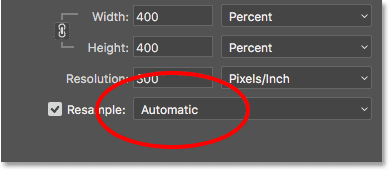
*The resample method set to "Automatic".*

The problem is, even though we've enabled Preserve Details 2.0 in the Preferences, and it's by far the best choice for enlarging images (as we'll see in a moment), Photoshop will not choose it when Resample is set to Automatic. Instead, it will use the original Preserve Details algorithm which was introduced in an earlier version of Photoshop CC. This will most likely change once Preserve Details 2.0 is officially added to Photoshop. But for now at least, to use Preserve Details 2.0, we need to select it ourselves.

Click on the word "Automatic" to view a list of all the resampling algorithms we can choose from. The ones for upscaling the image are at the top. Select **Preserve Details 2.0**. If you're not seeing Preserve Details 2.0, you'll want to go back and make sure you've enabled it in the Preferences:

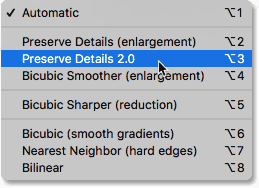
*Setting the resample method to "Preserve Details 2.0".*

### Previewing The Results

As soon as you select Preserve Details 2.0, the **preview window** on the left will update to show you what your upscaled image will look like using this new option. You can drag your image around inside the preview window to inspect different areas:

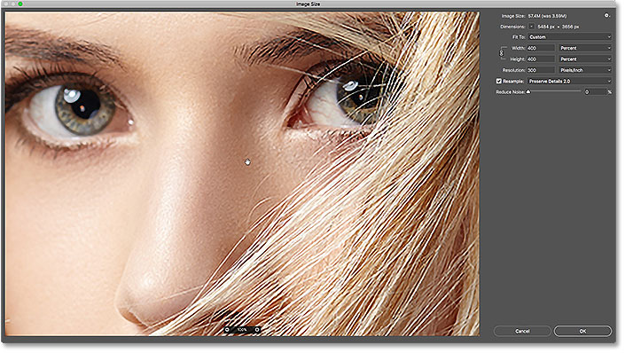
*The preview window showing the Preserve Details 2.0 results.*

## Comparing Photoshop's Upscaling Methods

### Bicubic Smoother

To get a better sense of how much of an improvement Preserve Details 2.0 really is over Photoshop's previous upscaling methods, let's do a quick comparison. First, position your image in the preview window so that you're viewing an area of fine detail. Then, click again on the resample method to re-open the list. Start by selecting **Bicubic Smoother**:

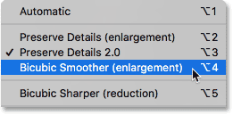
*Setting Resample to "Bicubic Smoother".*

Bicubic Smoother was the best upscaling method we had back in Photoshop CS6 and earlier, and it does an okay job. But as it's name implies, Bicubic Smoother tries to clean up any problems by smoothing out the entire image. If we look at the woman's eye on the right, along with the strands of hair in front of it, we see that those areas now look a lot softer and less detailed than they did before:

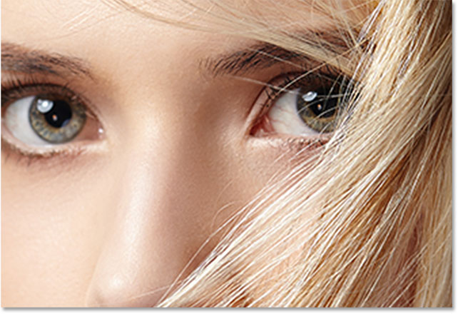
*Bicubic Smoother makes the upscaled image look too soft.*

### Preserve Details (Original)

In Photoshop CC, Adobe introduced a new upscaling algorithm named **Preserve Details**. Select it from the Resample option:

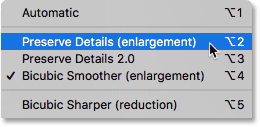
*Setting Resample to the original "Preserve Details".*

Preserve Details does a much better job of keeping important details in the image, as again we can see in the woman's eye and hair which now appear much sharper. But where Bicubic Smoother made things too soft, Preserve Details does the opposite. The image now looks oversharpened. Everything has a "chunky" look to it, especially the woman's skin texture, which is something you definitely don't want to oversharpen:

*Preserve Details can make the upscaled image look too sharp.*

### Preserve Details 2.0

Now that we've looked at Photoshop's previous upscaling options, let's compare them to the new **Preserve Details 2.0** in Photoshop CC 2018. I'll reselect it from the list:

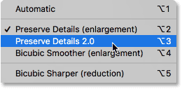
*Setting Resample to "Preserve Details 2.0".*

Preserve Details 2.0 uses advanced, "deep learning" artificial intelligence to detect and maintain important image details without oversharpening anything else. As soon as I select it, the preview in the Image Size dialog box instantly looks a *whole* lot better. Gone is the low-detail softness of Bicubic Smoother and the chunkiness from the original Preserve Details. Instead, notice how amazingly sharp her eye and hair now look, almost to the point where you might think the image was actually shot at this higher resolution. Meanwhile, Preserve Details 2.0 has largely avoided sharpening her [skin texture](/photo-editing/smooth-skin/). It remains nice and smooth, just as it should.

Keep in mind that we've upscaled the image by 400% which is beyond what you would typically do in a normal situation. Yet even at this extreme amount of upscaling, Preserve Details 2.0 gives us outstanding results:

*The vastly improved upscaling result using Preserve Details 2.0 in Photoshop CC 2018.*

### A Side-By-Side Comparison

Here's a quick side-by-side comparison showing all three upscaling methods in action. Bicubic Smoother is on the left, the original Preserve Details is in the center, and the new Preserve Details 2.0 is on the right. Again, these are all with the image scaled up by 400%. As we can see, neither of the previous two upscaling methods can match the impressive results of Preserve Details 2.0. Note that these images have been resized and compressed for the web. You'll see more dramatic differences with your own image in Photoshop:

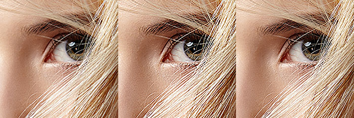
*The result from Bicubic Smoother (left), Preserve Details (center) and Preserve Details 2.0 (right).*

And there we have it! You can jump to any of the other lessons in this [Resizing Images in Photoshop](/basics/how-to-resize-images-in-photoshop-complete-guide/) chapter. Or visit our [Photoshop Basics](/basics/) section for more topics!