# Curvature Pen Tool in Photoshop CC 2018 – Drawing Paths Made Easy

> Source: [https://www.photoshopessentials.com/basics/use-curvature-pen-tool-photoshop-cc-2018/](https://www.photoshopessentials.com/basics/use-curvature-pen-tool-photoshop-cc-2018/)
> Downloaded and converted to Markdown.

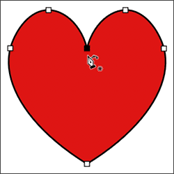

This tutorial shows you how to use the new Curvature Pen Tool in Photoshop CC 2018 to easily draw paths, and how to convert your path outlines into shapes, vector masks and selections. Follow along with this step-by-step guide.

One of the biggest new features in Photoshop CC 2018 is the new **Curvature Pen Tool**. The Curvature Pen Tool is a simplified version of Photoshop's standard Pen Tool. It lets us draw complex shapes and paths without the need to edit control handles or remember keyboard shortcuts. Using the Curvature Pen Tool is as easy as clicking to add points. Photoshop then uses those points to automatically draw your path.

As its name implies, the Curvature Pen Tool draws curved lines by default. But as we'll see, it's just as easy to draw straight lines, and to switch between curved and straight lines as needed. And like the standard Pen Tool, we can easily convert our path outlines into selection outlines, allowing anyone, even beginners, to make clean, professional selections in Photoshop. Let's see how it works!

The Curvature Pen Tool is only available as of Photoshop CC 2018, so you'll need [CC 2018 or newer](https://prf.hn/l/dlXjD2w) to follow along. If you're a Creative Cloud subscriber, you can learn how to update your copy of Photoshop to CC 2018 using our [How To Keep Photoshop CC Up To Date](/basics/update-photoshop-cc/) tutorial. Let's get started!

## Setting Up The Document

### Creating A New Photoshop Document

Rather than me just telling you how the Curvature Pen Tool works, let's set things up so that you can easily follow along with me. We'll start by creating a new Photoshop document. Go up to the **File** menu in the Menu Bar along the top of the screen and choose **New**:

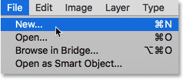

*Going to File > New.*

This opens the [New Document](/basics/create-new-documents-photoshop-cc/) dialog box. In the **Preset Details** panel along the right, set both the **Width** and **Height** of the new document to **1000 Pixels.** Set the **Resolution** to **72 Pixels/Inch** and make sure **Background Contents** is set to **White**. Then, click the **Create** button in the bottom right corner. A new document, filled with white, will open on your screen:

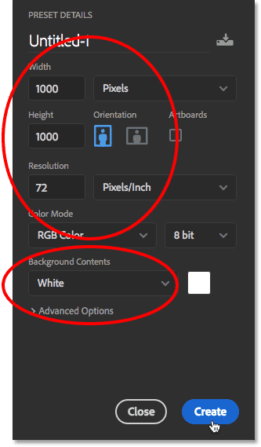

*Setting the options for the new document in the Preset Details panel.*

### Setting Up The Guides

Now that we have our document, let's set up some guides so it will be easier for us to draw the same shapes. Go up to the **View** menu in the Menu Bar and choose **New Guide Layout**:

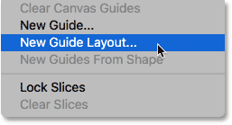

*Going to View > New Guide Layout.*

In the New Guide Layout dialog box, set both the **Number of Columns** and **Number of Rows** to **6**. Make sure the **Gutter** value for both the Columns and Rows is either empty or set to 0. If you have any pre-existing guides that you need to remove, select **Clear Existing Guides** at the bottom. Then, click OK to close the dialog box:

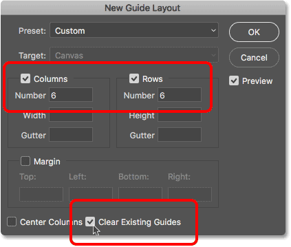

*The New Guide Layout options.*

You should now see 3 rows and 3 columns of guides in front of your document:

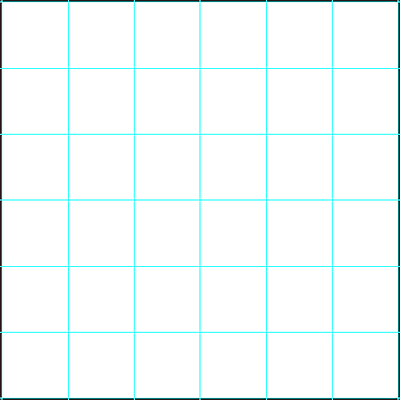

*The guides now appear in the document.*

## How To Draw With The Curvature Pen Tool

### Step 1: Select The Curvature Pen Tool From The Toolbar

With our document now set up, let's learn how to use the new Curvature Pen Tool in Photoshop CC 2018. We select the Curvature Pen Tool from the [Toolbar](/basics/photoshop-tools-toolbar-overview/). By default, the Curvature Pen Tool is nested in behind the standard [Pen Tool](/basics/selections/pen-tool-selections/), so you'll need to click and hold on the Pen Tool's icon until a fly-out menu appears. Then, choose the **Curvature Pen Tool** from the menu:

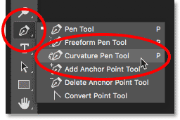

*Selecting the Curvature Pen Tool from the Toolbar.*

[Don't see the Curvature Pen Tool in the Toolbar? Here's where to find it.](/basics/find-missing-curvature-pen-tool-photoshop-cc-2018/)

### Step 2: Set The Tool Mode To "Path" Or "Shape"

Before you begin drawing with the Curvature Pen Tool, choose whether you want to draw a *path outline* or a *shape* using the **Tool Mode** option in the Options Bar. By default, the Tool Mode is set to **Path**, which is what I'm going to leave it set to. If you wanted to draw a shape, you would set the Tool Mode option to **Shape**. I find it's easier just to draw a path because paths are easier to see as you're drawing, and you can easily convert your path into a shape when you're done. We'll learn how to do that a bit later. For now, leave the Tool Mode set to Path:

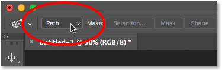

*The Tool Mode option can be set to Path or Shape.*

### Step 3: Click To Add A Starting Point

To begin drawing either a path or a shape, click once inside your document to set a starting point. I'll click on the spot where the vertical guide in the center and the horizontal guide along the bottom intersect. Notice that a little *square* appears at the spot where you clicked. This is known as an **anchor point** because it *anchors* the position of the path within the document:

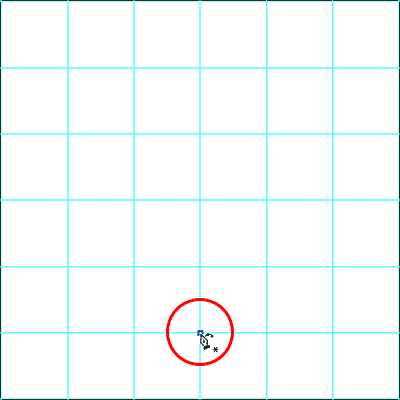

*Clicking to add a starting point for the path.*

### Step 4: Add A Second Point To Draw A Straight Line

Next, click to add a second anchor point. I'll click where the vertical guide on the left and the horizontal guide in the center intersect. Notice that even though the tool is named the *Curvature* Pen Tool, Photoshop draws a *straight line*, known as a **path segment**, between the two points. The reason is that drawing a curve requires *three* points; one for the start of the curve, one for the end, and one in the middle. The point in the middle determines the angle, or arc, of the curve. Without that middle point, all Photoshop can draw is a straight line:

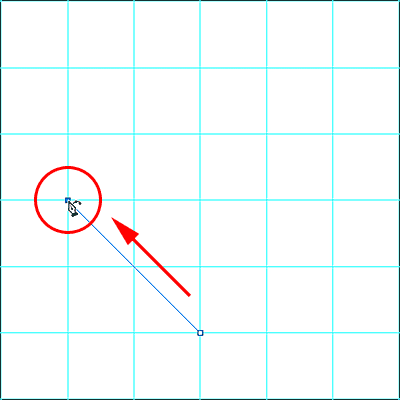

*Adding a second point draws a straight line between the two points.*

### Step 5: Add A Third Point To Draw A Curve

Click with the Curvature Pen Tool to add a third point. I'll click where the top horizontal guide and the center vertical guide intersect. As soon as you click to add the third point, the straight line becomes a curved line:

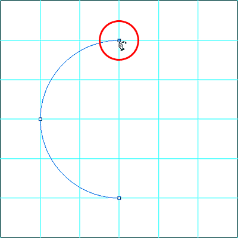

*Adding a third point converts the straight line into a curve.*

### Changing The Thickness And Color Of The Path

If you're having trouble seeing your path outline, you can adjust both the color and thickness of the path by clicking the **gear icon** in the Options Bar:

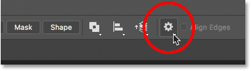

*Clicking the gear icon to open the path options.*

This opens the **Path Options** dialog box where you can change the thickness of the path outline from as small as 0.5 pixels to as large as 3 pixels. You can also choose a different color for the path. I'll set the **Thickness** to **3 px** and the **Color** to **Magenta**. Note that these settings are there only to help you see your path as you're working. They have no effect on the actual appearance of the path in the document. To close the Path Options dialog box, click again on the gear icon:

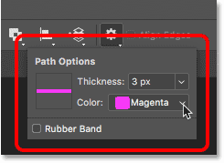

*Change the thickness and color of the path in the Path Options.*

And now we see that both the thickness and the color of my path has changed:

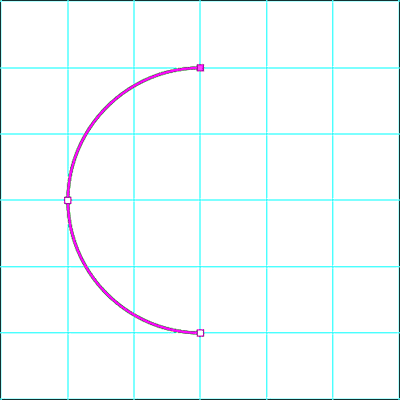

*The path outline is now much easier to see.*

### Step 6: Click To Add More Points

To continue drawing your path or shape, simply click to add more points. By default, once you've started drawing a curved line by adding a third point, any additional points you add will also draw a curve. I'll add a fourth anchor point by clicking where the vertical line along the right and the horizontal guide in the center intersect. This adds a new path segment between the third and fourth points and extends the curve:

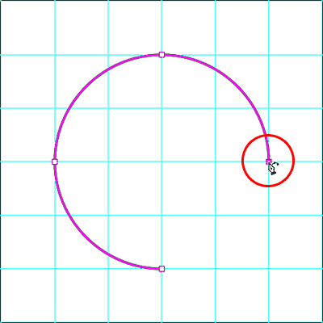

*Adding a fourth point to continue drawing the curved line.*

### Step 7: Click On The Starting Point To Close The Path

To close your path, click again on your original starting point. We've now drawn a complete circle with the Curvature Pen Tool just by clicking:

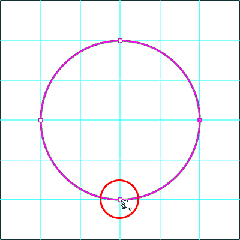

*Close the path by clicking again on the starting point.*

## Reshaping The Path Outline

### Moving An Existing Anchor Point

We've drawn our path, but we can easily go back at this point and reshape it. In fact, there's a few ways to do it. One is by clicking on an existing anchor point with the Curvature Pen Tool to select it, and then dragging the point to a new location. Here, I'm dragging the top anchor point two vertical guides over to the right:

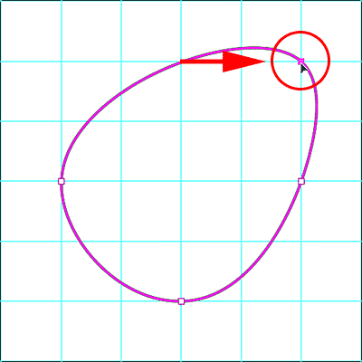

*Clicking and dragging an existing anchor point.*

### Adding More Anchor Points

We can also add more anchor points to the existing path. To add a new point, click anywhere along the path outline. Then, drag the new point to reshape the path. I'll click in the upper left of the path to add a new point:

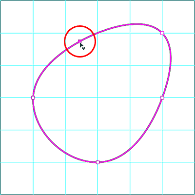

*Adding a new anchor point by clicking on the path outline.*

Then, to reshape the path, I'll drag the new point into the upper left corner where the grid lines intersect:

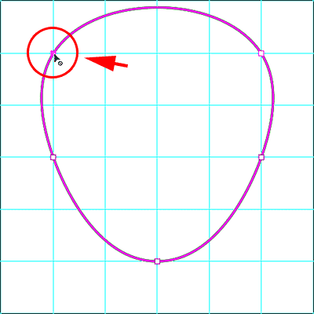

*Dragging the new point to reshape the path.*

I'll also click to add a new anchor point at the very top of the path, and then I'll drag the new point downward to where the grid lines meet just above the center:

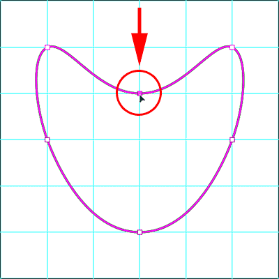

*Adding a new point at the top and dragging it downward.*

### Switching Between Curve Points And Corner Points

So far, all of the anchor points we've added with the Curvature Pen Tool have been **curve points** (also known as *smooth points*). That is, the path outline curves as it passes through the point. Another way to change the shape of a path is by converting a curve point into a **corner point**. To switch from a curve point to a corner point, **double-click** on an existing curve point.

I'll double-click on the point I just added in the top center, and now we see that, instead of a smooth curve, the path outline abruptly changes direction at that point. To switch from a corner point back to a curve point, again just double-click on the point:

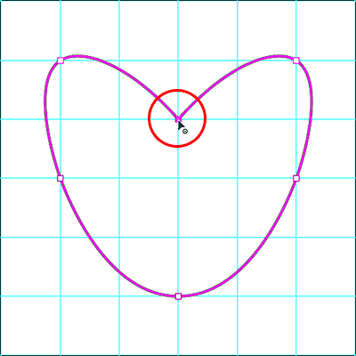

*Double-click on a curve point to convert it to a corner point, and vice versa.*

### Deleting A Point

To delete an anchor point, click on it with the Curvature Pen Tool to select it, and then press the **Backspace** (Win) / **Delete** (Mac) key on your keyboard. Here, I've deleted the point in the top center, and now the path has returned to the same shape it was in before adding the point:

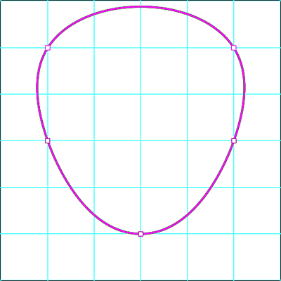

*To delete a point, select it and then press Backspace (Win) / Delete (Mac).*

### Deleting An Entire Path

To delete your entire path, **right-click** (Win) / **Control-click** (Mac) inside the document, and then choose **Delete Path** from the menu. You also delete the entire path by pressing **Backspace** (Win) / **Delete** (Mac) on your keyboard when no anchor points are selected:

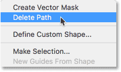

*To delete a path, right-click (Win) / Control-click (Mac) and choose "Delete Path".*

I'll delete my path so that I'm back to just my empty document and my guides:

*The path has been deleted.*

### Drawing Straight Path Segments With The Curvature Pen Tool

The main benefit of the Curvature Pen Tool is that it's easy to draw curved path outlines. But we can also use it to draw straight lines just as easily. We've already seen that we can convert a curve point into a corner point by double-clicking on it. But if we know in advance that we need to draw a straight line, there's no need to draw a curve point first and then convert it. Instead, just **double-click**, rather than single-click, to add the new point. Photoshop will automatically add the point as a corner point.

Let's say we want to draw a rectangular path outline using the Curvature Pen Tool. Start by clicking to set a starting point for the path. I'll click in the lower left corner:

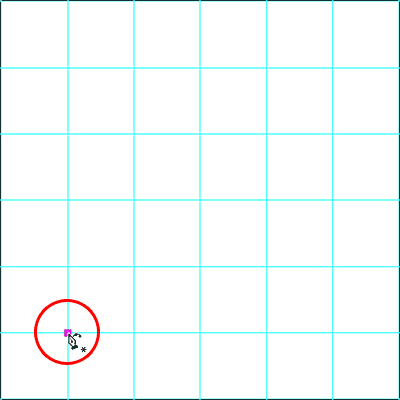

*Clicking to set a starting point for the rectangular path outline.*

Then, since we know we want the next point to be a corner point, double-click, rather than single-click, to add it. I'll double-click two horizontal guides above my starting point:

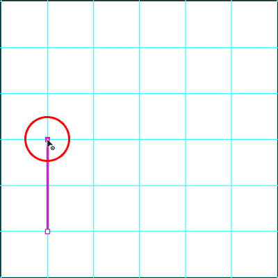

*Double-clicking to add the second point as a corner point.*

To add the third point to the rectangular shape, I'll again double-click to add it as a corner point. Notice that because we're adding the points as corner points, Photoshop is connecting them with straight path segments instead of curves:

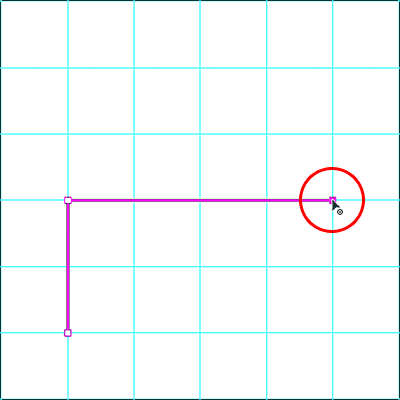

*Double-clicking to add the third point.*

I'll add a fourth corner point by double-clicking in the lower right corner. Again, Photoshop adds another straight path segment:

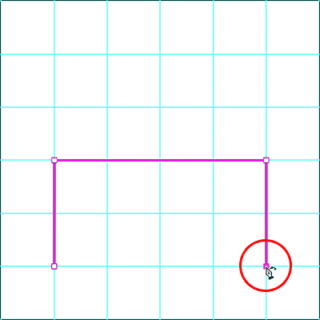

*Adding the fourth corner point.*

To complete the path, I'll double-click on the initial starting point, and Photoshop adds the remaining straight segment:

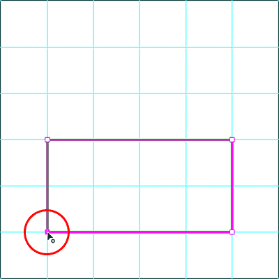

*Double-clicking on the starting point to close the path.*

### Converting A Straight Path Segment Into An Arch

What if, instead of a flat horizontal line at the top of the path, you want an arch? With the Curvature Pen Tool, it's easy. All you need to do is click anywhere along the top path segment to add a new anchor point:

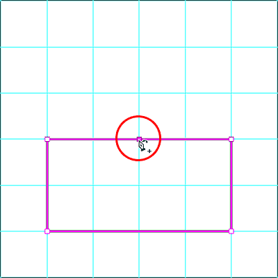

*Adding a new point to the top of the path.*

Then, drag the new point upward to create the arch:

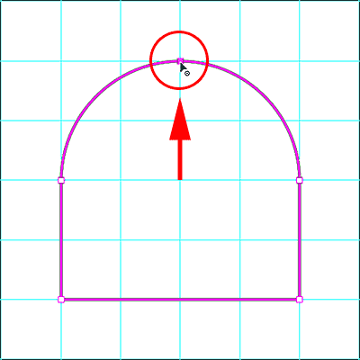

*Dragging the new point upward.*

### Moving Multiple Anchor Points At Once

So far, we've learned that we can move an individual anchor point by clicking and dragging it with the Curvature Pen Tool. But what if we need to move two or more anchor points at once? In that case, we can use Photoshop's **Direct Selection Tool**. You'll find the Direct Selection Tool, also known as the "White Arrow Tool", nested behind the **Path Selection Tool** (the "Black Arrow Tool") in the Toolbar. Click and hold on the Path Selection Tool until a fly-out menu appears, and then choose the Direct Selection Tool from the menu:

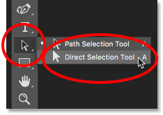

*Selecting the Direct Selection Tool from the Toolbar.*

Let's say we want to change the height of our path. We need to select all three anchor points that make up the top (the point in the top left, the top right, and the one at the top of the arch). To select all three points at once, click and drag a box around all three points with the Direct Selection Tool:

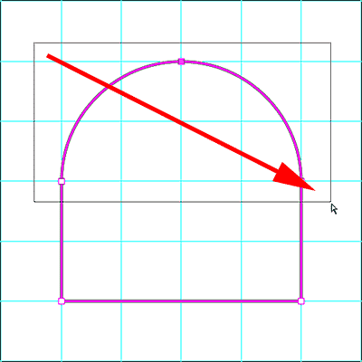

*Dragging with the Direct Selection Tool around all three points at the top.*

Then, with all three points at the top selected, click on any of them and drag all three of them downward together:

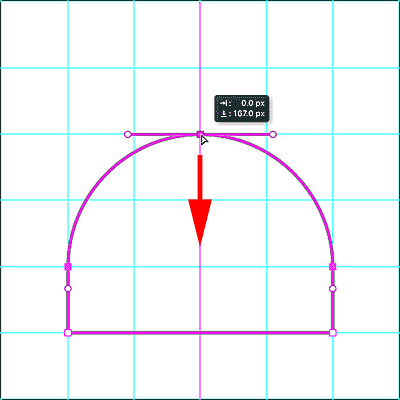

*Reshaping the path by moving all selected anchor points at the same time.*

To switch back to the Curvature Pen Tool, reselect it from the Toolbar:

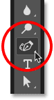

*Reselecting the Curvature Pen Tool.*

And then, to delete the path so we can start over again, **right-click** (Win) / **Control-click** (Mac) inside the document and choose **Delete Path** from the menu:

*Choosing the Delete Path option.*

### Drawing A Heart With The Curvature Pen Tool

Finally, let's take what we've learned about curve and corner points and use it to draw a path in the shape of a heart. When we're done, we'll finish off this tutorial by learning how to turn the path into an actual shape, as well as a vector mask and a selection outline.

First, click in the bottom center with the Curvature Pen Tool to set your starting point:

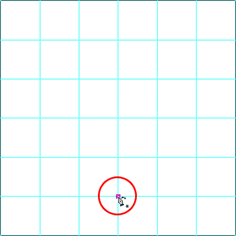

*Clicking to set the starting point for the heart.*

Then, click in the upper left, where the first vertical guide on the left intersects with the second horizontal guide from the top. This adds a second point, and since we only have two points at the moment, Photoshop draws a straight path segment between them:

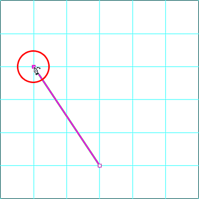

*Clicking to add the second point.*

To add the third point, click where the top horizontal guide intersects with the second vertical guide from the left. Since this is our third point, Photoshop converts the straight path segment into a curve:

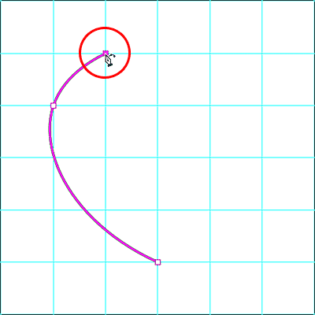

*Adding the third point creates the curve.*

We need to add our fourth point at the spot where the second horizontal guide from the top meets the vertical guide in the center. But, because we know we need this point to be a corner point, not a curve point, **double-click** to add it:

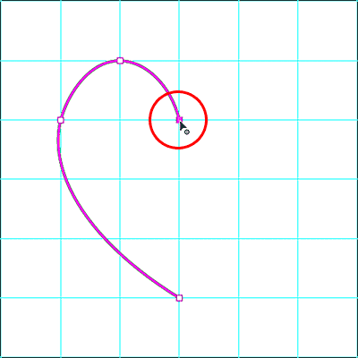

*Adding the fourth point as a corner point by double-clicking.*

Next, click where the top horizontal guide intersects with the second vertical guide from the right. Even though we're adding this point as a curve point (by single-clicking), Photoshop will initially draw a straight path segment. That's because our previous point was a corner point:

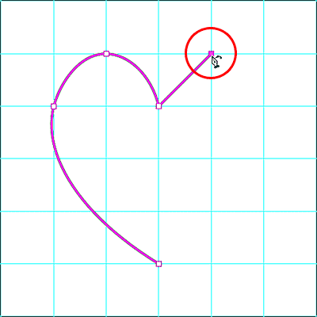

*Single-click to add the fifth anchor point as a curve point.*

To add the next point, click where the first vertical guide from the right meets the second horizontal guide from the top. Photoshop once again converts the straight path into a curve:

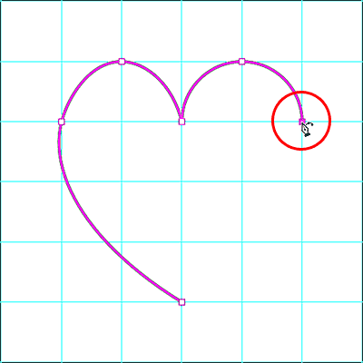

*Adding the sixth point converts the previous straight line into a curve.*

Finally, let's close the path and complete our heart shape by clicking on the initial starting point at the bottom. We need this point to be a corner point, not a curve, so complete the path by double-clicking on the starting point:

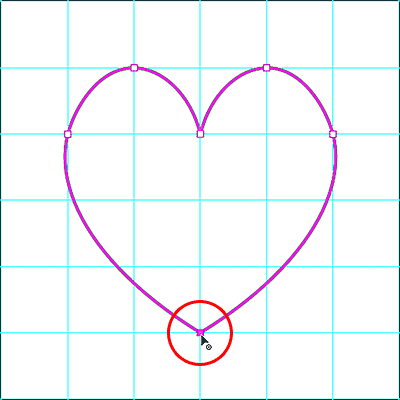

*Double-click on the starting point to close the path with a corner point.*

### Turning Off The Guides

We're done drawing with the Curvature Pen Tool, so let's remove the guides by going up to the **View** menu in the Menu Bar, choosing **Show**, and then choosing **Guides** to deselect them:

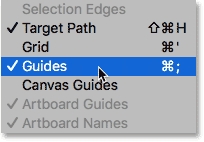

*Going to View > Show > Guides.*

This leaves us with just our path:

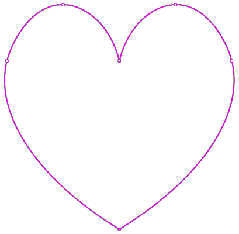

*The heart-shaped path drawn with the Curvature Pen Tool.*

## Converting The Path Into A Selection, Mask Or Shape

Now that we've drawn our path, Photoshop makes it easy to convert the path into either a **selection outline**, a **vector mask** or a **shape**. With the Curvature Pen Tool still active, you'll find all three options in the Options Bar. Simply choose the one you need:

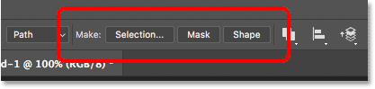

*Use the Make option to turn the path into a selection, vector mask or shape.*

### Selection Outline

To convert your path into a selection outline, choose **Selection**:

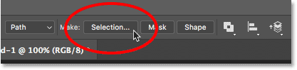

*Choosing "Selection" from the Options Bar.*

Photoshop will open the **Make Selection** dialog box. Here, you can add some feathering to the selection if needed, or just click OK to close the dialog box:

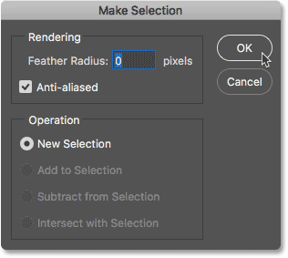

*The Make Selection dialog box.*

Photoshop instantly converts your path outline into a "marching ants" selection outline:

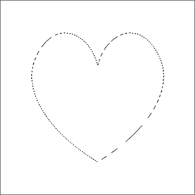

*The path drawn with the Curvature Pen Tool is now a selection outline.*

I'll undo it so we can look at the other two options by going up to the **Edit** menu and choosing **Undo Selection Change**. I could also just press **Ctrl+Z** (Win) / **Command+Z** (Mac) on my keyboard:

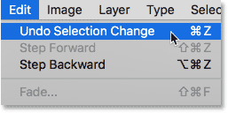

*Going to Edit > Undo Selection Change.*

### Vector Mask

To create a vector mask from your path outline, choose **Mask** in the Options Bar:

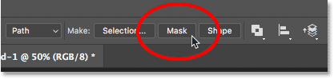

*Clicking the "Mask" option.*

Photoshop converts the path into a [vector mask](/basics/vector-shapes-vs-pixel-shapes-in-photoshop/), with only the area inside the path remaining visible in the document. The *checkerboard pattern* now surrounding the path represents transparency, since we have no other layers below the mask:

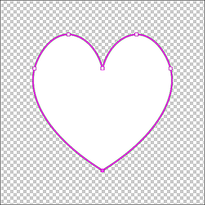

*The path now appears as a vector mask, with only the area inside the path visible.*

And if we look in the [Layers panel](/basics/layers/layers-panel/), we now see a **vector mask thumbnail**:

*A vector mask thumbnail appears in the Layers panel.*

I'll undo the vector mask so we can look at the third option by going up to the **Edit** menu and choosing **Undo Add Vector Mask**. Or again, I could just press **Ctrl+Z** (Win) / **Command+Z** (Mac) on my keyboard:

*Going to Edit > Undo Add Vector Mask.*

### Shape Layer

Finally, to convert a path drawn with the Curvature Pen Tool into a Shape layer, choose **Shape**:

*Choosing "Shape" from the Options Bar.*

Photoshop fills the new shape with your current Foreground color, which in my case is black:

*The path now converted into a shape.*

If we look again in the Layers panel, we now see a new **Shape layer**. To change the shape's color, double-click on the shape's **thumbnail**:

*Double-clicking the Shape layer thumbnail to change the shape color.*

Then choose a new color from the **Color Picker**. Since we've drawn a heart shape, I'll choose a shade of red. Click OK when you're done to close the Color Picker:

*Choosing a different color for the shape from the Color Picker.*

Finally, to hide the path outline from around the shape, press **Enter** (Win) / **Return** (Mac) on your keyboard. Or, simply choose a different tool from the Toolbar. Here's my heart shape now filled with red:

*The red heart shape drawn with the Curvature Pen Tool.*

And there we have it! That's our step-by-step guide to drawing paths and shapes with the new Curvature Pen Tool in Photoshop CC 2018! Also check out the new [Rich Tool Tips](/basics/rich-tool-tips-photoshop-cc-2018/) in Photoshop CC 2018. Visit our [Photoshop Basics](/basics/) section for similar tutorials!