# Using Layer Effects and Layer Styles in Photoshop CC 2020 – Complete Guide

> Source: [https://www.photoshopessentials.com/basics/using-layer-effects-and-layer-styles-in-photoshop-cc-2020-complete-guide/](https://www.photoshopessentials.com/basics/using-layer-effects-and-layer-styles-in-photoshop-cc-2020-complete-guide/)
> Downloaded and converted to Markdown.

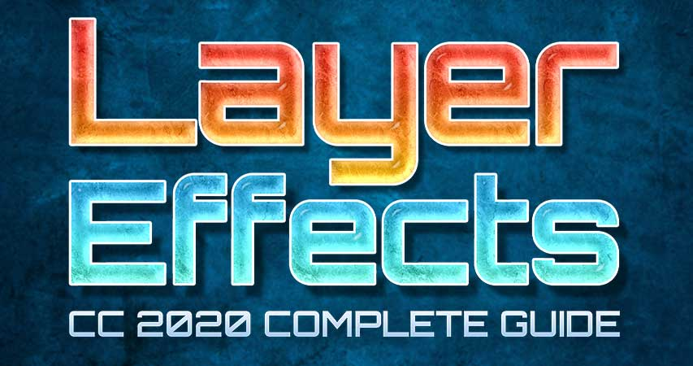

Learn everything you need to know to start using layer effects and layer styles in Photoshop CC 2020, including a look at CC 2020's new layer style presets, gradients, patterns and more!

In this first tutorial in my series on Photoshop layer effects, I cover everything you need to know to add layer effects and layer styles in Photoshop CC 2020! We'll start by learning the difference between a *layer effect* and a *layer style*, and how to use Photoshop's layer style presets to add instant one-click effects to your images. We'll look at the brand new layer styles included with Photoshop 2020, and I'll show you where to find the missing styles from earlier versions of Photoshop.

From there, you'll learn how to add and edit your own layer effects, and how to take full advantage of Photoshop 2020's amazing new gradients and patterns. I'll even show you how to add multiple copies of an effect to the same layer, how to scale layer effects to fit your image, how to save your effects as custom layer style presets, and more!

This tutorial is exclusively for [Photoshop 2020 and newer](https://prf.hn/l/dlXjD2w). So before you begin, you'll want to make sure that your copy of Photoshop is up to date.

We've got a lot to cover, so let's get started!

### Setting up the document

If you want to follow along, open any image to use as a background, and then add some text above it. Here I'm using a [background texture](https://prf.hn/l/BOq5Bv3) that I downloaded from Adobe Stock, and I've added the words "LAYER" and "EFFECTS". I'll be working with type layers for this tutorial, but layer effects can also be applied to pixel layers and shape layers:

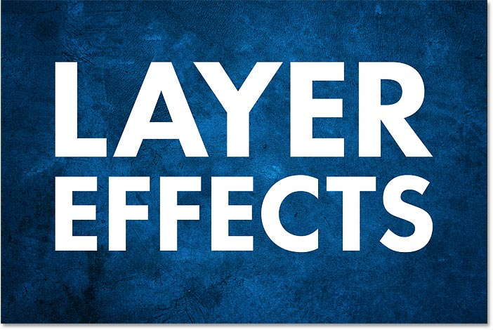
*The original document with text in front of a background image.*

In the [Layers panel](/basics/layers/layers-panel/), we see the texture on the Background layer, and each word is on its own type layer:

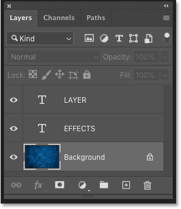
*The Layers panel showing the three layers in the document.*

## What are layer effects in Photoshop?

Layer effects are a collection of **non-destructive, editable effects** that can be applied to almost any kind of layer in Photoshop. There are 10 different layer effects to choose from, but they can be grouped together into three main categories—**Shadows and Glows**, **Overlays** and **Strokes**. Layer effects are live effects that link directly to the layer. So if you make changes to a layer's contents, any effects applied to that layer will instantly update.

## What are layer styles?

While you'll often hear the terms "layer effects" and "layer styles" used interchangeably, layer *effects* are the individual effects themselves, like Drop Shadow, Stroke, Outer Glow, and so on. A layer *style* is a collection of two or more layer effects working together to create a larger, overall look. Layer styles also include any Blending Options applied to the layer, including the layer's blend mode, along with its current Opacity and Fill Opacity settings.

## What are the benefits of using layer effects?

Layer effects are **easy to use**, **fully editable**, and entirely **non-destructive**. And they add virtually nothing to the overall size of your Photoshop document. While layer effects are most often used with type, they can also be used with images and vector shapes to add realism or creativity in ways that would be difficult, if not impossible, without layer effects. 

You can add multiple effects to a single layer, toggle layer effects on and off, edit their settings, and delete layer effects without making any permanent changes to your image. You can even add layer effects to an entire layer group to apply the same effects to multiple layers at once. And you can combine layer effects with type to create [amazing text effects](/photoshop-text/text-effects/) while keeping your text fully editable! 

## Where do I find Photoshop's layer effects?

There are two main places where you'll find the list of layer effects.

### The Layer menu

One is by going up to the **Layer menu** in the Menu Bar and choosing **Layer Style**. From there, you'll see a list of all the layer effects you can choose from, including Bevel & Emboss, Stroke, Inner Shadow, and more. To add an effect, select it from the list:

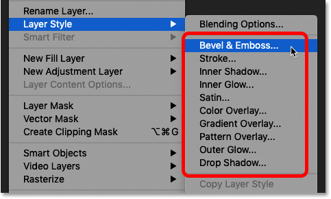
*Going to Layer > Layer Style to choose a layer effect.*

### The Layers panel

The other and faster way to add layer effects is by clicking the **fx** icon at the bottom of the **Layers panel**:

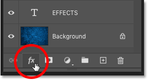
*Clicking the fx icon.*

And then choosing from the same list of layer effects that we saw in the Menu Bar:

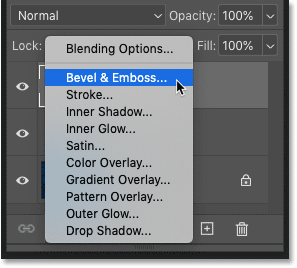
*Adding a layer effect from the Layers panel.*

### Why are my layer effects grayed out?

If the effects in the Layer Style menu in the Menu Bar are grayed out, or the fx icon in the Layers panel is grayed out, it's most likely because you have the **Background layer** selected in the Layers panel. Photoshop does not allow us to add layer effects to the Background layer, mostly because layer effects work best on layers that include areas of transparency, which the [Background layer](/basics/background-layer-photoshop-cc/) does not support:

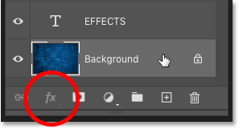
*Layer effects are not available when the Background layer is active.*

So before adding layer effects, first make sure you have the correct layer selected:

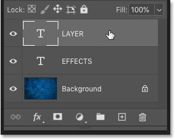
*Selecting the layer before adding layer effects.*

[Learn all about layers with our Layers Learning Guide!](/photoshop-layers-learning-guide/)

## How to use Photoshop's layer style presets

Before we start adding our own layer effects, let's look at how to use Photoshop's **layer style presets**. A layer style preset is like a ready-made, one-click effect. You just click on a layer style to select it and the effect is instantly applied to your layer. There are lots of preset styles to choose from, and Photoshop CC 2020 adds even more! And they're all found in Photoshop's **Styles panel**.

If you're not seeing the Styles panel on your screen, you can open it by going up to the **Window** menu in the Menu Bar and choosing **Styles**:

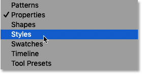
*Going to Window > Styles.*

### The new default layer styles in Photoshop CC 2020

Photoshop CC 2020 introduces all-new default layer styles, and the new styles are grouped into one of four sets—**Basics**, **Natural**, **Fur**, and **Fabric**. Each set has its own folder in the Styles panel, and each layer style is represented by a thumbnail.

By default, all four folders are twirled open, and the thumbnail size is set to **Large**. So to view all of the styles, you'll need to scroll down the list:

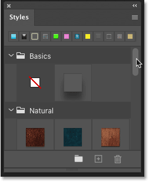
*The default Styles panel layout in Photoshop CC 2020.*

#### Customizing the Styles panel

To view more layer styles at once, you can change the size of the thumbnails. Click on the **menu icon** in the upper right of the Styles panel:

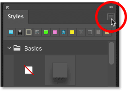
*Opening the Styles panel menu.*

And then choose **Small Thumbnail**:

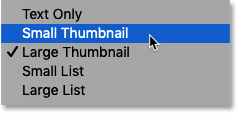
*Choosing the Small Thumbnail size.*

And now the thumbnails appear much smaller:

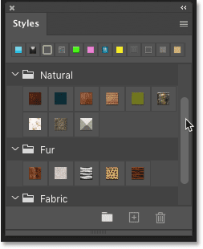
*More layer styles are now visible at once.*

### Tip! How to twirl all folders open or closed at once

Each set in the Styles panel can be twirled open or closed by clicking the **arrow** to the left of its folder icon. Or you can twirl all folders open or closed at once by holding the **Ctrl** (Win) / **Command** (Mac) key on your keyboard as you click one one of the arrows.

Here I've closed all folders, making it easy to see all four of the new default sets:

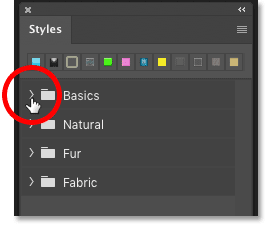
*Holding Ctrl (Win) / Command (Mac) to close all folders at once.*

Then to open just the folder you need, release your Ctrl (Win) / Command (Mac) and click on the arrow. I'll open the **Natural** folder:

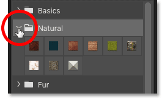
*Opening a single folder by clicking its arrow.*

### How to apply a layer style preset

To apply one of the layer styles in the folder, just click on its thumbnail. I'll select the new **Sea** style:

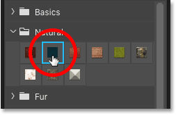
*Clicking on a layer style to apply it.*

The style is instantly applied to your selected layer, and here we get this sort of dark, underwater effect:

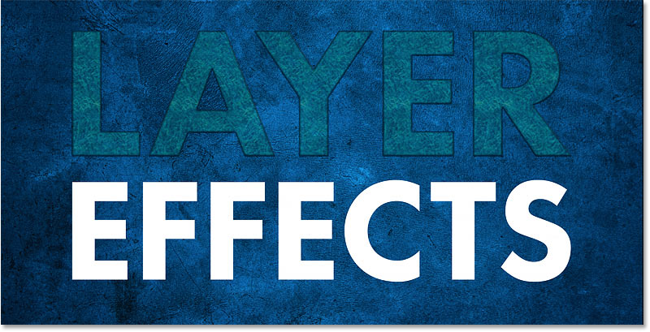
*The result after applying one of Photoshop's preset layer styles.*

And in the Layers panel, all of the individual layer effects that make up the style appear listed below the layer. So this one layer style is actually the result of (in this case) seven layer effects working together:

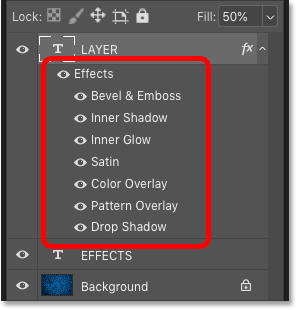
*A single layer style can include multiple layer effects.*

[Create a Spray Paint Text Effect with Photoshop's layer effects!](/photoshop-text/text-effects/spray-paint-text-effect/)

### Choosing a different layer style

To choose a different style, just click on a different thumbnail. I'll try another style from the Natural set, like **Wood**:

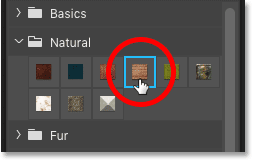
*Selecting a different style preset.*

The new layer style replaces the previous one, and now my text is filled with this wood grain effect:

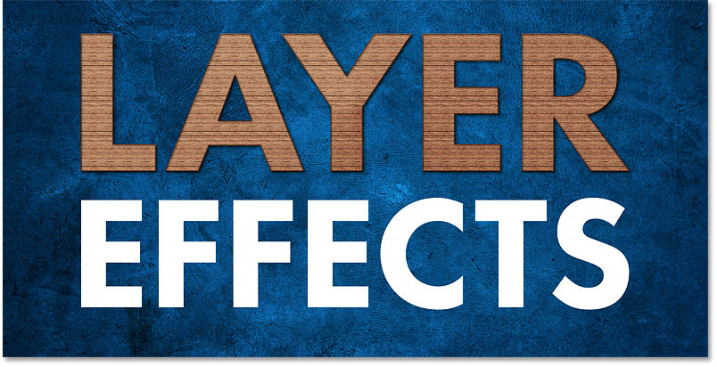
*New layer styles instantly replace the previous style.*

And the effects that make up the new style appear below the layer:

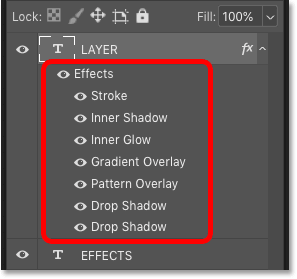
*Different layer styles use different effects.*

### Choosing layer styles from a different set

I'll close the Natural set by clicking the arrow beside its folder. Then I'll twirl open the **Fur** set and I'll click on the **Zebra** style:

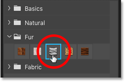
*Selecting a different style from a different set.*

And this time, my text is filled with zebra stripes:

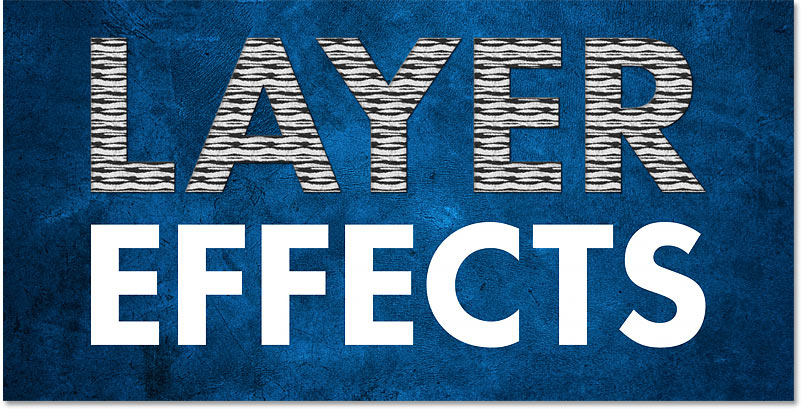
*Another new default layer style in Photoshop CC 2020.*

And again, we see the list of effects below the layer:

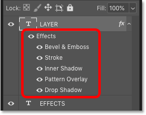
*The effects that make up the Zebra layer style.*

[Create 80's Retro Text with layer effects!](/photoshop-text/text-effects/80s-retro-text-effect-photoshop/)

### Expanding and collapsing the layer effects list

To free up room in the Layers panel, you can collapse the list of layer effects by clicking the small **arrow** beside the **fx** icon on the far right of the layer. Click the arrow again to expand the list. This does not turn the effects themselves on or off. It's just a way to keep the Layers panel from looking cluttered, especially when you have multiple layers with effects applied:

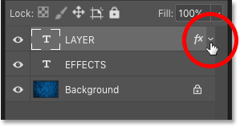
*Click the arrow to expand or collapse the effects list.*

## How to load more layer styles in Photoshop CC 2020

At first glance, it looks like Photoshop CC 2020 does not include many layer style presets. And if you've upgraded from a previous version of Photoshop, you may be wondering what happened to the original preset styles that have been part of Photoshop for years. All of the preset styles from earlier versions are still available in CC 2020, along with even more brand new styles. To access them, all we need to do is load them into the Styles panel.

Click the Styles panel **menu icon**:

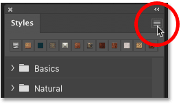
*Opening the Styles panel menu.*

And choose **Legacy Styles and More**:

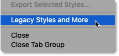
*Choosing "Legacy Styles and More" from the menu.*

This adds a "Legacy Styles and More" folder below the default folders:

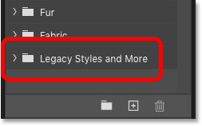
*A new "Legacy Styles and More" folder appears.*

Twirl the folder open and you'll find two more folders inside it. The **2019 Styles** folder holds more new layer styles to try out. And the **All Legacy Default Styles** folder holds all of  the original layer style presets from earlier versions of Photoshop:

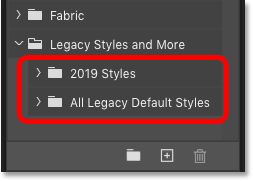
*The "2019 Styles" and "All Legacy Default Styles" sets.*

### The 2019 styles

The layer styles in the 2019 Styles folder are divided into various sets, including Gel, Glass, Grunge, Chrome, Metallic, and 3D. I'll twirl the **Chrome** set open, and then I'll select the **Bling** style:

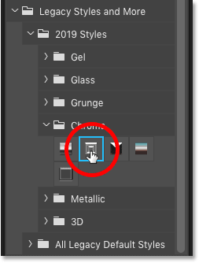
*Choosing one of the new layer style presets in the 2019 Styles folder.*

And as you would expect from something called Bling, we get this shiny, over-the-top effect:

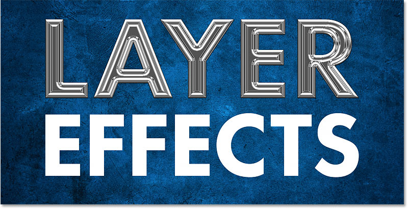
*The result from the Bling layer style.*

And if I twirl open the **3D** folder and I choose the **Duplicates** style near the bottom:

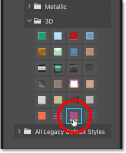
*Choosing a style from the 3D set.*

We get this completely different effect, with duplicates of the text appearing behind it in different colors:

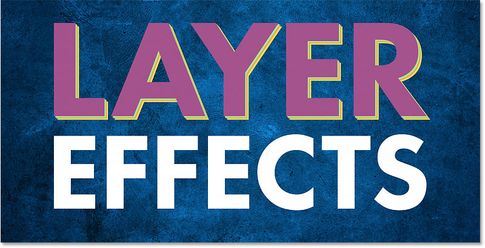
*The result from the Duplicates layer style.*

### The legacy default styles

To use any of the layer styles from previous versions of Photoshop, twirl open the **All Legacy Default Styles** folder and you'll find all of the original styles, again divided into sets.

I'll select the **Chromed Satin** style from the **Legacy Default Styles** set:

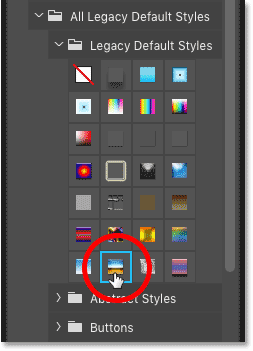
*Choosing a legacy layer style.*

And now we get this classic Photoshop chrome effect:

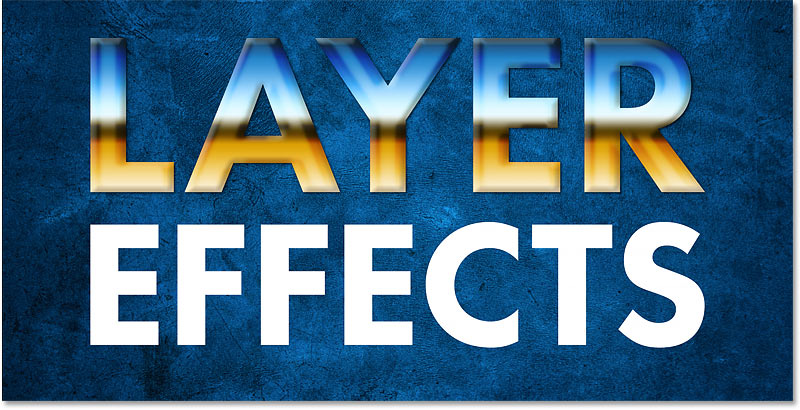
*The legacy Chromed Satin effect.*

## How to toggle  layer effects on and off

An easy way to see how each layer effect contributes to the overall look of the style is by toggling the individual effects on and off, which you can do by clicking the **visibility icon** (the eyeball) to the left of their names.

For example, if I turn off the **Gradient Overlay** in the Chromed Satin style:

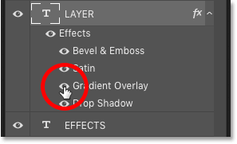
*Turning off one of the effects in the layer style.*

The orange and blue gradient in the letters disappears, leaving just the shading effects and the drop shadow behind the text:

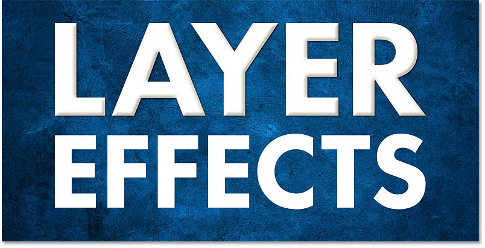
*The layer style with the Gradient Overlay turned off.*

To turn the effect back on, click in the empty spot beside the effect's name:

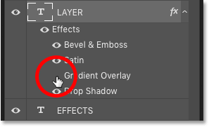
*Turning the Gradient Overlay back on.*

And the gradient reappears:

*The same layer style with the Gradient Overlay turned on.*

### How to toggle all layer effects at once

To turn all layer effects off at once, click the main visibility icon beside the word "Effects". Click it again to turn the effects back on:

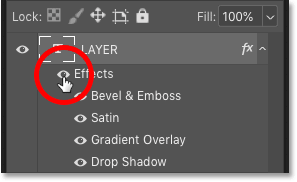
*Toggling all layer effects on and off.*

## How to move and copy layer styles

To copy a layer style from one layer and paste it onto a different layer, **right-click** (Win) / **Control-click** (Mac) on the **fx** icon on the layer that holds the style you want to copy:

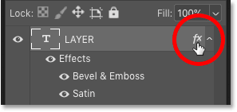
*Right-clicking (Win) / Control-clicking (Mac) on the "fx" icon.*

And choose **Copy Layer Style** from the menu:

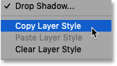
*Choosing "Copy Layer Style". *

Then **right-click** (Win) / **Control-click** (Mac) on the layer where you want to paste the style:

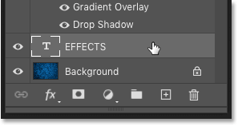
*Right/Control-clicking on a different layer.*

And choose **Paste Layer Style**:

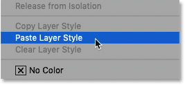
*Choosing "Paste Layer Style".*

And now the same layer style is applied to both layers:

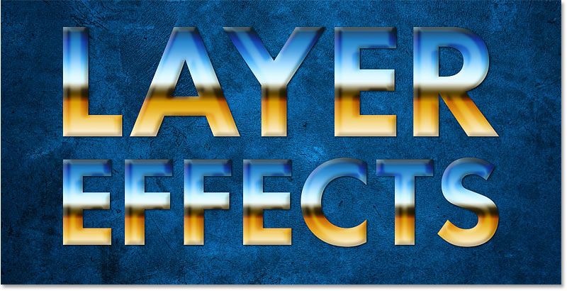
*The result after copying and pasting the layer style.*

### How to clear a layer style

To remove a layer style, clear it by **right-clicking** (Win) / **Control-clicking** (Mac) on the layer's **fx** icon:

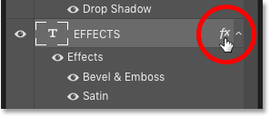
*Right-clicking (Win) / Control-clicking (Mac) on the "fx" icon.*

And choosing **Clear Layer Style**:

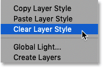
*Choosing "Clear Layer Style".*

And now I'm back to the effects being applied only to the top text layer:

*The layer style has been cleared from the bottom text.*

### How to move layer effects to a different layer

If you just want to move the effects to a different layer, click on the **fx** icon on the layer containing the effects, drag it onto the other layer, and then release your mouse button:

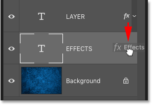
*Dragging the "fx" icon from one layer to another.*

The effects are instantly moved from the original layer to the new layer:

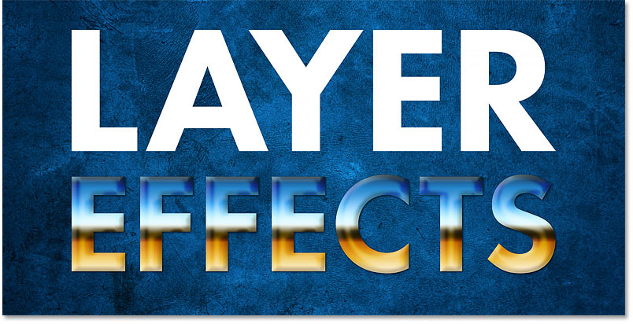
*The effects have been moved from the top text layer to the bottom.*

[Learn 5 easy ways to move images between Photoshop documents!](/basics/5-ways-move-images-photoshop-documents/)

### A faster way to copy layer effects

And if you press and hold the **Alt** (Win) / **Option** (Mac) key on your keyboard as you drag the **fx** icon:

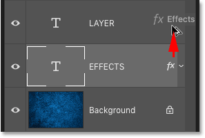
*Holding Alt (Win) / Option (Mac) while dragging the "fx" icon.*

You'll copy, rather than move, the effects from one layer to the other. I cover more about copying layer effects in my [How to Copy Layer Effects](/basics/copy-layer-effects-photoshop/) tutorial:

*The effects are again applied to both type layers.*

## How to edit an effect within a layer style

Notice that after copying the same Chrome layer style to both text layers, the gradient looks exactly the same in both letters, running from orange on the bottom to blue on the top. What if I wanted to flip the gradient on the bottom text? We're going to look at how to add and edit layer effects in more detail in a moment. But to edit the settings for any effect within a layer style, double-click on the effect's name below the layer.

For example, I want to edit the gradient, so I'll double-click on the **Gradient Overlay** effect:

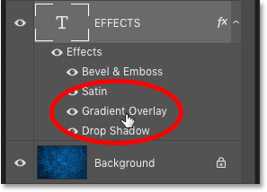
*Double-clicking on the effect I want to edit.*

Photoshop opens the **Layer Style** dialog box, and in the center of the dialog box are the settings for the effect:

*The Layer Style dialog box opens to the layer effect's settings.*

To flip the colors in the gradient, all I need to do is select the **Reverse** option. Then I'll click OK to close the dialog box:

*Selecting Reverse to flip the gradient colors.*

And now the gradient colors in the bottom text are reversed:

*The effect after reversing the colors in the Gradient Overlay.*

### How to clear layer styles from multiple layers at once

Earlier we learned how to clear a layer style from a single layer. To clear the styles from two or more layers at once, click on one layer select it, and then hold your **Ctrl** (Win) / **Command** (Mac) key and click on the other layer(s) to select them:

*Selecting two layers at once in the Layers panel.*

Then **right-click** (Win) / **Control-click** (Mac) on any of the selected layers and choose **Clear Layer Style** from the menu:

*Choosing the "Clear Layer Style" command.*

And now I'm back to my plain white letters in front of the blue background:

*The result after clearing the layer styles from both type layers.*

## How to scale layer effects in Photoshop

Sometimes you'll apply a layer style and the effect will look like it's either too big or too small for the contents of your layer. That's because the result you get from layer effects depends a lot on the size of your image. Larger images often need different settings than smaller images to achieve the same look. But you can correct any size problems by scaling the effects to any size you need.

For example, in the Layers panel, I'll select my top text layer:

*Selecting the top layer in the Layers panel.*

And then in the Styles panel, I'll twirl open the **KS Styles** set (found in the All Legacy Default Styles folder) and I'll choose the **Frosted** style:

*Choosing the Frosted layer style.*

This instantly gives the text a [frozen, icy look](/photo-effects/photoshop-weather-effects-snow/). But while it's a cool effect (pun intended), it also looks a bit overwhelming, as if the effect is too big for the size of the letters:

*The result after applying the Frosted layer style.*

To fix that, we can scale the effects. One way to scale layer effects is by going up to the **Layer** menu in the Menu Bar, choosing **Layer Style**, and then choosing **Scale Effects**:

*Going to Layer > Layer Style > Scale Effects.*

And the other is by **right-clicking** (Win) / **Control-clicking** (Mac) on the layer's **fx** icon:

*Right/Control-clicking the "fx" icon.*

And choosing **Scale Effects** from the menu:

*Choosing "Scale Effects" from the "fx" menu.*

Then in the Scale Layer Effects dialog box, adjust the **Scale** value to the amount you need. I'll lower mine from 100% down to 60%. Make sure the **Preview** box is checked so you can preview the results as you adjust the value. When you're done, click OK to close the dialog box:

*Adjusting the Scale amount.*

And here's the result with the same Frosted style scaled to 60% of its original size. Notice that the size of the text itself has not changed. Only the effects applied to the text have been resized:

*The result after scaling the effects.*

[How to resize images without losing quality with Smart Objects!](/basics/scale-resize-images-smart-objects-photoshop/)

### Layer styles can include more than just effects

Before we move on, notice in the Layers panel that along with the effects, this layer style also lowered the layer's **Fill** value from 100% down to 56%:

*The layer style also changed the layer's Fill value.*

We'll look at what the Fill value means in a moment. But a layer style can include not just effects but also the layer's Blending Options, which include the **Opacity** and **Fill** values along with the layer's **blend mode**:

*The Blend Mode, Opacity and Fill values can all be part of a layer style.*

### One more way to clear a layer style

And here's one more way to clear a layer style in Photoshop CC 2020. In the Layers panel, make sure the correct layer is selected. Then in the Styles panel, twirl open the **Basics** folder and choose the default style, which is **None**. It's the white thumbnail with the red diagonal line:

*Selecting "None" from the Basics folder.*

And after clearing the style, I'm once again back to my plain white text. And that's the basics of using layer style presets in Photoshop!

*The result after setting the layer style to "None".*

## How to add layer effects in Photoshop

So now that we know how to use Photoshop's layer style presets, let's learn how to add our own individual layer effects. We're not going to cover every layer effect and every setting, but you'll gain a good understanding of how layer effects work. And I'll be covering specific effects in more detail in other tutorials in this series.

### Choosing a layer effect

First, in the Layers panel, select the layer where you want to apply one or more effects. I'll select my top text layer:

*Selecting the top text layer.*

Then click the **Layer Effects** icon (the **fx** icon):

*Clicking the "fx" icon.*

And choose a layer effect from the list. I'll start with **Drop Shadow**:

*Adding a Drop Shadow layer effect.*

### Photoshop's Layer Style dialog box

Choosing any effect opens the **Layer Style** dialog box. And because I selected Drop Shadow, the dialog box opens to the Drop Shadow settings so I can customize the appearance of the effect:

*The Layer Style dialog box showing the settings for the selected layer effect.*

### Restoring the layer effect's default settings

The Layer Style dialog box remembers the last settings you applied. So before you begin customizing an effect, it's usually a good idea to restore the default settings by clicking the **Reset to Default** button:

*The Layer Style dialog box in Photoshop.*

### How to customize a layer effect

Then you can adjust the settings for the effect to create the look you need. Each layer effect has its own settings unique to that specific effect. 

So for example, with the Drop Shadow, you can drag the **Opacity** slider to adjust the shadow's intensity. You can change the **Blend Mode** of the effect (although Multiply usually works best for shadows). And you can click on the **color swatch** to choose a different color for the shadow. Black is the default shadow color, but sometimes a different color works better:

*The Drop Shadow's Opacity, Blend Mode and Color settings.*

The **Angle** option lets you adjust the direction of the light source, and the shadow will appear in the opposite direction. So if the light is coming from the upper left, the shadow will appear in the lower right. You can change the angle by clicking and dragging inside the radial dial or by entering a specific value:

*Use the Angle option to adjust the shadow's light source.*

#### Use Global Light

The **Use Global Light** option allows all of the layer effects that require a light source to share the same light source, so that the lighting will appear uniform throughout the overall effect. You'll find this option not only in the Drop Shadow settings but also in the settings for Bevel & Emboss and Inner Shadow. In most cases, you'll want to leave Use Global Light turned on, which it is by default:

*"Use Global Light" keeps the light source consistent with different effects.*

The **Distance** value controls how far out the shadow extends from the layer's contents. For example, when applying a drop shadow to a type layer, Distance controls how far out the shadow extends from the letters. 

And the **Size** value controls the overall size of the shadow. When the **Spread** value is set to 0%, increasing the Size value softens the shadow edges. And increasing the Spread value fills in the shadow and makes it more opaque:

*The Distance, Spread and Size options.*

I'll increase the shadow's **Opacity** to **40%**, the **Distance** to **90px**, and the **Size** to **40px**:

*Customizing the Drop Shadow settings.*

### How to accept your settings

If you're happy with the settings and this is the only layer effect you need to apply, click OK to accept your settings and close the Layer Style dialog box:

*Clicking OK to close the dialog box.*

[Create editable blurred text with Drop Shadows!](/photoshop-text/text-effects/blur-shadow/)

## How to edit a layer effect

In the document, the drop shadow appears behind the letters in the word "LAYER":

*The result after adding a Drop Shadow to the word "LAYER".*

And in the Layers panel,  Drop Shadow is now listed as an effect below the layer. To edit a layer effect, double-click on the effect's name:

*Double-clicking on the words "Drop Shadow".*

Photoshop reopens the Layer Style dialog box to the effect's current settings so you can make any changes you need. Layer effects are entirely non-destructive, so you won't lose image quality no matter how many changes you make.

I'll increase the shadow's **Opacity** to **50%** and I'll increase the **Distance** to **100px**. But I won't close the Layer Style dialog box yet because I have other layer effects I want to add:

*Editing the Drop Shadow settings.*

After editing the effect, the shadow is now more visible behind the letters:

*The result after editing the Drop Shadow settings.*

## Adding more effects in the Layer Style dialog box

We know that we can add layer effects by clicking the **fx** icon in the Layers panel. But if the Layer Style dialog box is open, you can add more effects by selecting them from the column along the left:

*The list of effects in the Layer Style dialog box.*

### How to show missing effects

If some of your layer effects are missing from the list, click the **fx** button in the bottom left of the dialog box:

*Clicking the "fx" button.*

And choose **Show All Effects**:

*Choosing "Show All Effects" from the menu.*

### The layer effects categories

As I mentioned earlier, Photoshop's layer effects can be grouped into three main categories. We have **Shadow and Glow** effects, which include Bevel & Emboss, Inner Shadow, Inner Glow, Satin, Outer Glow, and Drop Shadow. Note that Contour and Texture listed below Bevel & Emboss are part of the Bevel & Emboss effect, which is why they're indented to the right:

*The Shadows and Glows layer effects.*

We also have **Overlay** effects (Color Overlay, Gradient Overlay, and Pattern Overlay):

*The Overlay layer effects.*

And we have **Stroke**, which adds an outline or border around the layer's contents:

*The Stroke layer effect.*

### Photoshop's layer effect stacking order

Notice the order in which the layer effects are listed. In the most recent versions of Photoshop, layer effects are now listed in the order in which they are applied, from bottom to top. So a Drop Shadow is always applied first, and then an Outer Glow would be applied above it. Next would be the Overlay effects (Pattern, then Gradient, and then Color), followed by Satin, Inner Glow, Inner Shadow, and then Stroke. And the Bevel & Emboss effect is always applied last, on top of any other effects we've applied.

Also, Drop Shadow and Outer Glow are the only two layer effects that appear *below* the layer's contents. Every other effect appears *above* the contents. Knowing the stacking order of layer effects may seem trivial, but it can help you understand why your effects are not giving you the results you expected:

*Layer effects are always applied in order from bottom to top.*

### Adding a second layer effect

To add another layer effect, click on its name in the list. I'll add a **Stroke**:

*Adding a Stroke layer effect.*

### Customizing the Stroke effect

In the Stroke settings, I'll once again start by clicking the **Reset to Default** button to restore the default values:

*Resetting the Stroke default settings.*

Then I'll change the color of the stroke by clicking the **color swatch**:

*Clicking the Stroke's color swatch.*

And in the Color Picker, I'll choose a shade of orange by setting the **Hue** (**H**) value to **25**, the **Saturation** (**S**) value to **100** and the **Brightness** (**B**) value also to **100**. Then I'll click OK to close the Color Picker:

*Choosing a new color for the Stroke.*

The **Position** option lets you align the stroke to either the **Inside** or **Outside**  edge of the layer's contents. Or you can **Center** the stroke along the edge. I'll choose Outside. And the **Size** option is where we set the width or thickness of the stroke. I'll increase the size to **20px**:

*Setting the Size and Position of the stroke.*

Again, I'll leave the Layer Style dialog box open. And here's the effect with the orange stroke and the drop shadow applied to the top text:

*The result with the stroke and the drop shadow applied.*

[How to create Gold Text with layer effects!](/photoshop-text/text-effects/turning-text-into-gold-with-photoshop/)

## The Blending Options

Along with selecting and editing effects, the Layer Style dialog box also gives us access to the layer's blending options. Click the **Blending Options** category above the effects in the left column:

*Opening the Blending Options.*

From here, we can access the same **Blend Mode**, **Opacity** and **Fill** settings that are found in the Layers panel. We also have some Advanced Blending options which we'll look at in other tutorials:

*You can change the Blend Mode, Opacity or Fill from the Layer Style dialog box.*

### How to hide the layer contents and view only the effects

A great trick that we can do with blending options is that we can hide the actual contents of a layer and view only the layer effects themselves. You can do this either in the Layer Style dialog box or in the Layers panel.

If I lower the **Opacity** value from 100% all the way down to **0%**:

*Lowering the Opacity value to 0 percent.*

Both the text and the layer effects applied to the text disappear:

*Lowering the Opacity made the layer and the layer effects transparent.*

But if I set the Opacity back to 100%, and then I lower the **Fill** value (or **Fill Opacity** in the Layer Style dialog box) down to **0%**:

*Lowering the Fill Opacity value to 0 percent.*

This time, the text itself disappears but the layer effects remain visible, allowing us to see through the letters to the blue background image behind them. So the Opacity value affects the transparency of both the layer's contents *and* any layer effects, and the Fill value affects the transparency of just the layer's contents. Check out my [Layer Opacity vs Fill](/basics/layers/opacity-vs-fill/) tutorial to learn more:

*The result after lowering the Fill value to 0 percent.*

[Blend text into clouds with Photoshop's Advanced Blending options!](/photo-effects/how-to-blend-text-into-clouds-with-photoshop/)

### Closing the Layer Style dialog box

I'll close the Layer Style dialog box for now by clicking OK:

*Clicking OK to close the dialog box.*

And in the Layers panel, we see the Stroke and the Drop Shadow listed as effects below the layer. Notice that the Fill value is also set to 0%, since I lowered it in the Layer Style dialog box:

*The Layers panel showing the two layer effects plus the new Fill value.*

## New gradients and patterns in Photoshop CC 2020

Along with new layer styles, Photoshop CC 2020 also includes new gradients and patterns, both of which can be applied as layer effects. But to access all of the gradients and patterns, we first need to visit the **Gradients** and **Patterns panels**, which are also new in CC 2020.

### How to load more patterns

First, switch over to the **Patterns** panel. You'll find it nested in with the Color and Swatches panels. Just like with the Styles panel, the new patterns are divided into sets which can be twirled open and closed. But by default, there are only a few pattern sets to choose from (Trees, Grass and Water).

To load more patterns, click on the Patterns panel **menu icon**:

*Clicking the Patterns panel menu icon.*

And choose **Legacy Patterns and More**:

*Choosing "Legacy Patterns and More".*

A new folder named "Legacy Patterns and More" appears below the default pattern sets. And if you twirl the folder open, you'll find two more folders inside it. One holds more new patterns from 2019, and the other holds all of the original patterns from earlier versions of Photoshop. All of these patterns will now be available in the Layer Style dialog box:

*All of Photoshop’s patterns are now available.*

### How to load more gradients

Next, switch over to the new **Gradients** panel, nested beside the Patterns panel. Here you'll find lots and lots of new gradients to choose from in CC 2020, again divided into sets.

But if you also want access to the previous gradients from earlier versions of Photoshop, then click on the Gradients panel **menu icon**:

*Clicking the Gradients panel menu icon.*

And choose **Legacy Gradients**:

*Loading the Legacy Gradients in Photoshop CC 2020.*

A "Legacy Gradients" folder appears below the default gradients, and they will now be available in the Layer Style dialog box:

*The Legacy Gradients have been loaded.*

## Adding a Pattern Overlay effect

Gradients and patterns can both be applied to layers as overlay effects. To add a pattern, click the **fx** icon at the bottom of the Layers panel:

*Clicking the Layer Effects icon.*

And choose **Pattern Overlay**:

*Adding a Pattern Overlay effect.*

In the Layer Style dialog box, click on the **pattern swatch**:

*Clicking the swatch in the Pattern Overlay settings.*

And then scroll through the sets to choose a pattern. I'll twirl open the **Legacy Patterns and More** folder, then the **2019 Patterns** folder, and then the **Stone** folder, and I'll select the **Stone Marble** pattern by clicking its thumbnail. Note that you can drag the pattern selection window larger if needed:

*Selecting one of the new patterns in Photoshop CC 2020.*

And now my text is filled with a marble pattern:

*The result after applying a Pattern Overlay to the text.*

## Adding a Gradient Overlay effect

To add a gradient, with the Layer Style dialog box still open, choose **Gradient Overlay** from the left column:

*Adding a Gradient Overlay effect.*

And then click on the small **arrow** next to the gradient swatch. Don't click on the swatch itself or you'll open Photoshop's Gradient Editor. We just want to choose from the gradient presets, so click the arrow instead:

*Clicking the arrow next to the gradient swatch.*

Then scroll through the sets to choose a gradient. I'll twirl open the **Oranges** folder and I'll select the **Orange 10** gradient by clicking its thumbnail:

*Selecting one of the new gradients in Photoshop CC 2020.*

And here's my text with the gradient applied. But notice that the gradient is blocking the pattern from view. That's because gradients are always applied *above* patterns, as we learned earlier when we looked at the layer effect stacking order:

*The gradient is currently blocking the pattern below it.*

### Changing a layer effect's blend mode

To blend the gradient in with the pattern, go up to the **Blend Mode** option in the Gradient Overlay settings and choose a new blend mode from the list. I'll choose **Linear Burn**:

*Setting the Gradient Overlay effect to Linear Burn.*

And now the colors from the gradient are blending in with the pattern below it:

*The Gradient Overlay now blends with the Pattern Overlay effect.*

[**Get my Layer Blend Modes Complete Guide when you download this tutorial as a PDF!**](/print-ready-pdfs/)

## How to add multiple copies of the same layer effect

If you look at the effects along the left of the Layer Style dialog box, you'll notice that some effects (**Stroke**, **Inner Shadow**, **Color Overlay**, **Gradient Overlay**, and **Drop Shadow**) each have a **plus sign** on the right. The plus sign means that we can add  multiple copies of the effect to the same layer:

*Photoshop lets us add multiple copies of certain effects.*

### Editing the first Stroke effect

Let's look at how to add a second stroke. But first, I want to change the color of my existing stroke, so I'll reselect **Stroke** from the list:

*Reselecting the current Stroke layer effect.*

Then I'll click on the stroke's **color swatch**:

*Changing the color of the first stroke.*

And in the Color Picker, I'll choose **white**:

*Choosing white from the Color Picker.*

I'll leave the **Position** of this stroke set to **Outside**:

*Leaving the stroke's Position set to Outside.*

And here we see the text with the stroke color changed to white:

*The result after changing the Stroke color.*

### Adding a second Stroke effect

To add a second stroke to the same layer, click the **plus sign**:

*Clicking the plus sign to add another stroke.*

Photoshop adds the new Stroke effect above the first one, which means that it's sitting above the original stroke in the document:

*A second stroke is added.*

### Editing the second stroke

At the moment, both strokes are exactly the same. So for my second stroke, I'll change its color to black by clicking the **color swatch**:

*Clicking the color swatch for the second Stroke.*

And choosing **black** from the Color Picker:

*Setting the new Stroke to black.*

But notice that the new stroke is now blocking the original one from view. Instead of seeing a white stroke and a black stroke around the text, all we're seeing is black:

*The black stroke appears, but the white stroke is now missing.*

The reason is that both strokes have their **Position** set to **Outside**, which means they are both aligned to the outside edges of the letters. And since both strokes are the same size (20px), the second one is blocking the first one from view.

To fix that, I'll change the **Position** of the second stroke to **Inside** so that it aligns to the inside edges of the letters. And I'll lower the stroke's **Size** from 20px down to **10px**:

*Changing the second stroke's Position to Inside and lowering its size.*

And now, we have a white 20px stroke around the outside of the text, and a black 10px stroke along the inside. You can add up to 10 strokes to the same layer:

*Both strokes are now visible around the letters.*

## Saving your effects as a custom layer style preset

Finally, to save your layer effects as a new style preset, click the **New Style** button on the right of the Layer Style dialog box:

*Clicking the "New Style" button.*

And then give your preset a name. I'll name mine "2 Strokes + Orange + Marble ". Make sure **Include Layer Effects** is checked, and if you've used any custom blend settings, check **Include Layer Blending Options** as well. You can also add the new style to your Creative Cloud library:

*Saving the new layer style preset.*

Click OK to close the New Style dialog box, and then click OK to close the Layer Style dialog box.

Switch over to your **Styles** panel, and you'll find a thumbnail for your new style below the folders:

*The new style appears in the Styles panel.*

### Creating your own layer styles folder

To keep the Styles panel organized, add your custom styles to a separate folder. Click the **Create New Group** icon at the bottom of the Styles panel:

*Clicking the "Create New Group" icon.*

And then give the group a name, like "My Styles". Click OK to accept it:

*Naming the new group.*

The new folder appears below the others. Click on your layer style's thumbnail and drag it into the folder:

*Dragging the custom style into the "My Styles" folder.*

### How to apply your custom layer style

To apply any of your custom styles to a layer, first select the layer in the Layers panel:

*Selecting the layer where the custom style will be applied.*

Then in the Styles panel, just click on the style's thumbnail:

*Selecting the custom style.*

And the entire effect is instantly applied to the layer:

*The result after applying the custom style to the second type layer.*

And there we have it! That's everything you need to know to start using layer effects and layer styles in Photoshop CC 2020! Check out our [Photoshop Basics](/basics/) section for more tutorials. And don't forget, all of our Photoshop tutorials are available to [download as PDFs](/print-ready-pdfs/)!