# Using Layer Effects with Layer Masks in Photoshop

> Source: [https://www.photoshopessentials.com/basics/using-layer-effects-with-layer-masks-in-photoshop/](https://www.photoshopessentials.com/basics/using-layer-effects-with-layer-masks-in-photoshop/)
> Downloaded and converted to Markdown.

Using Photoshop's layer effects and a layer mask on the same layer can give you unexpected results. Learn why it happens and the tricks you need to know to get your effects and masks working perfectly together!

Layer effects and layer masks are two of Photoshop's most powerful and creative features. Problem is, they don't always work as expected when used together on the same layer. And the reason is because of the way layer masks and layer effects interact, which is different from how masks work with a layer's normal contents.

In this tutorial, I show you some examples of problems you can run into when combining layer effects with a mask, along with the tricks you need to know to get your effects and masks working seamlessly together.

### Which version of Photoshop do I need?

I'm using Photoshop 2023 but this applies to any recent version. You can [get the latest Photoshop version here](https://adobe.prf.hn/click/camref:1100lrdjJ/destination:https%3A%2F%2Fwww.adobe.com%2Fproducts%2Fphotoshop.html).

### The document setup

In this document, I have a [photo of a couple](https://adobe.prf.hn/click/camref:1100lrdjJ/destination:https%3A%2F%2Fstock.adobe.com%2Fimages%2Fyoung-couple-sitting-ona-a-bench-in-a-park-on-a-beautiful-autumn-day-she-is-using-laptop-and-young-man-is-using-his-mobile-phone%2F125314890) sitting on a park bench, which is the main image I'll working with. Behind it is a [wood texture](https://adobe.prf.hn/click/camref:1100lrdjJ/destination:https%3A%2F%2Fstock.adobe.com%2Fimages%2Fold-grunge-dark-textured-wooden-background-the-surface-of-the-old-brown-wood-texture-top-view-teak-wood-paneling%2F377806876) image that I'm using simply as a background.

Notice the white border around the main image. The border was created using a stroke, which is one of Photoshop's layer effects. And it's the stroke, not the image itself, that will be our main focus.

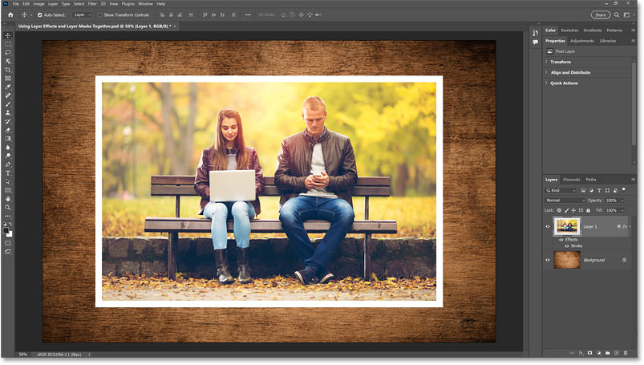
*The stroke around the image is the focus of this tutorial.*

In the Layers panel, we see the stroke listed as an effect below the layer.

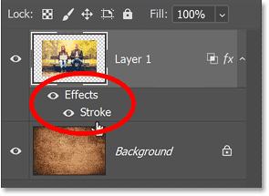
*Effects are listed below the layer.*

### A preview of the final effect

To show you where we're headed, here's the result we'll be working towards. I'm going to divide the main photo in half (into a left side and a right side) using layer masks. Then I'll drag the two sides apart, and I'll finish by adding a drop shadow (another layer effect) behind them.

But as we'll see, we're going to quickly run into problems with how the stroke is interacting with the layer masks. And after that, we'll discover a new problem with how the masks are affecting the drop shadow. But with each problem, I'll show you the easy solution.

*The final result with the layer effects and masks added, but not before solving some problems.*

Let's get started!

## Selecting the left side of the image

Before adding my first layer mask, I need to select the left half of the image. I'll do that by selecting the entire image and then resizing the selection outline.

In the [Layers panel](/basics/layers/layers-panel/), I'll right-click on the layer's thumbnail.

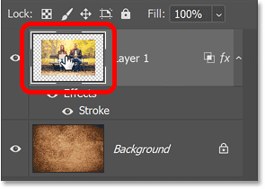
*Right-clicking on the thumbnail.*

Then I'll choose **Select Pixels**.

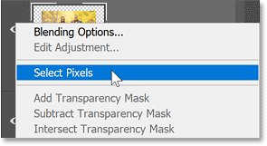
*Choosing Select Pixels.*

This loads a selection outline around the image.

*The main photo is selected.*

[Related tutorial: How to use the Object Selection Tool in Photoshop](/basics/using-the-object-selection-tool-and-object-finder-in-photoshop-2022/)

Then to resize the selection outline, I'll go up to the **Select** menu in the Menu Bar and choose [Transform Selection](/basics/resize-selections-with-transform-selection/).

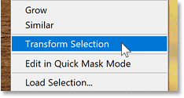
*Choosing Transform Selection from the Select menu.*

In the **Options Bar**, I'll unlink the **Width** and **Height** values so I can unlock the aspect ratio of the outline.

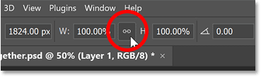
*Unlinking the Width and Height.*

Then I'll drag the right side of the outline inward until it snaps into place in the center of the image.

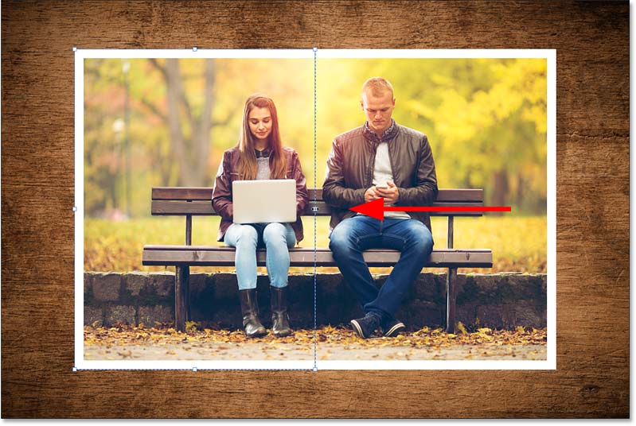
*Resizing the selection outline.*

And I'll click the **checkmark** in the Options Bar to accept it.

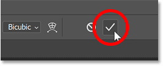
*Closing the Transform Selection command.*

## Adding the first layer mask

Now that the left side is selected, I'll add a [layer mask](/basics/understanding-photoshop-layer-masks/) by clicking the **Add Layer Mask** icon in the Layers panel.

*Adding the first layer mask.*

A layer mask thumbnail appears on the layer.

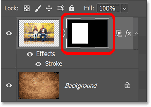
*The layer mask is added.*

### Problem: The layer mask did not hide the layer effect

And the layer mask hides the right side of the image, keeping only the left side visible.

But here's the problem. The layer mask did a great job at hiding the image, but it did not hide the stroke.

Instead, the stroke reshaped itself around the part of the image that's still visible. And now the right side of the stroke is running through what is really the center of the larger image, which is not what I wanted.

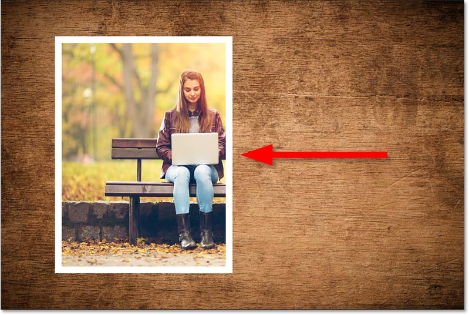
*The layer mask is added.*

## Adding a layer mask to the right side of the image

But the problem is about to get worse when I bring back the right side of the image.

To bring it back, I'll make a copy of the [layer](/basics/understanding-photoshop-layers/), along with its mask, by pressing **Ctrl+J** on a Windows PC or **Command+J** on a Mac.

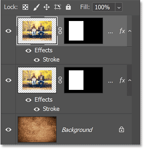
*The copy appears above the original.*

Then I'll select the layer's mask by clicking its **thumbnail**.

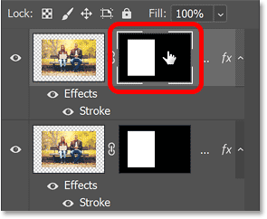
*Selecting the layer mask.*

And in the [Properties panel](/basics/using-the-enhanced-properties-panel-in-photoshop/), I'll click the **Invert** button, which turns the white parts of the mask to black and the black parts to white.

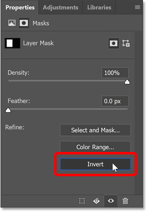
*Inverting the layer mask.*

### Same problem: The layer mask did not hide the effect

The good news is that the right side of the image is back. But the bad news is that I now have not one but *two* strokes cutting through the middle.

It looks like a single stroke that's twice as wide as the others. But it's actually two separate strokes, one for the left side of the image and one for the right.

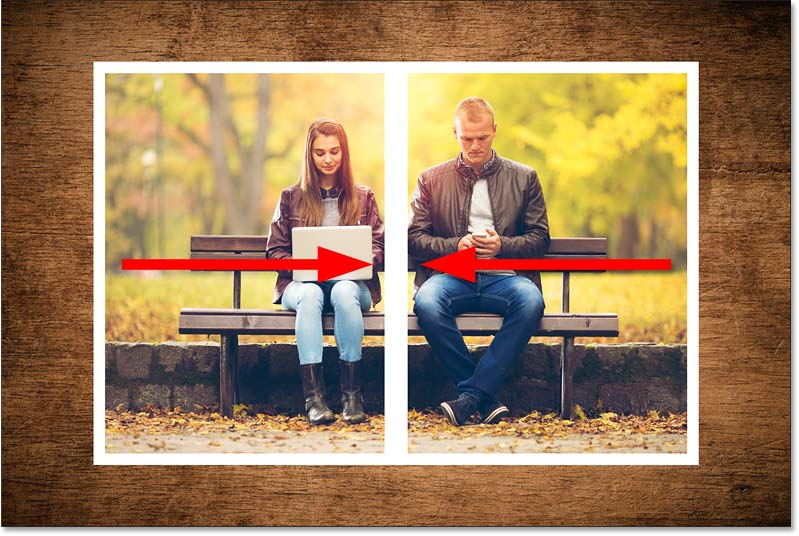
*The problem just got bigger.*

I'll hide the left side for a moment so it's easier to see that the stroke has once again reshaped itself around the part of the image that's still visible. But again, that's not what I wanted.

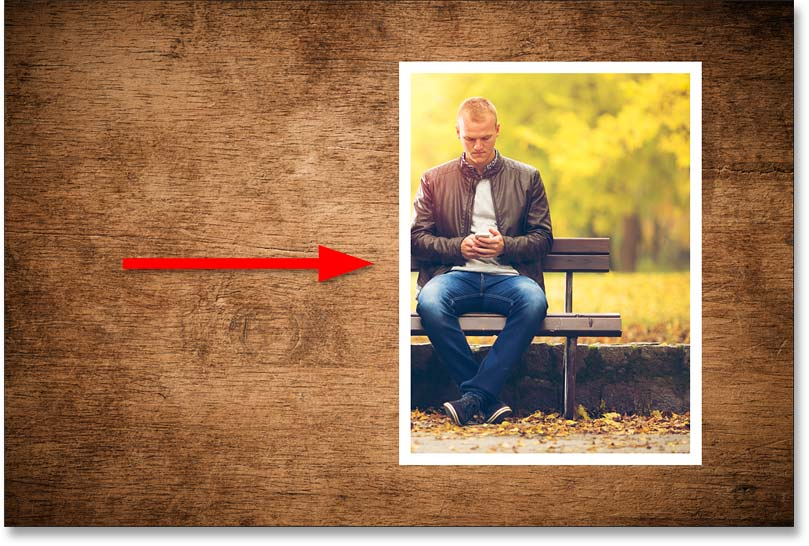
*The stroke now surrounds the right side.*

## How layer effects and layer masks interact in Photoshop

So what's going on here, and how do we fix it? How do I get rid of the two strokes in the middle of the image?

What's happening is that by default, a layer mask hides the layer contents but it does *not* hide any layer effects that are applied to the layer. Instead of hiding the layer effects, Photoshop *reshapes* the effects to fit the content that's not hidden by the mask.

That's why my stroke initially surrounded the entire image. But when I added a mask to hide one side of the image, the stroke simply reshaped itself around the other side.

## How to mask layer effects in Photoshop

Sometimes hiding a layer's contents and just reshaping the layer effects is what you want, which is why it's the default behavior in Photoshop.

But in this case, it's not what I want. I need the two strokes in the middle to disappear. Which means I need a way to tell Photoshop that my layer masks should hide both the contents *and* the layer effects.

And we can do that using an option called **Layer Mask Hides Effects**. Here's where to find it.

### Layer Mask Hides Effects

You can only do this on one layer at a time, so I'll turn off the right side of the image to make things easier to see.

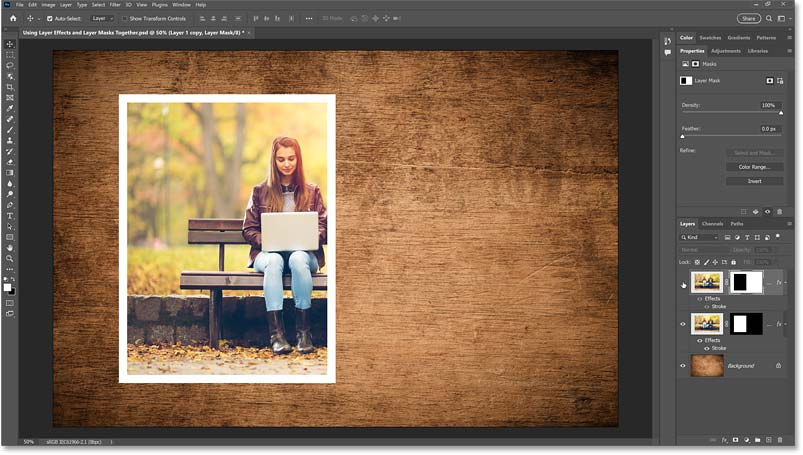
*The right side is turned off.*

Then to make the layer mask hide your layer effects, double-click on the word **Effects** below the layer.

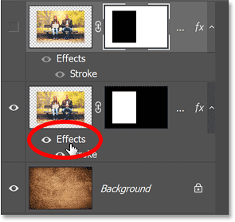
*Double-clicking on the word Effects.*

This opens the Layer Style dialog box set to the Blending Options. In the Advanced Blending section, look for the option that says **Layer Mask Hides Effects** and just turn it on.

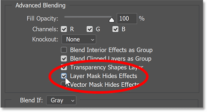
*Turning on Layer Mask Hides Effects.*

The stroke along the right instantly disappears because it is now being hidden by the layer mask.

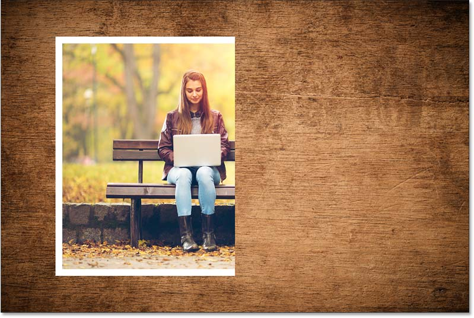
*The unwanted stroke along the left is gone.*

I'll click OK to close the Layer Style dialog box. Then I'll hide the left side of the image and turn on the right side.

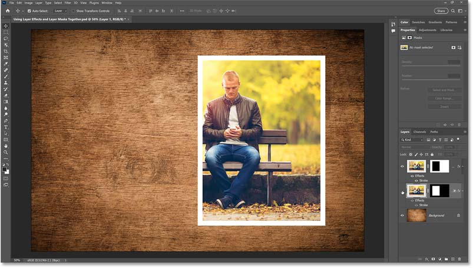
*Switching to the right side of the image.*

I'll do the same thing by double-clicking on the word **Effects** below the layer:

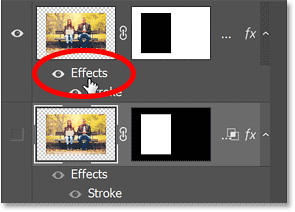
*Double-clicking on the word Effects.*

And turning on **Layer Mask Hides Effects**.

*Selecting Layer Mask Hides Effects.*

The stroke on the left instantly disappears, again because it is now being hidden by the mask.

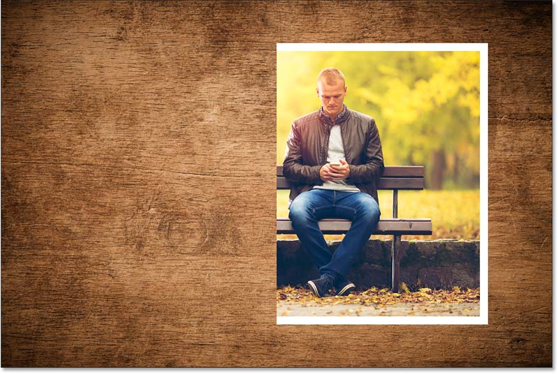
*The unwanted stroke along the left is gone.*

I'll click OK to close the dialog box. Then I'll turn the left side of the image back on.

And problem solved. The two strokes in the middle are now being hidden by the layer masks, and I'm back to what looks like a single image with a border around it.

*The layer masks are now hiding the layer effects.*

## Dragging the two sides of the image apart

Now I can drag the left and right sides of the image apart.

In the toolbar, I'll make sure I have the **Move Tool** selected.

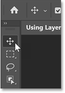
*Selecting the Move Tool.*

And in the **Options Bar**, I'll make sure that **Auto-Select** is turned on so I can select layers just by clicking on them.

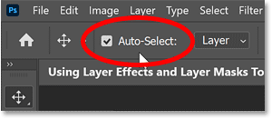
*The Auto-Select option.*

Then I'll click on the left side of the image to select it. I'll hold **Shift** on my keyboard to make it easier to drag horizontally, and I'll drag it over to the left.

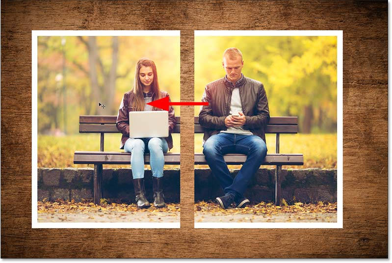
*Dragging the left side of the image.*

I'll do the same thing with the right side, clicking on it to select it, holding **Shift** and dragging it to the right. So far so good.

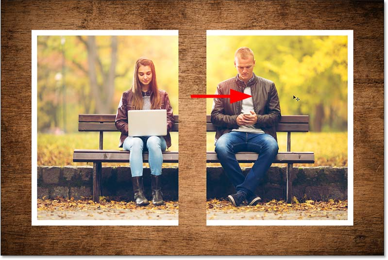
*Dragging the right side of the image.*

## Solving one problem but creating another

The real reason I dragged the two sides apart is so I can show you that by solving the first problem, we've actually created a new problem.

I want to add a drop shadow, which is another of Photoshop's layer effects, behind the two images. Should be easy enough, right?

I'll start with the image on the left by double-clicking on the word **Effects** below the layer to reopen the Layer Style dialog box.

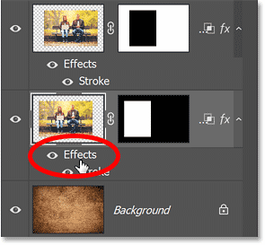
*Opening the Layer Style dialog box.*

And I'll choose **Drop Shadow** in the column on the left.

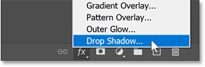
*Turning Drop Shadow on.*

In the Drop Shadow options, I'll set the **Angle** to **135 degrees** and the **Distance** to **160 pixels**, which should make the shadow easy to see. The rest of the settings are at their defaults.

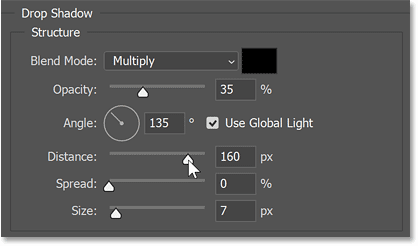
*The Drop Shadow options.*

And yet, where is the shadow? It should be behind the left side of the image, but I don't see it at all.

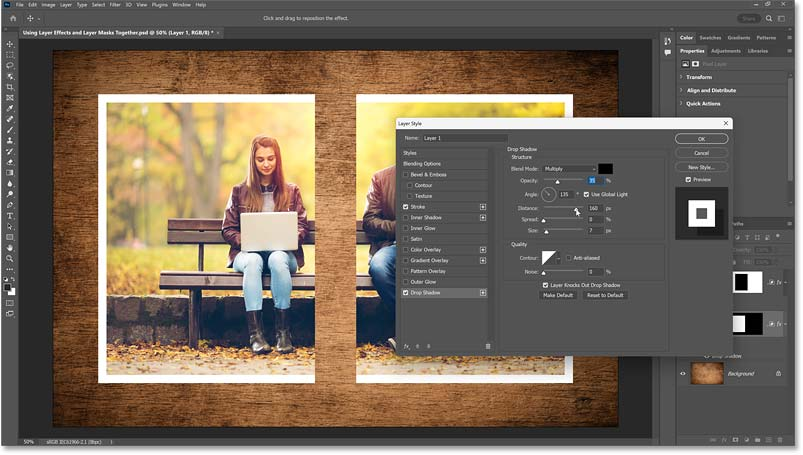
*The drop shadow is not visible.*

Actually, the shadow is there. We just can't see it. And the reason we can't see it is because we turned on Layer Mask Hides Effects. So the shadow, which falls outside the layer mask, is being hidden by the mask.

If I turn off Layer Mask Hides Effects:

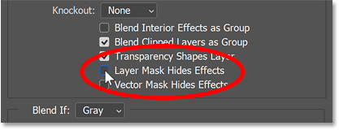
*Turning Layer Mask Hides Effects off.*

The shadow appears. But so does the stroke along the right that we don't want. So... hmm. What do we do?

*Turning Layer Mask Hides Effects off makes the shadow visible but also the stroke.*

## Applying layer effects to a layer group

We want to see the drop shadow but not the stroke. Which means we need the mask to hide one of the layer effects but not the other. Is there a "Layer Mask Hides This Effect But Not That One" option?

Well, no. But we can create something like that ourselves by applying the two effects *separately*.

We'll keep the stroke applied to the layer, with Layer Mask Hides Effects turned on. But we'll place the layer into a [layer group](/basics/layers/layer-groups/) and apply the drop shadow to the group itself!

### Selecting both layers at once

Now because I have two layers where I want to apply the shadow, I need to add both of them to the group.

So with one of the layers already selected in the Layers panel, I'll hold **Shift** on my keyboard and click on the other layer to select them both.

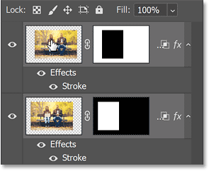
*Selecting both image layers.*

### Adding the layers to a group

Then I'll click the Layers panel **menu icon**:

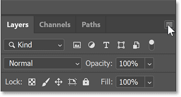
*Clicking the menu icon.*

And choose **New Group from Layers**.

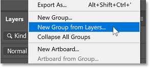
*Choosing New Group from Layers.*

I'll accept the default group name and click OK.

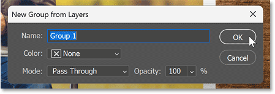
*Creating the new layer group.*

Both layers are now inside the group.

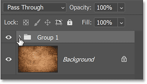
*The group is added.*

### Applying the Drop Shadow to the group

So now I can add the shadow to the group by clicking the **fx** icon at the bottom of the Layers panel and choosing **Drop Shadow**.

*Adding a Drop Shadow.*

I'll again set the **Angle** to **135 degrees** and the **Distance** to **160 pixels**. But I'll also soften the shadow edges by increasing the **Size** to around **40 pixels**. Then I'll click OK to close the Layer Style dialog box.

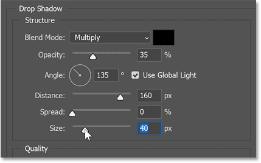
*The Drop Shadow settings for the group.*

And this time, because the Drop Shadow was added to the group, both layers inside the group have the shadow applied. While inside the group, my Strokes are still being hidden by the masks on the individual layers.

*The shadow is now visible while the strokes remain hidden by the layer masks.*

And there we have it! That's how to get layer effects and layer masks to work together in Photoshop.