# Using the Enhanced Properties Panel in Photoshop

> Source: [https://www.photoshopessentials.com/basics/using-the-enhanced-properties-panel-in-photoshop/](https://www.photoshopessentials.com/basics/using-the-enhanced-properties-panel-in-photoshop/)
> Downloaded and converted to Markdown.

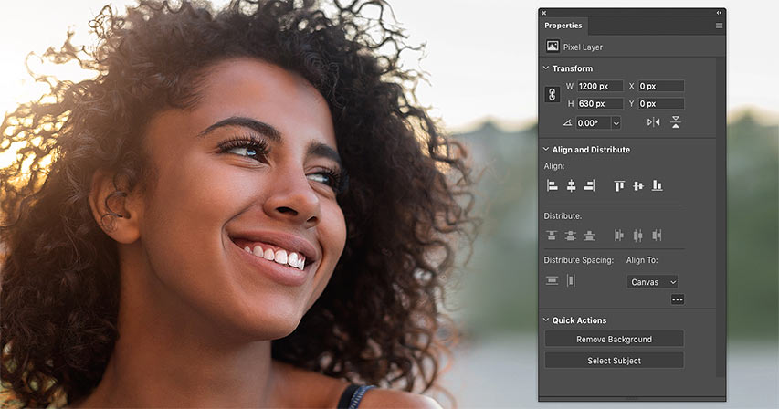

Learn about all the new features added to the enhanced Properties panel in Photoshop CC 2020, and why the Properties panel is quickly becoming a one-stop shop for the options you need the most!

Whenever Adobe releases a new version of Photoshop, the new features get all the attention while improvements to existing features often go unnoticed. But if speed, efficiency and ease-of-use are important to you, then you should definitely keep an eye on Photoshop's **Properties panel**, now greatly improved as of CC 2020.

The Properties panel is where you'll find controls and options for whichever layer is selected in the Layers panel. And the options change depending on the kind of layer you're working with. Up until recently, the options available in the panel have been rather limited. But Photoshop CC 2020 adds so much more to the Properties panel that you may wonder if other interface elements, like the Options Bar, are headed for extinction.

### What's new in the Properties panel

One of the biggest enhancements to the Properties panel in CC 2020 is with **type**. Select a type layer in the Layers panel and all of the options from both the Character and Paragraph panels are now available for quick access in the Properties panel.

And speaking of quick, the **Background layer** and **pixel layers** have also seen big changes, including the addition of new **Quick Actions**. With Quick Actions, you can change the image size, select the Crop Tool, trim or rotate the canvas, and even apply Photoshop's Select Subject and Remove Background commands, all from within the Properties panel itself. Type layers also get their own Quick Actions that let you instantly convert your type into a frame or a shape! Let's see how it works.

To follow along, you'll need Photoshop 2020 or later. You can [get the latest Photoshop version here](https://adobe.prf.hn/click/camref:1100lrdjJ/destination:https%3A%2F%2Fwww.adobe.com%2Fproducts%2Fphotoshop.html).

Let's get started!

## Comparing the Properties panel in CC 2020 vs 2019

To see how much the Properties panel has improved as of Photoshop CC 2020, we'll compare it with the options found in the CC 2019 version of the panel as we look at the three kinds of layers that have received the biggest updates. These are the Background layer, pixel layers and type layers. You can follow along by opening any image. I'll use [this image](https://adobe.prf.hn/click/camref:1100lrdjJ/destination:https%3A%2F%2Fstock.adobe.com%2Fimages%2Foutdoor-portrait-of-smiling-african-american-girl%2F227779676) from Adobe Stock:

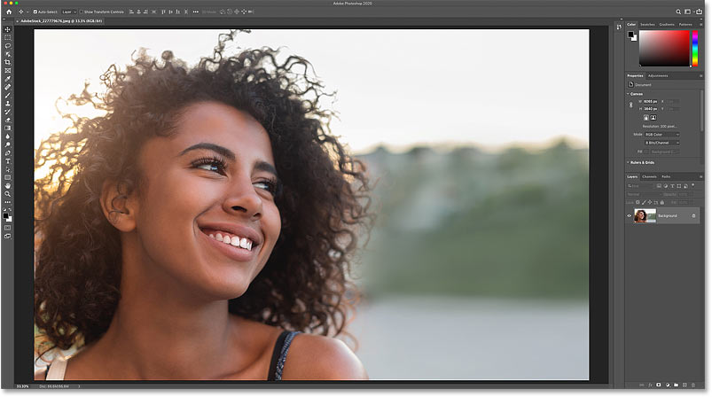
*The original photo. Credit: Adobe Stock.*

[Related: How to open images into Photoshop](/basics/opening-images-photoshop/)

## Where to find the Properties panel

The Properties panel is part of [Photoshop's default workspace](/basics/photoshop-workspaces/) known as **Essentials**. So if you're still using the default layout, then the Properties panel should be available on your screen.

If it's not, then you can open the Properties panel by going up to the **Window** menu in the Menu Bar and choosing **Properties**. But a checkmark beside its name means that the panel is already open, and choosing it from the menu while it's open will close the panel:

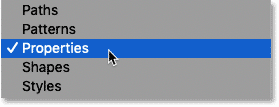
*Going to Window > Properties.*

## Background layer options in the Properties panel

Let's start by looking at the options available in the Properties panel whenever the Background layer in the [Layers panel](/basics/layers/layers-panel/) is selected.

The [Background layer](/basics/background-layer-photoshop-cc/) serves as the background for your document. When we open an image into Photoshop, the image becomes the background, which is why it appears on the Background layer. So you might expect that with the Background layer selected, the Properties panel would show options related to the document itself:

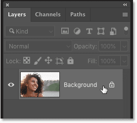
*Selecting the Background layer.*

### The Document Properties in CC 2019

But as recently as Photoshop CC 2019, the Properties panel showed no options at all for the Background layer. All it showed were a few details about the document, like its current [width, height and resolution](/basics/how-to-resize-images-in-photoshop-complete-guide/). And none of this information could be changed, at least not from the Properties panel itself:

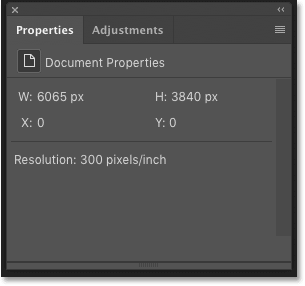
*The Document Properties in CC 2019.*

### The Document Properties in CC 2020

Fast forward to Photoshop CC 2020 and suddenly the Properties panel becomes incredibly useful. In fact, with the Background layer selected, there are now *so* many things we can do with the document directly from the Properties panel that Adobe divided the options into groups.

There's a **Canvas** group, a group for **Rulers & Grids**, and one for **Guides**. There's also a new feature called **Quick Actions**. You can twirl any of the groups open or closed by clicking the arrow to the left of its name.

I've split the Properties panel into two columns here so we can see all of the options at once. And one important note is that none of these options are exclusive to the Properties panel. At least, not for the kinds of [layers](/basics/understanding-photoshop-layers/) we'll be looking at in this tutorial. Every option is also available elsewhere in Photoshop. The benefit with the Properties panel is that it combines the most useful options from [various other panels](/basics/getting-know-photoshop-interface/) and dialog boxes into a single, convenient and time-saving location:

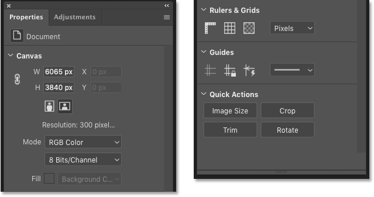
*The Document Properties in CC 2020.*

#### Canvas
- Use the options in the Canvas group to change the **width** or **height** of the document.
- Click the Portrait or Landscape button to change the document's **orientation**, but be aware that this will result in some of your image being clipped.
- You can also change the document's **color mode** and **bit depth** if needed.
- And if your background is a solid color rather than an image, you can change the **fill color** from here.

#### Rulers & Grids
- This group include buttons to show and hide the **rulers** and the **grid**, plus a button that opens [Photoshop's Preferences](/basics/essential-photoshop-preferences-beginners/) to the **Transparency & Gamut** settings.
- You can also change the **unit of measurement** (pixels, inches, percent, and so on) for the rulers.

#### Guides
- Click the buttons to **view** the guides, **lock** the guides or turn on **Smart Guides**.
- Or change the guide **style** from solid to dashed lines.

#### Quick Actions
- Quick Actions are a new feature added to the Properties panel in Photoshop CC 2020.
- With the Background layer selected, the Quick Actions group offers buttons to open the [Image Size](/basics/photoshops-image-size-command-features-and-tips/) dialog box, select the [Crop Tool](/basics/cropping-images-in-photoshop-complete-lesson-guide/), open the **Trim** dialog box, or [rotate the canvas](/basics/photoshop-rotate-view-tool/).
- As we'll see in a moment, the Quick Actions change when other kinds of layers are selected.

## Pixel layer options in the Properties panel

Next, let's look at the options for standard [pixel layers](/basics/understanding-photoshop-layers/) now available in the Properties panel as of Photoshop CC 2020.

### Converting the Background layer to a pixel layer

In the Layers panel, I'll convert my Background layer into a normal layer by clicking the **lock icon**:

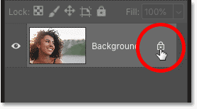
*Unlocking the Background layer.*

Photoshop renames the layer to "Layer 0", the lock icon disappears, and we now have a standard pixel layer:

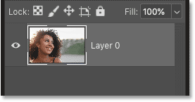
*The Background layer is now a normal layer.*

### The Pixel Layer Properties in CC 2019

Back in Photoshop CC 2019, the Properties panel was slightly more useful for pixel layers than it was for the Background layer. Instead of showing only static information about the layer, it gave us options for changing the width or height of the layer's contents and for repositioning the contents by changing the x and y locations:

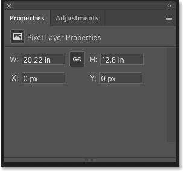
*The Pixel Layer Properties in CC 2019.*

### The Pixel Layer Properties in CC 2020

Let's fast forward to Photoshop CC 2020 where once again we see big improvements. And again, there are now *so* many options in the Properties panel for working with pixel layers that Adobe divided them into groups. We have a **Transform** group, an **Align and Distribute** group, and a **Quick Actions** group just like the one we saw when the Background layer was selected:

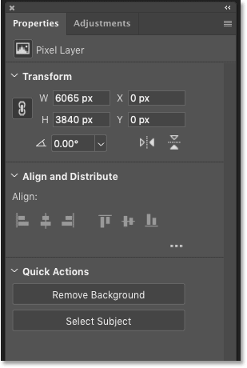
*The Pixel Layer Properties in CC 2020.*

### Expanding the Align and Distribute group

In fact, there are even more options available for pixel layers than what we see initially. In the Align and Distribute group, only the basic **Align** options are shown by default. But if you click the **ellipsis** icon (the 3 dots):

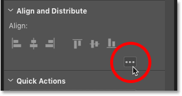
*Clicking the ellipsis to expand the group.*

You'll expand the group to show the **Distribute** options as well:

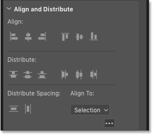
*The expanded Align and Distribute group.*

#### Transform
- The Transform group includes the same options for changing the **width**, **height** and **position** of the layer's contents that we saw in CC 2019.
- And new as of CC 2020, it also includes an option to **rotate** the layer's contents as well as buttons to **flip** the layer horizontally or vertically.

#### Align and Distribute
- Use the **Align** options to align two or more layers horizontally or vertically. At least 2 layers need to be selected in the Layers panel for the Align options to be available.
- Or if you click the ellipsis to expand the group, and then change the **Align To** option from Selection to **Canvas**, you can align a single layer to the canvas itself, either horizontally or vertically.
- Use the **Distribute** and **Distribute Spacing** options (available when 3 or more layers are selected) to create equal spacing between the contents of each layer.

#### Quick Actions
- Just like we saw with the Background layer, a new Quick Actions feature is now available in the Properties panel when a pixel layer is selected in the Layers panel. But the options are different for pixel layers than they are for Background layers.
- Click the [Select Subject](/basics/select-subject-select-and-mask-photoshop-cc-2018/) button to have Photoshop automatically detect and select the main subject in your photo.
- Or click the [Remove Background](/basics/select-subject-vs-remove-background-in-photoshop/) button to both select your subject and remove the background at the same time.

## Type layer options in the Properties panel

So far, we've seen that the Properties panel in Photoshop CC 2020 now includes more options than ever before when the Background layer or a pixel layer is selected in the Layers panel. But the biggest improvement is with type layers.

Go ahead and add some text to your document using the Type Tool. Any text will work. And then in the Layers panel, click on the type layer to select it:

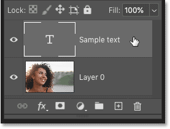
*Selecting the type layer.*

### The Type Layer Properties in CC 2019

Back in Photoshop CC 2019, the Properties panel included basic type options like choosing a font, changing the type size or color, adjusting the leading or tracking, and setting the alignment. But for more advanced options, we needed to click the **Advanced** button:

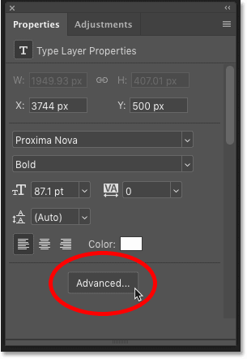
*Clicking the Advanced button in the Properties panel in CC 2019.*

#### The Character and Paragraph panels

The Advanced button opened Photoshop's **Character** and **Paragraph** panels which are separate from the Properties panel. The Character panel added more options like kerning, baseline shift, and horizontal and vertical scaling, plus common type options like Faux Bold, Faux Italic and All Caps:

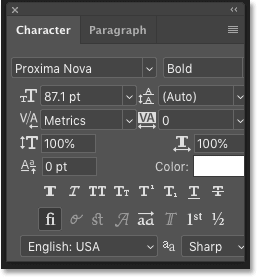
*The Character panel.*

And the Paragraph panel added Justification and Indentation options, as well as options to adjust the spacing between paragraphs:

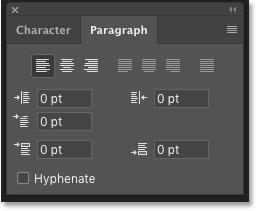
*The Paragraph panel.*

### The Type Layer Properties in CC 2020

But in Photoshop CC 2020, every option in both the Character and Paragraph panels (which are still available) has been copied over to the Properties panel. And the panel has once again been divided into groups. For type layers, we have a **Transform** group, a **Character** group, a **Paragraph** group, a **Type Options** group, and a **Quick Actions** group.

I've split the Properties panel into two columns so we can see all of the options at once. If some of these options are missing from your Properties panel, click the **ellipsis icon** in the Character, Paragraph and Type Options groups to expand them:

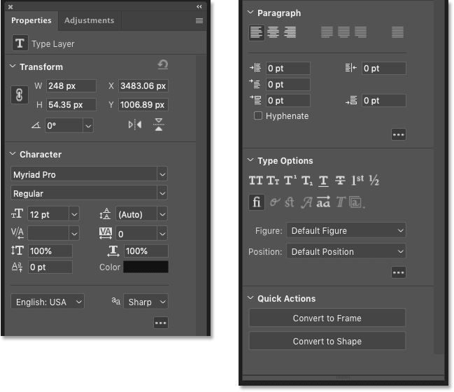
*The expanded Type Layer Properties in CC 2020.*

#### Transform
- Use the Transform group to change the **width** and **height** of your text, although scaling it with [Free Transform](/basics/transform-and-warp-images-with-free-transform-in-photoshop-cc-2019/) may be easier. Or **reposition** the text by changing the x and y values.
- New in Photoshop CC 2020, you can now **rotate** the text clockwise or counterclockwise, or **flip** the text horizontally or vertically, directly from the Properties panel.

#### Character
- In its default state, the Character group lets you **choose a font**, set your type **size** and **color**, and adjust the **kerning** (the space between two characters), the **tracking** (the spacing of a range of characters) and **leading** (line spacing).
- Click the ellipsis to expand the Character group to include options for **scaling** the letters vertically or horizontally, adjusting the **baseline shift**, changing the **language** of your text (for spell checking and hyphenation) and changing the **anti-aliasing** method.

#### Paragraph
- The Paragraph group initially shows options for setting the text **alignment** and **justification**.
- Clicking the ellipsis expands the group to include **indentation** (left margin, right margin or first line) and **paragraph spacing** options. You can also enable automatic **hyphenation** from here.

#### Type Options
- The Type Options group lets you choose common **type styles** like All Caps, Small Caps, Superscript and Subscript. But note that Faux Bold and Faux Italic are not included here. Both can still be accessed from the Character panel if needed.
- Click the ellipsis to change the **Figure** or **Position** style for OpenType fonts.

#### Quick Actions
- And finally in the Quick Actions group, click the **Convert to Frame** button to convert your text into a photo frame (although there's a better way to [place an image in text](/photoshop-text/text-effects/image-in-text-photoshop-cs6/)).
- Or click the **Convert to Shape** button to convert your type into a [vector shape](/basics/drawing-custom-shapes-with-the-shapes-panel-in-photoshop-cc-2020/).

## Summary

Photoshop's Properties panel grows more useful with each new release, and CC 2020 brings the biggest improvement to date. Select the Background layer, a pixel layer or a type layer in the Layers panel and the Properties panel now becomes a convenient one-stop shop for the options you need the most. And it remains as useful as ever when working with shapes, [adjustment layers](/photo-editing/adjustment-layers/), [layer masks](/basics/understanding-photoshop-layer-masks/), and [smart objects](/basics/how-to-create-smart-objects-in-photoshop/)! The next time a new version of Photoshop is released, don't forget to check out the Properties panel. You never know what options Adobe will add next!

And there we have it! To learn more about Photoshop's interface, see my [Getting Around in Photoshop](/basics/learning-the-photoshop-interface/) lesson guide. Or visit my [Photoshop Basics](/basics/) section for more tutorials for beginners. And don't forget, all of my tutorials are now available for [download as PDFs](/print-ready-pdfs/)!