# Using the Object Selection Tool in Photoshop 2022

> Source: [https://www.photoshopessentials.com/basics/using-the-object-selection-tool-and-object-finder-in-photoshop-2022/](https://www.photoshopessentials.com/basics/using-the-object-selection-tool-and-object-finder-in-photoshop-2022/)
> Downloaded and converted to Markdown.

Learn how to quickly select people or objects in your image using the improved Object Selection Tool in Photoshop 2022, and how its new Object Finder can select objects automatically!

In this tutorial, I show you how to use the improved Object Selection Tool in Photoshop 2022, along with its brand new feature called Object Finder, to quickly select objects in your image just by hovering your mouse cursor over them!

First introduced back in Photoshop 2020, the Object Selection Tool made it easy to select an object simply by drawing a rough selection outline around it. But thanks to a new option in Photoshop 2022 called Object Finder, the Object Selection Tool can now automatically find objects in your image all on its own. You can then highlight an object by hovering your mouse cursor over it, and click on the object to instantly select it. Let's see how it works!

Let's get started!

## Which version of Photoshop do I need?

To follow along, you'll need Photoshop 2022 or newer. [Get the latest Photoshop version here](https://adobe.prf.hn/click/camref:1100lrdjJ/destination:https%3A%2F%2Fwww.adobe.com%2Fproducts%2Fphotoshop.html).

## The document setup

For this tutorial, I'll use [this image](https://adobe.prf.hn/click/camref:1100lrdjJ/destination:https%3A%2F%2Fstock.adobe.com%2Fimages%2Fmultiethnic-group-of-university-students-against-college-wall%2F321817209) from Adobe Stock:

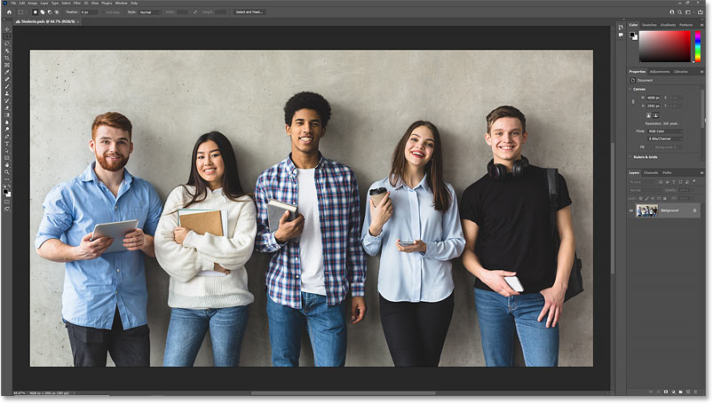
*The original image.*

## Where do I find the Object Selection Tool?

Just like in previous versions, the Object Selection Tool in Photoshop 2022 is found in the [toolbar](/basics/photoshop-tools-toolbar-overview/), nested in with the [Quick Selection Tool](/basics/selections/quick-selection-tool/) and the [Magic Wand Tool](/basics/selections/magic-wand-tool/):

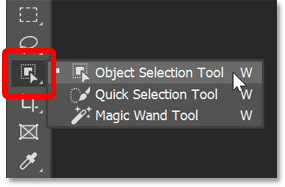
*Selecting the Object Selection Tool from the toolbar.*

## How the Object Selection Tool worked previously

To see how much easier it is to select objects with the Object Selection Tool in Photoshop 2022, let's quickly look at how we used the tool in previous versions. The reason is that we can still use it like this today and there are times when we still need to.

### The Tool Mode

In previous versions, after choosing the Object Selection Tool, we would first go up to the **Options Bar** and set the tool's Mode to either **Rectangle** or **Lasso**. The choice would depend on whether we wanted to draw a rectangular selection outline or a freeform selection outline around the object.

I'll choose Rectangle which is the default setting:

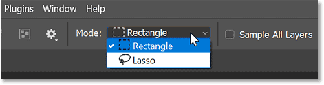
*The Mode option in the Options Bar.*

### Selecting an object in the image

Then to select an object, or in this case a person, we would simply drag out a selection outline around them.

Here I'm dragging a rectangular selection outline around the man in the center of the group:

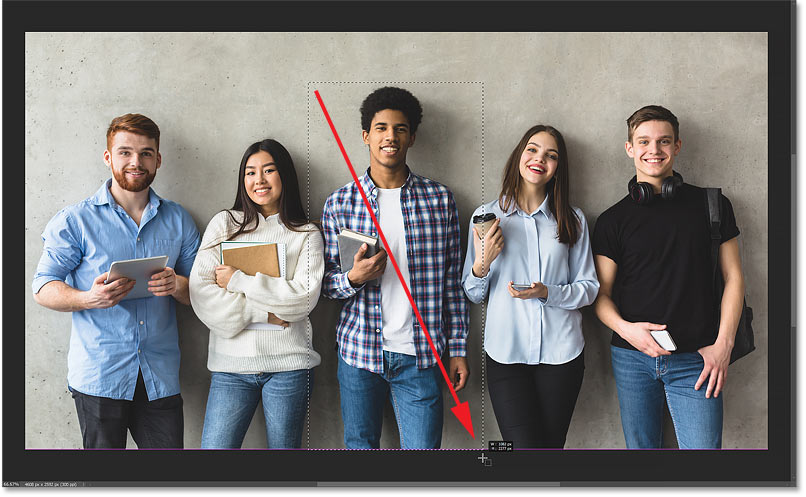
*Dragging a selection around the man in the center.*

When you released your mouse button, Photoshop would analyze the image inside the selected area and then redraw the selection around the object it found:

*Photoshop detected and selected him.*

### Adding more objects to the same selection

To add more objects to the same selection, we would press and hold the **Shift** key on the keyboard and drag a selection outline around the object or person we wanted to add.

Here I'm holding **Shift** and dragging around the man on the left:

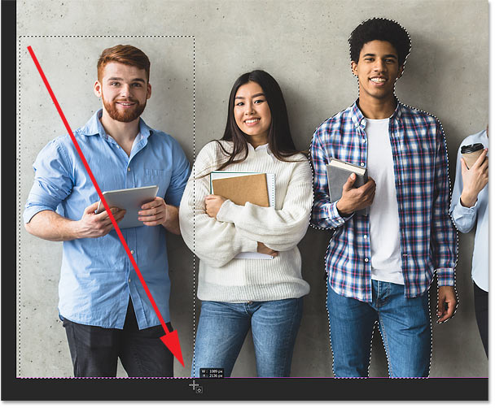
*Holding Shift to add a second person to the same selection.*

And when I release my mouse button, he's added to the same selection with the man in the center:

*Both people are now selected.*

### Subtracting objects from the selection

To subtract an object from the selection, we would press and hold the **Alt** key, or the **Option** key on a Mac, and drag around the object or person we wanted to remove.

I'll drag around the same man on the left, this time while holding Alt (Win) / Option (Mac):

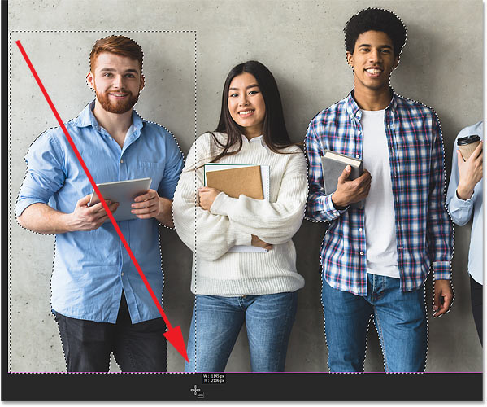
*Holding Alt (Win) / Option (Mac) while dragging to subtract an object.*

And when I release my mouse button, he is no longer part of the selection, while the man in the center remains selected:

*The selection outline no longer appears around the man on the left.*

### Adding areas that the Object Selection Tool missed

You could keep adding objects to the selection by holding **Shift** and dragging a selection outline around them.

Here I've already added the woman on the left, and I'm now drawing a selection outline to add the man on the far right:

*Holding Shift and dragging around other people to add them to the selection.*

But notice when I release my mouse button that while the Object Selection Tool did select the man himself, it did not include the bag hanging from his side:

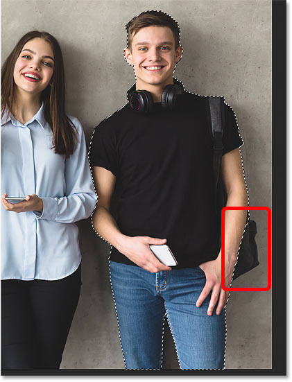
*Part of the object was missed.*

To fix that, I'll hold **Shift** to add to the existing selection and I'll drag around the missing part of the bag:

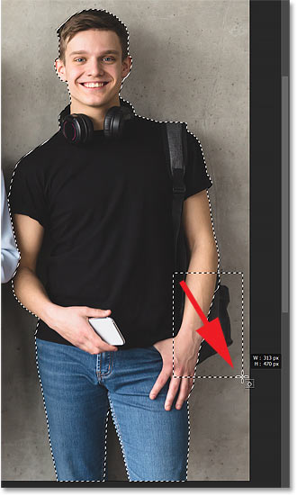
*Holding Shift and dragging to add the missing area.*

I'll release my mouse button, and the missing part is added:

*The missing area has been added to the selection.*

### Subtracting unwanted parts of an object

Or if I wanted to remove the bag from the selection, I could hold **Alt** (Win) / **Option** (Mac) and drag around it.

But depending on the shape of the object you want to add or subtract, it might be easier to draw a freeform selection around it rather than a rectangle. So in the Options Bar, I'll change the **Mode** from Rectangle to **Lasso**:

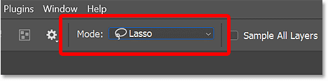
*Changing the tool mode to Lasso in the Options Bar.*

Then I'll hold **Alt** (Win) / **Option** (Mac) and I'll drag around the bag with the Lasso Tool to remove it:

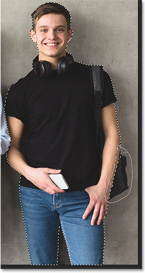
*Dragging a freeform selection around the bag.*

And now the bag is deselected:

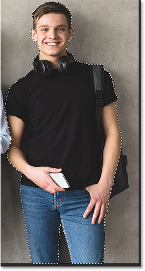
*The bag has been subtracted from the selection.*

## How to use the Object Selection Tool in Photoshop 2022

So that's how the Object Selection Tool worked in previous versions of Photoshop. And obviously, since I'm using Photoshop 2022 here, you can still use it like that today. In fact, there are times when you'll need to, as we'll see in a moment.

But there is also a much faster way to work with the Object Selection Tool in 2022 thanks to a brand new feature called **Object Finder**. Rather than needing to drag around objects, this new feature lets Photoshop find objects across the entire image all on its own.

### Clearing the existing selection

I'll remove my current selection outline by going up to the **Select** menu in the Menu Bar and choosing **Deselect**:

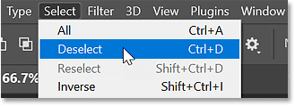
*Going to Select > Deselect.*

[See also: Better 1-click selections with Select Subject in Photoshop 2022](/basics/select-subjects-powerful-new-cloud-option-in-photoshop-2022/)

### The new Object Finder option

In Photoshop 2022, with the Object Selection Tool active, there's a new option in the Options Bar called **Object Finder** which is turned on by default. Object Finder allows Photoshop to analyze the entire image looking for objects that can be selected:

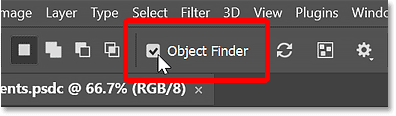
*The new Object Finder option.*

### The Refresh icon

You may notice immediately after choosing the Object Selection Tool that the **Refresh** icon (the rotating arrows icon) next to the Object Finder option is spinning. This means that Photoshop is analyzing the image looking for objects, and you'll want to wait until it stops spinning to let Photoshop finish what it's doing.

The Object Finder will refresh and re-analyze the image automatically anytime you make an edit or a change. But you can also refresh it manually at any time by clicking the Refresh icon:

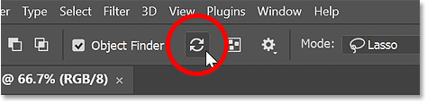
*The Refresh icon in the Options Bar.*

### The Object Finder Mode

If you don't want the Object Finder to refresh automatically, then click the **gear icon** in the Options Bar and change the **Object Finder Mode** from **Auto Refresh** to **Manual Refresh**. With Manual selected, the Object Finder will only refresh when you click the Refresh icon yourself. But in most cases, Auto Refresh works best:

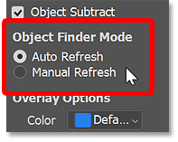
*Choose Auto or Manual Refresh.*

### Show All Objects

To see the objects that Photoshop found, click the new **Show All Objects** icon in the Options Bar:

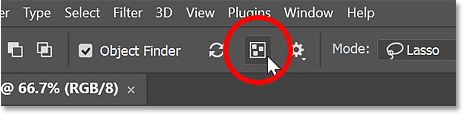
*The Show All Objects icon.*

And the objects appear highlighted with a blue overlay. So with my image, Photoshop was able to detect all five people as objects that can be selected.

You can toggle Show All Objects on and off either by clicking its icon in the Options Bar or by using the letter **N** on your keyboard. Press and hold N to turn Show All Objects on, and then release N to turn it off. If releasing N doesn't work, just press it again:

*The objects detected appear highlighted in blue.*

### The Overlay options

If you find the blue overlay color hard to see, click the **gear icon** in the Options Bar:

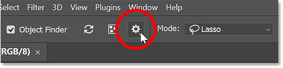
*Clicking the gear icon.*

Then in the **Overlay Options** section of the menu, choose a different color. You can also increase or decrease the opacity of the overlay from the default of 65 percent:

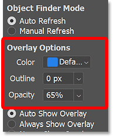
*The options for the object overlay.*

And if you would rather see the overlay as an outline *around* objects instead of in front of them, enter a size value, in pixels, into the **Outline** box.

For example, I'll set the Outline to 2 pixels:

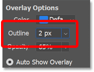
*Increasing the Outline size to 2 pixels.*

And now if I turn **Show All Objects** back on, the objects are highlighted with an outline or border around them:

*The object overlay now appears as an outline.*

But I prefer the standard overlay, so I'll click again on the **gear icon** to reopen the Overlay Options, and I'll set the **Outline** back to **0 pixels**:

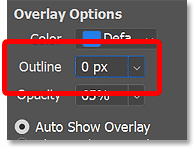
*Resetting the Outline back to 0.*

### How to select one of the objects

So at the moment, with Show All Objects turned on, we're seeing a preview of all the objects in the image that the Object Finder detected. But nothing is actually selected yet. To select one of the objects, first turn **Show All Objects** off, either by clicking its icon in the Options Bar or by pressing **N** on your keyboard.

Then hover your mouse cursor over the object or person you want to select, and the overlay will appear over just that one object.

Here I'm hovering over the man on the left:

*Hover over an object to highlight it.*

To select the highlighted object, simply click on it. I'll click on the man on the left. And Photoshop instantly draws a selection outline around him:

*Click on the highlighted object to select it.*

You can then move your mouse cursor away from the object to hide the overlay and view just the selection outline itself:

*Move your cursor away from the object to hide the overlay.*

### How to add more objects to the selection

To add a second object or person to the same selection, hover your mouse cursor over them to show the overlay. Then press and hold **Shift** on your keyboard and click.

Here I've added the woman to the selection, and I now have two people selected:

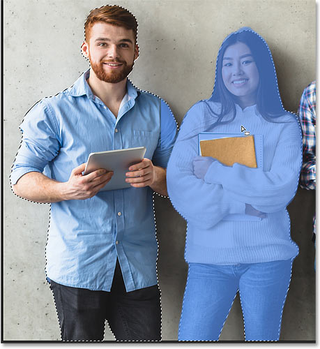
*Holding Shift and clicking to select a second person.*

You can continue adding more objects to the selection by hovering over them, holding Shift, and clicking.

Here I've added the woman on the right:

*Shift-clicking on more people to add them to the selection.*

### How to subtract an object from the selection

To remove an object or person from the selection, hover over them, hold **Alt** (Win) / **Option** (Mac) on your keyboard, and click.

Here I've deselected the man on the left by Alt+clicking (Win) / Option+clicking (Mac) on him, while the two women remain selected:

*Holding Alt (Win) / Option (Mac) and clicking to subtract a person from the selection.*

### How to start over with a new selection

To clear an existing selection outline completely and start over with a new selection, simply click on a new object to select it without holding Shift.

Here I've clicked on the man in the center without holding the Shift key, which deselects everyone else and leaves only him selected:

*Click to select a new object and deselect all previously-selected objects.*

## How to fix the Object Finder's mistakes

As we've seen, the new Object Finder feature for the Object Selection Tool in Photoshop 2022 makes it easier than ever to select objects in an image. We just hover over an object to highlight it and then click to select it. We can add more objects to the selection by Shift-clicking on them, and remove objects by holding Alt (Win) / Option (Mac) and clicking.

But earlier, we covered how the Object Selection Tool used to work in previous Photoshop versions, where we needed to drag around objects to select or deselect them. And while the Object Finder in 2022 works great much of the time, it won't get things right every time.

When the Object Finder makes a mistake, we still need to use the old methods of Shift+dragging to add a missing area to the selection, or Alt (Win) / Option (Mac)+dragging to subtract an area from the selection.

### Inspecting the selection outline for problems

For example, notice that even though the Object Finder did a decent job overall at detecting the man in the center when I clicked on him, it missed part of the book he's holding in his hand.

If I try adding that missing part to the selection by hovering over it and Shift-clicking, it doesn't work because the Object Finder did not recognize it as an object. So this means I'll need to add it manually:

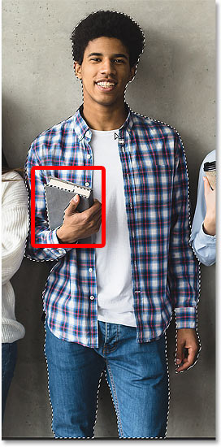
*The Object Finder missed part of an object.*

### How to manually add to the selection

To add a missing area, first go up to the Options Bar and set the Object Selection Tool's **Mode** to either **Rectangle** or **Lasso**. I'll change it back to Rectangle:

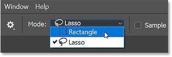
*Setting the tool mode back to Rectangle.*

Then press and hold **Shift** on your keyboard to add to the existing selection and drag a selection outline around the missing area:

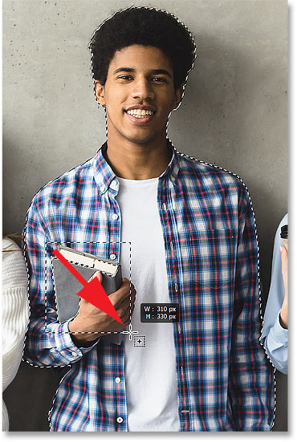
*Holding Shift and dragging around the book.*

Release your mouse button, and the missing area is added:

*The book has been added to the selection.*

### How to manually subtract from of the selection

I'll add a couple more people back to the selection by Shift-clicking on them:

*Shift-clicking to add more people to the selection.*

But now watch what happens if I try to subtract the man in the center from the selection by holding **Alt** (Win) / **Option** (Mac) and clicking on him:

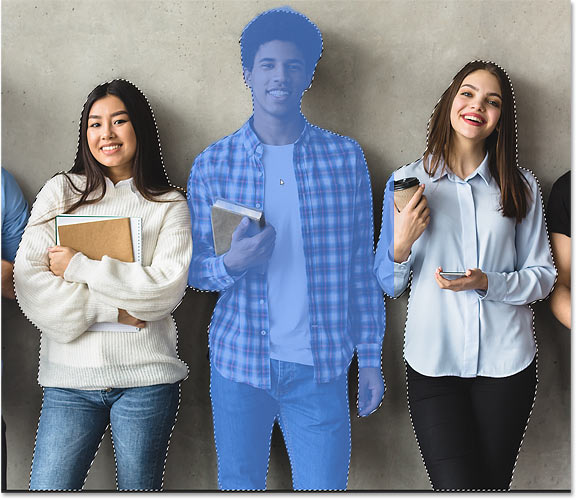
*Alt (Win) / Option (Mac)-clicking on the man to subtract him.*

Photoshop again missed that same part of the book he's holding, this time failing to remove it from the selection:

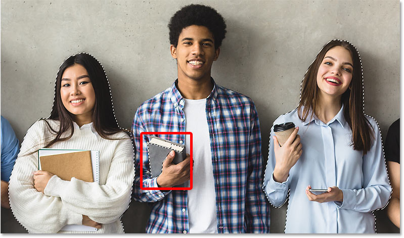
*The same part of the book was missed when subtracting from the selection.*

To remove it manually, I'll hold **Alt** (Win) / **Option** (Mac) on my keyboard as I drag around it:

*Holding Alt (Win) / Option (Mac) and dragging around the book.*

And when I release my mouse button, the remaining selection is removed:

*The book has been subtracted from the selection.*

### Object Subtract

Let's look at one more important option for the Object Selection Tool called **Object Subtract**.

I'll quickly deselect everything in my image by clicking anywhere outside the selection:

*Clicking on the background to clear all objects from the selection.*

Then I'll select the woman on the left by hovering my cursor over her and clicking:

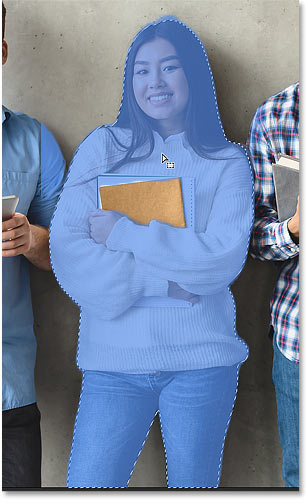
*Clicking to select the woman on the left.*

And notice that Photoshop included the notebooks she's holding as part of the selection:

*Photoshop selected everything, including the notebooks.*

But let's say I don't want the notebooks to be included and I need to subtract them from the selection.

If you click the **gear icon** in the Options Bar once again, you'll find an option at the top called **Object Subtract**, which is turned on by default:

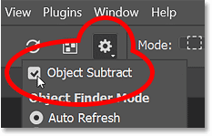
*The Object Subtract option.*

Object Subtract is what allows Photoshop to automatically detect objects that we want to subtract from the selection when we hold Alt (Win) / Option (Mac) and drag around them. It's basically the opposite of how the Object Selection Tool normally works. Instead of finding objects to add within the selected area, it looks for objects to remove.

### Subtracting objects with Object Subtract turned on

I want to remove the notebooks from the selection. So with Object Subtract turned on, I'll start by holding **Alt** (Win) / **Option** (Mac) and dragging around the top of the notebooks above her arm:

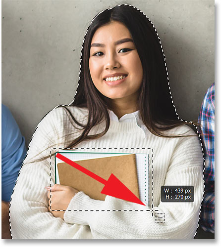
*Holding Alt (Win) / Option (Mac) and dragging around the top of the notebooks.*

I'll release my mouse button, and Photoshop auto-detects and subtracts the top of the notebooks as expected:

*The top of the notebooks have been subtracted.*

Then I'll do the same thing with the remaining part of the notebook below her arm, holding **Alt** (Win) / **Option** (Mac) and dragging around it:

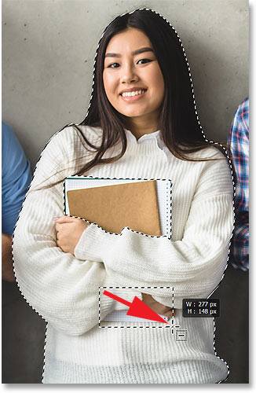
*Holding Alt (Win) / Option (Mac) and dragging around the bottom of the notebooks.*

And again, when I release my mouse button, Photoshop auto-detects and subtracts that part of the notebook from the selection:

*The bottom of the notebook has been subtracted.*

### Subtracting objects with Object Subtract turned off

But that's because Object Subtract was turned on. I'll press **Ctrl+Z** (Win) / **Command+Z** (Mac) a couple of times to undo those steps and add the notebooks back to the selection.

And now watch what happens if I go back to the gear icon and turn Object Subtract off:

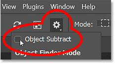
*Turning Object Subtract off.*

I'll again hold **Alt** (Win) / **Option** (Mac) and drag around the top of the notebooks above her arm. Then I'll drag around the remaining part below her arm.

But this time, with Object Subtract turned off, Photoshop did not try to detect any objects within the selected areas. Instead, it just subtracted everything within the rectangular selections:

*The result with Object Subtract turned off.*

### When to turn Object Subtract off

So why would you ever want to turn Object Subtract off? Well, for the most part, you'll want to leave it on. But for times when Photoshop is having trouble detecting the area you're trying to remove, click the gear icon and turn Object Subtract off. Then set the tool Mode to Lasso, hold Alt (Win) / Option (Mac) on your keyboard, and manually draw a precise selection around the area to remove it.

### Tip: How to switch to the Polygonal Lasso Tool

Of course, drawing a precise selection with the Lasso Tool can be a challenge. So here's how to switch from the [Lasso Tool](/basics/selections/lasso-tool/) to the much easier Polygonal Lasso Tool.

#### Start with the Lasso Tool

First, since we want to subtract the area from the selection, press and hold **Alt** (Win) / **Option** (Mac) on your keyboard and **click with the Lasso Tool** to set a starting point:

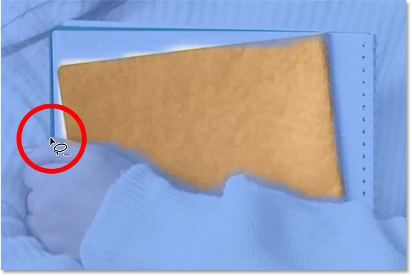
*Holding Alt (Win) / Option (Mac) and clicking to start the selection with the Lasso Tool.*

#### Switch to the Polygonal Lasso Tool

Then to switch to the Polygonal Lasso Tool, **keep your mouse button held down** but **release the Alt (Win) / Option (Mac) key**.

With your mouse button still down, **press and hold Alt (Win) / Option (Mac) again**, and **release your mouse button**.

It's a bit confusing, but if you did it right, the Lasso Tool icon will switch to the Polygonal Lasso Tool icon:

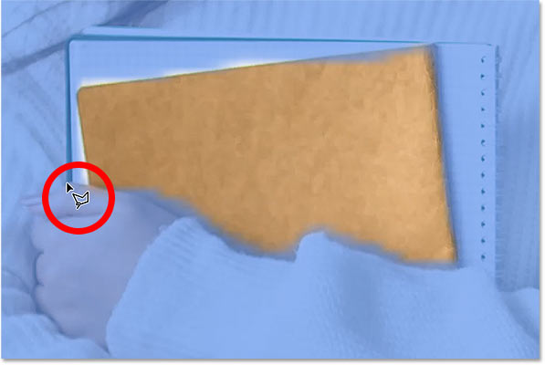
*Switching from the Lasso Tool to the Polygonal Lasso Tool.*

#### Click around the object to select it

Then with the [Polygonal Lasso Tool](/basics/selections/polygonal-lasso-tool/) active, keep the **Alt** (Win) / **Option** (Mac) key held down and simply click around the area you want to subtract. You'll draw the selection as a series of short, straight lines.

Here I've made my way around the bottom, right and top of the notebooks just by clicking along the edges:

*Clicking with the Polygonal Lasso Tool along the edges of the object.*

Once you've made your way back to the starting point, release the Alt (Win) / Option (Mac) key to complete the selection:

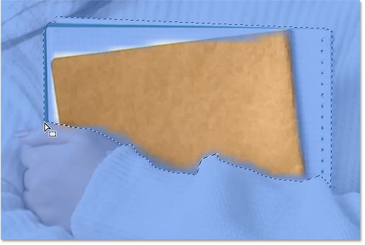
*Releasing the Alt (Win) / Option (Mac) key to complete the selection.*

I'll do the same thing with the bottom part of the notebooks, using the Polygonal Lasso Tool to easily click around the edges of the unwanted area:

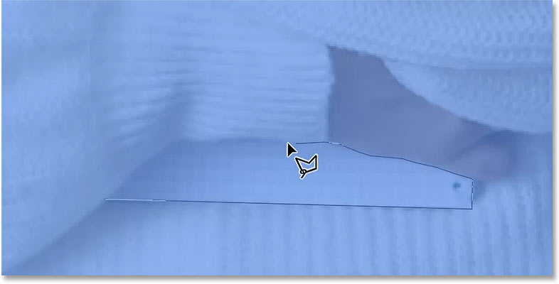
*Clicking along the edges to subtract the area from the selection.*

Then back at the starting point, I'll release my Alt (Win) / Option (Mac) key to complete the selection:

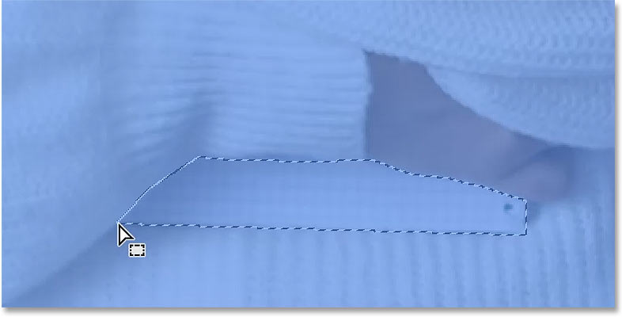
*Completing the selection.*

And now both parts of the notebooks (above and below her arms) have been subtracted:

*The notebooks have been manually subtracted from the selection.*

### Remember to turn Object Subtract back on

After manually subtracted the area from the selection, be sure to go back to the Options Bar, click the gear icon, and turn Object Subtract back on so you don't get unexpected behavior the next time you use it:

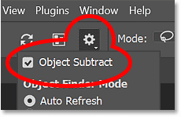
*Turning Object Subtract back on.*

### Refining the selection with Select and Mask

Once you have completed your selection, you'll usually need to refine it and clean up any rough edges by switching over to Photoshop's **Select and Mask** workspace. And with the Object Selection Tool active, you can get to it by clicking the Select and Mask button in the Options Bar.

But since Select and Mask is a big topic, I'll cover it in a separate tutorial. Instead, I'm going to use the Object Selection Tool to create a simple Black and White effect, which we'll finish up with next:

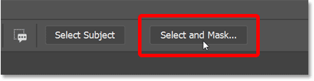
*The Select and Mask button in the Options Bar.*

## Creating a simple Color + Black and White effect

What I want to do is use the Object Selection Tool to select a couple of people in my image, leave them in color, and turn the rest of the image to black and white.

### Making the selection

So with the Object Selection Tool active and Object Finder turned on, I'll click on the woman on the left to select her. Then I'll hold **Shift** and I'll click on the woman on the right to add her to the selection:

*Selecting two people in the image with the Object Selection Tool.*

### Inverting the selection

I have the two people selected, but what I really need is for everything else in the image to be selected, which means I need to invert my selection. To do that, I'll go up to the **Select** menu in the Menu Bar and I'll choose **Inverse**:

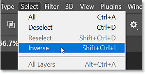
*Going to Select > Inverse.*

### Adding a Black and White adjustment layer

Then with the selection inverted, I'll add a Black and White adjustment layer by going up to the **Layer** menu, choosing **New Adjustment Layer**, and then **Black & White**:

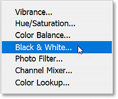
*Going to Layer > New Adjustment Layer > Black & White*

When the New Layer dialog box pops up, I'll click OK to close it:

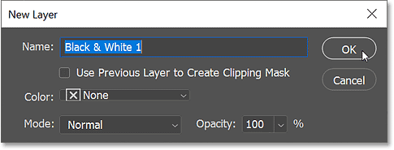
*Closing the New Layer dialog box.*

And Photoshop instantly turns my selected area to black and white while leaving the two people I initially selected in color:

*The image is converted to black and white except for the two people initially selected.*

### The selection was converted to a layer mask

Finally, if we take a quick look in the **Layers panel**, we see that Photoshop added the Black & White adjustment layer above my image. And we see in the **layer mask preview thumbnail** that Photoshop converted my selection into a [layer mask](/basics/understanding-photoshop-layer-masks/), which is why the adjustment layer is only affecting the area that was selected:

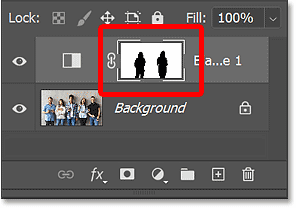
*The Layers panel showing the selection converted to a layer mask.*

And there we have it! Check out my [Photoshop Basics](/basics/) section for more tutorials. And don't forget, all of my tutorials are available to [download as PDFs](/print-ready-pdfs/)!