# Photoshop Shapes – Vectors, Paths and Pixels

> Source: [https://www.photoshopessentials.com/basics/shapes/vectors-paths-pixels/](https://www.photoshopessentials.com/basics/shapes/vectors-paths-pixels/)
> Downloaded and converted to Markdown.

In previous tutorials on [drawing shapes in Photoshop](/basics/shapes/), I mentioned that there are three very different kinds of shapes we can draw using Photoshop's various Shape tools. We can draw **vector shapes**, we can draw **paths**, or we can draw **pixel-based shapes**.

In this tutorial, we'll look more closely at the main differences between vector, path and pixel shapes and why you'd want to choose one over the others.

### The Shape Tools

As we learned in the [Photoshop Shapes And Shape Layers Essentials](/basics/shapes/) tutorial, Photoshop's various Shape tools are all nested together in the same spot in the Tools panel. By default, the Rectangle Tool is the tool that's visible, but if you click on the tool's icon and hold your mouse button down, a fly-out menu will appear listing the other Shape tools that are available. I'll choose the Ellipse Tool from the list, but everything we're about to learn applies to all of the Shape tools, not just the Ellipse Tool:

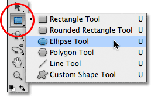
*Selecting the Ellipse Tool from the Shape tools fly-out menu.*

### The Drawing Modes

Once we've chosen a Shape tool, we need to tell Photoshop which type of shape - vector, path or pixels - we want to draw, and we do that using the **drawing mode options** in the Options Bar along the top of the screen.

Near the far left of the Options Bar is a set of three icons. Each icon represents one of the three types of shapes we can draw. The first icon (the one on the left) is the **Shape Layers** option, and it's the option we choose when we want to draw vector shapes. The second (middle) icon is the **Paths** option, which is what we choose when we want to draw paths. The third icon (the one on the right) is known as the **Fill Pixels** option. We choose it when we want to draw pixel-based shapes:

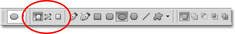
*From left to right - the Shape Layers, Paths, and Fill Pixels options.*

### Drawing Shape Layers (Vector Shapes)

Of the three types of drawing modes, the one we almost always want to be working with is Shape layers (vector shapes). When most people think of drawing shapes, they're not thinking of paths or pixels. They're thinking of vector shapes, the same type of shapes we'd draw in Adobe Illustrator or most other drawing programs.

Photoshop itself is not really known as a drawing program. It's primarily a photo editor, and photos (digital photos, at least) are made up of [pixels](/essentials/pixels.php). When we draw a pixel-based shape by choosing the **Fill Pixels** option in the Options Bar, we're creating shapes out of the same type of pixels that make up a digital photo, and pixels have major limitations on what we can do with them. The biggest drawback with pixel-based images or shapes is that they don't scale very well, at least not when we need to make them larger than their original size. Enlarge a pixel-based image or shape too much and it will lose its sharpness, becoming soft and dull. Enlarge it even more and the pixels that make up the image or shape can become visible, resulting in a blocky appearance.

Pixel-based images and shapes also depend very heavily on the [**resolution**](/essentials/image-quality/) of your document if they're going to look good when you print them. They may look great on your computer screen, but printing high quality images requires much higher resolution than what your monitor displays, and if your document doesn't have enough pixels to print it at the size you need with a high enough resolution, it will again look soft and dull.

Vectors, on the other hand, have nothing at all to do with pixels. They're actually made up of mathematical points, with the points connected to each other by either straight lines or curves. All of these points, lines and curves make up what we see as the shape! Don't worry about the "mathematical" part of what I just said. Photoshop handles all the math stuff behind the scenes so we can just focus on drawing our shapes.

Since vector shapes are essentially drawn using math, each time we make a change to the shape, either by resizing or reshaping it in some way, Photoshop simply redoes the math and redraws the shape! This means we can resize a vector shape as many times as we like, making it any size we need, without any loss of image quality. Vector shapes retain their crisp, sharp edges no matter how large we make them. And unlike pixels, vector shapes are **resolution-independent**. They don't care what the resolution of your document is because they always print at the highest possible resolution of your printer.

Let's look at some of the things we can do with vector shapes in Photoshop, and then we'll compare it with paths and pixel shapes. To draw vector shapes, select the **Shape Layers** option in the Options Bar:

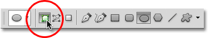
*Clicking on the Shape Layers icon in the Options Bar.*

Before I draw anything, let's take a quick look in my [Layers panel](/basics/layers/layers-panel/), where we see that currently my document is made up of nothing more than a single layer - the [Background layer](/basics/layers/background-layer/) - which is filled with solid white:

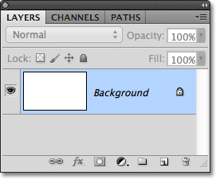
*The Layers panel showing the single Background layer.*

I'll choose a color for my vector shape by clicking on the **color swatch** in the Options Bar:

*Clicking on the color swatch to choose a color for the vector shape.*

This opens Photoshop's **Color Picker**. I'll choose red from the Color Picker, then I'll click OK to close out of it:

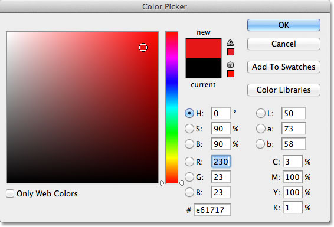
*Choosing a color for the vector shape from the Color Picker.*

With the Ellipse Tool in hand, the Shape Layers option selected in the Options Bar and red chosen from the Color Picker, I'll click inside my document and drag out an elliptical shape, holding the **Shift** key down as I drag to force the shape into a perfect circle:

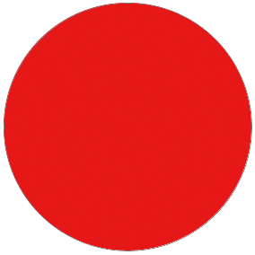
*A circular shape drawn with the Ellipse Tool.*

Photoshop places each new vector shape we draw on its own Shape layer, and if we look in my Layers panel, we see the shape on a new layer named Shape 1 above the Background layer. Shape layers are made up of two parts - a **color swatch** on the left which displays the current color of the shape and a **vector mask thumbnail** to the right of the color swatch which shows us what the shape currently looks like (the white area in the thumbnail represents the shape):

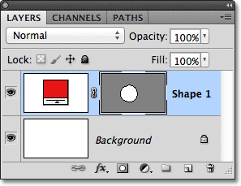
*Every new vector shape is given its own Shape layer in the Layers panel.*

With one shape drawn, I'll draw a second similar shape slightly to the right of the first one:

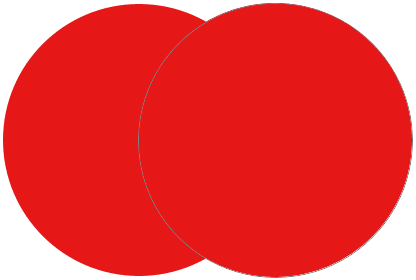
*A second vector shape now overlaps the original.*

Photoshop places this second vector shape on its own separate Shape layer (named Shape 2) above the first one, complete with its own color swatch and vector mask thumbnail:

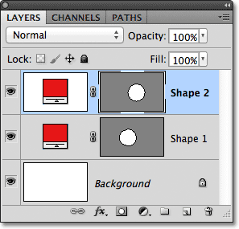
*Two vector shapes, two Shape layers.*

At the moment, both of my shapes are red, but we can easily change the color of a vector shape at any time simply by double-clicking on the shape's **color swatch** on the Shape layer: I'll double-click on the second shape's color swatch.

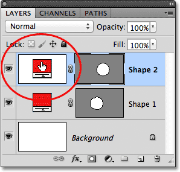
*Double-click on a vector shape's color swatch to change its color.*

This re-opens the Color Picker so we can select a different color. I'll choose blue this time:

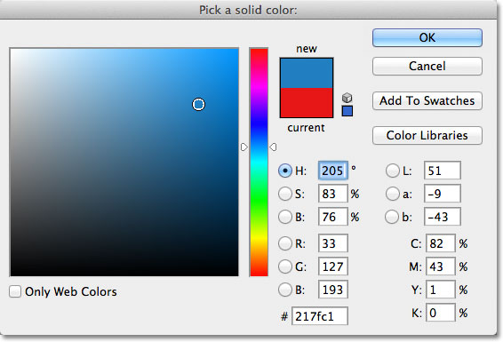
*Choosing blue as the new color of the second shape.*

I'll click OK to close out of the Color Picker, and my second shape is instantly changed from red to blue:

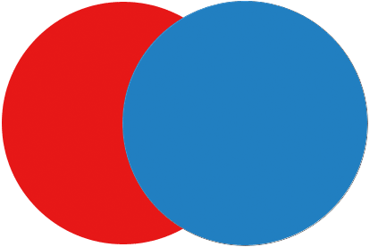
*The second vector shape now appears blue.*

The shape's color swatch on its Shape layer also updates to the new color:

*The vector shape's color swatch now displays the new color.*

As vector shapes, I can select them in the document very easily using the **Path Selection Tool** (also known as the black arrow). I'll choose the Path Selection Tool from the Tools panel. It's located in the same section of the Tools panel as the Shape Tools:

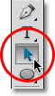
*Selecting the Path Selection Tool.*

With the Path Selection Tool in hand, if I click on the red shape in the document, Photoshop automatically selects it (a thin outline appears around the shape that's currently selected):

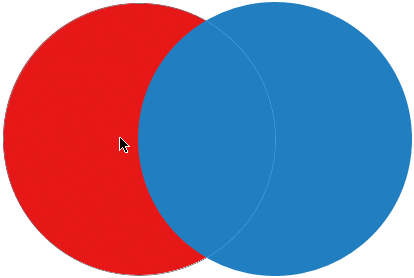
*The Path Selection Tool selects whichever vector shape you click on. Here, the red shape is selected by clicking on it.*

Photoshop also selects the shape's layer for me in the Layers panel (selected layers are highlighted in blue):

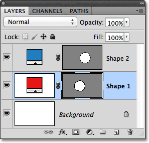
*When a vector shape is selected in the document, its Shape layer is highlighted in the Layers panel.*

I'll click on the blue shape in the document with the Path Selection Tool, and now the blue shape is selected:

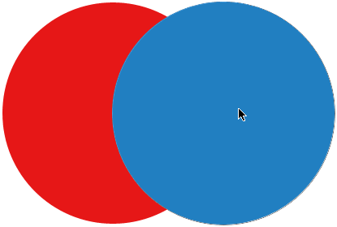
*Selecting the blue shape by clicking on it with the Path Selection Tool.*

And we see that Photoshop has also selected its Shape layer:

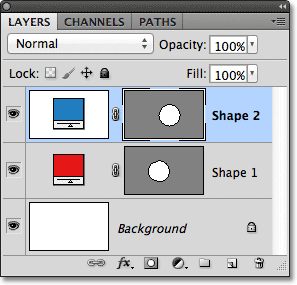
*The blue shape's layer is now selected.*

With a vector shape selected, I could drag it around inside the document with the Path Selection Tool to reposition it (the standard Move Tool would also work), but we can do much more interesting things with vector shapes than simply moving them around. For example, we can combine two or more shapes together to create different shapes! We'll learn how to do that next!

Up to this point, Photoshop has been placing each new vector shape I draw on its own Shape layer, but where things start to get interesting is when we combine two or more shapes on the *same* Shape layer. I'll cover combining shapes in more detail in another tutorial, but as a quick example, with my second (blue) shape selected, I'll press **Ctrl+C** (Win) / **Command+C** (Mac) on my keyboard to **copy** the shape to the clipboard. Then, with the shape copied, I'll delete the shape's layer by dragging it down onto the **Trash Bin** at the bottom of the Layers panel:

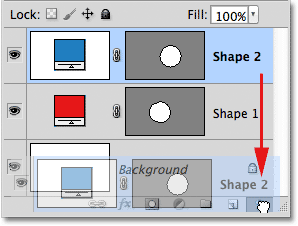
*Dragging the Shape 2 layer onto the Trash Bin to delete it.*

This leaves just the original shape in the document. I'll press **Ctrl+V** (Win) / **Command+V** (Mac) on my keyboard to **paste** the copied shape into the original shape, and now both shapes are combined into one:

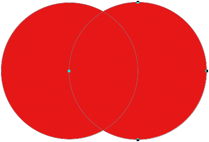
*The two previously separate shapes are now combined into a single shape.*

If we look at the vector mask thumbnail in the Layers panel, we see that both shapes are now part of the same Shape layer:

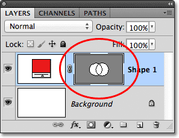
*The two shapes now share the same Shape layer.*

Since they're both on the same Shape layer, I can change how the shapes interact with each other by choosing different behaviors from a series of options in the Options Bar. From left to right, we have **Add to Shape Area**, **Subtract from Shape Area**, **Intersect Shape Areas**, and **Exclude Overlapping Shape Areas**:

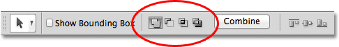
*This series of icons controls how two shapes on the same Shape layer interact with each other.*

Again, we'll look at combining vector shapes in more detail in another tutorial, but at the moment, both shapes are simply overlapping each other and creating the appearance of a single larger shape. That's because the Add to Shape Area option is currently selected. I'll click on the **Subtract from Shape Area** option:

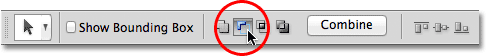
*Selecting "Subtract from Shape Area".*

With Subtract from Shape Area selected, the second shape is no longer visible in the document. Instead, Photoshop uses it to remove part of the original shape where the two shapes overlap:

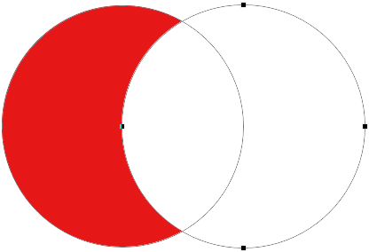
*The two shapes with the Subtract from Shape Area option selected.*

If I choose the **Intersect Shape Areas** option in the Options Bar:

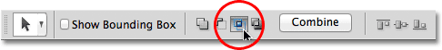
*Selecting "Intersect Shape Areas".*

We get a different behavior. This time, only the area where the two shapes overlap each other remains visible:

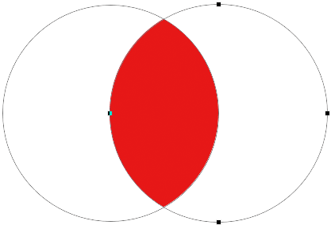
*The shapes with the Intersect Shape Areas option selected.*

And if I choose the **Exclude Overlapping Shape Areas** option:

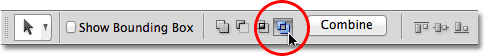
*Selecting "Exclude Overlapping Shape Areas".*

Again we get a different result. Both shapes are now visible *except* for the area where they overlap:

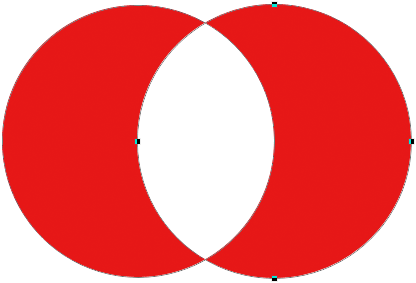
*The shapes in Exclude Overlapping Shape Areas mode.*

With the second shape (the shape on the right) still selected, if I decide I don't want it anymore, I can delete it by pressing **Backspace** (Win) / **Delete** (Mac) on my keyboard, which removes it from the Shape layer and leaves me back where I started with just my original circular shape:

*The second shape has been deleted, leaving only the original shape.*

One other important feature of vector shapes we should look at quickly before moving on to paths and pixel-based shapes is that we can easily reshape them! Earlier I mentioned that vector shapes are made up of points connected by lines or curves. We've already seen how to select an entire shape at once using the Path Selection Tool, but we can also select the individual points, lines and curves! For that, we need the **Direct Selection Tool** (also known as the white arrow). By default, it's nested in behind the Path Selection Tool in the Tools panel, so I'll click and hold on the Path Selection Tool until the fly-out menu appears, then I'll select the Direct Selection Tool from the list:

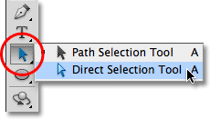
*Selecting the Direct Selection Tool.*

Reshaping vector shapes is a bit of an advanced topic which I'll cover in much more detail in another tutorial, but with the Direct Selection Tool selected, I'll click on the outline around the shape, which displays the shape's **anchor points** (the little squares). We can also see lines with little circles on the ends extending out from some of the anchor points. These are known as **direction handles**. We can click and drag either the anchor points or the direction handles to change the look of the shape.

For example, I'll click on one of the anchor points with the Direct Selection Tool and drag it towards the left:

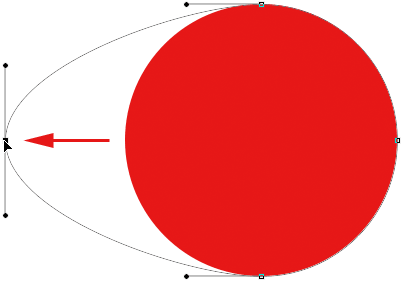
*Click and drag any of the anchor points to change the shape.*

I'll release my mouse button to complete the edit:

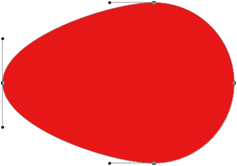
*Photoshop fills the added area with color when I release my mouse button.*

We can also drag the direction handles to edit the appearance of the line or curve between two anchor points. Here I'm dragging one of the direction handles that extends out from the anchor point at the top of the shape:

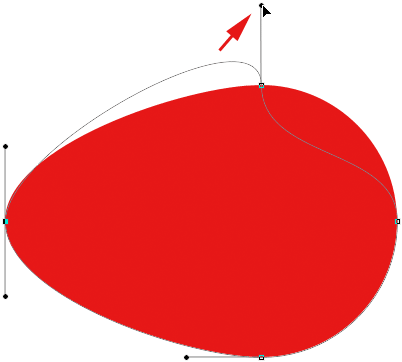
*Dragging a direction handle reshapes the line or curve connecting two anchor points.*

And again, I'll release my mouse button to complete the edit. Notice that even though I've made edits to the shape, because it's a vector shape and vectors are based on math, not pixels, it still retains its crisp, sharp edges:

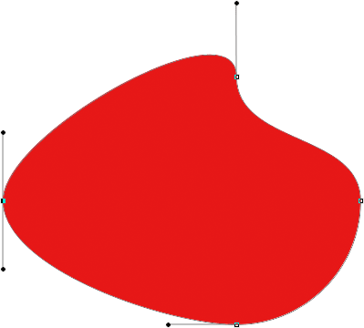
*The shape now looks much different than it did originally.*

Now that we've had a bit of a whirlwind tour of what we can do with vector shapes, including how editable and flexible they are, let's compare them to paths and pixel shapes, which we'll do next!

### Drawing Paths

Before we switch to the Paths option in the Options Bar, let's take a step back for a moment and draw another vector shape so we can keep an eye on exactly what's happening as we draw it. I'll use the same Ellipse Tool that I selected previously and I still have the Shape Layers option selected in the Options Bar. I'll delete my circular shape from the document so we're starting again with just the white-filled Background layer:

*Starting over with just the Background layer.*

I'll click inside the document to set a starting point for my elliptical shape, then with my mouse button still held down, I'll drag diagonally to draw the rest of the shape. Notice that as I'm dragging, all we see at first is an outline of what the shape will look like. This outline is actually a **path**. A path is really nothing more than an outline of a shape:

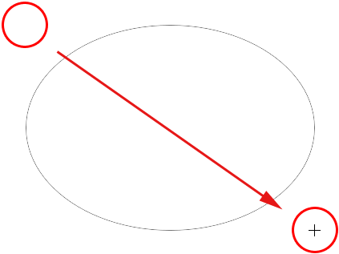
*The outline that Photoshop displays as we're drawing a shape is a path.*

It's only when I release my mouse button that Photoshop goes ahead and completes the shape, converting the outline (the path) into a vector shape and filling it with color:

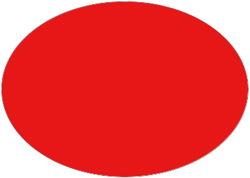
*The path becomes a color-filled vector shape only when we release the mouse button.*

If we look in my Layers panel, we see the familiar Shape layer with its color swatch and vector mask thumbnail, letting us know that the path is now a vector shape:

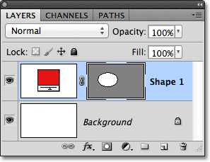
*The Shape layer appears in the Layers panel when Photoshop converts the initial path into a vector shape.*

I'll delete the Shape layer from the Layers panel so we're again starting with just the white background in my document, and this time, I'll choose the **Paths** option from the Options Bar:

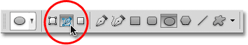
*Selecting the Paths option.*

With the Paths option selected, I'll again click with my Ellipse Tool inside the document to set a starting point for my shape, then with my mouse button held down, I'll drag diagonally to draw the rest of it. Just as before when I had the Shape Layers option selected, Photoshop displays only an initial path outline of what the shape will look like:

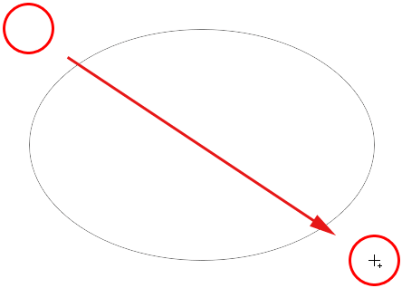
*Photoshop once again displays only the initial path outline of the shape as I draw it.*

However, when I release my mouse button to complete the shape, we see the difference between drawing Shape layers and drawing paths. Instead of converting the path outline into a vector shape as before, this time, we still just have the path outline. Photoshop doesn't fill the shape with color or convert it into a Shape layer. It simply draws the path outline of the shape and leaves it at that:

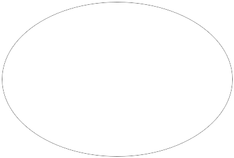
*With the Paths option selected, Photoshop draws only the path outline of the shape, nothing more.*

In fact, even though the path outline I just drew is visible to us in the document, if we look in my Layers panel, we see that Photoshop did not add a new layer for the path. I still only have my Background layer:

*Unlike Shape layers, Photoshop does not add new layers when we draw shapes as paths.*

The reason is that paths are independent of layers. In fact, they're independent of pretty much everything. Paths are vector-based, not pixel-based, which means they're made up of mathematical points connected by lines and curves, and even though we can see them on the screen while we're working in Photoshop, they don't really exist in the document unless we do something more with them. If I was to save my document right now as a jpeg, for example, the path would not appear in the image. If I printed the document, the path would not be visible on paper. We could choose to fill it with a color ourselves, or we could apply a colored stroke to the path, or even convert the path into a selection outline, but unless we do something more with it, a path just sits there waiting for a purpose.

Because paths are independent of layers, they're given their own panel - the **Paths** panel - which by default is grouped in with the Layers (and Channels) panel. You can switch between panels in a group by clicking on their **name tabs** along the top of the group. I'll switch to the Paths panel, where we can see the path I've drawn listed as ***Work Path***:

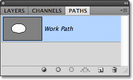
*Open the Paths panel by clicking on its name tab at the top of the panel group.*

The name "Work Path" means that the path is temporary, but we can save the path as part of the document if we need to simply by renaming it. To rename a path, double-click on its name in the Paths panel. Photoshop will open the **Save Path** dialog box asking you for a new name. You can just accept the default new name if you prefer or enter something else. I'll name mine "My elliptical path":

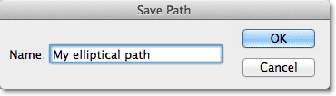
*Renaming the temporary work path.*

Click OK when you're done to close out of the dialog box, and the path is now saved with its new name:

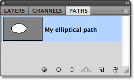
*The path is now saved as part of the document.*

Paths are every bit as editable as Shape layers (since Shape layers are really just paths filled with color). We can select an entire path at once with the **Path Selection Tool** (the black arrow), or we can edit its shape by clicking on it with the **Direct Selection Tool** (the white arrow), then clicking and dragging any of the anchor points or direction handles, just as we saw earlier:

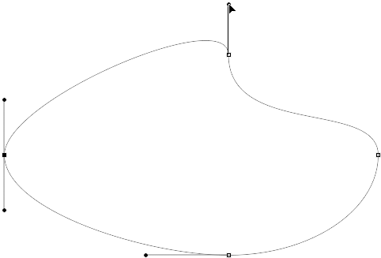
*Dragging the path's anchor points and direction handles with the Direct Selection Tool.*

The most common use for paths is converting them into selection outlines, which we can do by holding down the **Ctrl** (Win) / **Command** (Mac) key on the keyboard and clicking on the path's **thumbnail** in the Paths panel:

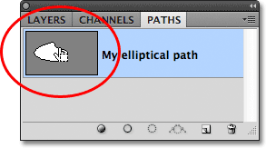
*Hold down Ctrl (Win) / Command (Mac) and click on the path's thumbnail.*

Photoshop instantly converts the path into a selection:

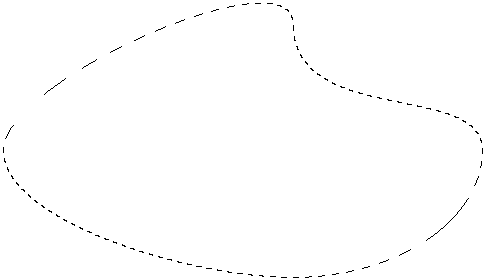
*The reshaped path is now a selection outline.*

### Converting Paths Into Shape Layers

Since Shape layers in Photoshop are just paths filled with color, it's actually very easy to convert a path into a Shape layer ourselves, which can be a handy trick when you meant to draw a Shape layer but forgot that you still had Paths selected in the Options Bar and accidentally drew the wrong type of shape.

Here I've drawn a circular path, when what I meant to draw was a Shape layer:

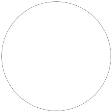
*A circular path drawn with the Ellipse Tool set to the Path drawing mode.*

Of course, I could just undo the step, select the Shape Layers option in the Options Bar and then redraw the shape, but why do that when I can easily convert the path into a Shape layer myself. All I need to do is click on the **New Fill or Adjustment Layer** icon at the bottom of the Layers panel:

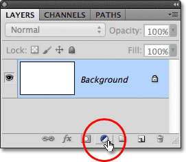
*Click on the New Fill or Adjustment Layer icon.*

Then I'll choose a **Solid Color** fill layer from the list that appears:

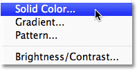
*Choose Solid Color from the top of the list.*

Photoshop will open the Color Picker so I can choose a color, which will become the color of my vector shape. I'll choose green this time:

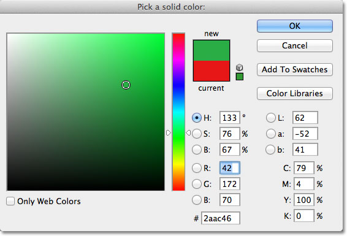
*Choose a color for the shape from the Color Picker.*

I'll click OK to close out of the Color Picker, and my path is instantly filled with the chosen color as if I had drawn it as a Shape layer:

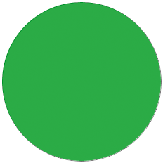
*The path is now filled with color.*

In fact, if we look in the Layers panel, we see that I now have something that looks exactly like a Shape layer, complete with the color swatch and the vector mask thumbnail. Technically, it's a Solid Color fill layer (which is why Photoshop named the layer "Color Fill 1" and not "Shape 1"), but because I had a path active when I added it, Photoshop converted the path into a vector mask and created what is in every respect a Shape layer:

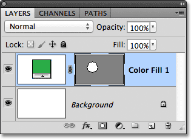
*The path has successfully been converted into a Shape layer.*

Next, we'll look at the last of the three drawing modes in Photoshop - **Fill Pixels** - and how they compare with Shape layers when resizing them!

### Drawing Pixel Shapes (Fill Pixels)

The third type of drawing mode in Photoshop is **Fill Pixels**, which lets us draw pixel-based shapes. I'll select the Fill Pixels option in the Options Bar:

*Selecting the Fill Pixels drawing mode.*

The Fill Pixels option is the least interesting or useful of the three drawing modes because with it selected, Photoshop simply draws shapes by filling them with colored pixels, and pixels are not as easily editable or as scalable as vectors.

Unlike Shape layers which get their own layer automatically each time we draw a new one, if we want a pixel shape to appear on its own separate layer, we first need to add a new blank layer ourselves. I'm going to start again with just my white-filled Background layer, and I'll add a new layer to my document by clicking on the **New Layer** icon at the bottom of the Layers panel:

*Clicking on the New Layer icon.*

Photoshop adds a new blank layer named Layer 1 above my Background layer:

*A new blank layer has been added for the pixel shape.*

Also unlike Shape layers which make it easy to change the color of a vector shape whenever we want, it's not as easy to change the color of a pixel shape. Photoshop will use your current **Foreground color** as the color of the pixel shape, so you'll want to choose the correct color before drawing it. To change the Foreground color, click on its **color swatch** near the bottom of the Tools panel. It's the swatch in the upper left (the lower right swatch is the Background color):

*Clicking the Foreground color swatch.*

This opens the Color Picker. I'll choose purple for my shape. Click OK once you've chosen a color to close out of the Color Picker:

*Choose a new Foreground color from the Color Picker.*

With the Fill Pixels option selected in the Options Bar, purple set as my Foreground color and Layer 1 selected in the Layers panel, I'll click inside the document with the Ellipse Tool as I've done before and I'll drag out my shape. Again, just as when drawing Shape layers and paths, all we see at first as we're drawing a pixel shape is the initial path outline of what the shape will look like:

*Drawing a Fill Pixels shape with the Ellipse Tool.*

I'll release my mouse button to complete the shape, at which point Photoshop fills it with color. At first glance, my new shape looks no different than a vector shape, as if I had drawn it as a Shape layer:

*The pixel shape looks very similar to a vector shape.*

However, when we look in the Layers panel, we see the truth. All we have is a solid shape filled with colored pixels on a normal, pixel-based layer. There is no color swatch to easily change the color of the shape if I need to, and there's no vector mask. Since the shape is made up of pixels, not vectors, I can't easily select it with the Path Selection Tool, and more importantly, there are no anchor points or direction handles to select and edit with the Direct Selection Tool, so I can't easily reshape it. In other words, unless I was willing to put in some extra work, my pixel shape is what it is, which makes it rather uninteresting after seeing how editable and flexible Shape layers are:

*The preview thumbnail for Layer 1 shows the pixel shape, which is not easily editable like a Shape layer would be.*

The biggest problem, though, with pixel-based shapes, and the biggest advantage Shape layers have over them, is that pixel shapes are not very scalable, especially when we need to make them larger than their original size, whereas Shape layers can be scaled as large as we want without any loss of image quality. To illustrate the problem with pixel shapes, here are two seemingly identical shapes that I've drawn with the Ellipse Tool. While they look the same at the moment, the shape on the left is a vector shape, while the one on the right is a pixel shape:

*A vector shape on the left and a pixel shape on the right.*

A quick glance at my Layers panel shows the vector shape on the Shape layer (Shape 1) and the pixel shape on Layer 1:

*The Layers panel showing the vector shape and the pixel shape.*

With the vector shape selected, I'll press **Ctrl+T** (Win) / **Command+T** (Mac) on my keyboard to bring up the **Free Transform** bounding box and handles around the shape:

*The Free Transform box and handles appear around the vector shape on the left.*

Then I'll scale the vector shape down in size by setting both the **Width** and **Height** options in the Options Bar to **10%**:

*Scaling the vector shape down to 10% of its original size.*

I'll press **Enter** (Win) / **Return** (Mac) on my keyboard to accept the change and exit out of Free Transform, and now the vector shape on the left appears much smaller:

*The shapes after making the vector shape smaller.*

I'll do the same thing with the pixel shape on the right, first selecting Layer 1 in the Layers panel, then pressing **Ctrl+T** (Win) / **Command+T** (Mac) to access the Free Transform command and changing both the Width and Height of the pixel shape to 10% in the Options Bar. I'll press **Enter** (Win) / **Return** (Mac) to accept the change and exit out of Free Transform, and now both shapes have been scaled down in size. At this point, though, they still look pretty much the same:

*The vector and pixel shape still look very similar after scaling them down in size.*

Watch what happens, though, when I make them larger. I'll start with the vector shape on the left, pressing Ctrl+T (Win) / Command+T (Mac) to access Free Transform, then scaling it back up to its original size by setting both the Width and Height in the Options Bar to 1000%:

*Scaling the vector shape upward to 1000% of its size.*

The vector shape is now back to its original size and shows no sign of wear and tear. Its edges are just as crisp and sharp as they were originally:

*Vector shapes can be scaled to any size with no loss of image quality.*

I'll do the same thing with the pixel shape, setting its Width and Height to 1000% in the Options Bar to scale it back up to its original size, and here is where the difference between the vector and pixel shape becomes very noticeable. While the vector shape on the left still looks good as new, the up-sized pixel shape on the right has completely lost all credibility. Its once sharp edges now look blocky and blurry, proving that pixels are no match against the scaling power of vectors:

*And the winner is.... Shape layers!*

To quickly summarize, even though Photoshop gives us three different kinds of shapes we can draw, the best choice, and the one you'll want to use most often, is Shape layers. They're vector-based, which means they're based on math, not pixels, and that makes them very editable, flexible and scalable. Paths, also vector-based, are simply outlines of shapes with no color fill. They're just as editable, flexible and scalable as Shape layers but are not actually part of the document until we do something more with them. Finally, pixel shapes (Fill Pixels), the least useful of the three, are just shapes filled with colored pixels, with all the normal limitations of pixel-based images. They're not easily editable like Shape layers or paths, and they will lose image quality if you need to scale them larger than their original size.