# How to View Multiple Images at Once in Photoshop

> Source: [https://www.photoshopessentials.com/basics/view-multiple-images-photoshop/](https://www.photoshopessentials.com/basics/view-multiple-images-photoshop/)
> Downloaded and converted to Markdown.

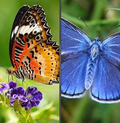

Learn how Photoshop's multi-document layouts make it easy to view and arrange multiple open images on your screen at once! Part of our Photoshop Interface series. For Photoshop CC and CS6.

In the [previous tutorial](basics/tabbed-and-floating-documents-in-photoshop/ "Learn more about tabbed and floating documents in Photoshop."), we learned how to work with **tabbed documents** and **floating document windows** in Photoshop. We learned that when we open multiple images at once, Photoshop displays them as a series of tabbed document windows. It's easy to switch between open images just by clicking on their tabs. Yet by default, no matter how many images we've opened, Photoshop only lets us view one image at a time.

There is a way, however, to view two or more images on your screen at once. To view multiple images, we use Photoshop's **multi-document layouts**. These layouts are found under the **Arrange** menu. Let's see how they work.

This is lesson 7 of 10 in our [Learning the Photoshop Interface](/basics/learning-the-photoshop-interface/ "Complete Guide to Learning the Photoshop Interface") series.

Let's get started!

## Opening Images Into Photoshop

I'll start by opening a couple of images into Photoshop. Since this tutorial continues from the previous tutorial, I'll use the same images again. Here, I've used [Adobe Bridge](basics/what-is-adobe-bridge/ "Learn more about Adobe Bridge") to navigate to a folder containing my three images. Rather than opening all three at once into Photoshop, I'll start by opening just two of them. To select the images, I'll click on the thumbnail for the first image on the left. Then, to select the middle image as well, I'll press and hold my **Shift** key and I'll click on the middle thumbnail. With the first two images now selected, I'll [open them into Photoshop](/basics/opening-images-photoshop/ "Learn how to open images in Photoshop") by double-clicking on either of the thumbnails:

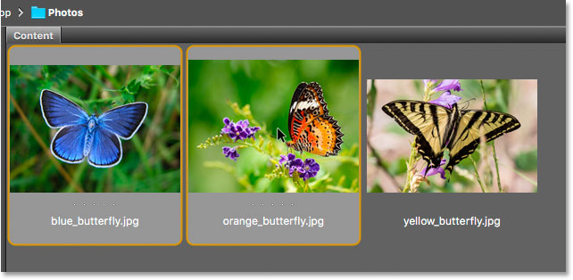
*In Adobe Bridge, selecting and opening the first two images into Photoshop.*

### Tabbed Documents

Both images open in Photoshop as [tabbed documents](basics/tabbed-and-floating-documents-in-photoshop/ "Learn more about tabbed and floating documents in Photoshop."). But we can only see one document at a time. The other document is hidden behind the visible one ([butterfly on flower photo](https://prf.hn/l/8x3wak0) from Adobe Stock):

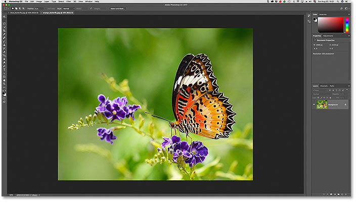
*The images open as tabbed documents. Only one of the documents is visible.*

### Switching Between Tabbed Documents

We can switch between tabbed documents by clicking the **tabs** along the top of the images. At the moment, my second image ("orange_butterfly.jpg") is selected. I'll switch to the first image ("blue_butterfly.jpg") by clicking its tab:

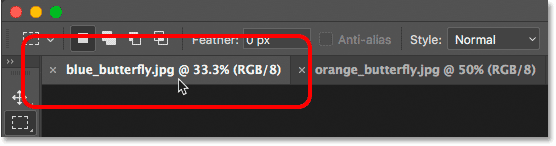
*Clicking the tabs to switch between open images.*

This hides the original image and shows me the other image I've opened ([blue butterfly photo](https://prf.hn/l/BOxVG3e) from Adobe Stock):

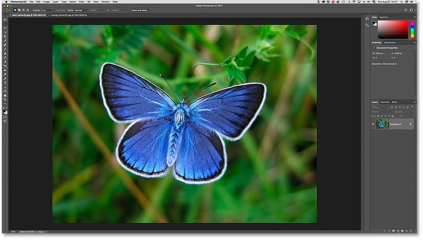
*The original image is now hidden behind the new image.*

## Photoshop's Multi-Document Layouts

To view both open images at once, we can use Photoshop's **multi-document layouts**. To find them, go up to the **Window** menu in the Menu Bar along the top of the screen. Then, choose **Arrange**. The various layouts are grouped together at the top of the menu. Depending on how many images you've opened, some of the layouts may be grayed out and unavailable. In my case, since I've opened only two images, the layouts for viewing three or more documents are grayed out:

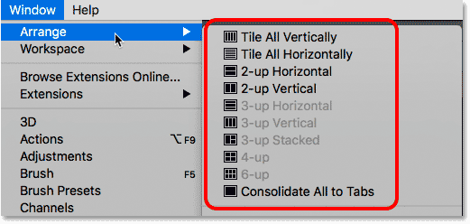
*The multi-document layout options in Photoshop.*

I'll select the **2-up Vertical** layout:

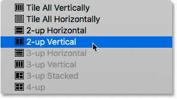
*Selecting the "2-up Vertical" layout.*

This displays both of my open documents side-by-side, allowing me to view both images at once:

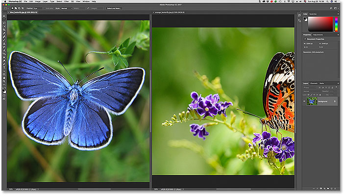
*The "2-up Vertical" layout.*

### The Active Document

Multi-document layouts make it easy to view more than one image at once. But it's important to remember that Photoshop only lets us *edit* one image at a time. The image we're editing appears in the **active document window**. We can tell which document window is active because its tab appears highlighted. Here we can see that my "blue_butterfly.jpg" document is the currently-active document because its tab is highlighted. To make a different document window active, click either on its tab or anywhere inside the document window:

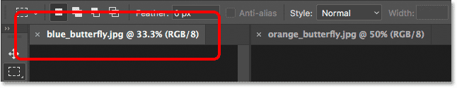
*Photoshop highlights the tab of the active document window.*

### Grouping Document Windows

So far, we've seen that we can easily view two images at once in Photoshop using the "2-up Vertical" layout. Let's see what happens if I open a *third* image while still using the same two-document layout. I'll switch back over to Adobe Bridge. Then, I'll open my third image ("yellow_butterfly.jpg") into Photoshop by double-clicking on its thumbnail ([swallowtail butterfly photo](https://prf.hn/l/pm0LVxW) from Adobe Stock):

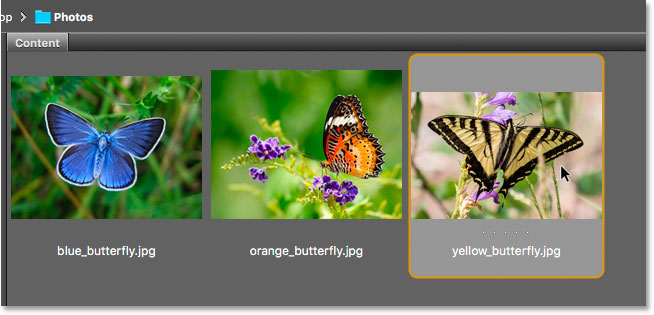
*Selecting and opening a third image from Bridge into Photoshop.*

This opens my third image into Photoshop. But since I've opened a third image into a layout designed for viewing only *two* images, Photoshop did not open my third image in its own, separate document window. Instead, it maintained the two-document layout by grouping, or docking, my third image in with the document that was previously active. I still have two main document windows. But the window on the left (which was the active window when I opened the third image) now holds **two tabbed documents**. The window on the right holds only one:

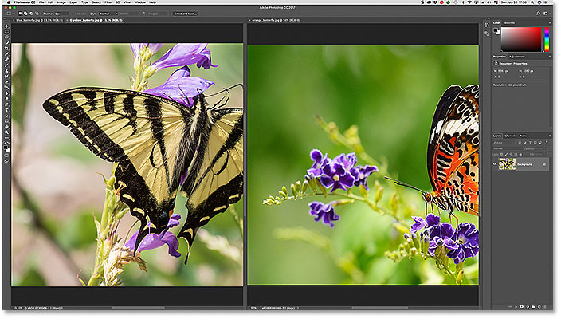
*Photoshop grouped the third image into the document window on the left.*

### Switching Between Grouped Documents

Just like with normal tabbed documents, Photoshop only displays one image inside a group at a time. Click the tabs to switch between images in the group. At the moment, my "yellow_butterfly.jpg" document is visible on the left. I'll switch back to viewing my "blue_butterfly.jpg" image by clicking its tab:

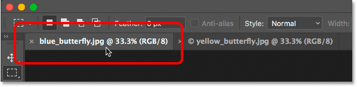
*Switching between grouped documents by clicking the tabs.*

And now the "blue_butterfly.jpg" image is once again visible in the left window:

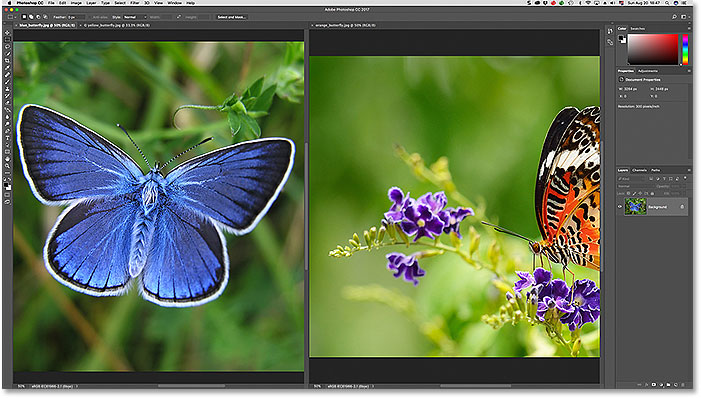
*The visible image in the left document window has changed.*

### Changing The Order Of Tabbed Documents In A Group

Also like normal tabbed documents, we can change the order of the tabs within a group. Click on the tab of the document you want to move. Then, with your mouse button still held down, drag the tab to the left or right of the other tab(s) within the same group. Release your mouse button to drop the tab into place:

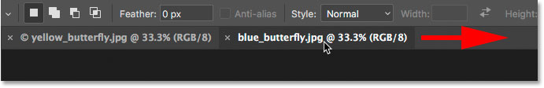
*Click and drag the tabs in a document group to change their order.*

### Moving Tabbed Documents Between Windows

What if I wanted my blue butterfly to be grouped in with the orange butterfly in the window on the right? To move a tabbed document from one window to another, click and hold on the tab of the document you want to move in the first window. Then drag the tab left or right into the **tab area** along the top of the other document window. When a **blue highlight box** appears around the window, release your mouse button to drop the document into the new window:

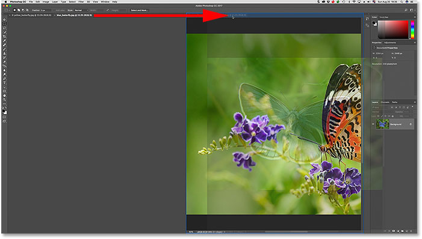
*Dragging a tab from the window on the left into the tab area of the window on the right.*

After dragging and dropping the tab, my blue butterfly document is now grouped in with the orange butterfly in the window on the right. The yellow butterfly now sits alone in the window on the left:

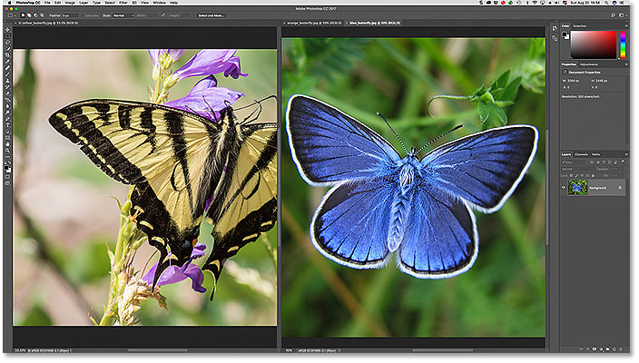
*The left window now holds a single image. The right window holds two images as tabbed documents.*

### Changing The Layout

To view all three images at once in Photoshop, all I need to do is switch from the "2-up Vertical" layout to a three-document layout. To switch layouts, I'll go back up to the **Window** menu and choose **Arrange**. This time, I'll choose **3-up Vertical**:

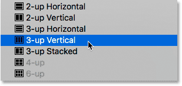
*Going to Window > Arrange > 3-up Vertical.*

And now all three images appear in their own separate document windows, allowing me to see all three at once:

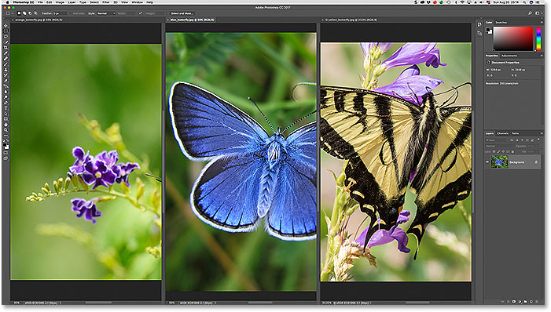
*The "3-up Vertical" layout.*

### Zooming And Panning Images In Multi-Document Layouts

Let's learn how to [zoom and pan images](/basics/image-navigation-essentials-zooming-panning-photoshop/ "Photoshop image navigation essentials - Zoom and Pan") within a multi-document layout. We'll start with panning.

#### Panning An Image

To pan, or scroll, a single image within a multi-document layout, first click anywhere inside the image to make its document window active. Then, press and hold the **spacebar** on your keyboard. This temporarily switches you to Photoshop's **Hand Tool**. You'll see your mouse cursor change into a hand icon. With the spacebar held down, click on the image and drag it into position.

In my case, the butterfly in the photo on the left of my layout is sitting off to the side and out of view. To reposition the butterfly, I'll click on the image to make its document window active. I'll press and hold my spacebar, and then I'll click on the image and drag the butterfly into the center of the document window:

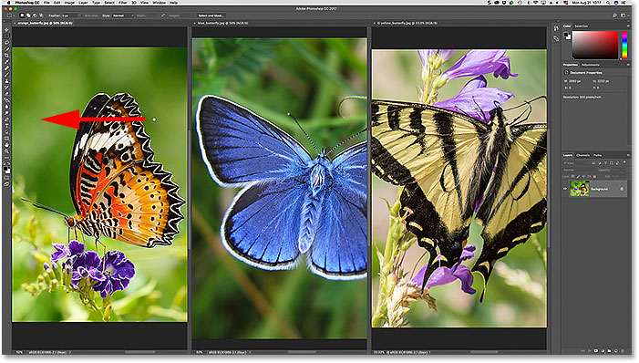
*Panning the image on the left to center the butterfly in the document window.*

#### Panning All Images At Once

To pan all open images at once, press and hold your **Shift** key and the **spacebar**. Click and drag any image within the layout to reposition it. The other images will move along with it.

#### Zooming In And Out Of An Image

To zoom in on a single image in a multi-document layout, first click on the image to make its document window active. Then, press and hold **Ctrl+spacebar** (Win) / **Command+spacebar** (Mac). This will temporarily switch you to Photoshop's **Zoom Tool**. Your cursor will change into a magnifying glass with a plus sign (+) in the center. Click on the image to zoom in on that spot. Click repeatedly to zoom in further.

Here, I've zoomed in on the blue butterfly in the middle document:

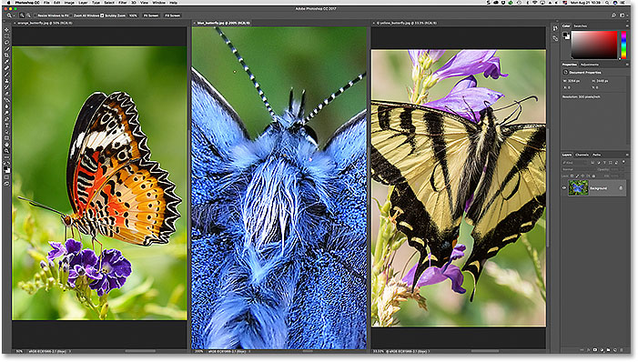
*Zooming in on a single image within the layout.*

To zoom out, press and hold **Ctrl+Alt+spacebar** (Win) / **Command+Option+spacebar** (Mac). You'll see the same magnifying glass cursor icon but with a minus sign (-) in the center. Click on the image to zoom out from that spot. Click repeatedly to zoom out further.

#### Zooming In Or Out Of All Images At Once

To zoom in on every open image at once, press **Shift+Ctrl+spacebar** (Win) / **Shift+Command+spacebar** (Mac) and click on any image within the layout. All images will zoom in at the same time. To zoom out of every image at once, press **Shift+Ctrl+Alt+spacebar** (Win) / **Shift+Command+Option+spacebar** (Mac) and click on any image.

### Matching The Zoom Level And Position Of All Images

Photoshop lets us quickly jump all images within a multi-document layout to the exact same zoom level or position. First, click on the image with the zoom level or position you want the other images to match. Go up to the **Window** menu, choose **Arrange**, and then choose the Match option you need. To match all images to the zoom level of the selected image, choose **Match Zoom**. To match their position, choose **Match Position**. There's also a **Match Rotation** option to match the rotation angle of all open images. We'll look at rotating images in another tutorial. To match the zoom level and position (as well as the rotation angle) of all images to the selected image, choose **Match All**:

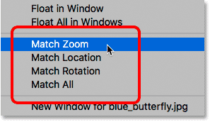
*The Match Zoom, Location, Rotation and All options.*

### Switching Back To The Default Tabbed Layout

Finally, to revert your layout back to the default, with only one image visible at a time, go up to the **Window** menu, choose **Arrange**, and then choose **Consolidate All to Tabs**:

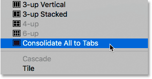
*Going to Window > Arrange > Consolidate All to Tabs.*

And now my images are back to the standard, tabbed document layout:

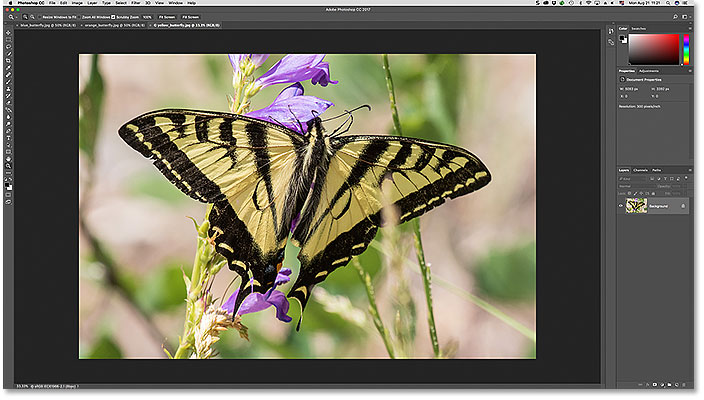
*Back to Photoshop's default document layout.*