# Warp Images with the Enhanced Warp Tool in Photoshop

> Source: [https://www.photoshopessentials.com/basics/warp-images-with-the-enhanced-warp-tool-in-photoshop-cc-2020/](https://www.photoshopessentials.com/basics/warp-images-with-the-enhanced-warp-tool-in-photoshop-cc-2020/)
> Downloaded and converted to Markdown.

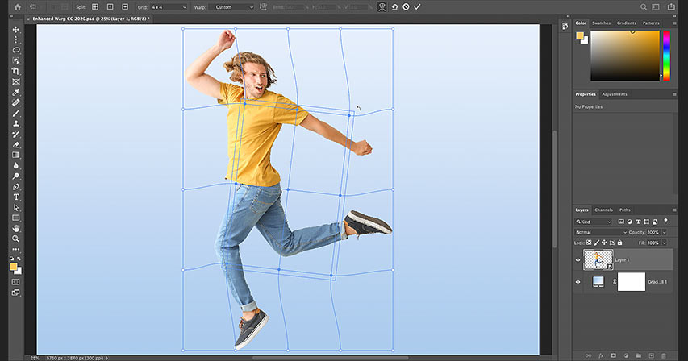

*Learn how to warp images like never before with the improved and enhanced Warp command in Photoshop 2020!*

One of the best new features in Photoshop CC 2020 is the enhanced Warp command. While Photoshop has allowed us to warp images for years, the controls and options for the Warp command have, up till now, been pretty limited. But as of CC 2020, that's no longer the case. Adobe has added powerful new enhancements to Warp, including new Warp grid presets, new custom grid sizes, and the ability to add our own grid lines and control points wherever we need them. We can now select and warp multiple points within the image at the same time, and we can even scale and rotate different areas of the image independently!

In this tutorial, I'll show you how every new feature of the Warp command works. To use these features, you'll need [Photoshop 2020 or newer](https://prf.hn/l/dlXjD2w). So before you continue, make sure that your copy of Photoshop CC is up to date.

Let's get started!

### The document setup

For this tutorial, I've created a simple document with a man dancing in front of a gradient background. The original [dancer photo](https://prf.hn/l/n0O3QR4) was downloaded from Adobe Stock, and I used the new [Object Selection Tool](basics/object-selection-tool/) in Photoshop CC 2020 to remove him from the rest of the image. The gradient behind him is one of many new gradients included with Photoshop CC 2020:

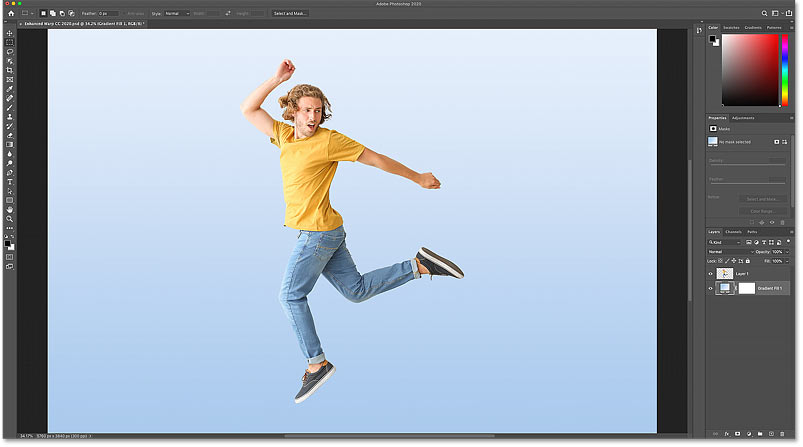

*The original document. Dancer from Adobe Stock.*

In the [Layers panel](/basics/layers/layers-panel/), the man appears on his own layer ("Layer 1") above a Gradient Fill layer. Make sure you have the correct layer selected before choosing the Warp command:

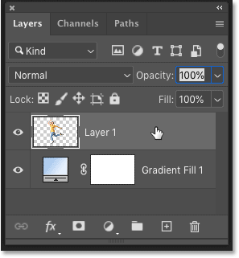

*Selecting the layer that will be warped.*

[Related: Master the Photoshop interface!](/basics/learning-the-photoshop-interface/)

## Warping smart objects vs normal layers

Also before choosing the Warp command, I highly recommend that you first convert your layer into a **smart object**. The reason is that if you warp a normal pixel layer, the changes you make become permanent. But if you warp a [smart object](/basics/how-to-create-smart-objects-in-photoshop/), the warp remains editable. You can warp a smart object further if you need to, or undo the warp and return to the original shape of the image at any time, without any loss in quality.

To convert your layer to a smart object, click on the Layers panel **menu icon** in the upper right:

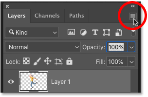

*Opening the Layers panel menu.*

And choose **Convert to Smart Object**:

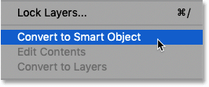

*Selecting the "Convert to Smart Object" command.*

An icon appears in the lower right of the layer's preview thumbnail, telling us that the layer is now safely inside a smart object and we're ready to warp the contents:

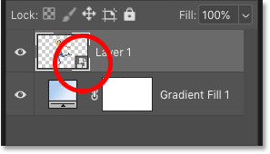

*The smart object icon.*

[Related: How to edit smart objects in Photoshop!](/basics/how-to-edit-and-replace-smart-object-contents-in-photoshop/)

## Where do I find Photoshop's Warp command?

There are a couple of ways to access the Warp command in Photoshop. One is by going up to the **Edit** menu in the Menu Bar, choosing **Transform**, and then choosing **Warp**. This lets you access the Warp command directly:

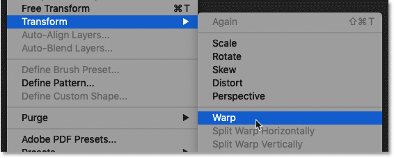

*Going to Edit > Transform > Warp.*

And the other way is through Photoshop's [Free Transform](/basics/transform-and-warp-images-with-free-transform-in-photoshop-cc-2019/) command. Open Free Transform by going up to the **Edit** menu and choosing **Free Transform**, or by pressing **Ctrl+T** (Win) / **Command+T** (Mac) on your keyboard:

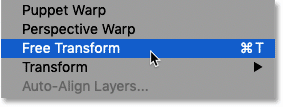

*Going to Edit > Free Transform.*

And then with Free Transform active, click the **Warp icon** in the Options Bar:

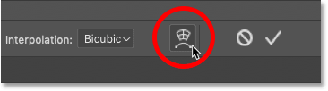

*Clicking the Warp icon.*

## The default Warp controls in Photoshop CC 2020

When you choose the Warp command, Photoshop places the default Warp box around the layer's contents:

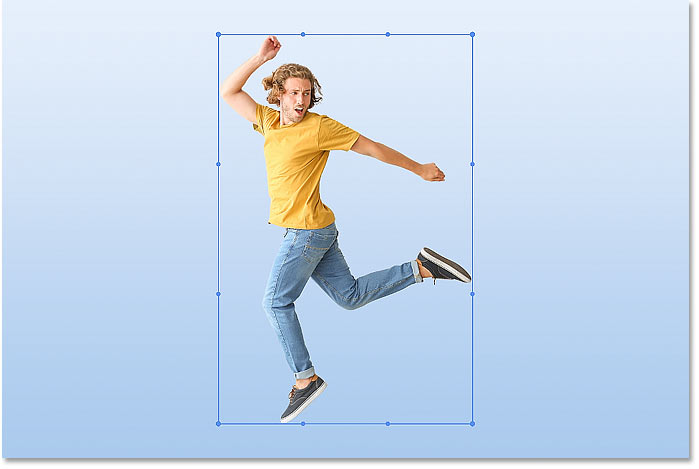

*The default Warp box.*

### How to use the default Warp controls

With the default controls, Warp mode in Photoshop CC 2020 behaves pretty much the same as it did in previous versions of Photoshop. You can click and drag anywhere inside the box to freely warp and reshape the image:

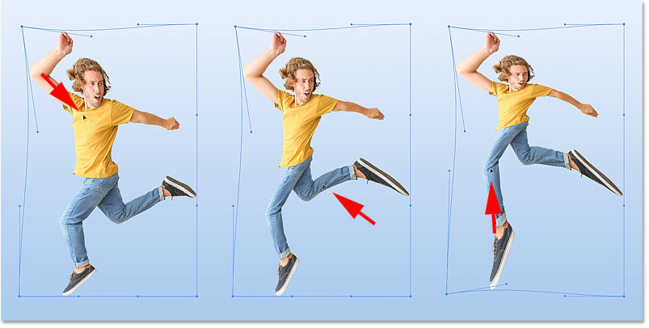

*Clicking and dragging inside the Warp box.*

You can drag the **control point** in each corner of the box:

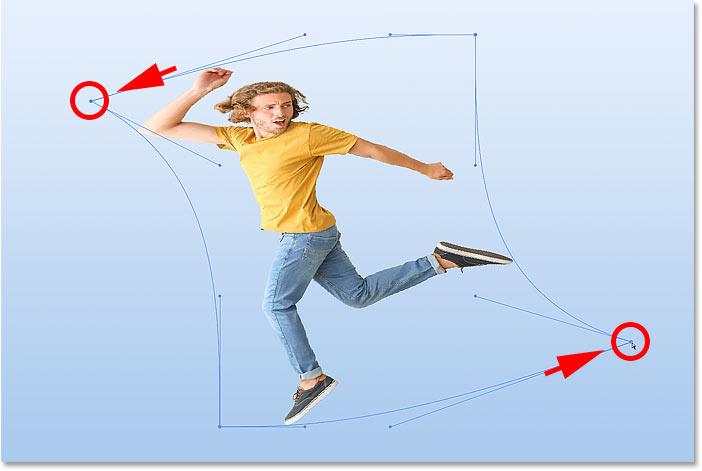

*Clicking and dragging the corner points.*

And you can click and drag either of the **control handles** that extend out from each corner point:

*Clicking and dragging the control handles.*

### How to undo a warp

In Photoshop CC 2020, the Warp command (and the Free Transform command) now gives us multiple undos. To undo your last step, go up to the **Edit** menu and choose **Undo**, or press **Ctrl+Z** (Win) / **Command+Z** (Mac) on your keyboard. And to undo multiple steps, press Ctrl+Z (Win) / Command+Z (Mac) repeatedly:

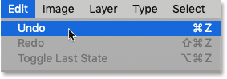

*Going to Edit > Undo.*

Or to completely undo the warp and return the image to its original shape, click the **Reset** button in the Options Bar:

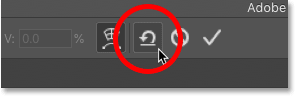

*Clicking the Reset button.*

## Gaining more control with the Warp grid presets

What if you want more control over the warp than what the default controls offer? New in Photoshop CC 2020, you can now choose one of three **Warp grid presets**. To choose a preset, click on the new **Grid** option in the Options Bar:

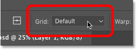

*Clicking the Grid option.*

And choose either a **3x3**, **4x4** or **5x5** grid:

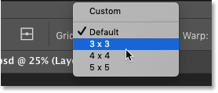

*Choosing one of three preset Warp grid sizes.*

The grid appears in front of the image. Here I've chosen the 3x3 grid. And notice that instead of seeing control points only in the corners, we now have a control point at each spot where the horizontal and vertical grid lines intersect. So just by adding a 3x3 grid preset, we've gone from four control points to sixteen points:

*The 3x3 warp grid preset.*

### Dragging a control point

To warp the image using the grid, you can click on any control point and drag it independently of the others:

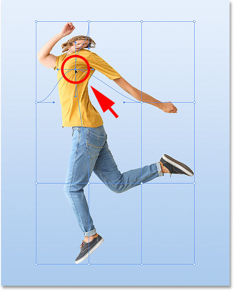

*Clicking and dragging a control point within the grid.*

### Dragging a control handle

You can also drag any of the control handles that extend out from the selected point. Here I'm dragging the right control handle further to the right to warp the shape of the man's upper body:

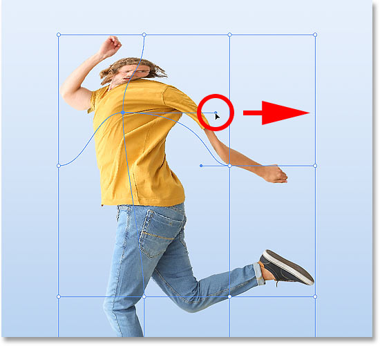

*Dragging a control handle that extends out from the point.*

### Rotating a control point

And you can rotate the image around a point by clicking and dragging the control handle clockwise or counterclockwise. Of course, I'm exaggerating things here just to make the results more obvious:

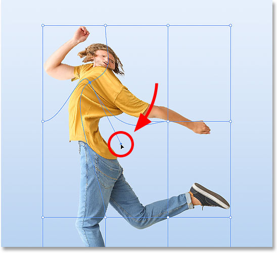

*Rotating the image around a control point.*

### Warping a grid line

Along with using the control points and handles, you can also click and drag directly on the grid line itself between two points to warp and curve the line into shape:

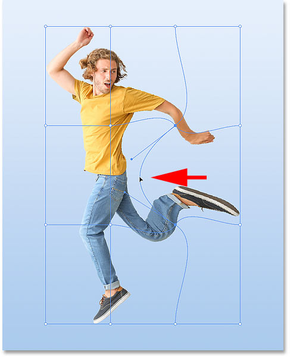

*Clicking and dragging one of the grid lines.*

## How to warp multiple control points at once

So far we've looked at how to warp the image using one control point at a time. But in Photoshop CC 2020, we can also warp multiple control points at once.

### Selecting multiple control points

To select multiple points, press and hold the **Shift** key on your keyboard and click on the points you want to select. Or a faster way is to hold Shift and simply drag around the points to select them. If you select a point by mistake, keep your Shift key held down and click on the point to deselect it.

Here I'm selecting the four points in the center of the grid. A box appears around the points you've selected:

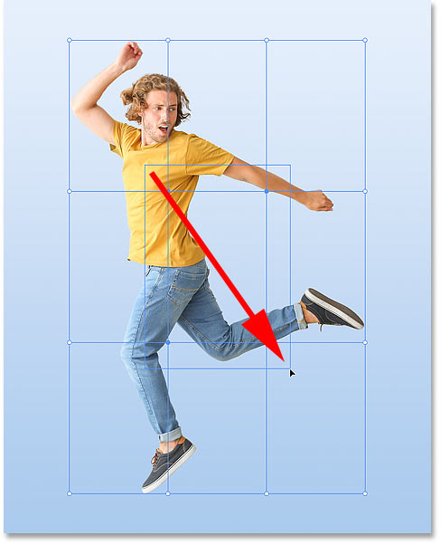

*Holding Shift and dragging to select multiple control points at once.*

### Moving the selected points

To move all selected points at the same time, click and drag inside the box:

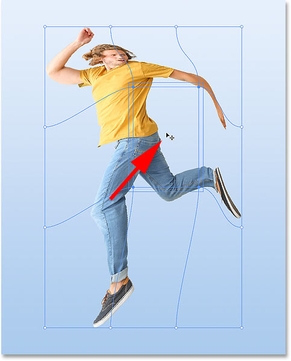

*Dragging all selected points together.*

### Scaling the selected points

To scale the area inside the selected points, click and drag a corner of the box:

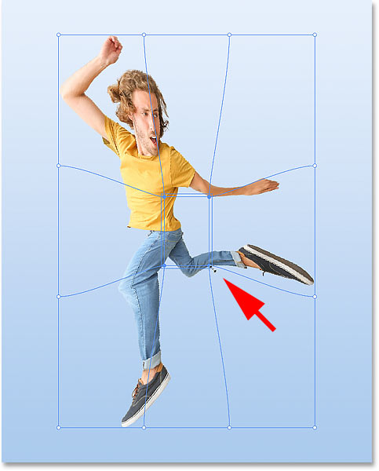

*Scaling the area inside the selected points.*

### Rotating the selected points

And to rotate the selected points, move your mouse cursor outside the box until your cursor changes into a rotate icon, and then click and drag:

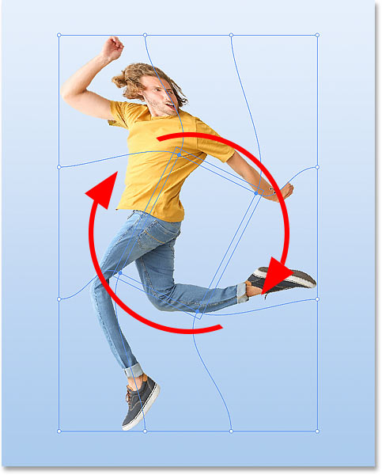

*Rotating the area inside the selected points.*

### How to deselect multiple points

To deselect the points when you're done, click on an empty spot within the grid, or click outside the main Warp box.

## Creating a custom Warp grid

If the Warp grid presets still do not give you enough control, you can create your own custom Warp grid.

In the Options Bar, set the **Grid** option to **Custom**:

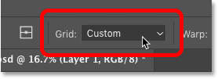

*Setting Grid to "Custom".*

And then in the Custom Grid Size dialog box, enter the number of Columns and Rows that you need. I'll enter **6** for both. Click OK when you're done:

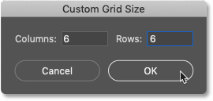

*Creating a custom Warp grid.*

The new custom grid appears in front of the image, again with an independent control point at each spot where the grid lines intersect. Just keep in mind that changing the grid size after warping the image will discard any changes you've made:

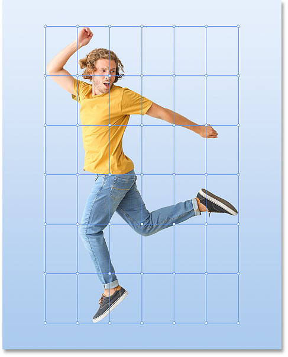

*A custom 6x6 Warp grid.*

## How to add your own Warp grid lines

Finally, for precise control over the warp, Photoshop CC 2020 now lets you add your own grid lines wherever you need them!

In the Options Bar, you'll find a new option called **Split**, with three icons beside it that each gives you a different way to "split" the grid. Starting from the left, **Split Crosswise** adds both a vertical and horizontal grid line, **Split Vertical** adds a vertical grid line, and **Split Horizontal** adds, you guessed it, a horizontal grid line:

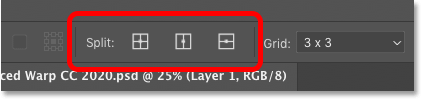

*The Crosswise (left), Vertical (middle) and Horizontal (right) Split options.*

To add a grid line, first choose the type of split you need. I'll choose Crosswise. The Split Crosswise option is usually best because it always adds a control point at the exact spot where you click:

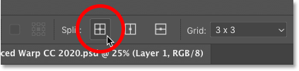

*Selecting the Split Crosswise option.*

Then simply move your mouse cursor over the image and click on the spot where you need to split the grid. I'll click on the man's arm. Notice that because I chose Split Crosswise, I'm adding both a vertical and horizontal grid line at that location:

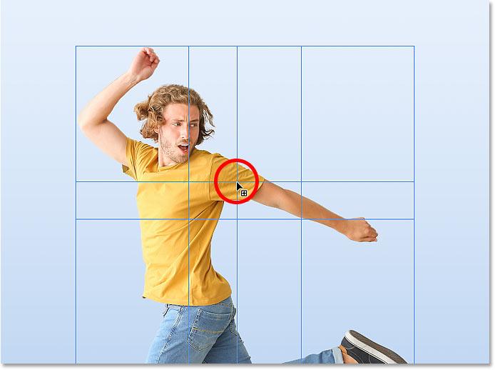

*Clicking on the image to split the grid vertically and horizontally.*

Photoshop adds a control point at the spot where I clicked. I can then click and drag the new control point to warp the image without moving any of the other points. You can add as many custom grid lines as you need, and adding new grid lines does not discard your previous changes:

*Clicking and dragging the new control point that was added.*

### A faster way to add grid lines

Here's a faster way to add grid lines. Rather than selecting one of the Split options in the Options Bar, just press and hold the **Alt** (Win) / **Option** (Mac) key on your keyboard and click on the spot where you need to split the grid. Photoshop will automatically choose the best Split option (Crosswise, Vertical or Horizontal) based on where you click.

In most cases, Photoshop will choose the **Split Crosswise** option, which adds both a vertical and horizontal grid line. But if you click close enough to an existing vertical grid line, then Photoshop will assume you want to add a horizontal line and will choose **Split Horizontal**. Likewise, clicking close to an existing horizontal grid line will make Photoshop choose **Split Vertical**.

### How to delete a custom grid line

If you split the grid in the wrong spot and need to remove it, click on a control point along the grid line to select it, and then **right-click** (Win) / **Control-click** (Mac) and choose **Remove Warp Split** from the menu:

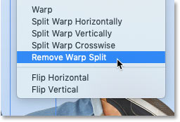

*Choosing the "Remove Warp Split" command.*

## How to accept the warp

To accept the warp, click the **checkmark** in the Options Bar:

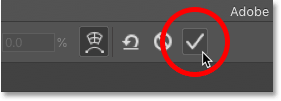

*Clicking the checkmark.*

Or to cancel and close the Warp command without saving your changes, click the **Cancel** button:

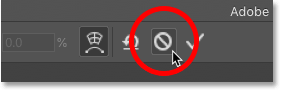

*Clicking the Cancel button.*

And there we have it! That's how to warp images using the enhanced Warp command in Photoshop CC 2020! Check out our [Photoshop Basics](/basics/) section for more tutorials. And don't forget, all of our Photoshop tutorials are available to [download as PDFs](/print-ready-pdfs/)!