# Creating Warped Text In Photoshop

> Source: [https://www.photoshopessentials.com/basics/type/warp-text/](https://www.photoshopessentials.com/basics/type/warp-text/)
> Downloaded and converted to Markdown.

In this **Photoshop Type** tutorial, we'll look at Photoshop's built-in **Warp Text** options and how they make it easy to twist, stretch and distort type into all kinds of interesting shapes, all while keeping our type, as well as the warping effect itself, completely editable!

The Warp Text options have been around for quite a while now, first introduced way back in Photoshop 6, and while the results we get from them may not have the same wow factor as many of the more advanced text effects out there, they do offer some important and impressive advantages.

First, no matter which warping option we choose, the text itself remains 100% live, editable type, which means we can go back and edit the text whenever we need to. That's a huge advantage over most of the more advanced text effects we can create since they usually force us to convert our text into either pixels or vector shapes, at which point we lose the ability to edit the text.

Another advantage with the Warp Text options is that the warping effects themselves also remain 100% fully editable. Nothing we do with them permanently changes the look of our type. Photoshop simply remembers the settings we used and essentially shows us a live preview of what those settings look like. We can go back at any time and change any of the settings. We can also switch to a completely different warping option, or we can turn the warp options off and switch back to the normal text, all without any loss of image quality. Finally, while many advanced text effects require lots of time and effort, not to mention some advanced skills, Photoshop's Warp Text options are fast and easy to use, even for beginners!

To use the Warp Text options, we first need to add some text to our document. Here's a simple design I have open on my screen with some text added in front of a background image:

*The original design.*

If we look in my Layers panel, we see that my document contains two layers, with my Type layer sitting above the image on the Background layer:

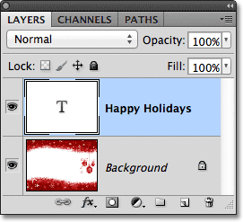
*The Layers panel showing the Type layer above the Background layer.*

Notice that my Type layer is selected (highlighted in blue) in the Layers panel. We need to have the Type layer selected before we can apply any of the Warp Text options to it. We also need to have the **Type Tool** selected, so I'll grab it from the Tools panel:

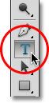
*Selecting the Type Tool from the Tools panel.*

### Choosing A Warp Style

With the Type Tool in hand and the Type layer selected in the Layers panel, click on the **Warp Text** option in the Options Bar. It's the icon that looks like a letter T with a curved line below it:

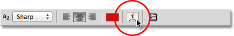
*Clicking on the Warp Text option in the Options Bar.*

This opens Photoshop's Warp Text dialog box where we can choose which warping option we want to apply. Photoshop refers to the various warping options as styles, but by default, the **Style** option at the very top of the dialog box is set to **None**, which is why nothing has happened yet to our text:

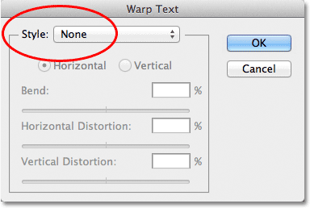
*The Warp Text dialog box.*

If we click on the word "None", we open a list of all the different warp styles we can choose from. There's 15 of them in total. If you've used Adobe Illustrator, these text warping options may look familiar since they're the exact same ones found in Illustrator. We won't go through all of them here since you can easily experiment with them on your own, but as an example, I'll choose the first style in the list, **Arc**:

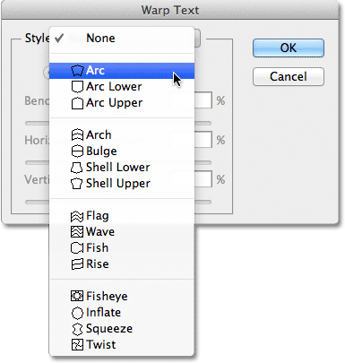
*Selecting the Arc style from the top of the list.*

As soon as I select a style, Photoshop applies it to my text in the document, giving me an instant preview of what the effect looks like:

*Photoshop shows us a live preview of the result in the document.*

### Adjusting The Warp With The Bend Option

Once we've chosen a style, we can adjust the intensity of the warping effect using the **Bend** option. By default, the Bend value is set to 50% but we can easily adjust it by dragging the slider left or right. I'll drag the slider towards the left to lower my Bend amount down to 25%:

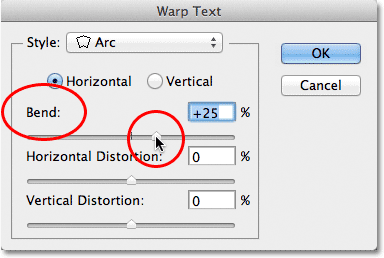
*Lowering the Bend value for the Arc style to 25%.*

And now we can see in the document that the warping effect has less "bend" to it:

*The warping effect has been reduced after lowering the Bend value.*

If we continue dragging the Bend slider towards the left, past the mid-way point, we'll move into the negative percentage values. I'll drag my Bend value to -25%:

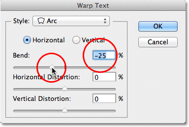
*Dragging the Bend slider into the negative values.*

This changes the shape of the bend from positive to negative so that the text now arcs downward instead of up:

*The text now arcs downward with a negative Bend value.*

### The Horizontal And Vertical Options

If you look directly above the Bend option in the Warp Text dialog box, you'll find two more options that control the direction of the warp, **Horizontal** and **Vertical**. The Horizontal option is selected for us by default and it's usually the one you'll want to use, but we can also have our text warp vertically. I'll choose the Vertical option:

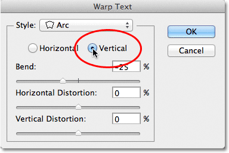
*Selecting the Vertical option.*

With Vertical selected, my text now warps from left to right rather than up or down. It's interesting, but not really what I want for this particular design. In most cases, you'll want to leave the direction set to Horizontal:

*The Arc style now warps the text from left to right with Vertical selected.*

Next, we'll look at Horizontal Distortion and Vertical Distortion, two interesting but potentially confusing options that have nothing at all to do with your chosen warp style.

### Horizontal and Vertical Distortion

There are two other options in the bottom half of the Warp Text dialog box - **Horizontal Distortion** and **Vertical Distortion**. These two options can be a bit confusing because while the Bend value controls the intensity of our chosen warp style, the Horizontal and Vertical Distortion options are completely independent effects. What makes it confusing is that Photoshop forces us to choose a style from the Style option before it gives us access to the Horizontal and Vertical Distortion sliders, but the distortion effects have nothing to do with the style we chose and in fact, we can use these sliders even if we effectively turn the warp style off.

To show you what I mean, I'll leave my warp style set to Arc, but I'll set my Bend value to 0% by dragging the slider to the mid-way point:

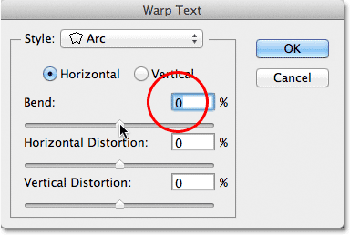
*Leaving Arc selected but setting the Bend value to 0%.*

Even though I have Arc chosen as my warp style, with Bend set to 0%, the style currently has no effect on my text because no bend is being applied:

*A Bend value of 0% effectively turns the style off.*

I'll drag the Horizontal Distortion slider to the right to set the value around 80%:

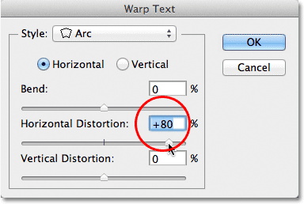
*Increasing Horizontal Distortion to 80%.*

This creates somewhat of a 3D perspective effect as if the text is moving closer to us from left to right, but all it's really doing is squishing the letters towards the left and stretching them towards the right. If you're trying to create a true perspective effect, you'll get better results using Photoshop's Free Transform command:

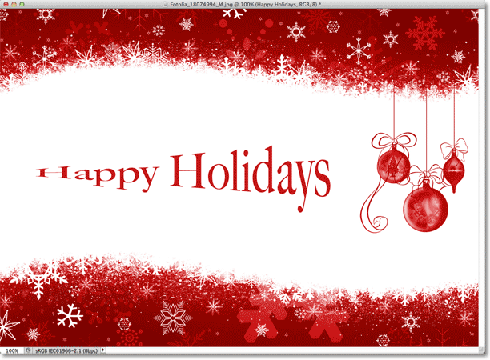
*The result of applying horizontal distortion to the text.*

Like the Bend option, we can set the Horizontal or Vertical Distortion options to negative values as well by dragging the slider to the left. I'll drag the Horizontal Distortion slider to -80%:

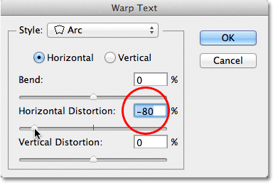
*Lowering the Horizontal Distortion to -80%.*

This gives us the same pseudo-perspective effect but in the opposite direction:

*A negative Horizontal Distortion value flips the direction of the effect.*

We can get similar results from the Vertical Distortion option except that the effect will be vertical rather than horizontal. I'll set the Horizontal Distortion option back to 0%, then I'll increase Vertical Distortion to 25% by dragging the slider to the right:

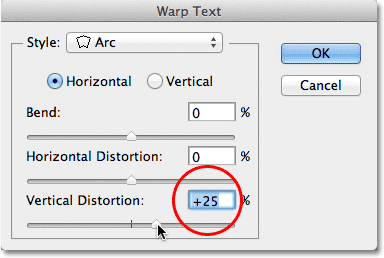
*Increasing Vertical Distortion to 25%.*

This gives the text a familiar "Star Wars" look, but again, it's not a true perspective effect. The Free Transform command would still produce better results:

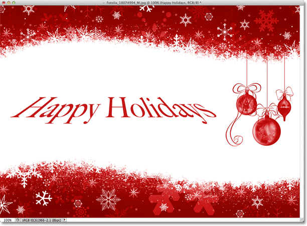
*The text with 25% Vertical Distortion applied.*

As we saw with the Horizontal Distortion option, we can flip the result by setting Vertical Distortion to a negative value. I'll drag the slider to -25%:

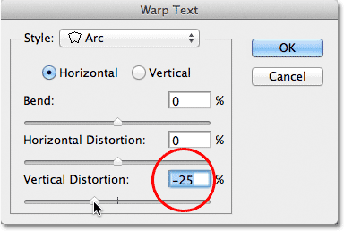
*Lowering Vertical Distortion to -25%.*

This time, we get an upside down "Star Wars" effect:

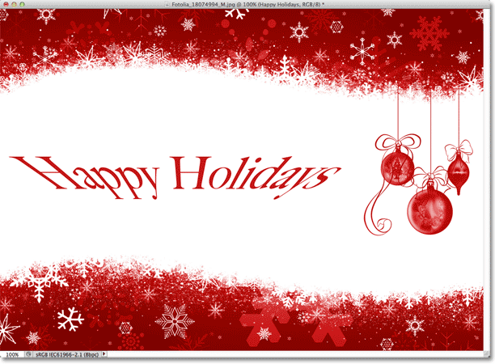
*The text with Vertical Distortion set to -25%.*

It's unlikely that you'll want to use the Horizontal and Vertical Distortion options very often, and as I mentioned, they're completely independent of the warp style you've chosen. In most cases, you'll simply want to choose a warp style from the Style option and then adjust the intensity of the warp using the Bend slider while leaving the Horizontal and Vertical Distortion options set to their default values of 0%.

### Making Changes To The Warping Effect

Once you're happy with the results, click OK in the top right corner of the Warp Text dialog box to close out of it. If you then look in the Layers panel, you'll see that the icon in the Type layer's **thumbnail** has changed to indicate that warping effects are being applied to the text on that layer:

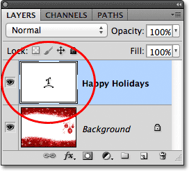
*The Type layer now displays the Warp Text icon in the thumbnail.*

As I mentioned at the beginning of the tutorial, one of the great things about these text warping options is that they're not permanently applied to the text. We can go back at any time and change any of the warp settings, including the warp style itself. To do that, make sure you have your Type layer and the Type Tool selected, then simply click again on the Warp Text icon in the Options Bar:

*Clicking again on the Warp Text option.*

This re-opens the Warp Text dialog box where you can make any changes you need. I think I'll change my warp style from Arc to **Flag**, then I'll set my Bend value to 25%:

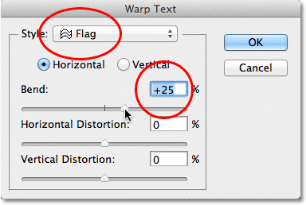
*Changing the Style from Arc to Flag and setting Bend to 25%.*

Just like that, I get a different warping effect applied to my text and all I had to do was choose a different style from the list. You can go back and make changes as many times as you like, so be sure to try out all 15 warp styles to see what effect each one will give you. You'll find that some are a lot crazier than others. To cancel the warping effect and switch back to your normal text, simply choose None from the Style option:

*The same text with the Flag style applied.*