# Best Way to Watermark Images in Photoshop CC

> Source: [https://www.photoshopessentials.com/basics/watermark-images-photoshop/](https://www.photoshopessentials.com/basics/watermark-images-photoshop/)
> Downloaded and converted to Markdown.

In this tutorial, you'll learn not only **how to add your logo or copyright information as a watermark to your images**, but also how to make sure that any changes to it instantly update across *all* your images, by adding your watermark as a linked smart object in Photoshop! Linked smart objects are very powerful, but they're only available in Photoshop CC. So to follow along, you'll need [Photoshop CC](https://prf.hn/l/dlXjD2w) and you'll want to make sure that your copy is [up to date](/basics/update-photoshop-cc/). Let's get started!

## What are linked smart objects?

Smart objects have been around since Photoshop CS2. But in Photoshop CC, Adobe introduced a new type of smart object known as a **linked smart object**. Before that, the contents of a smart object were always embedded in the document. This meant that there was no way to share a smart object *between* documents. Any changes you made to your smart object in one document would not appear in any others.

But *linked* smart objects are different. Rather than embedding their contents, a linked smart object simply *links* to an external file, like a separate Photoshop document. Multiple documents can all be linked to the same file, and any changes you make to that file will instantly appear in every document that links to it!

This makes linked smart objects perfect for things like watermarks. You can save your logo as a separate file, and then link all of your images to that file. If you edit the logo, the changes in that one file will be updated throughout all of your images. Let's see how it works!

## Creating the logo document

To add a watermark as a linked smart object, you'll first want to create your logo in a separate document. Here's the logo I created. I added some basic copyright information, like the copyright symbol and year, as well as my name and my website address below it:

*Create your logo in its own Photoshop document.*

If we look in the [Layers panel](/basics/layers/layers-panel/), we see my Type and Shape layers. I filled the Background layer with black just so I could see the white text and shapes as I was adding them:

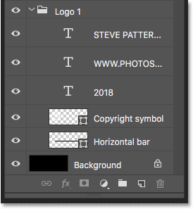
*The Layers panel showing the layers used to create the logo.*

### Turning off the Background layer

To use the file as a linked smart object, we need to save it. But I don't want the black background to appear in my images. I want a transparent background instead. So before I save it, I'll turn off the [Background layer](/basics/background-layer-photoshop-cc/) by clicking its **visibility icon**:

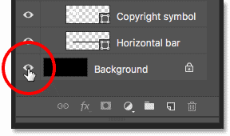
*Turning off the black background.*

This leaves the logo in front of a transparent background:

*Make sure your background is transparent before saving the logo.*

### Saving and closing the logo file

To save the file, go up to the **File** menu in the Menu Bar and choose **Save As**:

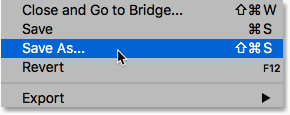
*Going to File > Save As.*

In the dialog box, name the file "logo" or whatever else makes sense. And to keep all of your layers, make sure you save it as a **Photoshop .PSD** file. Choose where you want to save it on your computer (I'll save mine to a folder on my Desktop), and then click **Save**. If Photoshop asks if you want to maximize compatibility, click OK:

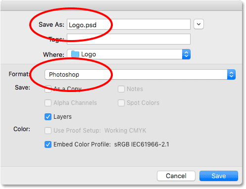
*Save the logo as a Photoshop .PSD file to keep your layers intact.*

Then to close the file, go back up to the **File** menu and choose **Close**:

*Going to File > Close.*

## How to add your logo as a watermark

Now that we've created and saved our logo, let's see how to add it as a watermark to an image. And to make sure that any changes we make to the logo will update in the image, we'll add it as a linked [smart object](/basics/how-to-create-smart-objects-in-photoshop/).

### Adding the watermark to the first image

Here's the first of three images I'll be using. All three are photos I shot recently, and I want to add a watermark to each of them:

*The first image. Photo credit: Steve Patterson.*

### How to add the watermark as a linked smart object

To add your watermark as a linked smart object, go up to the **File** menu and choose **Place Linked**. Again, this option is only found in Photoshop CC:

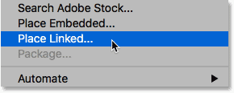
*Going to File > Place Linked.*

Navigate to your logo file, then click on it to select it and click **Place**:

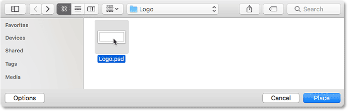
*Selecting the logo file.*

Photoshop adds the logo to the document and centers it in the image:

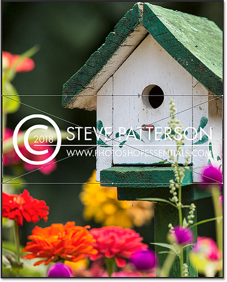
*The logo appears centered in the document.*

#### Resizing and repositioning the logo

Notice that Photoshop places the [Free Transform](/basics/photoshops-free-transform-essentials/) box and handles around the logo. To resize it, press and hold your **Shift** key, as well as your **Alt** (Win) / **Option** (Mac) key, and then click and drag any of the corner handles. The Shift key locks the aspect ratio as you're resizing it, and the Alt / Option key lets you resize the logo from its center:

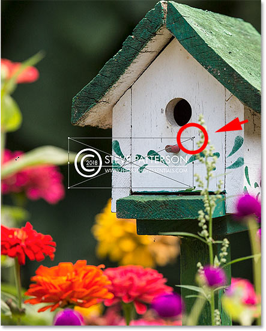
*Hold Shift+Alt (Win) / Shift+Option (Mac) as you drag the corner handles to resize the logo.*

Then click inside the Free Transform box and drag the logo into place. I'll move mine into the upper left corner. To accept it, press **Enter** (Win) / **Return** (Mac) on your keyboard to close out of Free Transform:

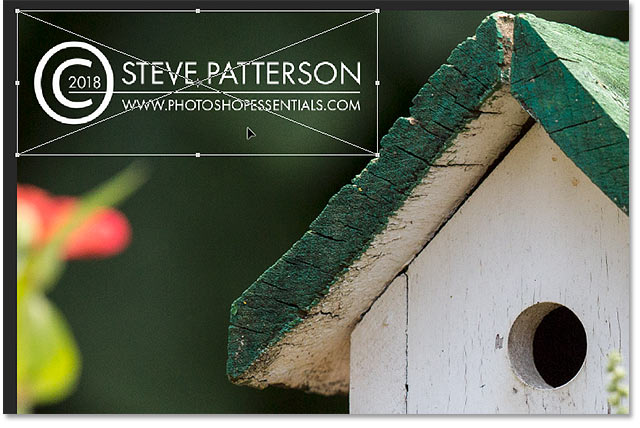
*Moving the logo into position.*

### How do we know it's a linked smart object?

If we look again in the Layers panel, we see our logo as a smart object above the image. We know it's a *linked* smart object, not an embedded smart object, by the **link icon** in the lower right of the thumbnail. I've enlarged it here to make it easier to see:

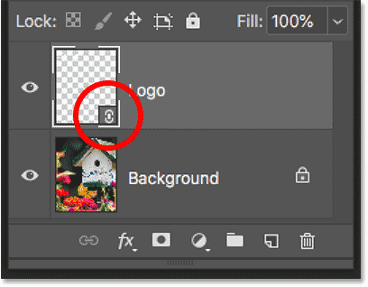
*The icon tells us which type of smart object it is.*

### Blending the watermark into the image

To fade the watermark into the image, I'll simply lower the **opacity** of the smart object from 100% down to **60%**. You'll find the Opacity option in the upper right of the Layers panel:

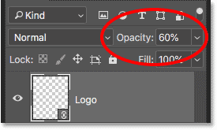
*Lowering the opacity of the logo.*

And here's the result with the watermark added to the first image:

*The first linked smart object is added.*

### Adding the watermark to the second image

Let's quickly add the same watermark to the other two images. I'll switch to my second image by clicking its tab below the Options Bar:

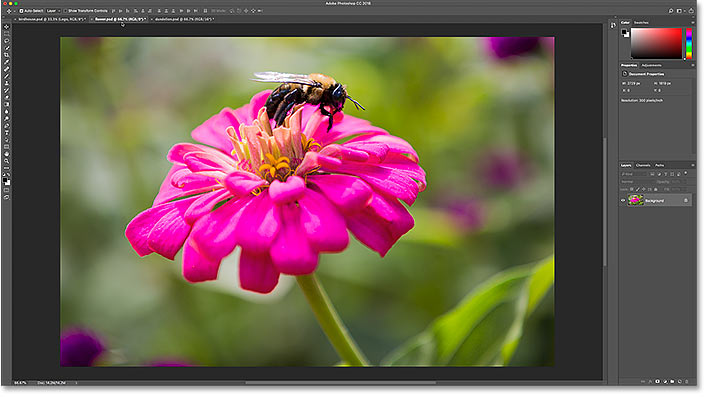
*Switching to the second image.*

Then I'll do the same thing I did before by going up to the **File** menu and choosing **Place Linked**:

*Going to File > Place Linked.*

I'll select my logo file, and I'll click **Place**:

*Selecting the logo file again.*

Photoshop again places the logo and centers it in the document:

*The logo appears in front of the second image.*

I'll press **Shift+Alt** (Win) / **Shift+Option** (Mac) as I drag the corner handles to resize it. And then I'll click inside the Free Transform box and I'll drag the logo into position. I'll move this one into the bottom right corner. To accept it, I'll press **Enter** (Win) / **Return** (Mac) on my keyboard:

*Resizing the logo and placing it in the bottom right of the image.*

#### Two smart objects sharing the same content

Again in the Layers panel, we see the logo as a linked smart object above the image. Even though this smart object is in a separate document, because its a *linked* smart object, it's sharing its contents with the smart object in the previous document. They're both sharing that same "logo.psd" file:

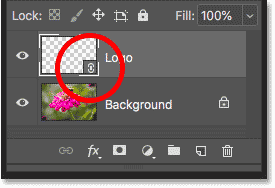
*The logo again appears as a linked smart object.*

I'll fade the logo into the image by lowering the opacity of the smart object to 60%:

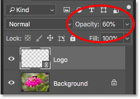
*Lowering the logo's opacity to 60%.*

And here's the result with the watermark added to the second image:

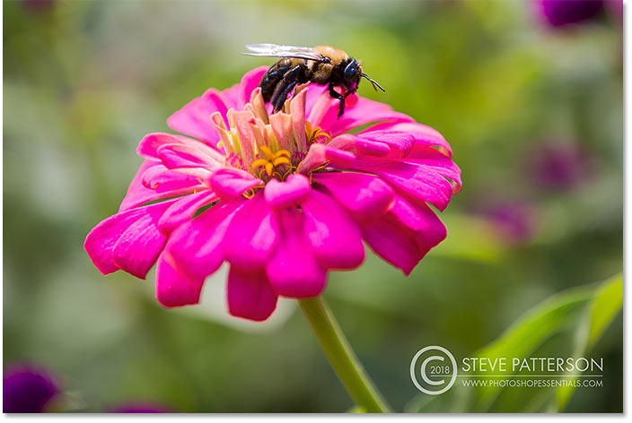
*The second linked smart object is added.*

[How to blend images together in Photoshop](/basics/three-ways-to-blend-two-images-together-photoshop/)

### Adding the watermark to the third image

I'll add it to one more photo. I'll switch over to my third image by clicking its tab:

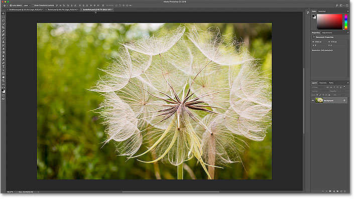
*Switching to the third image.*

Then I'll go back to the **File** menu and I'll choose **Place Linked**:

*Going to File > Place Linked.*

I'll select the same logo file, and I'll click **Place**:

*Selecting the logo file.*

Photoshop again centers the logo in the document:

*The logo is placed in front of the third image.*

I'll press **Shift+Alt** (Win) / **Shift+Option** (Mac) and I'll drag the corner handles to resize it. Then I'll drag the logo into the bottom left corner of the image. Finally, I'll press **Enter** (Win) / **Return** (Mac) to accept it:

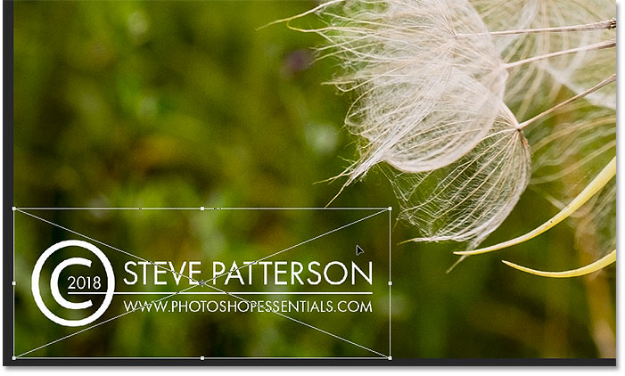
*Resizing and moving the logo into the bottom left corner.*

#### Three smart objects, one shared file

In the Layers panel, we again see the logo as a linked smart object. And we now have three smart objects, each in a separate document, all sharing that same "logo.psd" file. I'll fade the logo into the image by lowering its opacity to 60%:

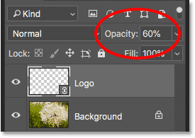
*Lowering the opacity to 60 percent.*

And here's the result with the watermark now added to the third image:

*The watermark has been added to all three images.*

### Saving and closing one of the images

Before we look at how to make changes to the logo, I'm going to save and close my third image. We'll see why I'm doing this at the end of the tutorial. To save it, I'll go up to the **File** menu and I'll choose **Save As**:

*Going to File > Save As.*

Just like with the logo file, make sure you save your image as a Photoshop .PSD file. This will keep any layers intact, including your smart object. Click **Save**, and again if Photoshop asks if you want to maximize compatibility, click OK:

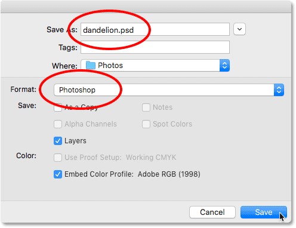
*Save the image as a Photoshop .PSD file so you don't lose your smart object.*

## How to edit the logo file

So now that we've added the logo to three separate images, what if we need to change the logo? Maybe we want something completely different, or we just need to update something about it, like our contact information. And, how to we get the change to appear in all of our images? With linked smart objects, it's easy to do.

I'll switch back to my original image by clicking its tab:

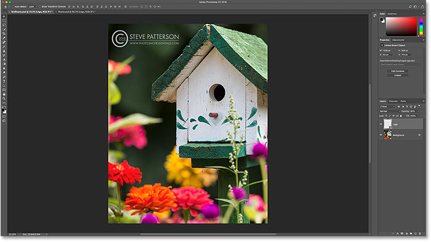
*Switching back to the original image.*

### Opening a linked smart object

To open a linked smart object and view its contents, simply double-click on the smart object's **thumbnail** in the Layers panel. You can do this in any document that shares the same linked smart object. So in my case, any of my three images would work:

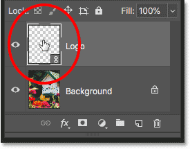
*Opening the smart object by double-clicking on its thumbnail.*

This reopens the logo file that all of my images are linking to:

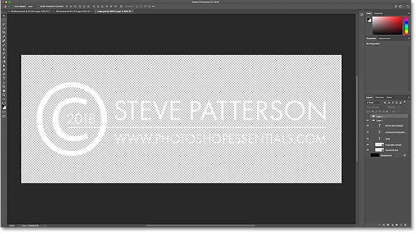
*The logo file re-opens.*

### Editing the smart object contents

To save time, I've created a new logo that I want to use in place of my original one. To see it, I'll turn the Background layer back on by clicking its **visibility icon**:

*Turning the Background layer back on.*

To keep things organized, I've placed each logo in its own separate **layer group**. I'll turn off the first logo by clicking the **visibility icon** for the "Logo 1" group, and then I'll view my new logo by turning on "Logo 2":

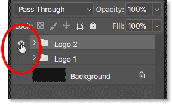
*Switching logos in the Layers panel.*

And here's the new logo in front of the black background:

*The new logo that will replace the original one.*

### Saving the changes

Again, I don't want the black background to appear in the images, so before I save it, I'll turn off the Background layer:

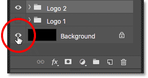
*Clicking the Background layer's visibility icon.*

And then, to save my change, I'll go up to the **File** menu and I'll choose **Save**:

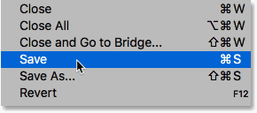
*Going to File > Save.*

Since I don't need to keep the document open, I'll close it by going back to the **File** menu and choosing **Close**:

*Going to File > Close.*

[How to edit smart objects in Photoshop](/basics/how-to-edit-and-replace-smart-object-contents-in-photoshop/)

## Updating the watermark in the images

This returns us to the image. And just like that, Photoshop updated the smart object with my new logo. Depending on the changes you've made, you may need to reposition the logo with the Move Tool:

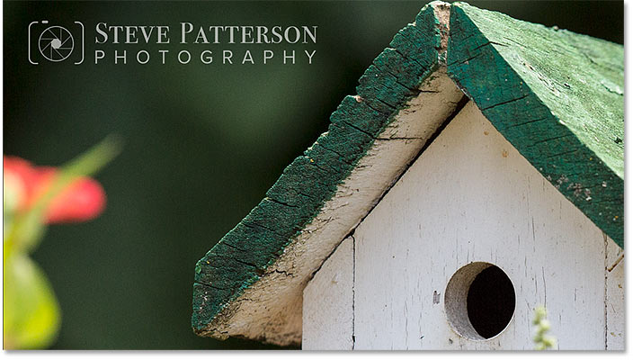
*The new logo instantly appears in the image.*

I'll switch over to my second image, and here again we see that the original logo has been replaced with the new one. Just by changing that one file, both images were instantly updated:

*The second image is also updated with the new logo.*

### How to update an image that was closed

The reason that Photoshop instantly updated both images was not only because they're both linking to a shared file, but also because both documents were *open* in Photoshop when I made the change. But Photoshop won't automatically update a document that was not open, even if it also links to the same shared file.

To show you what I mean, and how to fix it, I'll reopen my third image, the one I closed earlier, by going up to the **File** menu and choosing **Open**:

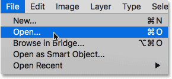
*Going to File > Open.*

I'll navigate to the file, and then I'll double-click to open it:

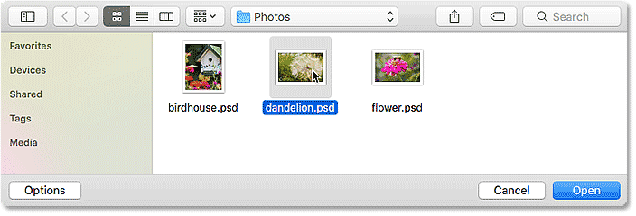
*Reopening the third image.*

And notice that this image is still showing the original logo, even though it's linking to the same file as the others. That's because the document was closed when I made the change:

*The logo in the image that was closed did not update.*

### Updating modified content

If we look in the Layers panel, notice the small **warning icon** in the lower right of the smart object's thumbnail. This icon tells us that the contents of the smart object have changed since the last time the file was opened, and it needs to be updated:

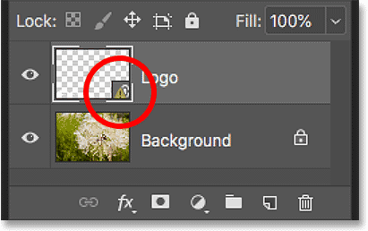
*The warning icon.*

To update it, make sure the smart object is selected. Then go up to the **Layer** menu, choose **Smart Objects**, and then choose **Update Modified Content**. Or if you have several smart objects that all need to be updated, choose **Update All Modified Content** instead:

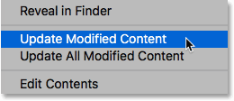
*Going to Layer > Smart Objects > Update Modified Content.*

As soon as you select it, Photoshop updates the smart object with the new content, and just like that, our new logo appears:

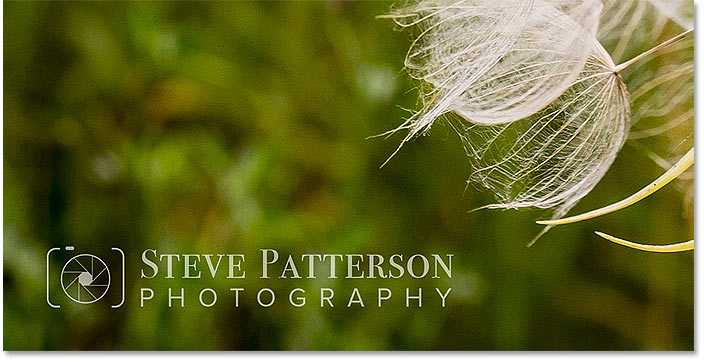
*Updating the smart object replaced the old logo with the new one.*

And there we have it! That's how add a watermark to your images, and how to update your changes, using linked smart objects in Photoshop! Be sure to check out our [Photoshop Basics](/basics/) section for more smart object tutorials! And don't forget, all of our Photoshop tutorials are now available to [download](/print-ready-pdfs/) as PDFs!