# How To Manage And Organize Your Images With Adobe Bridge

> Source: [https://www.photoshopessentials.com/basics/what-is-adobe-bridge/](https://www.photoshopessentials.com/basics/what-is-adobe-bridge/)
> Downloaded and converted to Markdown.

Learn all about Adobe Bridge and how to use Bridge to find, organize and preview your images. Topics include the Bridge interface and panels, full screen previews, Review Mode, applying star ratings, adding keywords and copyright information, filtering images, and more!

So far in this Getting Started with Photoshop series, we've been focusing on **Adobe Bridge**. We learned [how to install Adobe Bridge CC](/basics/install-adobe-bridge-cc/ "How to install Adobe Bridge CC") (the version of Bridge included with every Creative Cloud subscription). And we learned how to use Bridge to [download photos from your camera](/basics/how-to-download-photos-from-your-camera-with-adobe-bridge/ "How to download photos from your camera with Adobe Bridge") to your computer.

In this tutorial, we'll learn more about Adobe Bridge itself. We'll learn what exactly Bridge is and why we want to use it. We'll look at the Adobe Bridge interface along with some of the main features in Bridge. By the end of this tutorial, we'll have a good sense of why Bridge is such a great tool for finding, organizing and previewing our images. I'll be using **Adobe Bridge CC** but everything is fully compatible with **Bridge CS6** (the version included with Photoshop CS6).

This is lesson 4 of 8 in [Chapter 1 - Getting Started with Photoshop](/basics/getting-started-photoshop/ "Learn more") series.

Let's get started!

## What Is Adobe Bridge?

Adobe Bridge is a companion program for Photoshop. Bridge is often referred to as a *digital asset manager*, or a *media manager*. That's because Adobe Bridge gives us powerful ways to find, manage and organize our ever-growing collection of images. In fact, Bridge isn't limited to just photos, or just Photoshop. Bridge is actually a companion program for *every app* in the Adobe Creative Cloud (or the Creative Suite). We can use Bridge to manage not just images but also Adobe Illustrator files, InDesign files, videos, and more! Since we're mainly interested in Photoshop, we'll focus on how we can use Bridge with our photos.

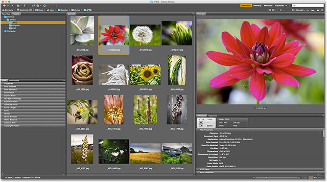
*Adobe Bridge.*

## Adobe Bridge Features Overview

Before we look at Adobe Bridge in more detail, let's quickly go over some of the many great features that Bridge has to offer.

### 01. Bridge Is A File Browser

At its most basic, Adobe Bridge is a **file browser**. Bridge is similar in many ways to the file browser you use with your computer's operating system. As we've already seen, we can use Bridge to [download our photos](/basics/how-to-download-photos-from-your-camera-with-adobe-bridge/ "How to download photos from your camera with Adobe Bridge") from our camera or memory card. But we can also use Bridge to find the images we're looking for on our computer. Bridge lets us copy or move images from one folder to another. It can also copy or move entire folders from one location to another. With Bridge, we can create new folders, rename folders and images, and delete folders and images. Every basic function we can perform using our operating system's file browser, we can do with Adobe Bridge.

### 02. Bridge Is A File Management System

If we can already do these things with our normal file browser, why bother learning how to do them in Bridge? The reason is simple. Bridge is not *just* a file browser. Adobe Bridge is a **complete file management system**. For starters, Bridge can display **thumbnail previews** of all the images in a folder. Sure, your operating system's file browser can also display thumbnails. But the thumbnails in Bridge are **fully customizable**. We can adjust the size of the thumbnails in Bridge just by dragging a slider. Bridge can also display more information about an image (the file name, pixel dimensions, date created, copyright info, and more) below its thumbnail.

Also, Bridge lets us easily change the **sort order** of the images. We can order images by file name, file type, the date each file was created or modified, or by file size or dimensions. We can also order images by **star rating** (more on that later) or some other criteria. And we can manually change the sort order just by dragging the thumbnails around!

### 03. Bigger And Better Image Previews

Along with changing the size of the thumbnails, Bridge gives us other ways to preview our images. The **Preview panel** in Bridge displays a larger preview of each image we select. And one of the best features of Bridge is the **Full Screen Preview** mode. It lets us instantly jump to a full screen view of any image for a closer look!

### 04. Image Review Mode

The **Review Mode** in Bridge lets us sort through an entire range or series of images. This makes it easy to separate the keepers from the "others". Review Mode lets us quickly cycle through image after image, keeping only the ones we like and dropping the rest!

### 05. Adding Ratings And Labels To Images

I mentioned that one of the ways we can sort our images in Bridge is by **star rating**. Bridge lets us quickly apply ratings to our images using a one-to-five-star system. An image you absolutely love may get five stars, while another image that's "okay but needs work" may get only one star. Other images that are beyond hope (hey, it happens to all of us) may get no stars at all. Or you can label an image as "Reject" if it's so bad, it's embarrassing.

Along with star ratings, Adobe Bridge also lets us apply **color labels** to images. A yellow label can indicate images that still need work. Green can be used for ones that have already been approved. We choose the meaning of each color ourselves, so how you use them is completely up to you!

### 06. Adding Keywords And Copyright Information

Bridge lets us add important **copyright information** to our photos. And, we can view and edit a whole range of additional information (**metadata**) about our images. We can create and apply **keywords** to our images with Bridge, making it easier for us (and others) to find those images when we need them.

### 07. Filtering Images And Creating Collections

Bridge can filter images to show us just the photos that meet certain criteria. We can view only images with a five star rating. Or only the images shot with a certain lens, or at a certain focal length. Bridge can combine photos into **collections** that make it easy for us to group related images together. Collections can even group images that are scattered across different folders or even different hard drives. And **smart collections** in Bridge act like dynamic search results. Smart collections tell Bridge to automatically add any images to the collection if and when they meet the criteria we specify.

### 08. Batch Renaming Files

The **Batch Rename** feature in Bridge lets us quickly rename multiple files at once. In the [previous tutorial](/basics/how-to-download-photos-from-your-camera-with-adobe-bridge/ "How to download photos from your camera with Adobe Bridge"), we learned that we can rename our files in the Photo Downloader as we're downloading them from our camera. But the Batch Rename command is the better way to do it. Batch Rename is more powerful, and it lets us rename our files after we've deleted the ones we don't want to keep. This means there won't be any breaks in the naming sequence (which makes it look like some of the images are missing).

### 09. Quick Access To Photoshop

As we'll see in the [next series](http://www.photoshopessentials.com/opening-images-photoshop-learning-guide/ "Opening Images in Photoshop Learning Guide") of tutorials, Bridge makes it easy to [open our images into Photoshop](/basics/open-images-photoshop-adobe-bridge/ "How to open images into Photoshop from Adobe Bridge"). But Bridge also gives us access to some of Photoshop's powerful image processing commands. **Lens Correction**, **Merge to HDR Pro**, **Photomerge** and others are all available from directly within Bridge itself. Adobe Bridge is also the best way to open images into Photoshop's image editing plugin, [Camera Raw](/basics/open-image-camera-raw/ "How to open images into Camera Raw"). Again, we'll come back to that in the next series, [Opening Images Into Photoshop](http://www.photoshopessentials.com/opening-images-photoshop-learning-guide/ "Opening Images in Photoshop Learning Guide").

And that's a quick run through of some of the main benefits and features of Adobe Bridge. Let's look at some of these features in more detail. We'll start with a general overview of the Bridge interface. Then, we'll look more closely at some of Bridge's key features.

## How To Launch Adobe Bridge

Let's start by learning how to open Adobe Bridge. It may be a companion app for Photoshop, but Bridge is actually its own separate program. We can open Bridge the same way we open Photoshop or any other program on our computer. On a Windows PC, Bridge can be opened from the Start menu. On a Mac, Bridge is found in the Applications folder. Photoshop does not need to be open for us to open Bridge. But we *can* open Bridge from *within* Photoshop.

If you're a Creative Cloud subscriber, make sure you've [downloaded and installed Bridge CC](/basics/install-adobe-bridge-cc/ "How to install Adobe Bridge CC") before you continue. Then, in Photoshop, open Bridge by going up to the **File** menu and choosing **Browse in Bridge**. You can also open Bridge from the keyboard by pressing **Ctrl+Alt+O** (Win) / **Command+Option+O** (Mac). And here's a quick tip. The keyboard shortcut will switch you back and forth between Photoshop and Bridge each time you press it:

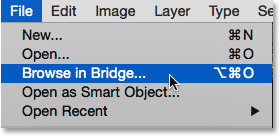
*In Photoshop, go to File > Browse in Bridge.*

The Browse in Bridge command will open Adobe Bridge if it wasn't open already. If Bridge was already running, Browse in Bridge will switch you from Photoshop over to Bridge. Photoshop will continue running in the background. Here's what the default Bridge interface looks like. We'll look at it more closely in the next section:

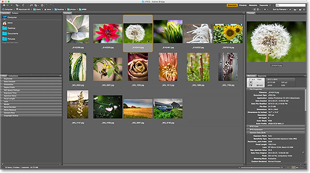
*The Adobe Bridge interface.*

## The Adobe Bridge Interface

Like Photoshop, Adobe Bridge provides us with a collection of **panels**. In fact, the Bridge interface is made up almost *entirely* of panels. The **Folders** panel in the upper left lets you navigate through the folders and directories on your computer to find your images. Nested in with the Folders panel is the **Favorites** panel. Favorites gives you quick access to the folders and directories you use the most. The **Content** panel in the center displays thumbnails of your images.

In the upper right is the **Preview** panel, showing a larger preview of whichever thumbnail is selected. Metadata about your images, including copyright information, can be viewed and edited in the **Metadata** panel. The **Keywords** panel lets us create keywords and apply them to our photos. The **Filter** panel makes it easy to filter images so we're only seeing the ones we need. And the **Collections** panel lets us group related images together.

### The Folders and Favorites Panels

Usually, the first thing we want to do after opening Bridge is find some images to work on. That's where the two panels in the upper left, Folders and Favorites, come in. The **Folders** panel is our main way of navigating to our images. It displays the folders on your computer in a familiar and easy-to-use "tree" structure. The **Favorites** panel lets us quickly access the folders and file locations we use the most, just like bookmarks in your web browser!

Adobe Bridge groups related panels together to save space, just like Photoshop does. And just like in Photoshop, we can switch between panels in a group by clicking on the **name tabs** along the top of the group. Here, we're seeing the Favorites panel. By default, Bridge adds some common file locations to the Favorites panel, like your Desktop, Documents folder and Pictures folder. We can quickly jump to any of these locations by clicking on them. We can also add our own folders and file locations to the Favorites panel. We'll learn how to do that in a moment:

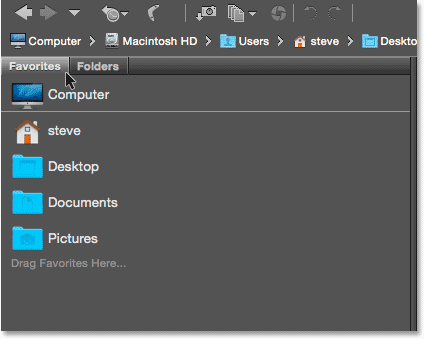
*The Favorites panel gives us quick access to commonly-used file locations.*

#### The Folders Panel

To switch from Favorites to the Folders panel, click on the Folders tab:

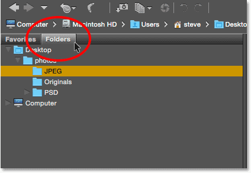
*Click the tabs to switch between panels in a group.*

The Folders panel is our main way of navigating to our images. It lets us drill down through our folders to get to the files we need. Clicking the **triangle** to the left of a folder will twirl that folder open, revealing the folders inside it. Keep making your way down through your folders until you reach the one that holds your images. Here, we can see that I currently have a folder named "JPEG" selected. The "JPEG" folder is inside a parent folder named "photos". And the "photos" folder is sitting on my Desktop:

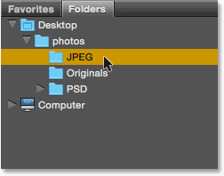
*Twirl folders open to view the folders inside them.*

#### Adding Folders To The Favorites Panel

We can easily add a folder to the Favorites panel. Let's say I know I'll be coming back to my "JPEG" folder again and again. Rather than navigating to it manually each time, I can simply add the "JPEG" folder to my Favorites. To add a folder to your Favorites, **right-click** (Win) / **Control-click** (Mac) on it in the Folders panel. Then choose **Add to Favorites** from the menu:

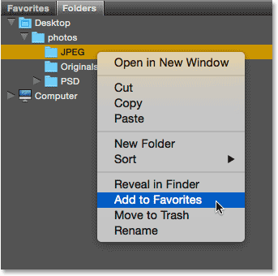
*Adding a folder to my Favorites.*

I'll switch back to my Favorites panel by clicking on its tab. And here we see that my "JPEG" folder has been added to the list. The next time I need to access the folder, I'll be able to quickly jump right to it:

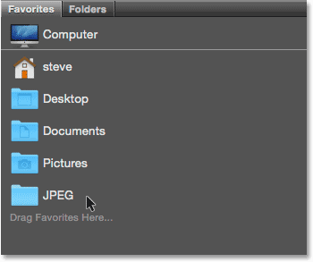
*The "JPEG" folder has been saved as a favorite.*

### The Path Bar

The **Path Bar** along the top of the Bridge interface gives us another way to see our current file location. Here again, we see that I'm in the "JPEG" folder which is inside the "photos" folder on my Desktop. But the Path Bar doesn't just show us where we are. It also lets us quickly jump to any other location along the path. For example, if I wanted to jump to my Desktop, all I would need to do is click on "Desktop" in the Path Bar and Bridge would take me right there:

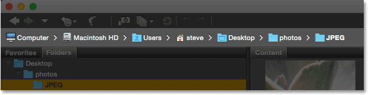
*The Path Bar shows us our current location and lets us jump to any parent location.*

### Back And Forward Buttons

Bridge also gives us familiar **Back** and **Forward** buttons in the upper left corner. These buttons act just like the Back and Forward buttons in your web browser. Use them to move back and forth through your navigation history:

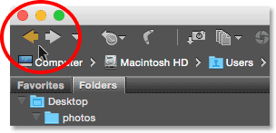
*The Back and Forward buttons in Bridge.*

### Downloading Photos From The Camera With Bridge

If the images you need are still on your camera or memory card, Bridge makes it easy to download them to your computer. You'll find a small **camera icon** in the **toolbar** along the upper left of the interface. This is the **Get Photos from Camera** icon:

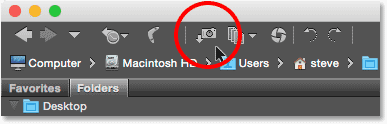
*Clicking the Get Photos from Camera icon in the toolbar.*

Clicking the camera icon opens the **Adobe Photo Downloader**. Here, we can choose the camera or memory card that holds our images. We can then choose the location where we want to store the images on our computer. We can rename the files as they're being downloaded, add copyright information to them, and more! I covered [how to download photos from your camera](/basics/how-to-download-photos-from-your-camera-with-adobe-bridge/ "How to download photos from your camera with Adobe Bridge") in the previous tutorial:

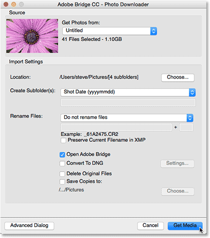
*The Adobe Photo Downloader is built in to Adobe Bridge.*

### The Content Panel

Once we've navigated to our images using the Folders or Favorites panel, they appear as thumbnails in the **Content** panel. The Content panel is the largest panel in Bridge, taking up the entire section in the middle. Here, we see thumbnail previews of all the images inside my "JPEG" folder:

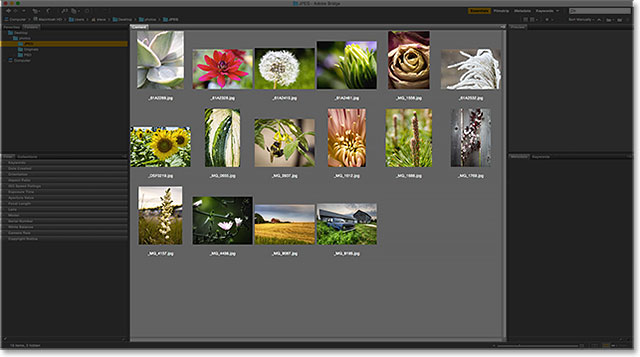
*The Content panel displays thumbnail previews of the images.*

The **slider** along the bottom right of the Bridge interface makes it easy to adjust the size of the thumbnails. Drag the slider to the right to make the thumbnails larger. Drag to the left to make them smaller. There's also an icon on either side of the slider bar. Clicking the icons will increase (right icon) or decrease (left icon) the thumbnail size incrementally:

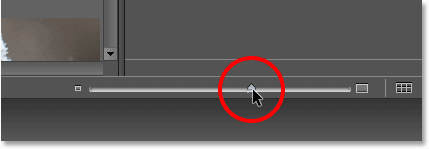
*Drag the slider to change the size of the thumbnails.*

Here we see that after dragging the slider to the right, my thumbnails are now much bigger. In fact, they're *so* big that only a few of them can fit within the Content panel's viewable area. The **scroll bar** along the right of the Content panel lets us scroll through our thumbnails when they're either too large, or when there's just too many, to fit all of them on the screen at once:

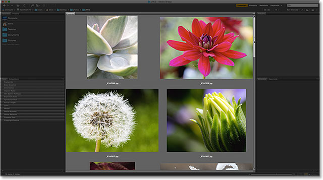
*Use the scroll bar to scroll up and down through the thumbnails when needed.*

### The Preview Panel

To select an image in the Content panel, click once on its thumbnail. A preview of the image will appear in the **Preview** panel in the upper right of the Bridge interface:

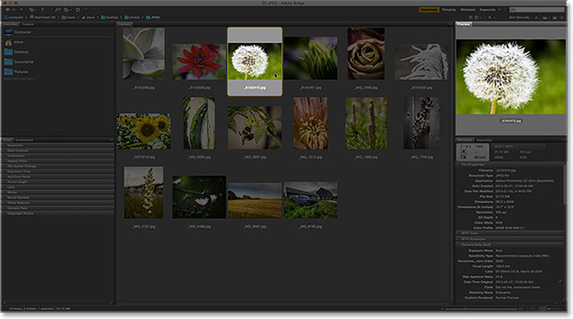
*Selecting a thumbnail in the Content panel shows a preview of the image in the Preview panel.*

### Resizing Panels In Bridge

If you find that the preview is too small, as mine is, you can easily resize the Preview panel to make it larger. In fact, we can resize *any* of the panels in Bridge in exactly the same way. Simply hover your mouse cursor over the **vertical divider line** on the left or right of a panel. Or, over the **horizontal divider line** above or below a panel. Your cursor will change into a resize icon with two arrows pointing in opposite directions. Click and drag the divider line to resize the panel as needed. You'll notice that as you resize the Preview panel, the image inside the panel resizes along with it:

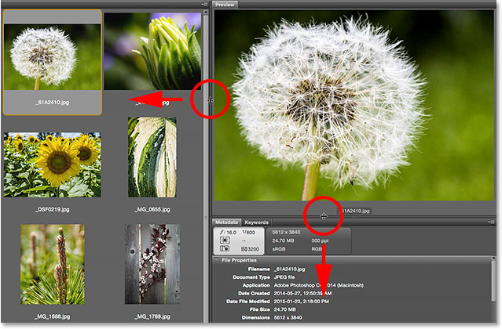
*Clicking and dragging the divider lines to resize the Preview panel.*

Increasing the size of one panel in Bridge decreases the size of other panels (since there's only so much room on the screen). In this case, by making the Preview panel larger, I've made my Content panel smaller. That's okay, though, because personally, I'd rather use the space for larger previews. You can customize the interface any way you like:

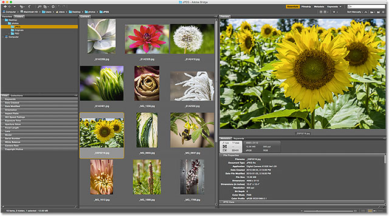
*Making the Preview panel larger made the Content panel smaller.*

### Full Screen Previews

While the Preview panel is nice, the Full Screen Preview option in Bridge is even better! With a thumbnail selected in the Content panel, go up to the **View** menu in the Menu Bar along the top of the screen and choose **Full Screen Preview**. Or just press the **spacebar** on your keyboard:

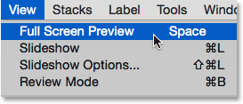
*Going to View > Full Screen Preview.*

This instantly jumps your image to a full screen view, with the entire image fitting on the screen. If the aspect ratio of your image isn't the same as the aspect ratio of your screen, you'll see gray bars either on the sides or along the top and bottom:

*The full screen preview.*

#### The 100% View

Clicking on the image while in the full screen view will zoom you in to a **100% view**. In the 100% view, each pixel in the image takes up exactly one screen pixel. This makes it easier to judge the sharpness and focus of the image. You can click and drag the image around while in the 100% view mode to view and inspect different areas. To zoom back out, click once again on the image. To exit Full Screen Preview mode completely, press the **spacebar** again on your keyboard:

*Click and drag the image around while in the 100% view to inspect different areas.*

### Review Mode

The Full Screen Preview mode is great for viewing single images. But what if you need to quickly browse through an entire folder of images? That's where the Review Mode in Bridge really shines. Just go up to the **View** menu at the top of the screen and choose **Review Mode**. Or press **Ctrl+B** (Win) / **Command+B** (Mac) on your keyboard:

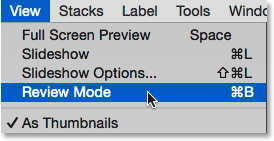
*Going to View > Review Mode.*

Review Mode displays your images as a rotating carousel. You can rotate from one image to the next using the **left and right arrows** in the bottom left corner of the screen. You can also press the **left and right arrow keys** on your keyboard. When you come to an image you don't want to keep, press the **down arrow** in the bottom left of the screen (or the **down arrow key** on your keyboard). This will drop the image from the selection and move on to the next image. When you're done reviewing your images, click the "**X**" in the bottom right corner or the **Esc** key on your keyboard. This will close Review Mode. Back in the Content panel, only the images you didn't drop during the review process will be selected:

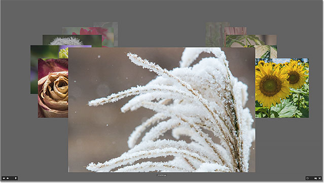
*Review Mode is great for comparing many images quickly.*

#### The Loupe Tool

While in Review Mode, we can click on an image to bring up the **Loupe Tool**. The Loupe Tool in Adobe Bridge acts like a magnifying glass. It magnifies the spot we clicked on so we're seeing it at the 100% zoom level. This makes it easy to check the sharpness and focus of an image. Click and drag the Loupe Tool around to inspect different areas. To close the Loupe Tool, click anywhere inside of it:

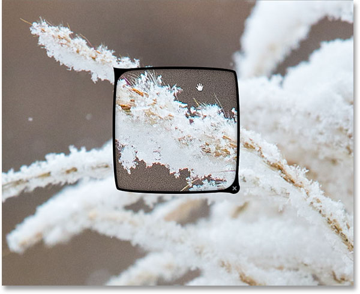
*Using the Loupe to inspect an area of the image at 100%.*

### Rating Images

To make it easy to separate good images from bad, Bridge lets us apply **ratings** to our images. It uses a popular one-to-five-star rating system. To show how ratings work, I've selected three images in my Content panel. The images I chose are the second, third and fourth in the top row. To select multiple images at once, press and hold the **Ctrl** (Win) / **Command** (Mac) key on your keyboard and click on the images you need. Or, if all the images you want to select are in a continuous row, there's an easier way. Click on the thumbnail of the first image to select it. Then, press and hold your **Shift** key and click on the last image. This will select the first image, the last image and all images in between.

Notice that with three images selected, my Preview panel is displaying larger previews of all three images. The Preview panel can display up to nine images at a time:

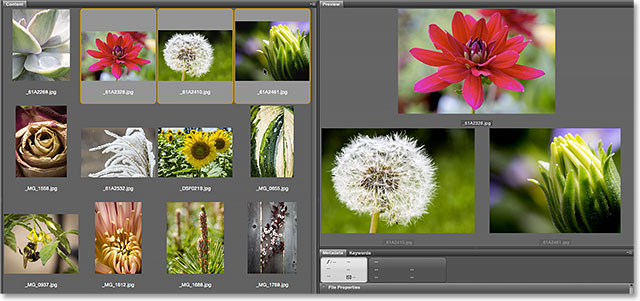
*Three images in the top row of the Content panel are selected. All three appear in the Preview panel.*

Let's say I decide I really like these three photos. I may want to indicate that by giving them a five star rating. With all three images selected, I'll go up to the **Label** menu at the top of the screen. From there, I'll choose **five stars**. Choose **No Rating** to clear the previous rating from the image. For images you know you don't want to keep, choose **Reject**:

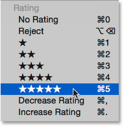
*Choosing the five star rating from the Label menu.*

Notice that all three images now show a five star rating below their thumbnail:

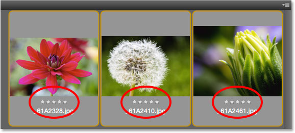
*The ratings appear below the thumbnails in the Content panel.*

### Filtering Images By Star Rating

Once you've rated some images, you can filter the Content panel to show only images with a certain rating. Click the **Filter Items by Rating** icon (the star) in the upper right of the Bridge interface. Then, choose an option from the menu. To view only my 5 star images, I'll choose **Show 5 Stars**:

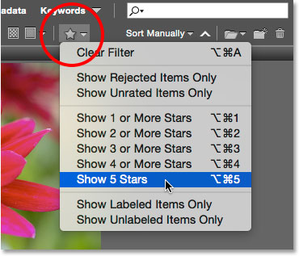
*Filtering the images in the Content panel based on their star rating.*

And now, only those three images with a 5 star rating remain in the Content panel. Images with fewer than 5 stars, or no rating at all, are temporarily hidden. We can also choose to view only rejected images, or images with no rating. Or, we can view only images with our without a color label assigned to them:

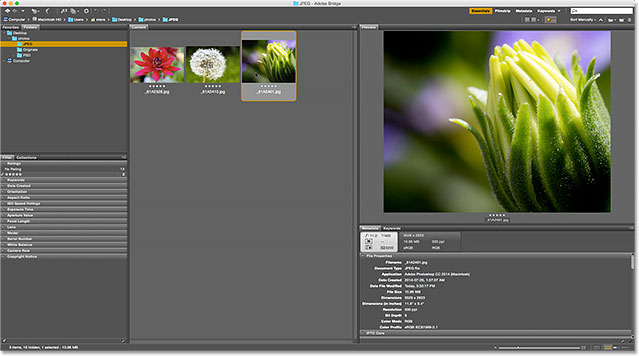
*All images with less than five stars are now hidden from view.*

#### Clearing The Filter

To view all of your images once again, click on the **Filter Items by Rating** icon and choose **Clear Filter** from the top of the menu:

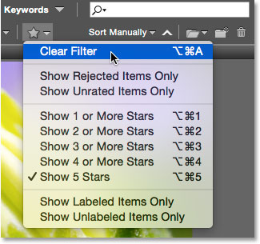
*Clearing the filter.*

With the filter cleared, the Content panel once again displays all images in the folder:

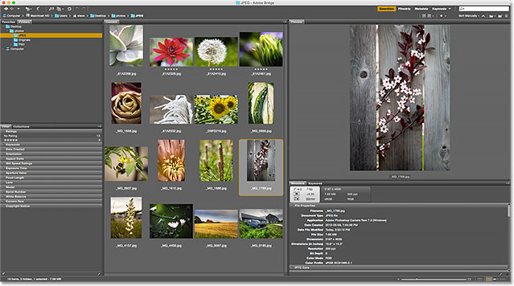
*Clear the filter to bring back all images.*

### The Metadata Panel

Below the Preview panel on the right are the **Metadata** and **Keywords** panels nested together in a group. Both of these panels are extremely valuable. The Metadata panel displays everything we'd want to know about an image. We can view the shot date, the camera settings that were used, and the file size and type. We can also view the image's color mode and bit depth, or whether or not the flash fired, and lots more. The Metadata panel can also be used to add additional details to the image, like our copyright and contact info. Use the scroll bar along the right to scroll through all the details. Click on the various category headings (File Properties, IPTC Core, and so on) to open and close them:

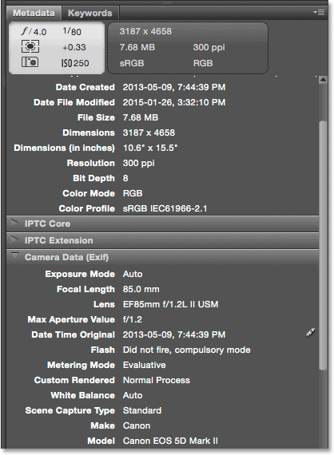
*The Metadata panel lets us view and edit information about an image.*

### The Keywords Panel

The Keywords panel is nested in beside the Metadata panel. Click on the Keywords **tab** to open it. The Keywords panel lets us create descriptive keywords and assign them to images. Later, when we need to find those images again, we can search for them by their keywords. To add a new keyword, click the **New Keyword** button at the bottom, then type in your keyword. To assign an existing keyword to an image, select the image in the Content panel. Then, click inside the checkbox of the keyword you want to assign. You can assign multiple keywords to the same image. To remove a keyword, select the image in the Content panel, then uncheck the keyword:

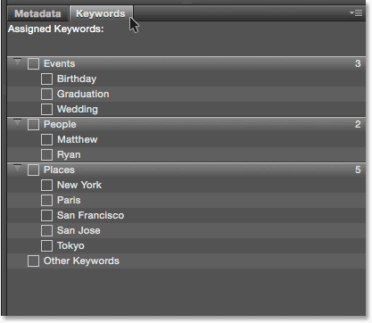
*Use the Keywords panel to add descriptive keywords to images, making it easy to find them later.*

### The Filter Panel

Below the Favorites and Folders panel on the left of Bridge is the **Filter** panel. Earlier, we saw that we can filter images displayed in the Content panel based on their star rating. But that's nothing compared with what the Filter panel can do. We can use the Filter panel to filter images by keyword, the date created, whether the image is in landscape or portrait orientation, by aperture, shutter speed and ISO settings, focal length, and lots more. We can even filter images by camera model or the particular lens that was used.

To use the Filter panel, click on the various category headings to open and close them. Then click on any of the filter options in the category to select them. Note that you won't always see every filtering option listed. That's because the Filter panel in Bridge is dynamic. The options you see are based on the images in your currently-selected folder. For example, it may be that all of the images in the folder use landscape orientation. Since none of them use portrait orientation, the Portrait option will not be displayed in the Orientation category:

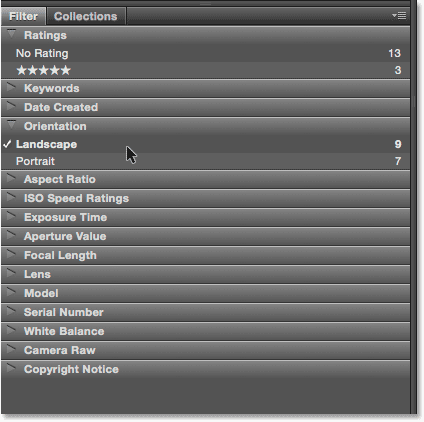
*The Filter panel lets us get very specific about which images we're seeing.*

### The Collections Panel

Nested in with the Filter panel is the **Collections** panel. Collections allow us to group related images together. The images may be scattered all over your computer or even across different hard drives. Once images have been added to a collection, they can be viewed and accessed as easily as if they were all in the same folder. The Collections panel in Bridge is also where we create **smart collections**. A smart collection tells Bridge to automatically add images to a collection if they match certain criteria. We'll learn more about collections and smart collections in another tutorial.