# Why Do We Need Selections In Photoshop?

> Source: [https://www.photoshopessentials.com/basics/selections/why-make-selections/](https://www.photoshopessentials.com/basics/selections/why-make-selections/)
> Downloaded and converted to Markdown.

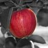

As you may have already discovered on your own if you've read through any of our other Photoshop tutorials here at Photoshop Essentials, I'm a big fan of "why". Lots of people will happily tell us *how* to do something, but for whatever reason, the *why* is usually left out, forever limiting our understanding of what it is we're doing.

Take selections in Photoshop, for example. There's no shortage of ways to select things in an image with Photoshop. We can make simple geometric selections with the [Rectangular Marquee Tool](/basics/rectangular-marquee-tool/) or the [Elliptical Marquee Tool](/basics/elliptical-marquee-tool/), or freehand selections with the [Lasso](/basics/lasso-tool/), [Polygonal Lasso](/basics/polygonal-lasso-tool/) or [Magnetic Lasso](/basics/magnetic-lasso-tool/) Tools. We can select areas of similar color or brightness values with the [Magic Wand](/basics/magic-wand-tool/) or Color Range command. We can paint or refine a selection manually with a brush in Quick Mask mode or by using a layer mask. We can make surgically-precise selections with the [Pen Tool](/basics/pen-tool-selections/), and more! We can even combine different selection methods when none of them by themselves seem to be up to the challenge.

None of this, however, explains why we need to make selections in the first place, so in this tutorial, we'll take a quick look at the "why". This won't be a detailed explanation of how to make selections. We'll save that for other tutorials. Here, we're simply going to look at why we need to make selections at all.

This tutorial is from our [How to make selections in Photoshop](/basics/make-selections-photoshop/ "Learn how to make selections in Photoshop") series.

### Do You See What I See?

As I write this, summer is once again coming to an end. The days are getting shorter, the nights are cooler, and around here, with autumn fast approaching, the weekend farmers markets will soon be filled with bushels and bushels of apples. In fact, here's some right now just waiting to be picked:

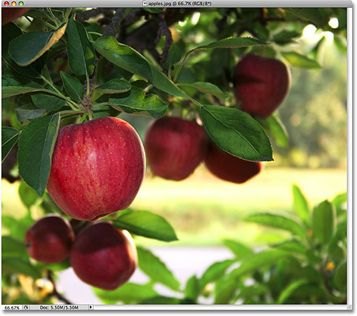
*Red, delicious apples. Unless of course, you don't like apples, but who doesn't like apples?*

Obviously, the main subject in the photo above is the apples, right? But why is it obvious? How do we know that we're looking at apples? We know because most of us have seen enough apples in the past that we can instantly recognize them. We know their shape, their color and their texture because we've seen them before. We could even point to each apple in the photo if someone asked us to without mistakenly pointing at a leaf or something else that isn't an apple because we have no problem distinguishing between all the different objects in the image. We see things with our eyes and our brain tells us that this is this and that is that, and this is not that and that is not this. In fact, even if we had never seen an apple before, we could at least point to all the objects that look relatively the same. We're so good at recognizing and identifying objects that we usually do it without consciously thinking about it.

That's great for us, but what about Photoshop? Does Photoshop see the apples? Does Photoshop recognize their shape, color and texture as "apple"? Can it point to all the apples in the photo without confusing an apple with a leaf, or at least point to all the objects that look the same?

The simple answer is no, it can't. No matter how many photos of apples you've opened in Photoshop in the past (geez, what is it with you and apples?), Photoshop has no idea what apples are or what they look like. The reason is because all Photoshop sees is **[pixels](/essentials/pixels.php)**. It doesn't matter if it's a photo of apples, oranges or monkeys eating bananas. To Photoshop, it's all the same. It's all just pixels, those tiny little squares that make up a digital photo:

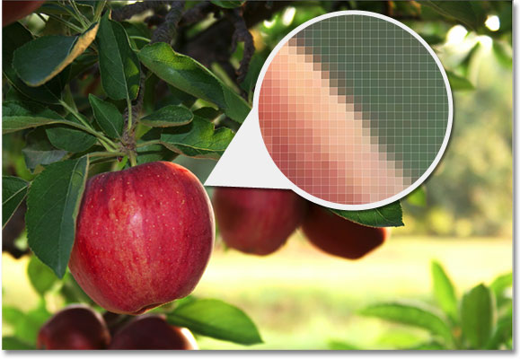
*A close-up view of the edge of an apple showing that it's really just a bunch of tiny square pixels.*

What this unfortunately means for us is that we can't simply click on something in a photo and expect Photoshop to instantly select it for us because what we see as separate and independent objects, Photoshop sees as nothing but different colored pixels. So how do we get around this little problem of miscommunication? Well, since we can't expect Photoshop to think like us, we need to think like Photoshop. We need a way to tell Photoshop that we want to work on these pixels here but not those pixels there. We can't tell Photoshop that we want to change the color of the apple, for example, but we *can* tell it that we want to change the color of the pixels that, to us, make up that apple. We do that by first selecting those pixels in the photo, and we do *that* by making... you guessed it... selections!

### Select None To Select Them All

So far, we know that we see things very differently from how Photoshop sees them. We see independent, recognizable objects while Photoshop sees everything as pixels, and we tell Photoshop which pixels we want to work on by selecting them with one or more of the various selection tools. In fact, before we can do anything at all to an image, Photoshop first needs to know which pixels we want to edit.

For example, let's say I want to change the color of the main apple in the photo. I want to change it from red to green. Based on what I just said, I shouldn't be able to do that without first selecting the pixels that make up the apple. Let's give it a try anyway, just for fun. I'll select the **Brush Tool** from the Tools panel:

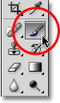
*Selecting the Brush Tool.*

Then I'll select a green color to paint with by clicking on the **Foreground color swatch** near the bottom of the Tools panel:

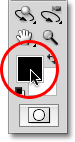
*Photoshop paints with the current Foreground color.*

Clicking on the color swatch brings up Photoshop's **Color Picker**. I'll select a light green:

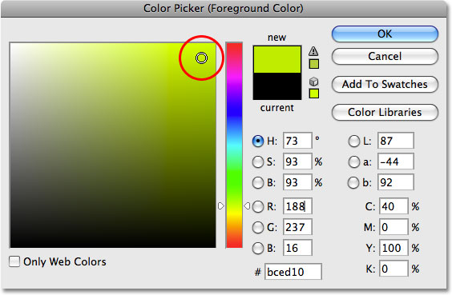
*The Color Picker is the most common way to select colors in Photoshop.*

I'll click OK to exit out of the Color Picker, and now that I have my Brush Tool selected and green as my Foreground color, I'll try to paint over the apple. Since I didn't bother to select any pixels before painting, we already know that I'm wasting my time (and yours) here. Photoshop isn't going to let me do anything. In fact, as soon as I try to paint over the apple, it throws a big warning box at me threatening to crash my hard drive if I ever try to get away with this again:

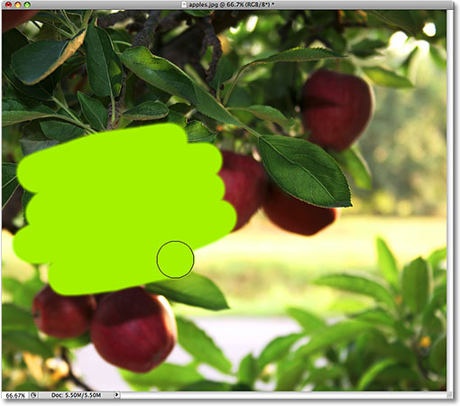
*Ultra-realistic photo effect. Expert users only.*

Wait a minute, what just happened?! I *was* able to paint over the apple! Photoshop didn't complain at all! Okay, let's recap. I said we can't do anything to an image unless we first select the pixels that we want to edit. Then to prove it, I grabbed my Brush Tool and tried painting over part of the image without first selecting anything, yet I was still able to paint over it. This can only mean one thing... I have no idea what I'm talking about!

Seriously though, the real reason why I was still able to paint over the apple without first selecting any pixels is because of a little known fact. Whenever we have nothing selected in an image, we actually have *everything* selected. Photoshop assumes that if we didn't select any specific pixels first, it can only be because we wanted *every* pixel selected so we can edit the entire photo. Or at least, we have the *option* to edit the entire photo. As we saw in this example, I was able to paint over just a small area of the image even though I didn't select any pixels first, but if I wanted to, I could have just as easily painted over the entire image and there would have been nothing preventing me from doing that.

While having the freedom to go where we want and do what we please sounds wonderful, it can actually be a very bad thing, at least when it comes to photo editing. In this example, all I wanted to do was change the color of the apple, yet because I didn't select the apple first, Photoshop allowed me to paint anywhere I wanted, and all I ended up doing was making a mess of things. Let's see what happens if I select the apple first.

### Painting Inside The Lines

I'm going to undo the paint strokes I added to the image by pressing **Ctrl+Z** (Win) / **Command+Z** (Mac), and this time, I'll select the apple first before painting over it. As I mentioned at the beginning of this tutorial, we'll save the details of how to actually make selections for other tutorials. For now, I'll simply go ahead and draw a selection around the apple.

Photoshop displays selection outlines for us as a series of animated dashed lines, or what many people call "marching ants". Obviously, we can't see them "marching" in the screenshot, but we can at least see the selection outline that now appears around the apple:

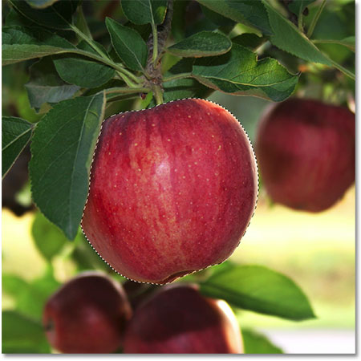
*Selection outlines appear as animated "marching ants".*

Of course, to us, it looks like I've selected the apple, but keep in mind that as far as Photoshop is concerned, all I've done is selected some of the pixels in the image. They just happen to be the pixels that make up what you and I see as an apple. The pixels that fall within the boundaries of the selection outline are now selected, which means that they can be affected by whatever edits I make next, while the remaining pixels outside of the selection outline are not selected and won't be affected by anything I do.

Let's see what happens now when I try painting over the apple again. I'll grab the Brush Tool just like I did before, and with green still as my Foreground color, I'll try painting over the apple. The only difference this time is that I selected the apple first:

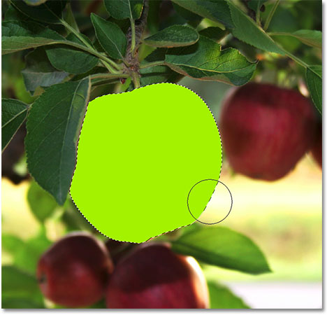
*The paint strokes now appear only inside the selected area.*

Thanks to the selection I made before painting, Photoshop allowed me to paint only inside my selected area. Even though I moved the brush well outside the boundaries of the selection as I was painting and made no attempt to stay inside the lines, none of the pixels outside of the selection outline were affected. They remained safe and unharmed no matter how sloppy I was with the brush, and I was able to easily paint over the apple without worrying about the rest of the image, all thanks to my selection!

Of course, just because we've selected a certain area of pixels doesn't mean we necessarily have to edit every pixel inside the selection outline. I'm going to once again remove my green paint strokes by pressing **Ctrl+Z** (Win) / **Command+Z** (Mac) to undo the last step, and this time, with my selection still active, I'm going to use a much larger brush with soft edges to paint only along the bottom half of the apple, giving me a nice transition in the middle between the green brush color and the natural red of the apple. Even though the pixels in the top half of the apple are part of the selection I made, they remain unchanged because I chose not to paint over them. Photoshop doesn't actually care if we do anything with the pixels we've selected. All it cares about is that we don't get to touch the pixels we didn't select:

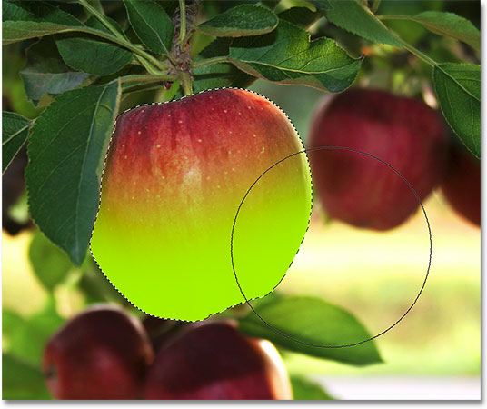
*Any pixel inside of a selection outline can be edited, but nothing says you have to edit every pixel.*

Just as before, my paint stroke is confined to the pixels inside of the selection outline, even though I moved well outside of it with my brush. To make things look a bit more realistic, I'm going to blend the green color in with the apple using one of Photoshop's blend modes. I'll go up to the **Edit** menu at the top of the screen and choose the **Fade Brush Tool** option:

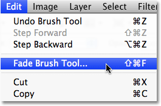
*The actual name of the Fade option changes depending on the last edit that was made.*

This brings up Photoshop's Fade dialog box, which allows us to make some adjustments to the previous edit. To blend the green in with the apple, I'm going to change the blend mode of the brush to **Color**, and to lower the intensity of the green, I'll lower the **Opacity** option down to around 80%:

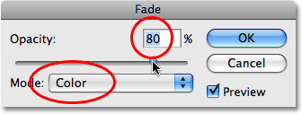
*The Color blend mode allows us to change the color of an object without changing its original brightness values.*

I'll click OK to exit out of the Fade dialog box, and to temporarily hide the selection outline around the apple so we can more easily judge the results, I'll press **Ctrl+H** (Win) / **Command+H** (Mac). Thanks to the adjustments I made with the Fade command, we now have an apple that could still use a bit more time on the tree before picking:

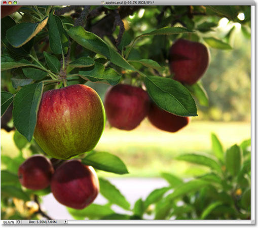
*Press Ctrl+H (Win) / Command+H (Mac) to temporarily hide selection outlines. Press it again to bring them back.*

Up next, we'll look at another important reason for making selections - working with layers!

### Selections Make Layers More Useful

Up until now, I've been making all of my edits directly on the Background layer, which is a very bad way to work because it means that I've been making changes to my original photo. If I was to save my changes and close out of the document window, the original image would be lost forever. Sometimes that may be fine, but it tends to leave a bad impression when you're forced to call up a client and ask, "Would you happen to have another copy of the photo you sent over? I sort of... well, hehe... I kind of ruined the copy you gave me".

A much better way to work in Photoshop is to use **[layers](/basics/layers/)**. With layers, we can work on a copy of the image while leaving the original unharmed, and thanks to selections, we can even copy different parts of an image to their own layers so we can work on them independently! Without the ability to make selections though, layers in Photoshop would be nowhere near as useful as they are.

I'm going to revert my image back to its original, unedited state by going up to the **File** menu and choosing **Revert**. This sets my image back to the way it was when I first opened it:

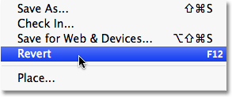
*The Revert command reverts an image back to its original state or to the last saved state.*

A very common Photoshop effect is to leave something in the image in full color while converting the rest of the photo to black and white. Let's see how selections can help us to do this. First, since we just said that working directly on the Background layer is a bad thing, let's duplicate the Background layer, which will give us a copy of it that we can work on. To do that, I'll go up to the **Layer** menu at the top of the screen, then I'll choose **New**, and then I'll choose **Layer via Copy**:

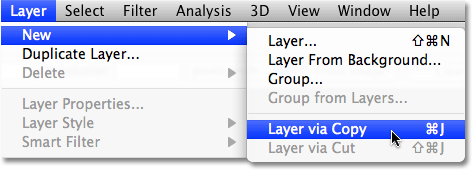
*Creating a copy of the original image.*

If we look in the Layers panel, we can see that we now have two layers - the Background layer on the bottom which holds the original photo, and a new layer above it which Photoshop has named "Layer 1", containing a copy of the photo that we can safely edit without harming the original:

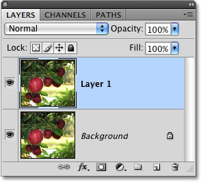
*Working on a copy of the image keeps the original safe.*

Notice that the entire Background layer was copied. We'll come back to this in a moment. Since we want to leave the apple with its original colors while converting everything else to black and white, we'll need to select the apple before we do anything else, so I'll once again draw a selection around it. Our familiar selection outline reappears:

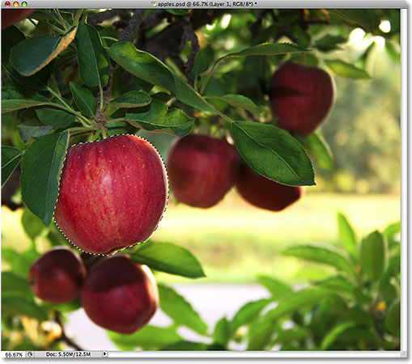
*A selection outline appears once again around the apple.*

With the apple selected, I'm going to create another copy of the image by going back up to the **Layer** menu, choosing **New** and then choosing **Layer via Copy**. Remember that the last time we did this, Photoshop copied the entire layer. This time though, something different has happened. We now have a third layer in the Layers panel sitting above "Layer 1" and the Background layer, but if we look in the **preview thumbnail** to the left of the new layer's name, we can see that all we copied this time was the apple itself, not the entire layer:

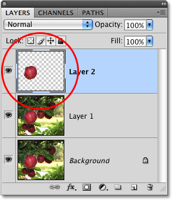
*True to its name, the preview thumbnail gives us a preview of the contents of each layer.*

Any time we have a selection active when we copy a layer, only the area inside the selection outline is copied, which is why in this case, only the apple was copied. This ability to isolate a specific object in a photo and place it on its own layer is what makes layers so incredibly useful. If we couldn't select anything first, all we could do is make copy after copy of the entire image, which is usually about as pointless as it sounds.

Now that my apple is sitting all by itself above the other layers, I'm going to click on "Layer 1" in the Layers panel to select it. Selected layers appear highlighted in blue in the Layers panel, and now anything I do next will be applied to the copy of the original image on "Layer 1", leaving the apple on the top layer untouched:

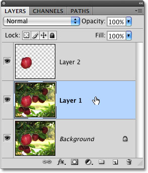
*Selected layers appear highlighted in blue.*

To convert the image to black and white, I'll quickly desaturate it by going up to the **Image** menu, choosing **Adjustments** and then choosing **Desaturate**:

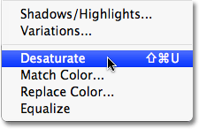
*The Desaturate command is a quick way to remove color from an image.*

Desaturating an image is certainly not the [**best way to convert a color photo to black and white**](/photo-editing/black-and-white-cs3/), but it works in a hurry. Let's look again in the Layers panel, where we can see in the preview thumbnail for "Layer 1" that the copy of our original image now appears in black and white, while the apple on the layer above it has been unaffected and remains in color:

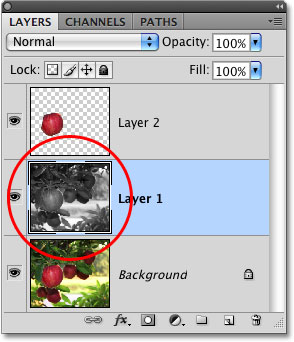
*Only "Layer 1" has been desaturated.*

Since the apple is sitting on a layer above the black and white version of the image, it appears in full color in front of the black and white image in the document window:

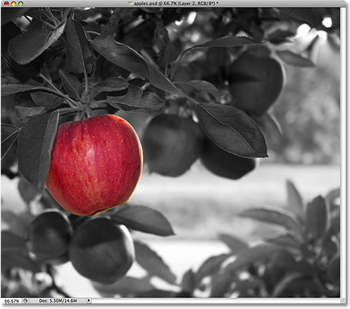
*Combining selections with layers makes a great creative team.*

Of course, there's a lot more we can do with selections in Photoshop than just painting inside of them or copying them to new layers, but hopefully this gave us an idea of why selections are so important. Photoshop sees only pixels where we see independent objects, so we need selections as a way to bridge the gap between our world and Photoshop's world. And while layers can stake their claim as one of the biggest and best features of Photoshop, they owe more of their usefulness to selections than they'd probably care to admit.