# Zoom And Pan All Images At Once In Photoshop

> Source: [https://www.photoshopessentials.com/basics/zoom-and-pan-all-images-at-once-in-photoshop/](https://www.photoshopessentials.com/basics/zoom-and-pan-all-images-at-once-in-photoshop/)
> Downloaded and converted to Markdown.

This tutorial shows you how to navigate two or more open images in Photoshop at the same time. You'll learn how to zoom all images with the Zoom Tool, how to pan all images with the Hand Tool, and how to instantly jump all images to the same zoom level or location!

In the previous lesson, we learned the basics of how to zoom and pan images in Photoshop. I showed you how to use the Zoom Tool to zoom in and out of an image, and how to use the Hand Tool to pan or scroll an image from one area to another.

In that lesson, we navigated around a single image, which is what you’ll be doing most of the time. But Photoshop also lets us view two or more open images side-by-side. And in this lesson, I show you the tricks to zooming and panning all open images together.

If you're new to Photoshop, be sure to read through the previous lesson to [learn the basics of zooming images](/basics/photoshop-zoom/) before you continue.

Let's get started!

## Which Photoshop version do I need?

I'm using Photoshop 2022 but any recent version will work. You can [get the latest Photoshop version here](https://adobe.prf.hn/click/camref:1100lrdjJ/destination:https%3A%2F%2Fwww.adobe.com%2Fproducts%2Fphotoshop.html).

## How to switch between open images in Photoshop

You can follow along with your own images. For this lesson, I’ve opened two images in Photoshop, both from Adobe Stock.

By default, Photoshop lets us view only one open image at a time. So here’s my [first image](https://adobe.prf.hn/click/camref:1100lrdjJ/destination:https%3A%2F%2Fstock.adobe.com%2Fstock-photo%2Fcloseup-photo-of-handsome-young-man%2F162876824).

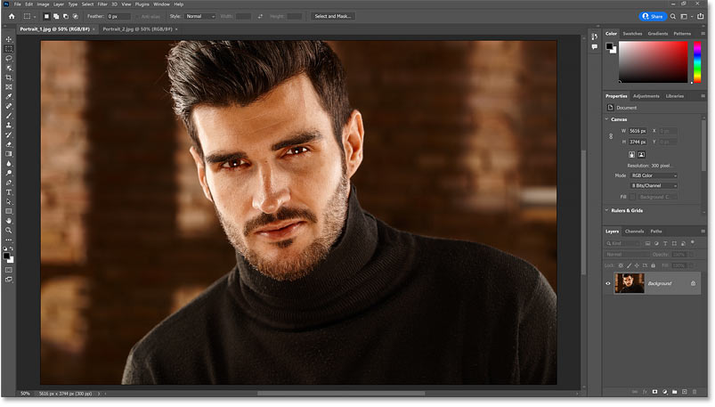
*The first of two images open in Photoshop.*

To switch from one open image to another, click the [document tabs](/basics/tabbed-and-floating-documents-in-photoshop/) at the top.

I’ll click on the tab for the second image:

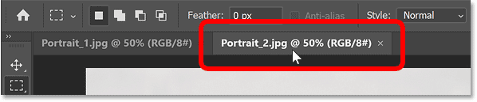
*Clicking the tabs to switch between images.*

And now my [second image](https://adobe.prf.hn/click/camref:1100lrdjJ/destination:https%3A%2F%2Fstock.adobe.com%2Fstock-photo%2Fportrait-photo-of-cool-handsome-young-man%2F120947359) appears.

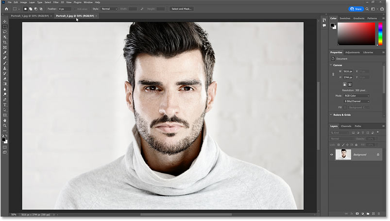
*The second image.*

To switch back to my first image, I’ll click on its tab.

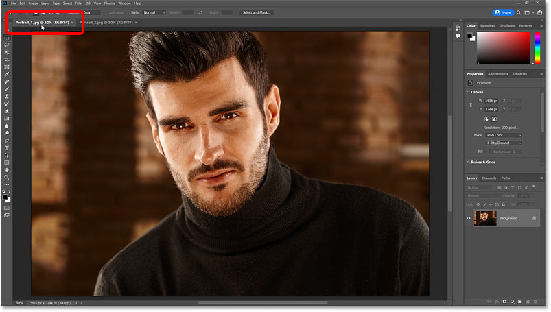
*Clicking the tab to return to the first image.*

### The initial zoom level

Photoshop initially displays images at a zoom level that allows them to fit entirely on the screen. And the current zoom level is displayed in the document's tab.

Since both of my images share the same dimensions (width and height), they both opened at a zoom level of **50%**. Your zoom levels may be different depending on the sizes of your images and your screen resolution.

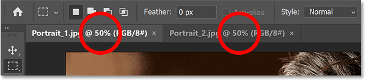
*Both images opened at the 50% zoom level.*

## How to view multiple images at once in Photoshop

To view two or more open images at the same time, go up to the **Window** menu in the Menu Bar and choose **Arrange**.

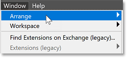
*Going to Window > Arrange.*

From here, choose one of Photoshop’s [multi-document layouts](/basics/view-multiple-images-photoshop/). Depending on the number of images open, some layouts will be grayed out.

In my case, I have only two open images, so I’m limited to either **2-up Horizontal** or **2-up Vertical**. I’ll choose 2-up Vertical.

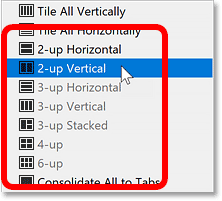
*Choosing 2-up Vertical from the layout options.*

The 2-up Vertical layout splits the screen vertically so that both images appear side-by-side.

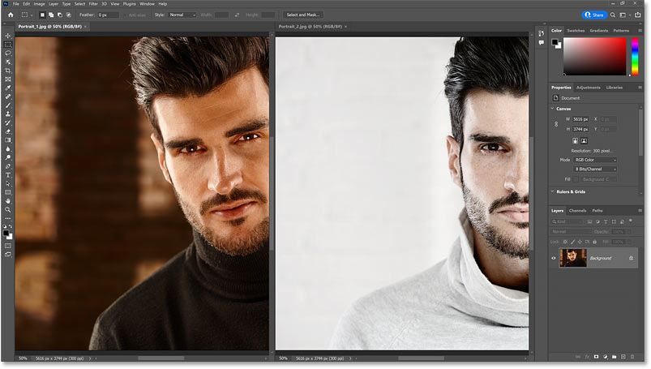
*Both open images are now visible at the same time.*

### The active image

Even though we’re seeing both images, we can still only work on one image at a time. And the currently active image is the one with its name, zoom level and other information in its tab appearing brighter, while the other one appears dimmed.

Again we can switch between active images by clicking the **tabs**. Or you can just click on an image itself in the document window to make it active.

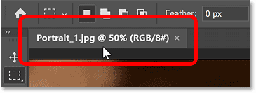
*The document information appears brighter in the active image's tab.*

## How to pan all open images in Photoshop

Since both of my images are currently off-center, I’ll start by showing you how to pan all open images at the same time.

First select the [Hand Tool](/basics/photoshop-zoom/), either from the [toolbar](/basics/photoshop-tools-toolbar-overview/) or by holding the **spacebar** on your keyboard.

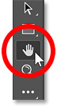
*Selecting the Hand Tool.*

Then hold your **Shift** key (or *add* the Shift key if you’re holding the spacebar). Click on your active image, keep your mouse button held down, and drag the image around inside the document window. Holding Shift as you drag moves all open images at the same time.

Here I’ve panned the active image on the left to center my subject in the document window. And because I was holding Shift, the image on the right moved along with it.

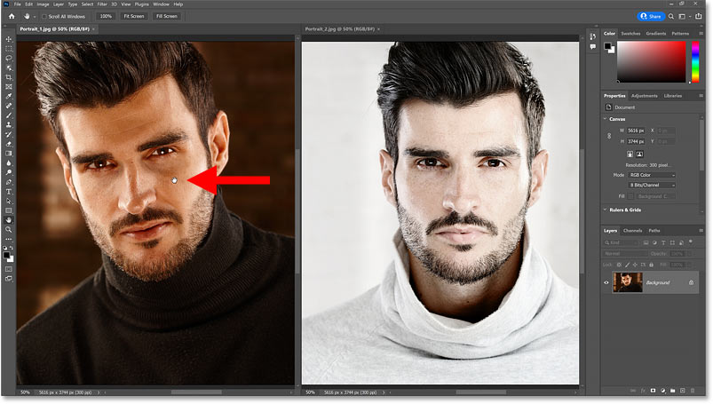
*Hold Shift and drag the active image to pan all open images together.*

### The Scroll All Windows option

You can make panning all images the default behavior for the Hand Tool (so there’s no need to hold Shift) by turning on **Scroll All Windows** in the Options Bar. Note that the Hand Tool needs to be active in the toolbar for the option to appear.

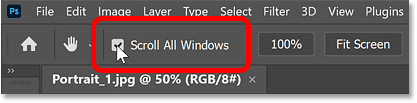
*The Scroll All Windows option for the Hand Tool (off by default).*

## How to zoom all images in Photoshop

To zoom all open images at the same time, select the [Zoom Tool](/basics/photoshop-zoom/), either from the toolbar or by holding the **spacebar** and the **Ctrl** key on a Windows PC, or the **spacebar** and the **Command** key on a Mac.

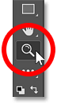
*Selecting the Zoom Tool.*

Then just like we did with the Hand Tool, hold your **Shift** key (or *add* the Shift key if you’re holding the spacebar and the Ctrl or Command key) and click on the active image to zoom in. Both images will zoom in at the same time.

To zoom all images out at the same time, add the **Alt** or **Option** key and click.

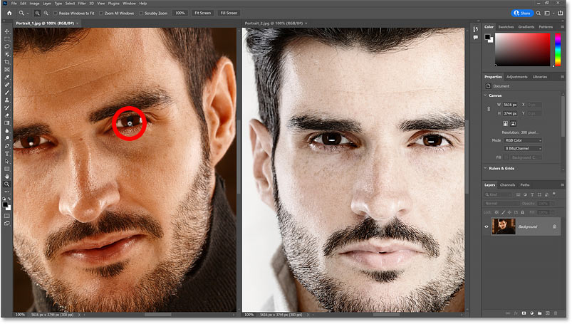
*Hold Shift and click on the active image to zoom all open images together.*

### The Zoom All Windows option

You can make zooming all open images the default behavior for the Zoom Tool by making sure the Zoom Tool is active in the toolbar, and then selecting **Zoom All Windows** in the Options Bar.

Photoshop will then zoom all open images automatically with no need to hold the Shift key. But you’ll still need to hold the Alt or Option key to zoom them out.

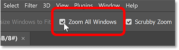
*The Zoom All Windows option for the Zoom Tool (off by default).*

## The Match Zoom, Location and All commands

If you change the zoom level for your active image on its own, and then want your inactive images to match that same zoom level, go up to the **Window** menu, choose **Arrange**, and then choose the **Match Zoom** command.

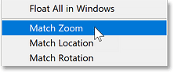
*Going to Window > Arrange > Match Zoom.*

Or if you panned or scrolled your active image on its own and want your inactive images to match that same location, go up to the **Window** menu, choose **Arrange**, and then choose **Match Location**.

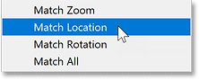
*Going to Window > Arrange > Match Location.*

To match both the zoom level and the location of the active image (as well as the [rotation value](/basics/photoshop-rotate-view-tool/) which I cover in a separate tutorial), go up to the **Window** menu, choose **Arrange**, and then choose **Match All**.

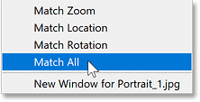
*Going to Window > Arrange > Match All.*

## How to exit the multi-document layout

Finally, to exit out of your multi-document layout and go back to Photoshop’s default behavior of viewing a single open image at a time, go up to the **Window** menu, choose **Arrange**, and then choose **Consolidate All to Tabs**.

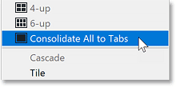
*Going to Window > Arrange > Consolidate All to Tabs.*

And there we have it! In the next lesson in my [Navigating Images in Photoshop](/basics/photoshop-image-navigation/) series, we'll learn how to use Photoshop's [Navigator panel](/basics/how-to-use-the-navigator-panel-in-photoshop/) which is like the Zoom Tool and the Hand Tool rolled into one! Or visit my [Photoshop Basics](/basics/) section for more topics for beginners!